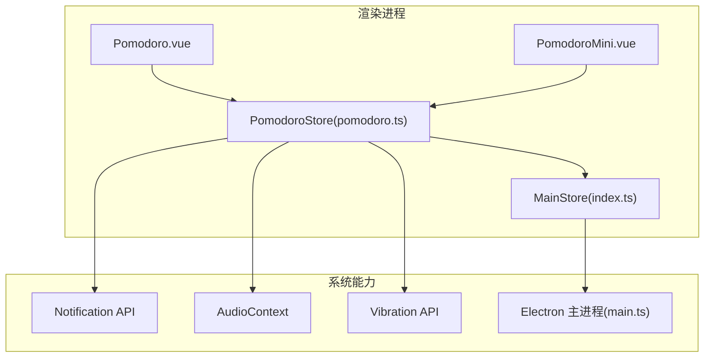
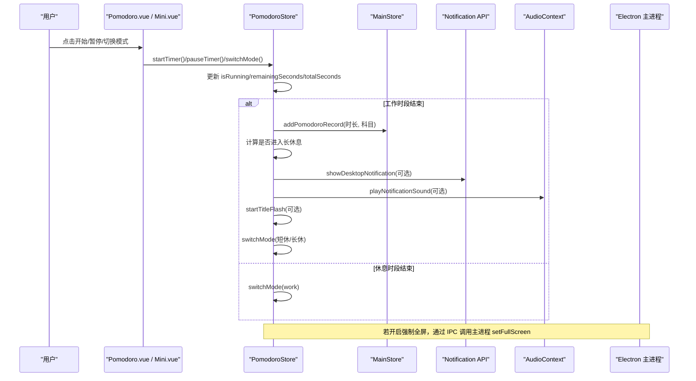
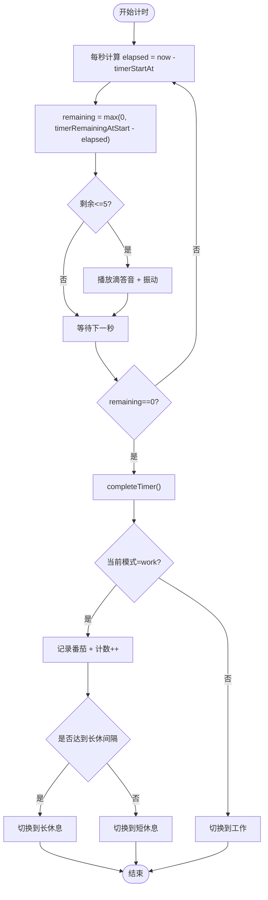
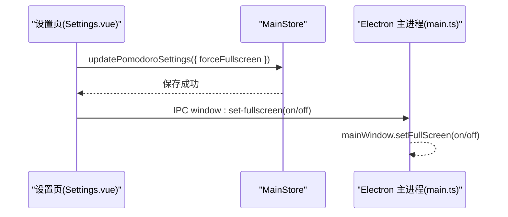
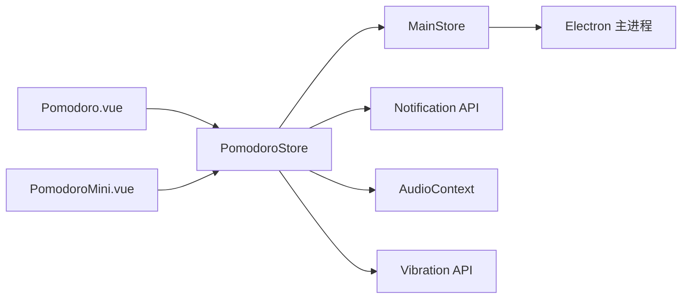

# 番茄钟状态管理

<cite>
**本文引用的文件**
- [pomodoro.ts](file://src/renderer/src/stores/pomodoro.ts)
- [Pomodoro.vue](file://src/renderer/src/views/Pomodoro.vue)
- [PomodoroMini.vue](file://src/renderer/src/components/PomodoroMini.vue)
- [index.ts](file://src/renderer/src/stores/index.ts)
- [main.ts](file://src/main/main.ts)
- [Settings.vue](file://src/renderer/src/views/Settings.vue)
</cite>

## 目录
1. [简介](#简介)
2. [项目结构](#项目结构)
3. [核心组件](#核心组件)
4. [架构总览](#架构总览)
5. [详细组件分析](#详细组件分析)
6. [依赖关系分析](#依赖关系分析)
7. [性能与计时精度](#性能与计时精度)
8. [故障排查指南](#故障排查指南)
9. [结论](#结论)
10. [附录：设置项与使用示例](#附录设置项与使用示例)

## 简介
本文件聚焦于番茄钟的状态管理与专注模式控制，围绕 PomodoroStore 的计时器生命周期、工作/短休息/长休息切换逻辑、全屏专注模式集成、提醒通知与声音提示配置、自定义设置与使用示例，以及计时精度保证和性能优化策略进行系统化说明。文档面向不同技术背景的读者，提供从高层到代码级的分层解读与可视化图示。

## 项目结构
番茄钟功能由“状态层（store）+ 视图层（页面/浮窗）+ 系统能力（通知/音频/全屏）”三部分构成：
- 状态层：PomodoroStore 负责全局计时状态、模式切换、完成回调、通知与声音触发。
- 视图层：Pomodoro.vue 为完整页面；PomodoroMini.vue 为可拖拽浮窗，复用同一 store 实现跨页面一致体验。
- 系统能力：浏览器 Notification API、AudioContext、Vibration API、Electron 窗口全屏控制。

图表来源
- [pomodoro.ts:12-347](file://src/renderer/src/stores/pomodoro.ts#L12-L347)
- [Pomodoro.vue:169-255](file://src/renderer/src/views/Pomodoro.vue#L169-L255)
- [PomodoroMini.vue:132-236](file://src/renderer/src/components/PomodoroMini.vue#L132-L236)
- [index.ts:219-699](file://src/renderer/src/stores/index.ts#L219-L699)
- [main.ts:672-699](file://src/main/main.ts#L672-L699)

章节来源
- [pomodoro.ts:12-347](file://src/renderer/src/stores/pomodoro.ts#L12-L347)
- [Pomodoro.vue:169-255](file://src/renderer/src/views/Pomodoro.vue#L169-L255)
- [PomodoroMini.vue:132-236](file://src/renderer/src/components/PomodoroMini.vue#L132-L236)
- [index.ts:219-699](file://src/renderer/src/stores/index.ts#L219-L699)
- [main.ts:672-699](file://src/main/main.ts#L672-L699)

## 核心组件
- PomodoroStore（pomodoro.ts）
  - 职责：维护当前模式、运行状态、剩余时间、累计番茄数、提醒遮罩状态；驱动计时器、完成流程、通知与声音。
  - 关键状态：currentMode、isRunning、hasStarted、remainingSeconds、totalSeconds、completedPomodoros、alert 相关状态。
  - 关键方法：startTimer、pauseTimer、resetTimer、skipTimer、completeTimer、switchMode、sendNotification、playNotificationSound、showDesktopNotification、startTitleFlash、triggerVibration。
- 视图组件
  - Pomodoro.vue：完整番茄钟页面，绑定 store 状态，提供模式切换、开始/暂停/重置/跳过、科目选择、今日统计等。
  - PomodoroMini.vue：可拖拽浮窗，紧凑/展开两种形态，同样复用 store，支持位置持久化与屏幕边界约束。
- MainStore（index.ts）
  - 职责：全局数据与设置（含番茄钟设置）、记录番茄、每日学习统计、主题与数据迁移等。
  - 番茄钟设置：workDuration、breakDuration、longBreakDuration、longBreakInterval、enableNotification、enableSound、enableTitleFlash、forceFullscreen、soundVolume。
- Electron 主进程（main.ts）
  - 职责：窗口控制（最小化、最大化、关闭到托盘、强制全屏）。

章节来源
- [pomodoro.ts:12-347](file://src/renderer/src/stores/pomodoro.ts#L12-L347)
- [Pomodoro.vue:169-255](file://src/renderer/src/views/Pomodoro.vue#L169-L255)
- [PomodoroMini.vue:132-236](file://src/renderer/src/components/PomodoroMini.vue#L132-L236)
- [index.ts:219-699](file://src/renderer/src/stores/index.ts#L219-L699)
- [main.ts:672-699](file://src/main/main.ts#L672-L699)

## 架构总览
下图展示从用户操作到状态变更、再到系统级反馈的完整链路。

图表来源
- [pomodoro.ts:68-161](file://src/renderer/src/stores/pomodoro.ts#L68-L161)
- [pomodoro.ts:170-305](file://src/renderer/src/stores/pomodoro.ts#L170-L305)
- [main.ts:695-699](file://src/main/main.ts#L695-L699)

## 详细组件分析

### PomodoroStore 计时器状态管理
- 计时器启动与推进
  - 使用 window.setInterval 每秒执行一次，基于绝对时间差计算 elapsed，避免累积误差。
  - 最后5秒触发倒计时预警音与振动。
  - 归零时触发 completeTimer。
- 模式切换与生命周期
  - switchMode：停止运行、重置 hasStarted、按当前模式设定剩余与总时长。
  - completeTimer：
    - 工作完成：记录番茄、递增计数、弹出提醒、根据 longBreakInterval 决定下一段是短休或长休。
    - 休息结束：弹出提醒并切回工作模式。
- 提醒与通知
  - sendNotification：依据设置启用声音、桌面通知、标题闪烁。
  - showDesktopNotification：请求权限后发送系统通知。
  - startTitleFlash：周期性切换 document.title，并在获得焦点或超时后恢复。
- 声音与振动
  - ensureAudioContext：复用单一 AudioContext。
  - playBellNote：基频 + 二倍泛音叠加，指数衰减包络，音量受 soundVolume 影响。
  - playNotificationSound：工作完成上行琶音，休息结束下行琶音。
  - triggerVibration：移动端/设备支持时触发振动。

图表来源
- [pomodoro.ts:68-161](file://src/renderer/src/stores/pomodoro.ts#L68-L161)

章节来源
- [pomodoro.ts:68-161](file://src/renderer/src/stores/pomodoro.ts#L68-L161)

### 全屏专注模式与系统级集成
- 设置项：forceFullscreen（在 Settings 中配置），默认关闭。
- 生效方式：通过 Electron 主进程的 window:set-fullscreen IPC 调用，将窗口设置为全屏，隐藏任务栏以减少干扰。
- 与番茄钟解耦：开启即生效，不依赖计时运行状态。

图表来源
- [Settings.vue:591-624](file://src/renderer/src/views/Settings.vue#L591-L624)
- [index.ts:600-624](file://src/renderer/src/stores/index.ts#L600-L624)
- [main.ts:695-699](file://src/main/main.ts#L695-L699)

章节来源
- [Settings.vue:591-624](file://src/renderer/src/views/Settings.vue#L591-L624)
- [index.ts:600-624](file://src/renderer/src/stores/index.ts#L600-L624)
- [main.ts:695-699](file://src/main/main.ts#L695-L699)

### 提醒通知机制与声音提示配置
- 通知开关：enableNotification 控制是否推送系统通知。
- 声音开关：enableSound 控制是否播放提示音。
- 音量控制：soundVolume（0-100），在 playBellNote 中按比例缩放峰值音量。
- 标题闪烁：enableTitleFlash 控制是否在多标签页时闪烁标题。
- 倒计时预警：最后5秒触发轻柔滴答音与短振动，提升临场感。

章节来源
- [pomodoro.ts:170-305](file://src/renderer/src/stores/pomodoro.ts#L170-L305)
- [Settings.vue:54-84](file://src/renderer/src/views/Settings.vue#L54-L84)

### 番茄钟设置的自定义选项与使用示例
- 自定义项
  - 专注时长（分钟）
  - 短休息时长（分钟）
  - 长休息时长（分钟）
  - 长休息间隔（每完成几个番茄进入长休息）
  - 桌面通知开关
  - 提示音开关与音量
  - 标题闪烁开关
  - 强制全屏开关
- 使用示例
  - 打开设置页，调整各时长与开关，点击保存。
  - 进入番茄钟页面或浮窗，选择科目，点击开始。
  - 完成后自动进入短休息或长休息，循环往复。
  - 如需全屏专注，可在设置中开启强制全屏。

章节来源
- [Settings.vue:31-86](file://src/renderer/src/views/Settings.vue#L31-L86)
- [Pomodoro.vue:107-138](file://src/renderer/src/views/Pomodoro.vue#L107-L138)
- [PomodoroMini.vue:98-126](file://src/renderer/src/components/PomodoroMini.vue#L98-L126)

## 依赖关系分析
- 组件耦合
  - 视图组件仅依赖 store 暴露的状态与方法，无内部计时逻辑，降低耦合度。
  - 浮窗与页面共享同一 store，确保状态一致性。
- 外部依赖
  - 浏览器 API：Notification、AudioContext、Vibration、document.title。
  - Electron IPC：window:set-fullscreen。
- 潜在循环依赖
  - 未发现循环引用；store 单向依赖 MainStore，视图单向依赖 store。

图表来源
- [pomodoro.ts:12-347](file://src/renderer/src/stores/pomodoro.ts#L12-L347)
- [Pomodoro.vue:169-255](file://src/renderer/src/views/Pomodoro.vue#L169-L255)
- [PomodoroMini.vue:132-236](file://src/renderer/src/components/PomodoroMini.vue#L132-L236)
- [index.ts:219-699](file://src/renderer/src/stores/index.ts#L219-L699)
- [main.ts:672-699](file://src/main/main.ts#L672-L699)

章节来源
- [pomodoro.ts:12-347](file://src/renderer/src/stores/pomodoro.ts#L12-L347)
- [Pomodoro.vue:169-255](file://src/renderer/src/views/Pomodoro.vue#L169-L255)
- [PomodoroMini.vue:132-236](file://src/renderer/src/components/PomodoroMini.vue#L132-L236)
- [index.ts:219-699](file://src/renderer/src/stores/index.ts#L219-L699)
- [main.ts:672-699](file://src/main/main.ts#L672-L699)

## 性能与计时精度
- 计时精度保障
  - 使用绝对时间差计算 elapsed，避免 setInterval 漂移导致的累积误差。
  - 1秒间隔足够满足番茄钟需求，兼顾性能与精度。
- 性能优化策略
  - 复用单一 AudioContext，减少创建销毁开销。
  - 仅在最后5秒触发预警音与振动，降低频繁 I/O。
  - 标题闪烁定时器在页面获得焦点或超时后及时清理，防止资源泄漏。
  - 浮窗位置与紧凑状态持久化至 localStorage，减少重复计算与布局抖动。
  - 进度环使用 CSS transition 平滑动画，避免高频重绘。

[本节为通用性能建议，无需特定文件引用]

## 故障排查指南
- 通知未显示
  - 检查 enableNotification 是否开启。
  - 确认浏览器已授权通知权限；可在设置页点击“测试通知权限”。
- 无声或音量过小
  - 检查 enableSound 是否开启。
  - 调整 soundVolume 滑块；注意部分浏览器需用户交互后才能播放音频。
- 标题不闪烁
  - 检查 enableTitleFlash 是否开启。
  - 确认页面未被其他脚本覆盖 document.title。
- 全屏无效
  - 确认 forceFullscreen 已开启。
  - 在 Electron 环境下，确认主进程已监听 window:set-fullscreen 并正确调用 setFullScreen。
- 计时异常
  - 检查是否有多个定时器实例冲突（store 内仅维护一个 timer）。
  - 确认页面未被后台节流导致 setInterval 延迟。

章节来源
- [pomodoro.ts:170-305](file://src/renderer/src/stores/pomodoro.ts#L170-L305)
- [Settings.vue:54-84](file://src/renderer/src/views/Settings.vue#L54-L84)
- [main.ts:695-699](file://src/main/main.ts#L695-L699)

## 结论
PomodoroStore 以清晰的状态机模型管理番茄钟生命周期，结合浏览器与 Electron 的系统能力，提供稳定、可配置的专注体验。通过绝对时间差计时、音频上下文复用、合理的提醒策略与全屏集成，实现了高精度与低开销的平衡。配合设置页的丰富选项，用户可按需定制节奏与提醒方式，获得个性化的学习辅助。

[本节为总结性内容，无需特定文件引用]

## 附录：设置项与使用示例
- 设置项清单
  - 专注时长（分钟）
  - 短休息时长（分钟）
  - 长休息时长（分钟）
  - 长休息间隔（个番茄）
  - 桌面通知（开关）
  - 提示音（开关）
  - 提示音音量（0-100%）
  - 标题闪烁（开关）
  - 强制全屏（开关）
- 使用步骤
  - 打开设置页，按需调整时长与开关，保存。
  - 进入番茄钟页面或浮窗，选择科目，点击开始。
  - 关注最后5秒的预警提示，完成后自动进入休息。
  - 需要全屏专注时，开启强制全屏。

章节来源
- [Settings.vue:31-86](file://src/renderer/src/views/Settings.vue#L31-L86)
- [Pomodoro.vue:107-138](file://src/renderer/src/views/Pomodoro.vue#L107-L138)
- [PomodoroMini.vue:98-126](file://src/renderer/src/components/PomodoroMini.vue#L98-L126)