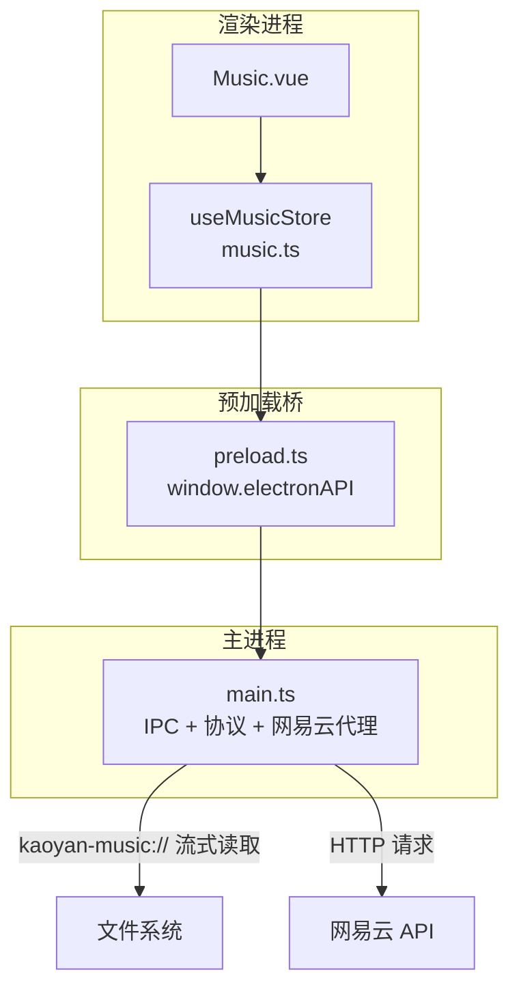
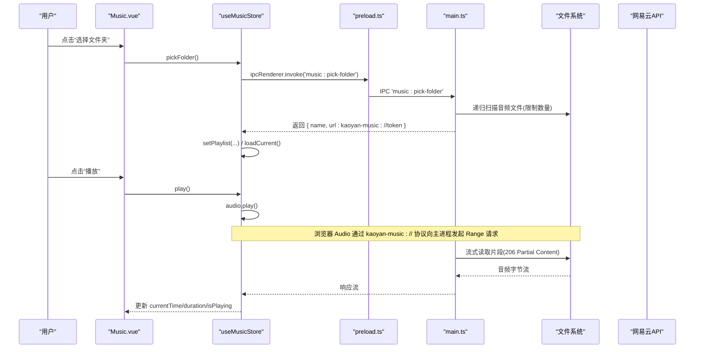
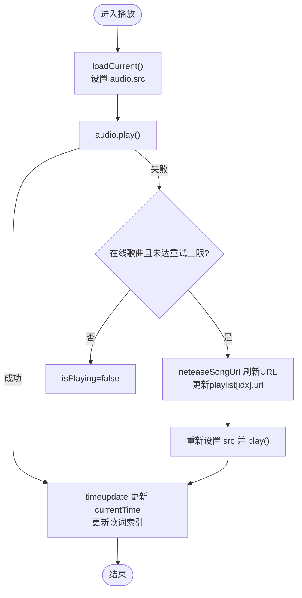
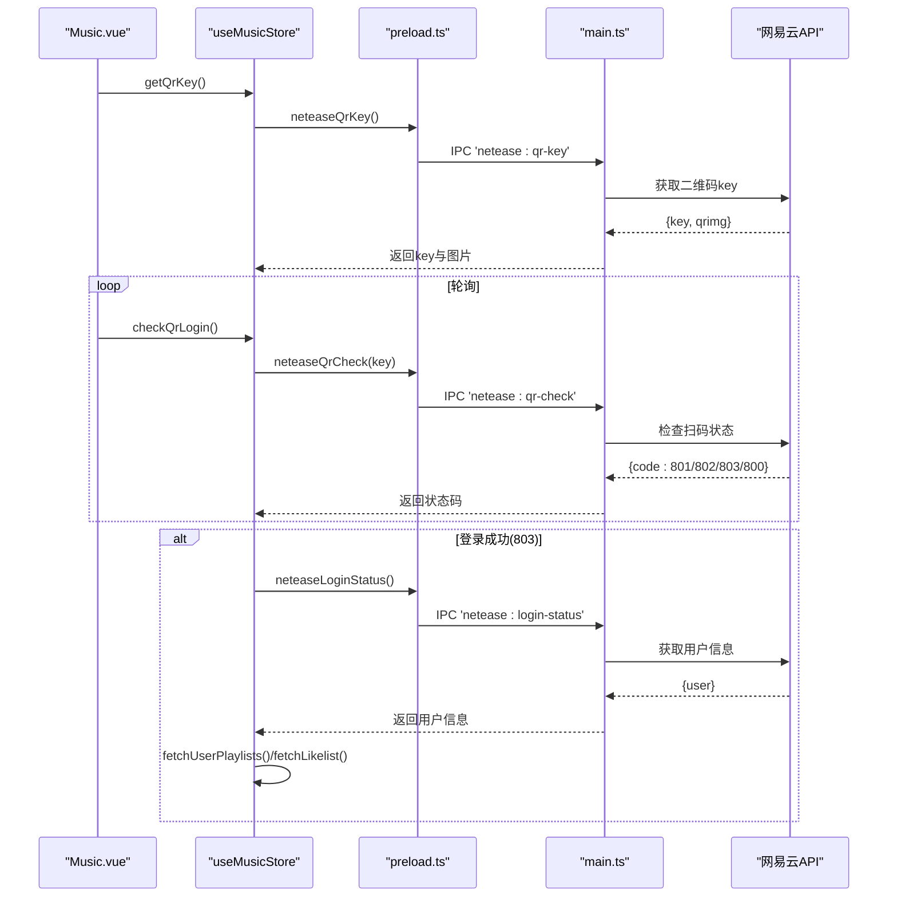
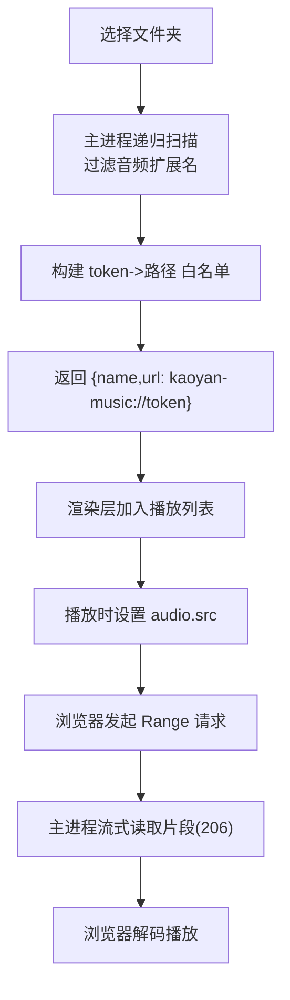
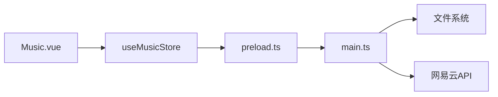

# 音乐状态管理

<cite>
**本文引用的文件**
- [music.ts](file://src/renderer/src/stores/music.ts)
- [Music.vue](file://src/renderer/src/views/Music.vue)
- [preload.ts](file://src/preload/preload.ts)
- [main.ts](file://src/main/main.ts)
</cite>

## 目录
1. [简介](#简介)
2. [项目结构](#项目结构)
3. [核心组件](#核心组件)
4. [架构总览](#架构总览)
5. [详细组件分析](#详细组件分析)
6. [依赖关系分析](#依赖关系分析)
7. [性能考量](#性能考量)
8. [故障排查指南](#故障排查指南)
9. [结论](#结论)
10. [附录：配置与使用示例](#附录配置与使用示例)

## 简介
本文件围绕“音乐状态管理”展开，系统性说明 MusicStore 的职责、功能与实现细节，覆盖本地音乐播放、网易云音乐集成、播放列表管理、播放状态（当前歌曲、进度、音量等）、外部 API 交互与数据同步策略、音频扫描/缓存/播放逻辑，以及配置项与最佳实践。目标是帮助开发者快速理解并扩展音乐模块。

## 项目结构
- 渲染层（Vue + Pinia）
  - 状态与业务逻辑：src/renderer/src/stores/music.ts
  - 界面与交互：src/renderer/src/views/Music.vue
- 预加载桥接（Electron）
  - IPC 暴露接口：src/preload/preload.ts
- 主进程（Electron）
  - 协议处理、文件扫描、网易云 API 代理：src/main/main.ts

图表来源
- [music.ts:32-1429](file://src/renderer/src/stores/music.ts#L32-L1429)
- [Music.vue:668-800](file://src/renderer/src/views/Music.vue#L668-L800)
- [preload.ts:1-98](file://src/preload/preload.ts#L1-L98)
- [main.ts:183-616](file://src/main/main.ts#L183-L616)

章节来源
- [music.ts:32-1429](file://src/renderer/src/stores/music.ts#L32-L1429)
- [Music.vue:668-800](file://src/renderer/src/views/Music.vue#L668-L800)
- [preload.ts:1-98](file://src/preload/preload.ts#L1-L98)
- [main.ts:183-616](file://src/main/main.ts#L183-L616)

## 核心组件
- MusicStore（Pinia Store）
  - 维护播放列表、当前索引、播放状态、音量、随机模式、音质等级、歌词、搜索与登录态、歌单/排行榜/云盘等数据。
  - 封装播放控制（播放/暂停/上一首/下一首/跳转/音量/随机）、在线歌曲获取与加入队列、歌词解析与高亮、网易云登录与歌单同步、喜欢与评论点赞等。
- Music.vue（视图层）
  - 提供播放器 UI、歌词显示、搜索、歌单、排行榜、云盘、登录对话框、评论弹窗等交互。
  - 通过 watch 与事件绑定驱动 store 方法，保持 UI 与状态一致。
- preload.ts（桥接）
  - 将主进程的 IPC 能力安全暴露给渲染进程（如网易云 API、文件选择、歌词读取等）。
- main.ts（主进程）
  - 注册自定义协议 kaoyan-music:// 支持 Range 流式播放，避免大文件内存占用。
  - 实现网易云 API 代理（搜索、歌词、登录、歌单、评论、排行榜、云盘、心动模式等）。
  - 管理 Cookie、二维码登录轮询、用户信息拉取与持久化。

章节来源
- [music.ts:32-1429](file://src/renderer/src/stores/music.ts#L32-L1429)
- [Music.vue:1-800](file://src/renderer/src/views/Music.vue#L1-L800)
- [preload.ts:1-98](file://src/preload/preload.ts#L1-L98)
- [main.ts:183-616](file://src/main/main.ts#L183-L616)

## 架构总览
音乐模块采用“渲染层状态 + 主进程能力”的分层架构：
- 渲染层负责 UI 与状态管理，调用 store 方法。
- 预加载层通过 contextBridge 暴露受限的 IPC 接口。
- 主进程负责：
  - 本地文件访问与流式播放（kaoyan-music://），支持 Range 请求，提升拖动与缓冲体验。
  - 网易云 API 代理，统一鉴权与错误处理。
  - 登录态与 Cookie 管理，二维码登录轮询。

图表来源
- [music.ts:284-306](file://src/renderer/src/stores/music.ts#L284-L306)
- [music.ts:308-343](file://src/renderer/src/stores/music.ts#L308-L343)
- [preload.ts:23-28](file://src/preload/preload.ts#L23-L28)
- [main.ts:701-760](file://src/main/main.ts#L701-L760)
- [main.ts:407-477](file://src/main/main.ts#L407-L477)

## 详细组件分析

### MusicStore 职责与状态
- 播放状态
  - 当前曲目 currentTrack（由 playlist 与 currentIndex 计算得出）
  - 播放中 isPlaying、音量 volume、随机 shuffle、音质 qualityLevel
  - 进度 currentTime、duration
  - 歌词 lyricLines、currentLyricIndex、showLyrics
- 在线功能
  - 搜索 searchResults/searchLoading/searchKeyword
  - 登录 neteaseLoggedIn/neteaseUser、歌单 userPlaylists/currentPlaylistInfo/currentPlaylistTracks
  - 云盘 cloudDriveList/cloudDriveCount、排行榜 toplistList/toplistDetail
  - 喜欢 likedSongIds/currentLiked、评论 songComments/currentHotComment
- 关键方法
  - 播放控制：play/pause/toggle/next/prev/playIndex/seek/setVolume/toggleShuffle/toggleLyrics
  - 列表管理：setPlaylist/removeTrack/clearPlaylist/addOnlineSong/playOnlineSong/playPlaylist/addPlaylistToQueue
  - 歌词：loadLyric/updateLyricIndex/parseLyric
  - 网易云：searchOnline/checkLoginStatus/loginPhone/getQrKey/checkQrLogin/logoutNetease/fetchUserPlaylists/fetchPlaylistDetail/fetchToplist/fetchToplistDetail/fetchCloudDrive/startHeartbeatMode
  - 喜欢与评论：checkSongLikeStatus/toggleLikeSong/checkSongsLiked/isSongLiked/fetchLikelist/fetchSongComments/toggleCommentLike/isCommentLiked

章节来源
- [music.ts:32-1429](file://src/renderer/src/stores/music.ts#L32-L1429)

### 播放状态管理机制
- 当前播放歌曲：由 playlist[currentIndex] 决定；切换时调用 loadCurrent() 设置 audio.src 并加载歌词。
- 播放进度：监听 timeupdate 更新 currentTime，同时根据时间匹配歌词行索引。
- 音量控制：volume 受控于 setVolume，应用至 audio.volume。
- 自动续播：ended 事件触发 next()。
- 在线 URL 过期重试：error 或 play 失败时尝试刷新在线 URL（最多两次），成功后恢复播放。

图表来源
- [music.ts:300-343](file://src/renderer/src/stores/music.ts#L300-L343)
- [music.ts:102-147](file://src/renderer/src/stores/music.ts#L102-L147)

章节来源
- [music.ts:93-164](file://src/renderer/src/stores/music.ts#L93-L164)
- [music.ts:300-343](file://src/renderer/src/stores/music.ts#L300-L343)

### 网易云集成与数据同步
- 登录方式
  - 扫码登录：getQrKey 获取 key 与 base64 图片，checkQrLogin 轮询状态，成功则拉取用户信息与歌单。
  - 手机号登录：loginPhone 直接登录。
  - Cookie 登录：setNeteaseCookie 粘贴 Cookie 字符串，验证后拉取歌单与喜欢列表。
- 数据同步策略
  - 登录成功后立即 fetchUserPlaylists 与 fetchLikelist，保证歌单与喜欢状态可用。
  - 歌单详情与排行榜详情按需加载，批量获取播放地址（每批最多20首）以避免过多并发。
  - 云盘歌曲分页全量加载，逐页追加到列表，提升用户体验。
- 外部 API 交互
  - 通过 window.electronAPI 调用主进程 IPC 方法，主进程统一封装 neteaseSmartRequest/neteasePlainRequest，处理 Cookie、Referer、UA、IP 伪装等。

图表来源
- [music.ts:546-652](file://src/renderer/src/stores/music.ts#L546-L652)
- [preload.ts:40-69](file://src/preload/preload.ts#L40-L69)
- [main.ts:1411-1471](file://src/main/main.ts#L1411-L1471)
- [main.ts:1475-1547](file://src/main/main.ts#L1475-L1547)

章节来源
- [music.ts:546-700](file://src/renderer/src/stores/music.ts#L546-L700)
- [main.ts:1334-1547](file://src/main/main.ts#L1334-L1547)

### 本地音乐扫描、缓存与播放
- 扫描
  - 选择文件夹后，主进程递归遍历，仅记录相对路径，限制最大文件数，按名称排序。
  - 为每个文件生成 token，建立白名单映射 token -> 绝对路径。
- 缓存
  - 不缓存文件内容，仅缓存 token 与路径映射；播放通过 kaoyan-music:// 协议流式读取，避免内存峰值。
- 播放
  - 渲染层使用 HTMLAudioElement，通过自定义协议请求主进程；主进程支持 Range 请求，返回 206 分段数据，提升拖动与缓冲性能。

图表来源
- [main.ts:701-760](file://src/main/main.ts#L701-L760)
- [main.ts:407-477](file://src/main/main.ts#L407-L477)
- [music.ts:284-306](file://src/renderer/src/stores/music.ts#L284-L306)

章节来源
- [main.ts:701-800](file://src/main/main.ts#L701-L800)
- [main.ts:407-477](file://src/main/main.ts#L407-L477)
- [music.ts:284-306](file://src/renderer/src/stores/music.ts#L284-L306)

### 歌词解析与高亮
- 解析
  - 本地：读取同目录 .lrc 文件，正则提取时间戳与文本，排序后存入 lyricLines。
  - 在线：通过 neteaseLyric 获取 lrc/tlyric，解析后展示。
- 高亮
  - 播放时根据 currentTime 查找对应歌词行索引 currentLyricIndex，滚动到可视区域。

章节来源
- [music.ts:171-252](file://src/renderer/src/stores/music.ts#L171-L252)

### 播放列表管理与在线歌曲加入
- 本地文件/文件夹：pickFiles/pickFolder 返回文件清单，setPlaylist 重置索引并加载当前。
- 在线歌曲：playOnlineSong 获取播放 URL 后立即加入并播放；addOnlineSong 仅加入队列。
- 歌单/排行榜/云盘：批量获取播放地址（每批20首），替换或追加到播放列表，必要时先暂停释放旧 URL。

章节来源
- [music.ts:258-306](file://src/renderer/src/stores/music.ts#L258-L306)
- [music.ts:456-506](file://src/renderer/src/stores/music.ts#L456-L506)
- [music.ts:702-776](file://src/renderer/src/stores/music.ts#L702-L776)

### 配置选项与使用示例
- 配置项
  - 随机播放 musicShuffle（持久化）
  - 音质等级 musicQualityLevel（standard/higher/exhigh/lossless/hires）
  - 顶栏歌词显示 musicShowLyrics（持久化）
- 使用示例
  - 选择文件夹：调用 pickFolder()，返回文件数。
  - 选择文件：调用 pickFiles()，返回文件数。
  - 搜索在线：调用 searchOnline(keyword, limit)。
  - 播放在线：调用 playOnlineSong(song) 或 addOnlineSong(song)。
  - 切换音质：调用 setQualityLevel(level)。
  - 切换随机：调用 toggleShuffle()。
  - 切换歌词显示：调用 toggleLyrics()。
  - 登录：getQrKey()/checkQrLogin() 或 loginPhone()/setNeteaseCookie()。
  - 获取歌单：fetchUserPlaylists()/fetchPlaylistDetail(id)。
  - 云盘：fetchCloudDrive(pageSize, pageNo)。
  - 排行榜：fetchToplist()/fetchToplistDetail(id)。
  - 喜欢：toggleLikeSong(songId)/checkSongLikeStatus(songId)。
  - 评论：fetchSongComments(songId)/toggleCommentLike(commentId, currentLiked)。

章节来源
- [music.ts:41-48](file://src/renderer/src/stores/music.ts#L41-L48)
- [music.ts:265-306](file://src/renderer/src/stores/music.ts#L265-L306)
- [music.ts:435-506](file://src/renderer/src/stores/music.ts#L435-L506)
- [music.ts:546-700](file://src/renderer/src/stores/music.ts#L546-L700)
- [music.ts:819-894](file://src/renderer/src/stores/music.ts#L819-L894)
- [music.ts:977-1062](file://src/renderer/src/stores/music.ts#L977-L1062)
- [music.ts:1084-1178](file://src/renderer/src/stores/music.ts#L1084-L1178)

## 依赖关系分析
- 渲染层依赖
  - Vue 响应式（ref/computed/watch）
  - Pinia（defineStore）
  - Element Plus（UI 组件）
  - Electron 预加载暴露的 window.electronAPI
- 主进程依赖
  - Electron（BrowserWindow、ipcMain、protocol、dialog、fs、http）
  - 网易云 API（HTTP 请求，带 Cookie/Referer/UA/IP 伪装）
- 耦合与内聚
  - MusicStore 高内聚：所有播放与在线逻辑集中在 store，便于测试与维护。
  - 主进程解耦：协议与 API 代理独立，便于扩展其他资源协议或服务。

图表来源
- [music.ts:32-1429](file://src/renderer/src/stores/music.ts#L32-L1429)
- [preload.ts:1-98](file://src/preload/preload.ts#L1-L98)
- [main.ts:183-616](file://src/main/main.ts#L183-L616)

章节来源
- [music.ts:32-1429](file://src/renderer/src/stores/music.ts#L32-L1429)
- [preload.ts:1-98](file://src/preload/preload.ts#L1-L98)
- [main.ts:183-616](file://src/main/main.ts#L183-L616)

## 性能考量
- 本地文件流式播放
  - 使用 kaoyan-music:// 协议与 Range 请求，避免一次性加载大文件，降低内存占用。
  - 主进程使用 ReadableStream 与 highWaterMark 提升吞吐。
- 批量获取在线播放地址
  - 每次最多20首，减少并发压力与网络抖动影响。
- 长列表分页渲染
  - 云盘与播放队列采用可见数量分页（VISIBLE_STEP），避免 DOM 过多导致卡顿。
- 歌词解析与高亮
  - 正则解析一次，排序后线性查找当前行，复杂度 O(n)，满足实时性。
- 错误重试与回退
  - 在线 URL 过期自动刷新重试（最多两次），失败则停止播放，避免无限循环。

[本节为通用指导，无需特定文件引用]

## 故障排查指南
- 播放失败
  - 检查当前是否为在线歌曲，若是则触发 URL 刷新重试；若仍失败，确认网络与音质等级。
  - 本地文件：确认文件扩展名在白名单，路径可访问。
- 歌词不显示
  - 本地：确保同目录存在 .lrc 文件，文件名与音频一致。
  - 在线：确认 neteaseLyric 返回成功，解析函数正常。
- 网易云登录异常
  - 扫码：确认二维码未过期，手机端已确认。
  - Cookie：从浏览器正确复制完整 Cookie，格式为 key=value; key2=value2。
  - 手机号：检查国家代码与密码。
- 歌单/云盘/排行榜为空
  - 确认已登录，检查 API 返回 success 字段与数据数组长度。
  - 云盘分页：首次加载 count，后续分页累加，注意上限保护。

章节来源
- [music.ts:102-147](file://src/renderer/src/stores/music.ts#L102-L147)
- [music.ts:191-252](file://src/renderer/src/stores/music.ts#L191-L252)
- [music.ts:546-652](file://src/renderer/src/stores/music.ts#L546-L652)
- [music.ts:819-850](file://src/renderer/src/stores/music.ts#L819-L850)
- [main.ts:1411-1547](file://src/main/main.ts#L1411-L1547)

## 结论
MusicStore 以清晰的职责边界与健壮的错误处理，实现了本地与在线音乐的统一管理。通过 Electron 自定义协议与主进程代理，既保证了本地播放的性能与安全性，又无缝集成了网易云生态。配合分页渲染与批量请求，整体体验流畅稳定。建议后续继续优化：
- 增加播放历史与最近播放
- 支持更多歌词格式与多语言歌词
- 增强离线缓存策略（对热门在线歌曲）
- 提供更细粒度的日志与监控

[本节为总结，无需特定文件引用]

## 附录：配置与使用示例
- 配置项
  - 随机播放：toggleShuffle()，持久化到本地存储。
  - 音质等级：setQualityLevel(level)，默认 exhigh。
  - 顶栏歌词：toggleLyrics()，默认开启。
- 常用流程
  - 选择文件夹：music.pickFolder()
  - 选择文件：music.pickFiles()
  - 搜索：music.searchOnline(keyword, 30)
  - 播放在线：music.playOnlineSong(song)
  - 登录：music.getQrKey()/checkQrLogin() 或 music.loginPhone()/setNeteaseCookie()
  - 歌单：music.fetchUserPlaylists()/fetchPlaylistDetail(id)
  - 云盘：music.fetchCloudDrive(100, 0)
  - 排行榜：music.fetchToplist()/fetchToplistDetail(id)
  - 喜欢：music.toggleLikeSong(songId)
  - 评论：music.fetchSongComments(songId)/music.toggleCommentLike(commentId, currentLiked)

章节来源
- [music.ts:41-48](file://src/renderer/src/stores/music.ts#L41-L48)
- [music.ts:265-306](file://src/renderer/src/stores/music.ts#L265-L306)
- [music.ts:435-506](file://src/renderer/src/stores/music.ts#L435-L506)
- [music.ts:546-700](file://src/renderer/src/stores/music.ts#L546-L700)
- [music.ts:819-894](file://src/renderer/src/stores/music.ts#L819-L894)
- [music.ts:977-1062](file://src/renderer/src/stores/music.ts#L977-L1062)
- [music.ts:1084-1178](file://src/renderer/src/stores/music.ts#L1084-L1178)