# BiliBiliPanel B站面板组件

<cite>
**本文引用的文件**
- [BiliBiliPanel.vue](file://src/renderer/src/components/BiliBiliPanel.vue)
- [preload.ts](file://src/preload/preload.ts)
- [main.ts](file://src/main/main.ts)
- [vite-env.d.ts](file://src/renderer/src/vite-env.d.ts)
- [storage.ts](file://src/renderer/src/utils/storage.ts)
</cite>

## 更新摘要
**变更内容**
- **v3.6.0版本重大重构**：右侧边栏完全重构，从线性布局改为标签页界面，包含四个独立视图：简介、UP主视频、相关视频、评论；新增固定顶部UP主卡片区域；实现了响应式设计和粘性定位；优化了窄屏适配
- **v3.5.8版本重大更新**：新增完整评论回复系统，支持热评优先、分页加载、用户头像显示；播放器对话框宽度增至1400px；右侧栏全面重新设计，包含UP主卡片增强、视频简介区域、紧凑列表布局
- **v3.5.7版本重大更新**：新增SourceBuffer配额管理以支持高码率播放、热门视频首次访问自动加载、增强弹幕渲染（全局keyframe动画和内联样式）、智能时间机制防止弹幕泛滥、右侧栏视觉优化
- **v3.5.6版本更新**：网格布局系统从4×6改为6×4配置，提供更优的视频卡片展示效果
- **播放器对话框增强**：改进了响应式设计和两列布局，支持更灵活的屏幕适配
- **DASH编码处理修复**：修复了MSE DASH播放器的编码格式解析问题，提升高清晰度播放稳定性
- **右侧栏独立滚动**：播放器弹窗右侧栏（UP主信息/相关视频）实现独立滚动，不撑高弹窗

## 目录
1. [简介](#简介)
2. [项目结构](#项目结构)
3. [核心组件](#核心组件)
4. [架构总览](#架构总览)
5. [详细组件分析](#详细组件分析)
6. [依赖关系分析](#依赖关系分析)
7. [性能与缓存策略](#性能与缓存策略)
8. [故障排查指南](#故障排查指南)
9. [结论](#结论)
10. [附录：API 与数据模型](#附录api-与数据模型)

## 简介
本组件为"学习资料页"集成的哔哩哔哩视频模块，提供扫码/Cookie 登录、**个性推荐**、热门推荐、收藏夹浏览、视频搜索、视频播放（分P/清晰度/相关推荐）、**评论回复**等能力。所有网络请求通过主进程代理（bili:* IPC），播放流由主进程注入 Referer 以绕过防盗链；前端仅负责交互与状态管理。

**v3.6.0版本重大重构** 将右侧边栏从线性布局完全重构为标签页界面，包含简介、UP主视频、相关视频、评论四个独立视图，并新增固定顶部UP主卡片区域。**v3.5.8版本进一步增强了用户体验**，新增了完整的评论回复系统，支持热评优先、分页加载和用户头像显示，同时优化了播放器对话框的宽度和右侧栏的视觉设计。**v3.5.7版本还引入了SourceBuffer配额管理解决高码率播放问题、热门视频首次访问自动加载、增强的弹幕系统和优化的右侧栏界面**。

## 项目结构
- 渲染层（Vue 组件）：BiliBiliPanel.vue 实现 UI、用户交互、状态管理与 API 调用封装。
- 预加载层（Electron preload）：将主进程的 bili:* IPC 暴露为 window.electronAPI，供渲染层安全调用。
- 主进程（Electron main）：统一封装 B 站 API 访问、Cookie 管理、二维码登录轮询、收藏/搜索/热门/播放接口代理。
- 类型声明：vite-env.d.ts 定义 B 站相关类型与 ElectronAPI 方法签名。
- 本地存储：storage.ts 提供应用级持久化与迁移机制（B 站面板本身不直接使用该模块进行业务缓存）。

```mermaid
graph TB
subgraph "渲染进程"
V["BiliBiliPanel.vue"]
T["vite-env.d.ts<br/>类型声明"]
end
subgraph "预加载进程"
P["preload.ts<br/>IPC 桥接"]
end
subgraph "主进程"
M["main.ts<br/>B站API代理/登录/收藏/搜索/播放"]
end
V --> |window.electronAPI.*| P
P --> |ipcRenderer.invoke('bili:*')| M
M --> |HTTP 请求 + Cookie 管理| B["bilibili.com API"]
```

**图表来源**
- [BiliBiliPanel.vue:338-722](file://src/renderer/src/components/BiliBiliPanel.vue#L338-L722)
- [preload.ts:73-82](file://src/preload/preload.ts#L73-L82)
- [main.ts:2292-2499](file://src/main/main.ts#L2292-L2499)
- [vite-env.d.ts:203-231](file://src/renderer/src/vite-env.d.ts#L203-L231)

章节来源
- [BiliBiliPanel.vue:338-722](file://src/renderer/src/components/BiliBiliPanel.vue#L338-L722)
- [preload.ts:73-82](file://src/preload/preload.ts#L73-L82)
- [main.ts:2292-2499](file://src/main/main.ts#L2292-L2499)
- [vite-env.d.ts:203-231](file://src/renderer/src/vite-env.d.ts#L203-L231)

## 核心组件
- 登录认证：支持扫码登录与 Cookie 粘贴登录；维护登录态并展示用户信息。
- **个性推荐**：**新增** 基于用户兴趣的智能推荐，支持"换一批"刷新。
- 热门推荐：**v3.5.7更新** 首次访问自动加载热门视频，提供更好的用户体验。
- 收藏夹：登录后获取收藏夹列表与内容，支持分页刷新。
- 视频搜索：关键词处理、结果展示、分页导航。
- 播放器：**增强版** 视频详情获取、分P切换、清晰度选择、相关推荐、多分段自动连播、备用CDN重试，**新增社交互动功能和评论回复系统**。
- **弹幕系统**：**v3.5.7重大升级** 全局keyframe动画、内联样式渲染、智能时间机制防止弹幕泛滥。
- **SourceBuffer管理**：**v3.5.7新增** 配额保护机制，解决高码率长视频内存溢出问题。
- **评论回复系统**：**v3.5.8新增** 完整评论功能，支持热评优先、分页加载、用户头像显示。
- **右侧边栏标签页**：**v3.6.0重大重构** 从线性布局改为标签页界面，包含简介、UP主视频、相关视频、评论四个独立视图。
- 错误处理：统一的 loading/error 状态、失败提示、重试入口。

章节来源
- [BiliBiliPanel.vue:354-722](file://src/renderer/src/components/BiliBiliPanel.vue#L354-L722)
- [main.ts:2352-2499](file://src/main/main.ts#L2352-2499)

## 架构总览
- 认证流程：前端通过 biliQrKey/biliQrCheck 或 biliSetCookie 完成登录；主进程维护 Cookie 并通过 biliLoginStatus 返回当前用户信息。
- 数据获取：热门、收藏、搜索、视频详情、播放地址均通过主进程 bili:* IPC 代理到 B 站 API，统一错误处理与数据映射。
- 播放链路：先获取视频详情（含分P），再根据 cid 与 qn 获取 durl（支持 backupUrl），前端使用原生 video 标签播放，并在出错时尝试备用CDN。
- 状态同步：登录成功后自动刷新收藏夹；页面挂载时刷新登录态并加载**个性推荐**。

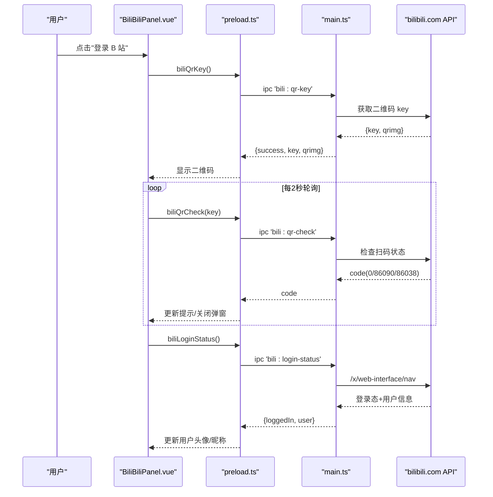

**图表来源**
- [BiliBiliPanel.vue:387-468](file://src/renderer/src/components/BiliBiliPanel.vue#L387-L468)
- [preload.ts:73-82](file://src/preload/preload.ts#L73-L82)
- [main.ts:2292-2348](file://src/main/main.ts#L2292-L2348)

## 详细组件分析

### 用户认证流程
- 扫码登录：
  - 前端发起 biliQrKey 获取二维码图片与 key，启动定时器每 2 秒轮询 biliQrCheck。
  - 当 code=0 表示已确认登录，关闭弹窗并刷新登录态；code=86090 提示手机端确认；code=86038 二维码过期需刷新。
- Cookie 登录：
  - 用户粘贴 Cookie，主进程解析并存入本地 Cookie 容器，随后校验登录态并返回用户信息。
- 退出登录：
  - 清空本地 Cookie 并重置前端状态。

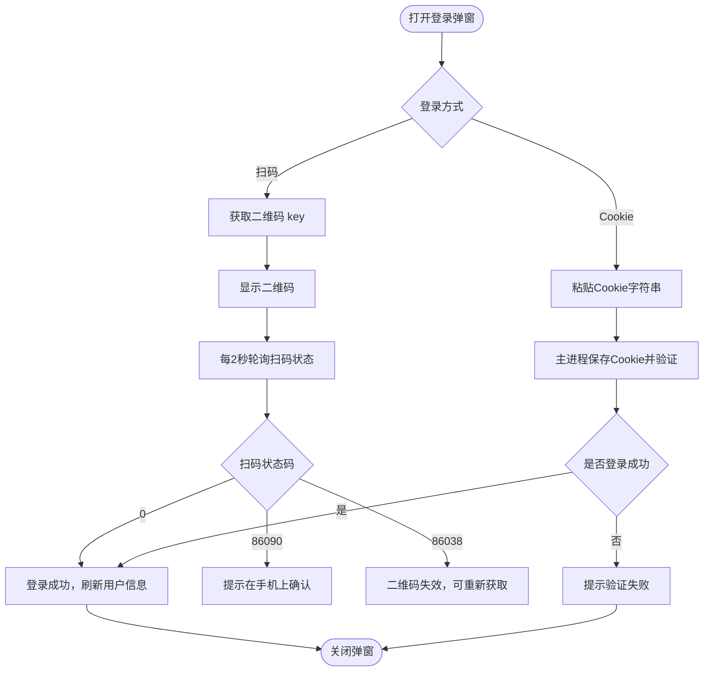

**图表来源**
- [BiliBiliPanel.vue:387-468](file://src/renderer/src/components/BiliBiliPanel.vue#L387-L468)
- [main.ts:2321-2348](file://src/main/main.ts#L2321-L2348)

章节来源
- [BiliBiliPanel.vue:354-468](file://src/renderer/src/components/BiliBiliPanel.vue#L354-L468)
- [main.ts:2292-2348](file://src/main/main.ts#L2292-L2348)

### 个性推荐功能
**新增功能** 基于用户兴趣的智能视频推荐系统。

- 推荐算法：
  - 使用 B 站首页 feed/rcmd 接口，通过 WBI 签名确保请求合法性。
  - 过滤直播内容和广告，仅展示普通视频。
  - 支持自定义页面大小（默认24条，采用6×4网格布局）。
- 用户界面：
  - 独立的"个性推荐"标签页，位于工具栏第一个位置。
  - 支持"换一批"功能，随机刷新推荐内容。
  - **v3.5.6更新**：采用6×4固定网格布局，每批展示24个视频卡片。
- 技术实现：
  - 主进程通过 biliEnsureBuvid 确保 buvid3 Cookie 存在。
  - 使用 biliWbiSign 生成带签名的请求参数。
  - 自动处理 WBI 密钥轮换异常。

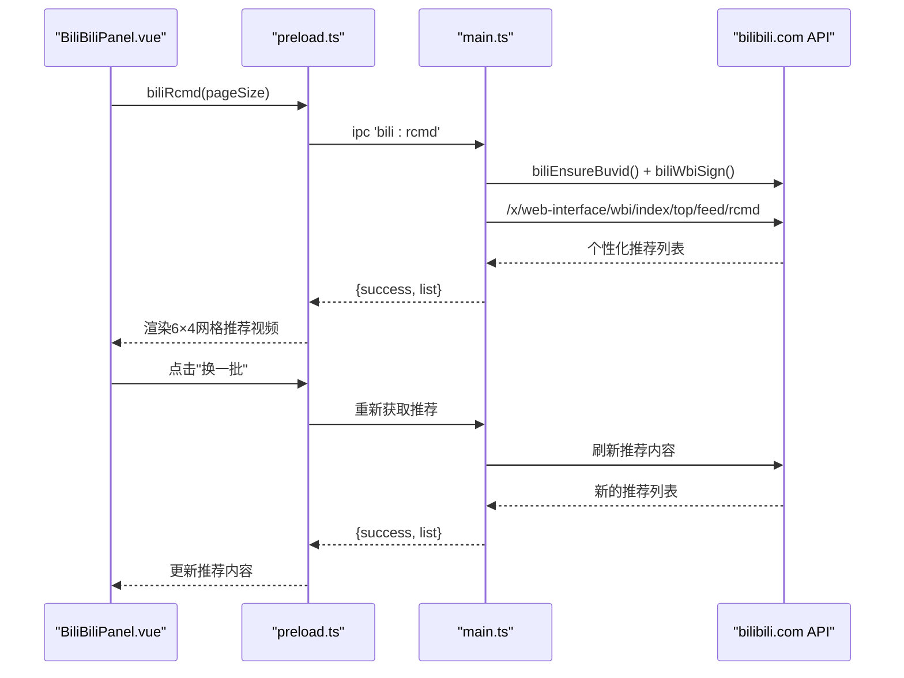

**图表来源**
- [BiliBiliPanel.vue:43-77](file://src/renderer/src/components/BiliBiliPanel.vue#L43-L77)
- [BiliBiliPanel.vue:535-551](file://src/renderer/src/components/BiliBiliPanel.vue#L535-L551)
- [main.ts:2565-2586](file://src/main/main.ts#L2565-2586)

章节来源
- [BiliBiliPanel.vue:43-77](file://src/renderer/src/components/BiliBiliPanel.vue#L43-L77)
- [BiliBiliPanel.vue:535-551](file://src/renderer/src/components/BiliBiliPanel.vue#L535-L551)
- [main.ts:2565-2586](file://src/main/main.ts#L2565-2586)

### 热门推荐功能
**v3.5.7版本重要更新**：热门视频首次访问自动加载，提供更好的用户体验。

- 加载行为变更：
  - **首次访问自动加载**：组件切换到热门标签时自动获取热门视频，无需用户手动操作。
  - **后续手动触发**：用户需要点击"换一批"按钮来获取新的热门视频推荐。
  - **空状态提示**：仅在加载失败或无结果时显示引导提示。
- 网格布局优化：
  - **6×4固定布局**：每批展示24个视频，采用6列×4行的固定网格布局。
  - **响应式适配**：在不同屏幕尺寸下保持良好的视觉效果。
- 分页加载：
  - 支持"加载更多"功能，按页获取更多内容。
  - 随机跳页机制避免重复推荐。

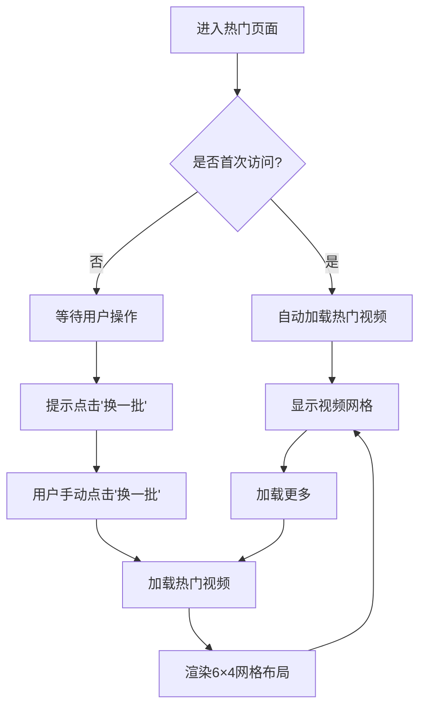

**图表来源**
- [BiliBiliPanel.vue:79-119](file://src/renderer/src/components/BiliBiliPanel.vue#L79-L119)
- [BiliBiliPanel.vue:626-649](file://src/renderer/src/components/BiliBiliPanel.vue#L626-L649)
- [BiliBiliPanel.vue:746-750](file://src/renderer/src/components/BiliBiliPanel.vue#L746-L750)

章节来源
- [BiliBiliPanel.vue:79-119](file://src/renderer/src/components/BiliBiliPanel.vue#L79-L119)
- [BiliBiliPanel.vue:626-649](file://src/renderer/src/components/BiliBiliPanel.vue#L626-L649)
- [BiliBiliPanel.vue:746-750](file://src/renderer/src/components/BiliBiliPanel.vue#L746-L750)

### 收藏夹管理
- 获取收藏夹列表：
  - 需要登录，主进程从 Cookie 中取 mid，调用创建收藏夹列表接口，返回 id/title/count/cover。
- 获取收藏夹内容：
  - 按 mediaId 分页拉取，过滤失效资源（attr !== 0/1），返回统一视频卡片结构。
- 刷新与状态同步：
  - 切换收藏夹时重置分页并拉取第一页；登录成功后若处于收藏夹页签则自动加载列表。

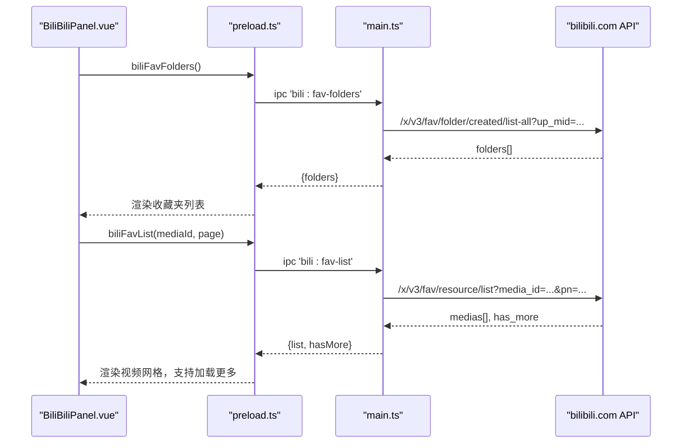

**图表来源**
- [BiliBiliPanel.vue:494-544](file://src/renderer/src/components/BiliBiliPanel.vue#L494-L544)
- [main.ts:2396-2440](file://src/main/main.ts#L2396-L2440)

章节来源
- [BiliBiliPanel.vue:494-544](file://src/renderer/src/components/BiliBiliPanel.vue#L494-L544)
- [main.ts:2396-2440](file://src/main/main.ts#L2396-L2440)

### 视频搜索功能
- 关键词处理：
  - 输入框 v-model 绑定 searchKeyword，回车或点击搜索触发 doSearch(page)。
  - 空关键词提示；page < 1 直接返回。
- 结果展示与分页：
  - 调用 biliSearch(keyword, page)，返回 list/total/numPages，渲染网格与分页控件。
- 防风控：
  - 主进程确保 buvid3 Cookie 存在后再发起搜索，避免被风控拦截。

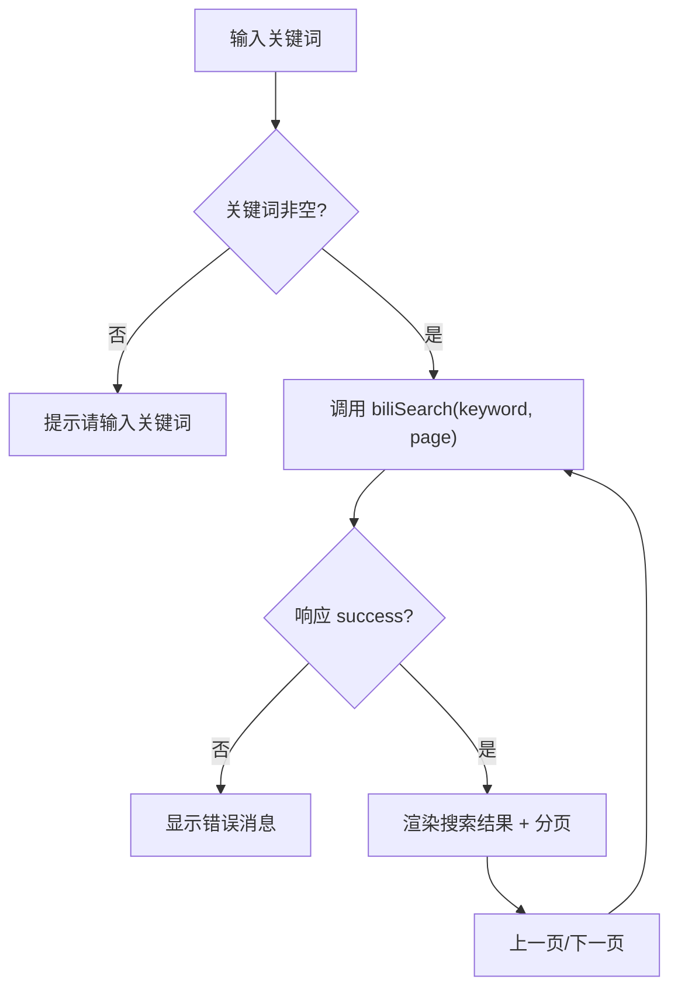

**图表来源**
- [BiliBiliPanel.vue:546-581](file://src/renderer/src/components/BiliBiliPanel.vue#L546-L581)
- [main.ts:2376-2391](file://src/main/main.ts#L2376-L2391)

章节来源
- [BiliBiliPanel.vue:546-581](file://src/renderer/src/components/BiliBiliPanel.vue#L546-L581)
- [main.ts:2376-2391](file://src/main/main.ts#L2376-L2391)

### 视频播放集成与配置
**增强功能** 视频播放器现已支持社交互动功能和评论回复系统，**v3.5.8版本进一步优化**。

- 播放流程：
  - 点击视频卡片进入播放器弹窗，调用 biliView(bvid) 获取详情（包含 pages、统计信息等）。
  - 根据当前分P的 cid 与选择的 qn 调用 biliPlayurl 获取 durl（含 backupUrl）。
  - 使用 HTML5 video 标签播放，设置 controls/autoplay/preload/playsinline。
- 分P与清晰度：
  - 下拉选择分P与清晰度，切换后重新 loadStream。
- 多分段自动连播：
  - onVideoEnded 自动切换到下一段 segments[segIdx+1]。
- 错误与重试：
  - onVideoError 优先尝试 backupUrl；若仍失败，提示用户切换清晰度或重试。
- 相关推荐：
  - 异步加载 biliRelated(bvid)，不影响播放主流程。
- **社交互动**：**新增** 点赞、投币、收藏功能，支持实时状态同步。
- **评论回复系统**：**v3.5.8新增** 完整评论功能，支持热评优先、分页加载、用户头像显示。
- **v3.5.8更新**：播放器对话框宽度增加至 `min(1400px, 96vw)`，提供更好的观看体验。

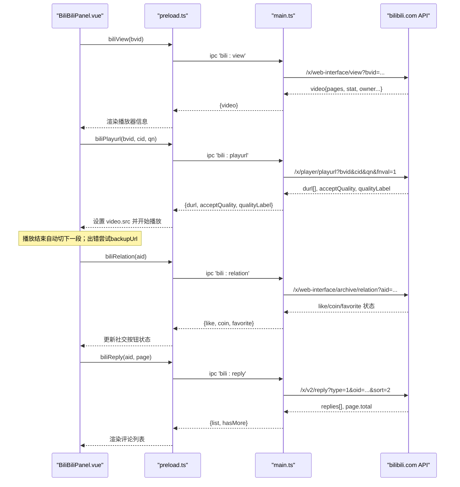

**图表来源**
- [BiliBiliPanel.vue:610-703](file://src/renderer/src/components/BiliBiliPanel.vue#L610-703)
- [main.ts:2444-2499](file://src/main/main.ts#L2444-L2499)
- [main.ts:2588-2613](file://src/main/main.ts#L2588-L2613)
- [main.ts:2764-2785](file://src/main/main.ts#L2764-L2785)

章节来源
- [BiliBiliPanel.vue:610-703](file://src/renderer/src/components/BiliBiliPanel.vue#L610-703)
- [main.ts:2444-2499](file://src/main/main.ts#L2444-L2499)

### 社交互动功能
**新增功能** 视频播放器中的社交互动能力。

- 点赞功能：
  - 支持点赞和取消点赞操作。
  - 实时显示点赞状态和数量。
  - 未登录时提示用户先登录。
- 投币功能：
  - 支持投1个或2个硬币。
  - 限制每个视频最多投2个币。
  - 显示投币状态和剩余次数。
- 收藏功能：
  - 支持添加到默认收藏夹。
  - 支持取消收藏。
  - 自动获取用户收藏夹列表。
- 状态同步：
  - 播放视频时自动查询当前用户的互动状态。
  - 操作成功后实时更新界面状态。
  - 错误处理友好，不影响播放体验。

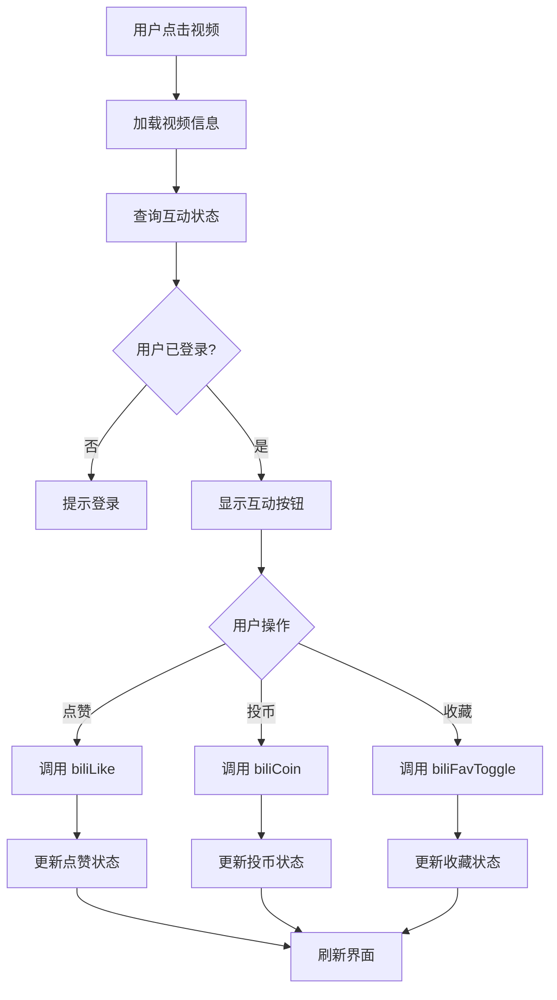

**图表来源**
- [BiliBiliPanel.vue:314-339](file://src/renderer/src/components/BiliBiliPanel.vue#L314-L339)
- [BiliBiliPanel.vue:793-879](file://src/renderer/src/components/BiliBiliPanel.vue#L793-L879)
- [main.ts:2588-2646](file://src/main/main.ts#L2588-L2646)

章节来源
- [BiliBiliPanel.vue:314-339](file://src/renderer/src/components/BiliBiliPanel.vue#L314-L339)
- [BiliBiliPanel.vue:793-879](file://src/renderer/src/components/BiliBiliPanel.vue#L793-L879)
- [main.ts:2588-2646](file://src/main/main.ts#L2588-L2646)

### 评论回复系统
**v3.5.8版本重大新增**：完整的视频评论回复功能。

- 评论加载机制：
  - 使用 B 站 x/v2/reply API，支持热评优先排序（sort=2）。
  - 每页加载10条评论，支持分页加载更多。
  - 异步加载，不阻塞视频播放主流程。
- 用户信息显示：
  - 显示评论者头像、昵称、评论内容和点赞数。
  - 头像缺失时显示默认占位符。
  - 评论文本支持换行和特殊字符处理。
- 分页加载：
  - 底部"加载更多"按钮，支持无限滚动式加载。
  - 智能判断是否有更多评论，动态控制按钮状态。
  - 评论列表状态管理，包括加载状态和分页状态。
- 用户体验优化：
  - 评论区域独立滚动，不影响其他内容。
  - 加载状态反馈，避免用户等待焦虑。
  - 错误处理友好，加载失败不影响整体功能。

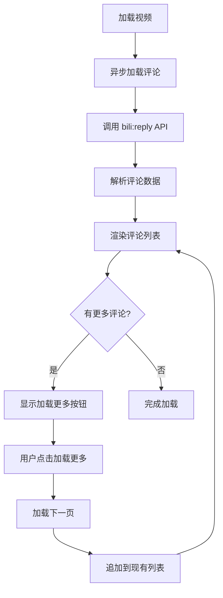

**图表来源**
- [BiliBiliPanel.vue:427-452](file://src/renderer/src/components/BiliBiliPanel.vue#L427-L452)
- [BiliBiliPanel.vue:1219-1238](file://src/renderer/src/components/BiliBiliPanel.vue#L1219-L1238)
- [main.ts:2764-2785](file://src/main/main.ts#L2764-L2785)

章节来源
- [BiliBiliPanel.vue:427-452](file://src/renderer/src/components/BiliBiliPanel.vue#L427-L452)
- [BiliBiliPanel.vue:1219-1238](file://src/renderer/src/components/BiliBiliPanel.vue#L1219-L1238)
- [main.ts:2764-2785](file://src/main/main.ts#L2764-L2785)

### 播放器对话框响应式设计
**v3.5.6版本重大更新**：播放器对话框采用全新的响应式两列布局设计，**v3.5.8版本进一步优化**。

- 响应式宽度：
  - **v3.5.8更新**：使用 `width="min(1400px, 96vw)"` 确保在不同屏幕尺寸下的最佳显示效果。
  - 大屏幕下最大宽度1400px，小屏幕下自适应96%视口宽度。
- 两列布局：
  - **左侧主区域**：视频播放器、播放控制栏、社交互动按钮。
  - **右侧边栏**：UP主信息卡片、投稿视频列表、相关视频推荐、评论回复。
- 独立滚动：
  - 右侧边栏支持独立滚动，最大高度54vh，避免撑高整个弹窗。
  - 窄屏模式下（≤1100px）右侧栏自动移动到视频下方。
- 网格布局优化：
  - **6×4固定网格**：推荐和热门视频采用6列×4行的固定布局。
  - **响应式适配**：在小屏幕下自动调整网格列数。

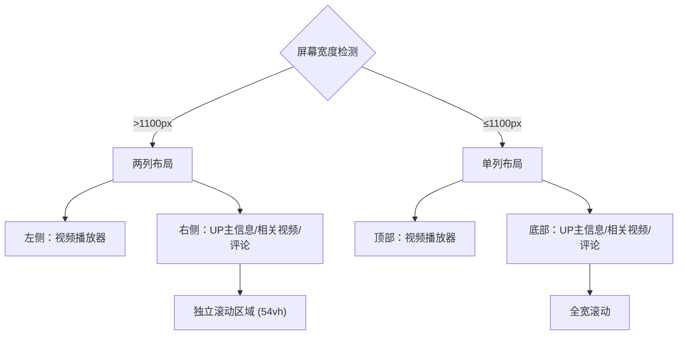

**图表来源**
- [BiliBiliPanel.vue:240-455](file://src/renderer/src/components/BiliBiliPanel.vue#L240-L455)
- [BiliBiliPanel.vue:1842-1877](file://src/renderer/src/components/BiliBiliPanel.vue#L1842-L1877)

章节来源
- [BiliBiliPanel.vue:240-455](file://src/renderer/src/components/BiliBiliPanel.vue#L240-L455)
- [BiliBiliPanel.vue:1842-1877](file://src/renderer/src/components/BiliBiliPanel.vue#L1842-L1877)

### DASH编码处理修复
**v3.5.6版本关键修复**：解决了MSE DASH播放器的编码格式解析问题。

- 编码格式解析：
  - **问题修复**：B站返回的mime_type格式如`video/mp4; codecs=avc1.640033`（codecs未加引号），直接传给isTypeSupported会解析失败。
  - **解决方案**：只取容器类型，再用独立codecs字段重新拼装标准MIME格式。
- 轨道选择优化：
  - 仅在MSE可解码的轨道中选择目标清晰度，避免选中不支持的编码。
  - 精确匹配优先，否则就近向下选择，最后取最低档。
- 流控机制：
  - 缓冲超前秒数上限90秒，达到后暂停拉流。
  - 消耗至45秒后恢复拉流，避免内存占用过高。

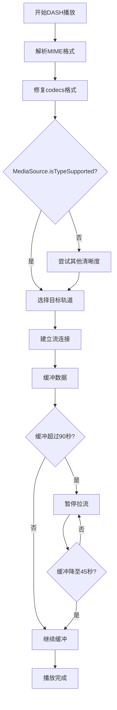

**图表来源**
- [BiliBiliPanel.vue:844-953](file://src/renderer/src/components/BiliBiliPanel.vue#L844-L953)

章节来源
- [BiliBiliPanel.vue:844-953](file://src/renderer/src/components/BiliBiliPanel.vue#L844-L953)

### SourceBuffer配额管理
**v3.5.7版本重大新增**：解决了高码率长视频的内存溢出问题。

- 配额保护机制：
  - **QuotaExceededError处理**：当SourceBuffer超出配额时，自动移除播放点之前的历史缓冲腾出空间。
  - **智能清理策略**：保留播放点前20秒便于回拖，其余历史缓冲全部移除。
  - **自动重试机制**：清理后自动重试append操作，确保播放连续性。
- 内存优化：
  - **动态缓冲管理**：根据播放进度动态调整已播放缓冲的保留范围。
  - **及时释放资源**：避免长时间播放导致的内存累积增长。
- 用户体验：
  - **无缝播放**：配额管理过程对用户透明，不影响播放体验。
  - **稳定性提升**：大幅降低高码率视频播放时的崩溃概率。

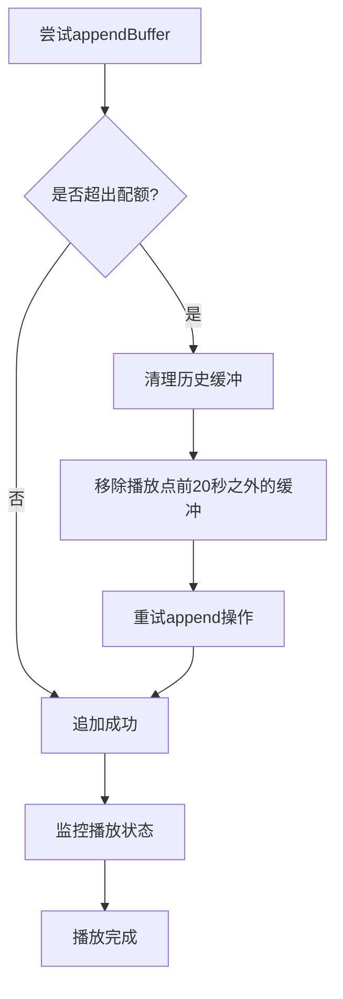

**图表来源**
- [BiliBiliPanel.vue:960-988](file://src/renderer/src/components/BiliBiliPanel.vue#L960-L988)

章节来源
- [BiliBiliPanel.vue:960-988](file://src/renderer/src/components/BiliBiliPanel.vue#L960-L988)

### 弹幕系统增强
**v3.5.7版本重大升级**：全面优化弹幕渲染性能和视觉效果。

- 全局Keyframe动画：
  - **动态样式注入**：通过全局style标签注入弹幕动画keyframes，避免scoped样式限制。
  - **两种动画模式**：滚动弹幕（bili-dm-scroll）和停留弹幕（bili-dm-stay）。
  - **性能优化**：使用CSS3动画替代JavaScript动画，提升渲染性能。
- 内联样式渲染：
  - **动态元素样式**：弹幕元素通过行内样式设置，确保在teleport后的弹窗中正确显示。
  - **样式优先级**：避免与组件scoped样式冲突，保证弹幕样式一致性。
- 智能时间机制：
  - **防刷屏保护**：弹幕晚于播放开始时，跳过已播过的部分，避免一次性补发刷屏。
  - **时间指针管理**：维护danmakuPtr和danmakuLastTime，精准定位弹幕播放位置。
  - **拖动优化**：进度条拖动时清空屏幕弹幕并二分定位到新时间点。
- 渲染优化：
  - **同屏限制**：最多同时显示80条弹幕，超出部分丢弃保证流畅性。
  - **自动清理**：动画结束后自动移除DOM元素，防止内存泄漏。
  - **容错处理**：即使动画事件丢失，也通过setTimeout兜底清理。

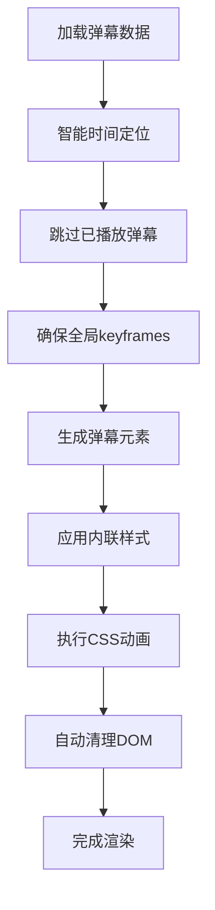

**图表来源**
- [BiliBiliPanel.vue:1174-1285](file://src/renderer/src/components/BiliBiliPanel.vue#L1174-L1285)

章节来源
- [BiliBiliPanel.vue:1174-1285](file://src/renderer/src/components/BiliBiliPanel.vue#L1174-L1285)

### 右侧边栏标签页界面
**v3.6.0版本重大重构**：右侧边栏从线性布局完全重构为标签页界面。

- 标签页设计：
  - **四个独立视图**：简介、UP主视频、相关视频、评论，通过标签页切换显示。
  - **固定顶部UP主卡片**：UP主信息卡片固定在侧边栏顶部，不参与滚动，始终可见。
  - **独立滚动区域**：每个标签页内容区域独立滚动，互不影响。
- 响应式设计：
  - **粘性定位**：UP主卡片使用sticky定位，滚动时保持固定在顶部。
  - **窄屏适配**：在≤1100px屏幕下，右侧栏自动移动到视频下方，采用全宽布局。
  - **弹性布局**：标签页按钮在小屏幕下自动换行显示。
- 内容优化：
  - **简介区域**：视频描述信息，支持滚动查看，最大高度限制。
  - **UP主视频**：左图右文紧凑列表布局，92×54缩略图，显示播放量信息。
  - **相关视频**：最多显示10条相关视频推荐，紧凑行卡布局。
  - **评论区**：热评优先排序，分页加载，每页10条评论。
- 视觉优化：
  - **紧凑化设计**：减小padding、字体大小，提升信息密度。
  - **玻璃拟态风格**：保持与整体UI一致的玻璃卡片效果。
  - **交互反馈**：标签页切换有平滑过渡动画，hover效果明显。

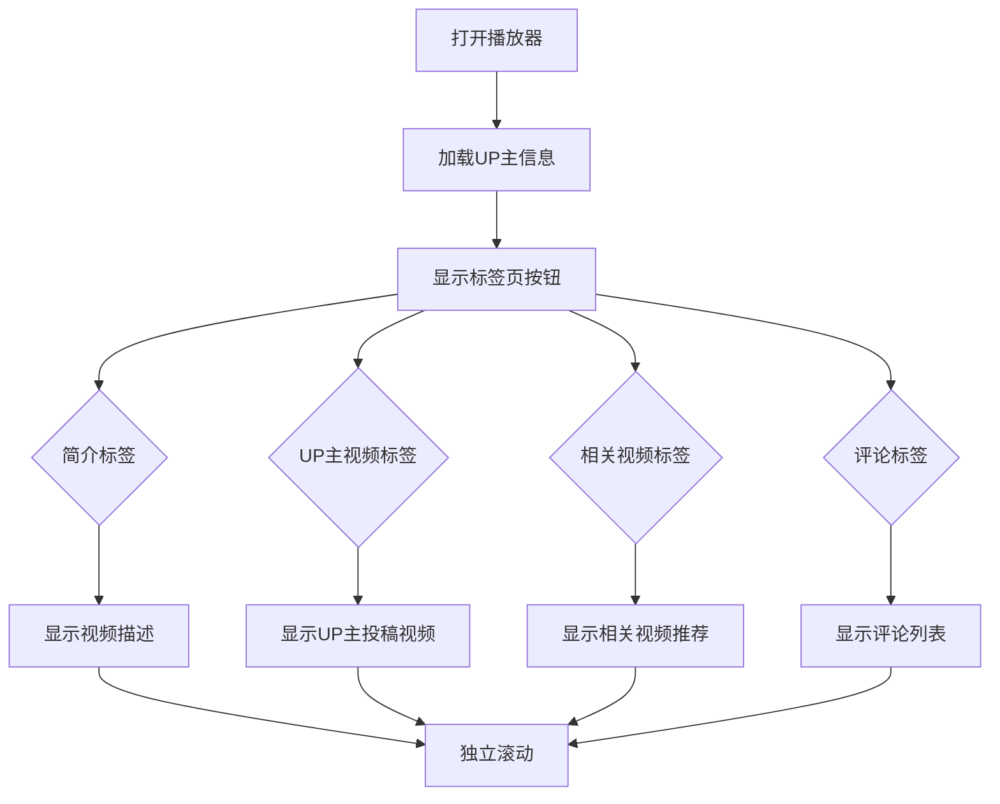

**图表来源**
- [BiliBiliPanel.vue:359-450](file://src/renderer/src/components/BiliBiliPanel.vue#L359-L450)
- [BiliBiliPanel.vue:1394-1440](file://src/renderer/src/components/BiliBiliPanel.vue#L1394-L1440)

章节来源
- [BiliBiliPanel.vue:359-450](file://src/renderer/src/components/BiliBiliPanel.vue#L359-L450)
- [BiliBiliPanel.vue:1394-1440](file://src/renderer/src/components/BiliBiliPanel.vue#L1394-L1440)

### 登录状态的维护与自动刷新
- 组件挂载时调用 refreshLoginStatus，查询当前登录态并渲染用户信息。
- 登录成功后自动刷新用户信息；退出登录时清空本地 Cookie 并重置前端状态。
- 收藏夹页签在登录成功后自动加载收藏夹列表。

章节来源
- [BiliBiliPanel.vue:354-375](file://src/renderer/src/components/BiliBiliPanel.vue#L354-L375)
- [BiliBiliPanel.vue:713-716](file://src/renderer/src/components/BiliBiliPanel.vue#L713-L716)
- [main.ts:2292-2319](file://src/main/main.ts#L2292-L2319)

### 错误处理与重试策略
- 统一 loading/error 状态：每个数据获取操作均有 loading 标志，失败时 ElMessage 提示。
- 播放错误：onVideoError 优先尝试 backupUrl；若仍失败，提示用户切换清晰度或点击"重试"。
- 搜索风控：主进程对 -412 等风控码给出友好提示，建议稍后重试或先登录。
- **社交操作错误**：**新增** 点赞、投币、收藏操作的错误处理和用户反馈。
- **评论加载错误**：**v3.5.8新增** 评论加载失败的静默降级处理，不影响播放体验。
- **v3.5.6更新**：DASH编码解析失败的错误处理，提供更友好的用户提示。
- **v3.5.7更新**：SourceBuffer配额管理的错误处理，自动清理并重试。
- **v3.6.0更新**：右侧边栏标签页切换的错误处理，确保各视图独立加载和错误隔离。

章节来源
- [BiliBiliPanel.vue:476-492](file://src/renderer/src/components/BiliBiliPanel.vue#L476-L492)
- [BiliBiliPanel.vue:556-581](file://src/renderer/src/components/BiliBiliPanel.vue#L556-L581)
- [BiliBiliPanel.vue:682-693](file://src/renderer/src/components/BiliBiliPanel.vue#L682-L693)
- [BiliBiliPanel.vue:1224-1238](file://src/renderer/src/components/BiliBiliPanel.vue#L1224-L1238)
- [main.ts:2376-2391](file://src/main/main.ts#L2376-L2391)

### 自定义搜索过滤与排序
- 当前实现未在前端提供自定义过滤与排序选项。
- 如需扩展：可在 doSearch 前后增加本地过滤逻辑（如按作者、时长、发布时间筛选），或在主进程侧扩展搜索参数（如排序字段）并透传到 B 站 API。

[本节为概念性说明，不直接分析具体文件]

## 依赖关系分析
- 渲染层依赖：
  - Element Plus 图标与消息提示。
  - window.electronAPI 暴露的 bili:* 方法。
- 预加载层依赖：
  - ipcRenderer.invoke 转发至主进程。
- 主进程依赖：
  - biliGet/biliCookies/biliEnsureBuvid 等内部工具函数（用于统一请求、Cookie 管理、buvid 补领）。
  - B 站官方 API（热门、收藏、搜索、视频详情、播放地址、推荐、评论）。

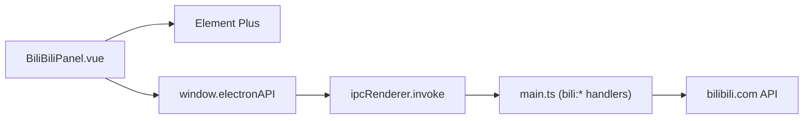

**图表来源**
- [BiliBiliPanel.vue:338-350](file://src/renderer/src/components/BiliBiliPanel.vue#L338-L350)
- [preload.ts:73-82](file://src/preload/preload.ts#L73-82)
- [main.ts:2352-2499](file://src/main/main.ts#L2352-L2499)

章节来源
- [BiliBiliPanel.vue:338-350](file://src/renderer/src/components/BiliBiliPanel.vue#L338-L350)
- [preload.ts:73-82](file://src/preload/preload.ts#L73-82)
- [main.ts:2352-2499](file://src/main/main.ts#L2352-L2499)

## 性能与缓存策略
- 前端缓存：
  - 热门/收藏/搜索结果均以数组形式保存在组件响应式状态中，支持"加载更多"追加数据。
  - 无跨页面/跨会话的本地缓存（B 站面板未使用 storage.ts 做业务缓存）。
- 主进程缓存：
  - Cookie 持久化（SESSDATA 等）保证登录态跨会话有效。
  - buvid3 缺失时自动补领，减少搜索风控概率。
- 播放优化：
  - 使用 HTML5 video 原生播放，避免第三方播放器开销。
  - 多分段 FLV 自动连播，减少用户操作。
  - 备用 CDN 地址自动回退，提升稳定性。
  - **v3.5.6更新**：DASH流控机制，避免长视频内存占用过高。
  - **v3.5.7更新**：SourceBuffer配额管理，解决高码率视频内存溢出问题。
- 网络优化：
  - 热门接口"换一批"随机跳页，避免重复推荐。
  - 搜索分页固定 pageSize=20，控制单次负载。
  - **v3.5.7更新**：热门视频首次访问自动加载，减少用户操作步骤。
- **个性化推荐优化**：**新增** WBI 签名缓存和密钥轮换处理，提高推荐接口稳定性。
- **弹幕性能优化**：**v3.5.7更新** 全局keyframe动画和内联样式，提升渲染性能。
- **评论性能优化**：**v3.5.8新增** 分页加载机制，每页10条评论，避免一次性加载过多数据。
- **右侧边栏性能优化**：**v3.6.0新增** 标签页懒加载机制，仅加载当前激活标签页的内容，减少初始加载负担。

[本节为通用性能讨论，不直接分析具体文件]

## 故障排查指南
- 无法获取二维码：
  - 检查网络连通性与主进程 biliQrKey 返回值；确认 qrLoading 状态与提示信息。
- 扫码无响应：
  - 确认轮询定时器未被清理；检查 biliQrCheck 返回的 code 是否为 0/86090/86038。
- Cookie 登录失败：
  - 确认粘贴的 Cookie 包含 SESSDATA；主进程会校验登录态并返回 message。
- 搜索被风控：
  - 出现 -412 时提示稍后重试或先登录；确保 buvid3 已存在。
- 播放失败：
  - 优先尝试备用CDN；若仍失败，提示切换清晰度或重试；检查 biliPlayurl 返回的 durl 与 acceptQuality。
- **个性化推荐失败**：**新增** 检查 WBI 签名是否正确，确认 buvid3 Cookie 存在，查看是否有密钥轮换异常。
- **社交操作失败**：**新增** 确认用户已登录，检查 CSRF token 是否有效，查看具体的错误消息。
- **评论加载失败**：**v3.5.8新增** 检查 bili:reply API 调用是否正常，确认 oid 参数正确，查看网络请求状态。
- **v3.5.6更新**：DASH播放问题排查，检查浏览器是否支持相应的编码格式，确认MIME格式解析正确。
- **v3.5.7更新**：SourceBuffer配额问题排查，检查浏览器MSE支持情况，确认配额管理逻辑正常工作。
- **弹幕显示异常**：**v3.5.7新增** 检查全局keyframes是否正确注入，确认内联样式生效，验证弹幕时间轴计算逻辑。
- **右侧边栏标签页问题**：**v3.6.0新增** 检查标签页切换逻辑，确认各视图数据加载状态，验证粘性定位效果。

章节来源
- [BiliBiliPanel.vue:393-433](file://src/renderer/src/components/BiliBiliPanel.vue#L393-L433)
- [BiliBiliPanel.vue:445-468](file://src/renderer/src/components/BiliBiliPanel.vue#L445-L468)
- [BiliBiliPanel.vue:556-581](file://src/renderer/src/components/BiliBiliPanel.vue#L556-L581)
- [BiliBiliPanel.vue:682-693](file://src/renderer/src/components/BiliBiliPanel.vue#L682-L693)
- [BiliBiliPanel.vue:1224-1238](file://src/renderer/src/components/BiliBiliPanel.vue#L1224-L1238)
- [main.ts:2376-2391](file://src/main/main.ts#L2376-L2391)

## 结论
BiliBiliPanel 组件通过清晰的三层架构（渲染/预加载/主进程）实现了 B 站视频的完整集成：安全的认证流程、稳定的数据获取、友好的播放体验与完善的错误处理。**v3.6.0版本进行了右侧边栏的重大重构**，从线性布局完全转变为标签页界面，包含简介、UP主视频、相关视频、评论四个独立视图，并新增固定顶部UP主卡片区域，显著提升了用户体验和信息组织效率。**v3.5.8版本进一步增强了用户体验**，新增了完整的评论回复系统，支持热评优先、分页加载和用户头像显示，同时优化了播放器对话框的宽度和右侧栏的视觉设计。**v3.5.7版本还引入了SourceBuffer配额管理解决高码率播放问题、热门视频首次访问自动加载、增强的弹幕系统和优化的右侧栏界面**。这些改进显著提升了应用的稳定性和用户满意度，为未来的功能扩展奠定了坚实基础。

[本节为总结性内容，不直接分析具体文件]

## 附录：API 与数据模型
- 类型定义：
  - BiliVideo：统一视频卡片结构（bvid/title/pic/author/duration/play/danmaku/pubdate）。
  - BiliUser：登录用户信息（mid/uname/face/vipStatus）。
  - **BiliReply**：**v3.5.8新增** 评论条目结构（rpid/uname/face/message/like/ctime）。
  - ElectronAPI.bili*：登录、热门、收藏、搜索、详情、播放等方法的 Promise 返回结构。
- 主要 IPC 通道：
  - bili:login-status / bili:logout / bili:set-cookie
  - bili:popular / bili:related / bili:search
  - bili:fav-folders / bili:fav-list
  - bili:view / bili:playurl
  - **新增**：bili:rcmd / bili:relation / bili:like / bili:coin / bili:fav-toggle
  - **v3.5.8新增**：bili:reply（评论回复系统）
  - **v3.6.0新增**：bili:card / bili:space-videos（UP主信息和投稿视频）

章节来源
- [vite-env.d.ts:20-38](file://src/renderer/src/vite-env.d.ts#L20-L38)
- [vite-env.d.ts:52-53](file://src/renderer/src/vite-env.d.ts#L52-L53)
- [vite-env.d.ts:203-231](file://src/renderer/src/vite-env.d.ts#L203-L231)
- [preload.ts:73-82](file://src/preload/preload.ts#L73-82)
- [main.ts:2292-2499](file://src/main/main.ts#L2292-L2499)
- [main.ts:2764-2785](file://src/main/main.ts#L2764-L2785)