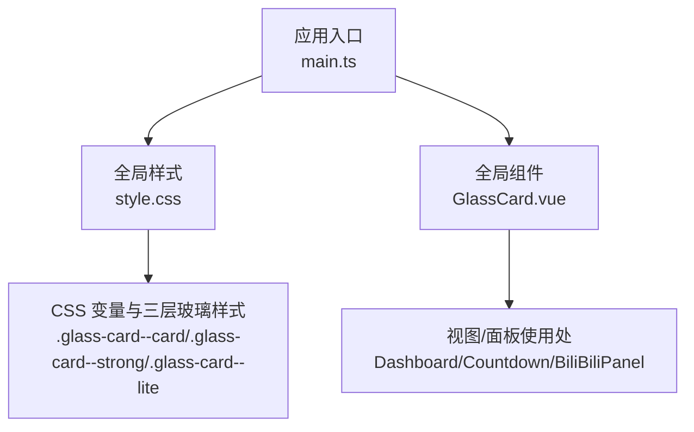
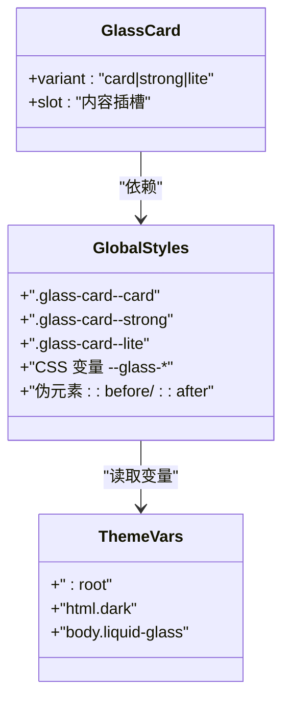
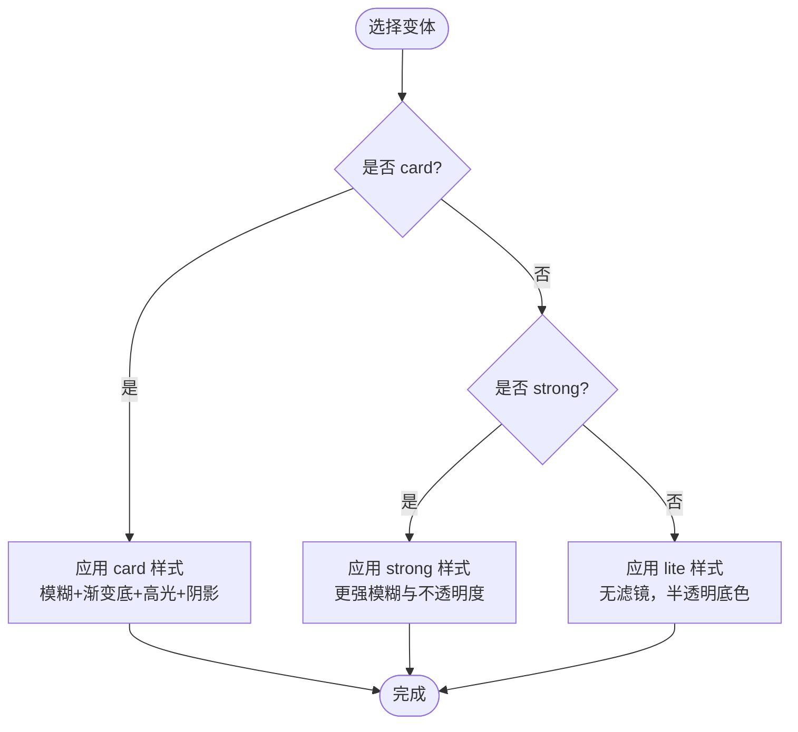
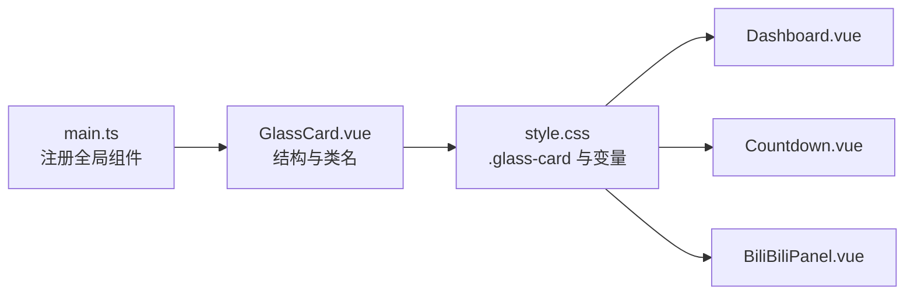

# GlassCard 玻璃卡片组件

<cite>
**本文引用的文件**
- [GlassCard.vue](file://src/renderer/src/components/GlassCard.vue)
- [style.css](file://src/renderer/src/style.css)
- [main.ts](file://src/renderer/src/main.ts)
- [Dashboard.vue](file://src/renderer/src/views/Dashboard.vue)
- [Countdown.vue](file://src/renderer/src/views/Countdown.vue)
- [BiliBiliPanel.vue](file://src/renderer/src/components/BiliBiliPanel.vue)
</cite>

## 目录
1. [简介](#简介)
2. [项目结构](#项目结构)
3. [核心组件](#核心组件)
4. [架构总览](#架构总览)
5. [详细组件分析](#详细组件分析)
6. [依赖关系分析](#依赖关系分析)
7. [性能考量](#性能考量)
8. [故障排查指南](#故障排查指南)
9. [结论](#结论)
10. [附录](#附录)

## 简介
GlassCard 是一个全局注册的 Vue 组件，用于实现“液态玻璃”风格的卡片容器。它通过 CSS 变量与伪元素高光、模糊背景（backdrop-filter）以及多层阴影构建出通透、有层次感的玻璃质感。组件提供三种变体模式：card（默认页面容器）、strong（弹窗级强调）、lite（无滤镜轻量面），以适配不同场景的视觉强度与性能需求。

## 项目结构
- 组件定义位于 components/GlassCard.vue，仅负责结构与类名注入，样式由全局 style.css 统一承载。
- 全局样式在 style.css 中集中管理，包含主题变量、三类玻璃变体样式、液态玻璃模式增强、Element Plus 浮层玻璃化等。
- 应用入口 main.ts 将 GlassCard 注册为全局组件，并引入全局样式。
- 视图与面板（如 Dashboard、Countdown、BiliBiliPanel）通过直接使用 <GlassCard> 或 .glass-card 工具类来组织内容。

图表来源
- [main.ts:1-24](file://src/renderer/src/main.ts#L1-L24)
- [style.css:282-372](file://src/renderer/src/style.css#L282-L372)

章节来源
- [main.ts:1-24](file://src/renderer/src/main.ts#L1-L24)
- [style.css:1-168](file://src/renderer/src/style.css#L1-L168)

## 核心组件
- 组件职责：渲染一个带 glass-card 基础类的容器，并根据 variant 追加对应修饰类，承载插槽内容。
- 属性：
  - variant: 'card' | 'strong' | 'lite'，默认 'card'。
- 插槽：默认插槽用于承载任意子内容。
- 样式策略：组件内部不写具体样式，全部视觉由全局 .glass-card 及其变体类控制，便于降级覆盖与主题切换。

章节来源
- [GlassCard.vue:1-27](file://src/renderer/src/components/GlassCard.vue#L1-L27)

## 架构总览
GlassCard 采用“薄组件 + 强样式”的设计：
- 组件层：只负责 DOM 结构与 class 拼接。
- 样式层：通过 CSS 变量统一管理颜色、模糊度、高光、阴影；通过伪元素 ::before/::after 实现高光与噪声纹理，避免额外滤镜层。
- 主题层：浅色/深色主题通过 :root 与 html.dark 覆盖变量；支持启用 body.liquid-glass 进入“液态玻璃模式”，进一步调整参数以获得更真实的折射与菲涅尔效果。
- 集成层：全局注册后，可在任意视图/面板直接复用，无需重复引入。

图表来源
- [GlassCard.vue:8-22](file://src/renderer/src/components/GlassCard.vue#L8-L22)
- [style.css:282-372](file://src/renderer/src/style.css#L282-L372)
- [style.css:11-152](file://src/renderer/src/style.css#L11-L152)
- [style.css:586-697](file://src/renderer/src/style.css#L586-L697)

## 详细组件分析

### 变体模式与视觉效果
- card（默认）
  - 适用：页面主容器、信息区块、统计卡片等。
  - 效果：具备 backdrop-filter 模糊与饱和，配合渐变底、顶部内亮线、左上镜面光斑与多层弥散阴影；hover 时阴影增强。
  - 参考样式位置：[style.css:290-346](file://src/renderer/src/style.css#L290-L346)
- strong
  - 适用：弹窗级强调区域、需要更强层级与对比度的浮层容器。
  - 效果：更高的不透明度背景与更强的模糊（pop），保留内亮线与阴影，突出层级。
  - 参考样式位置：[style.css:348-360](file://src/renderer/src/style.css#L348-L360)
- lite
  - 适用：长列表项、网格卡片、嵌套高频元素。
  - 效果：不使用 backdrop-filter，仅半透明底色+细边框+轻高光，保障滚动性能。
  - 参考样式位置：[style.css:362-372](file://src/renderer/src/style.css#L362-L372)

图表来源
- [GlassCard.vue:8-22](file://src/renderer/src/components/GlassCard.vue#L8-L22)
- [style.css:290-372](file://src/renderer/src/style.css#L290-L372)

章节来源
- [GlassCard.vue:8-22](file://src/renderer/src/components/GlassCard.vue#L8-L22)
- [style.css:290-372](file://src/renderer/src/style.css#L290-L372)

### 属性配置选项
- variant
  - 类型：'card' | 'strong' | 'lite'
  - 默认值：'card'
  - 作用：决定最终附加的修饰类名，从而触发不同的样式表现。
  - 参考：[GlassCard.vue:8-16](file://src/renderer/src/components/GlassCard.vue#L8-L16)

章节来源
- [GlassCard.vue:8-16](file://src/renderer/src/components/GlassCard.vue#L8-L16)

### 插槽机制与内容承载
- 默认插槽：用于承载任意子节点（文本、图标、表格、表单等）。
- 内容层级：由于伪元素 ::before 的高光层 z-index 较低，且内容被提升为相对定位 z-index:1，因此插槽内容始终显示在高光之上，保证可读性。
- 参考：[style.css:307-330](file://src/renderer/src/style.css#L307-L330)

章节来源
- [GlassCard.vue:19-22](file://src/renderer/src/components/GlassCard.vue#L19-L22)
- [style.css:307-330](file://src/renderer/src/style.css#L307-L330)

### 使用示例与最佳实践
- 基本用法
  - 在视图中直接使用 <GlassCard> 包裹内容，并通过 class 添加布局类名（如 .card）。
  - 示例位置：
    - [Dashboard.vue:70-117](file://src/renderer/src/views/Dashboard.vue#L70-L117)
    - [Dashboard.vue:120-160](file://src/renderer/src/views/Dashboard.vue#L120-L160)
    - [Dashboard.vue:164-234](file://src/renderer/src/views/Dashboard.vue#L164-L234)
    - [Countdown.vue:105-140](file://src/renderer/src/views/Countdown.vue#L105-L140)
    - [Countdown.vue:143-167](file://src/renderer/src/views/Countdown.vue#L143-L167)
- 避免嵌套使用
  - 组件注释明确禁止嵌套 GlassCard；如需嵌套，请使用 lite 变体以避免多重 backdrop-filter 导致的性能问题与视觉异常。
  - 参考：[GlassCard.vue:3-7](file://src/renderer/src/components/GlassCard.vue#L3-L7)
- 场景选择建议
  - 页面主容器/信息块：card
  - 弹窗/强调浮层：strong
  - 长列表/网格项/嵌套区：lite
- 直接工具类
  - 也可在不使用组件的情况下直接使用 .glass-card 及变体类，灵活组合。
  - 参考：[BiliBiliPanel.vue:734-745](file://src/renderer/src/components/BiliBiliPanel.vue#L734-L745)

章节来源
- [GlassCard.vue:3-7](file://src/renderer/src/components/GlassCard.vue#L3-L7)
- [Dashboard.vue:70-234](file://src/renderer/src/views/Dashboard.vue#L70-L234)
- [Countdown.vue:105-167](file://src/renderer/src/views/Countdown.vue#L105-L167)
- [BiliBiliPanel.vue:734-745](file://src/renderer/src/components/BiliBiliPanel.vue#L734-L745)

### 与全局样式变量的集成与主题定制
- 变量体系
  - 所有玻璃相关外观由 --glass-* 系列变量控制，包括背景渐变、模糊半径、饱和度、高光强度、阴影等。
  - 参考：[style.css:37-65](file://src/renderer/src/style.css#L37-L65)
- 主题切换
  - 浅色主题：:root 下定义默认变量。
  - 深色主题：html.dark 覆盖变量，使玻璃更收敛、高光和阴影更暗。
  - 参考：[style.css:11-152](file://src/renderer/src/style.css#L11-L152)
- 液态玻璃模式
  - 在 body 上添加 liquid-glass 类可启用“液态玻璃模式”，调整模糊、圆角、高光与阴影，模拟真实折射与菲涅尔反射，并叠加噪声纹理。
  - 参考：[style.css:586-697](file://src/renderer/src/style.css#L586-L697)
- 降级方案
  - 当浏览器不支持 backdrop-filter 时，自动回退到不透明底色并关闭高光，确保可用性。
  - 参考：[style.css:154-168](file://src/renderer/src/style.css#L154-L168)

章节来源
- [style.css:37-65](file://src/renderer/src/style.css#L37-L65)
- [style.css:11-152](file://src/renderer/src/style.css#L11-L152)
- [style.css:154-168](file://src/renderer/src/style.css#L154-L168)
- [style.css:586-697](file://src/renderer/src/style.css#L586-L697)

## 依赖关系分析
- 组件注册
  - 应用入口 main.ts 将 GlassCard 注册为全局组件，并引入全局样式。
  - 参考：[main.ts:1-24](file://src/renderer/src/main.ts#L1-L24)
- 样式依赖
  - GlassCard 的视觉完全依赖 style.css 中的 .glass-card 及其变体类与 CSS 变量。
  - 参考：[style.css:282-372](file://src/renderer/src/style.css#L282-L372)
- 使用方
  - 多个视图与面板通过 <GlassCard> 或直接使用 .glass-card 工具类进行布局与展示。
  - 参考：
    - [Dashboard.vue:70-234](file://src/renderer/src/views/Dashboard.vue#L70-L234)
    - [Countdown.vue:105-167](file://src/renderer/src/views/Countdown.vue#L105-L167)
    - [BiliBiliPanel.vue:734-745](file://src/renderer/src/components/BiliBiliPanel.vue#L734-L745)

图表来源
- [main.ts:1-24](file://src/renderer/src/main.ts#L1-L24)
- [GlassCard.vue:1-27](file://src/renderer/src/components/GlassCard.vue#L1-L27)
- [style.css:282-372](file://src/renderer/src/style.css#L282-L372)
- [Dashboard.vue:70-234](file://src/renderer/src/views/Dashboard.vue#L70-L234)
- [Countdown.vue:105-167](file://src/renderer/src/views/Countdown.vue#L105-L167)
- [BiliBiliPanel.vue:734-745](file://src/renderer/src/components/BiliBiliPanel.vue#L734-L745)

章节来源
- [main.ts:1-24](file://src/renderer/src/main.ts#L1-L24)
- [style.css:282-372](file://src/renderer/src/style.css#L282-L372)
- [Dashboard.vue:70-234](file://src/renderer/src/views/Dashboard.vue#L70-L234)
- [Countdown.vue:105-167](file://src/renderer/src/views/Countdown.vue#L105-L167)
- [BiliBiliPanel.vue:734-745](file://src/renderer/src/components/BiliBiliPanel.vue#L734-L745)

## 性能考量
- 避免多重 backdrop-filter
  - 组件注释明确指出禁止嵌套 GlassCard；嵌套区域应改用 lite 变体，避免多层模糊带来的性能损耗与渲染异常。
  - 参考：[GlassCard.vue:3-7](file://src/renderer/src/components/GlassCard.vue#L3-L7)
- GPU 合成与悬浮
  - 样式注释说明移除 translateY 上浮以避免创建新的合成层导致相邻卡片遮挡；hover 仅通过 box-shadow 增强营造悬浮感。
  - 参考：[style.css:337-346](file://src/renderer/src/style.css#L337-L346)、[style.css:684-697](file://src/renderer/src/style.css#L684-L697)
- 降级兜底
  - 不支持 backdrop-filter 的环境自动回退为不透明底色，保证可用性与一致性。
  - 参考：[style.css:154-168](file://src/renderer/src/style.css#L154-L168)

章节来源
- [GlassCard.vue:3-7](file://src/renderer/src/components/GlassCard.vue#L3-L7)
- [style.css:337-346](file://src/renderer/src/style.css#L337-L346)
- [style.css:684-697](file://src/renderer/src/style.css#L684-L697)
- [style.css:154-168](file://src/renderer/src/style.css#L154-L168)

## 故障排查指南
- 现象：卡片文字被高光遮挡
  - 原因：内容未处于高光层之上
  - 处理：确保内容具有相对定位与 z-index:1（样式已内置，勿覆盖）
  - 参考：[style.css:323-330](file://src/renderer/src/style.css#L323-L330)
- 现象：滚动卡顿或掉帧
  - 原因：大量使用 card/strong 导致多重 backdrop-filter
  - 处理：长列表/网格项改用 lite 变体
  - 参考：[style.css:362-372](file://src/renderer/src/style.css#L362-L372)
- 现象：hover 时相邻卡片被遮挡
  - 原因：transform 引发合成层顺序问题
  - 处理：遵循样式注释，仅通过 box-shadow 增强悬浮，避免 transform
  - 参考：[style.css:337-346](file://src/renderer/src/style.css#L337-L346)、[style.css:684-697](file://src/renderer/src/style.css#L684-L697)
- 现象：旧设备/浏览器显示异常
  - 原因：不支持 backdrop-filter
  - 处理：自动降级为不透明底色；如需自定义，可覆盖 --glass-bg-fallback 等变量
  - 参考：[style.css:154-168](file://src/renderer/src/style.css#L154-L168)

章节来源
- [style.css:323-330](file://src/renderer/src/style.css#L323-L330)
- [style.css:362-372](file://src/renderer/src/style.css#L362-L372)
- [style.css:337-346](file://src/renderer/src/style.css#L337-L346)
- [style.css:684-697](file://src/renderer/src/style.css#L684-L697)
- [style.css:154-168](file://src/renderer/src/style.css#L154-L168)

## 结论
GlassCard 通过“薄组件 + 全局样式”的模式，实现了统一的液态玻璃风格与良好的可维护性。三种变体覆盖了从页面容器到弹窗强调再到高性能列表的不同需求；借助 CSS 变量与主题切换，可轻松定制深浅主题与液态玻璃模式。遵循避免嵌套、优先使用 lite 的建议，可在保证视觉一致性的同时获得更佳的性能表现。

## 附录
- 快速上手
  - 在任意视图中使用 <GlassCard variant="card">...</GlassCard> 即可得到标准玻璃卡片。
  - 弹窗强调可使用 variant="strong"；长列表项使用 variant="lite"。
  - 若需直接样式控制，可直接使用 .glass-card 及变体类。
- 主题与模式
  - 通过修改 style.css 中的 --glass-* 变量实现全局调参。
  - 在 body 添加 liquid-glass 类开启液态玻璃模式，获得更真实的折射与菲涅尔效果。
- 参考路径
  - 组件定义：[GlassCard.vue:1-27](file://src/renderer/src/components/GlassCard.vue#L1-L27)
  - 样式体系：[style.css:282-372](file://src/renderer/src/style.css#L282-L372)
  - 主题变量：[style.css:11-152](file://src/renderer/src/style.css#L11-L152)
  - 液态玻璃模式：[style.css:586-697](file://src/renderer/src/style.css#L586-L697)
  - 使用示例：[Dashboard.vue:70-234](file://src/renderer/src/views/Dashboard.vue#L70-L234)、[Countdown.vue:105-167](file://src/renderer/src/views/Countdown.vue#L105-L167)、[BiliBiliPanel.vue:734-745](file://src/renderer/src/components/BiliBiliPanel.vue#L734-L745)