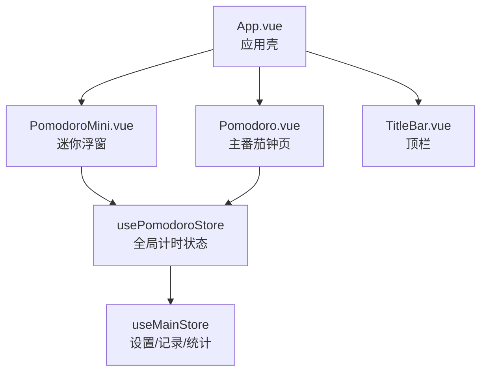
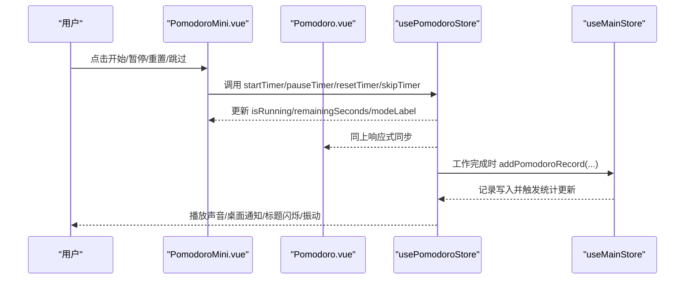
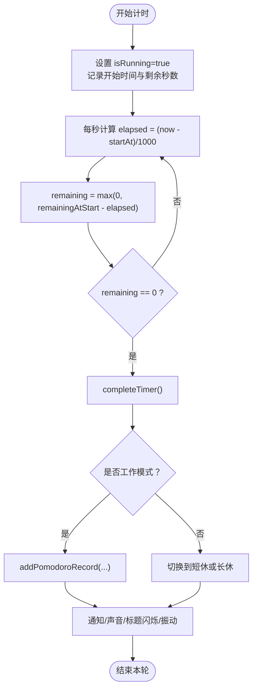
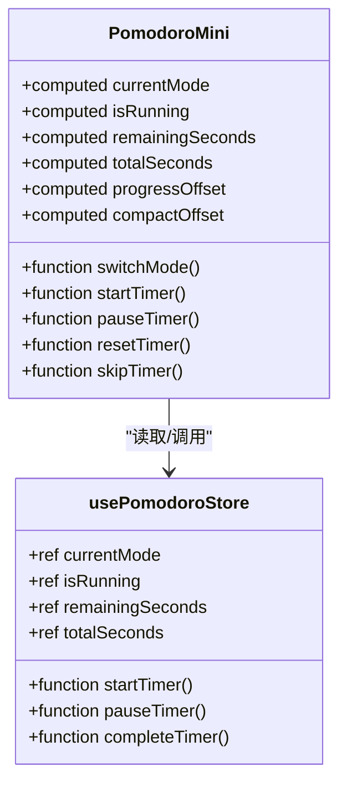
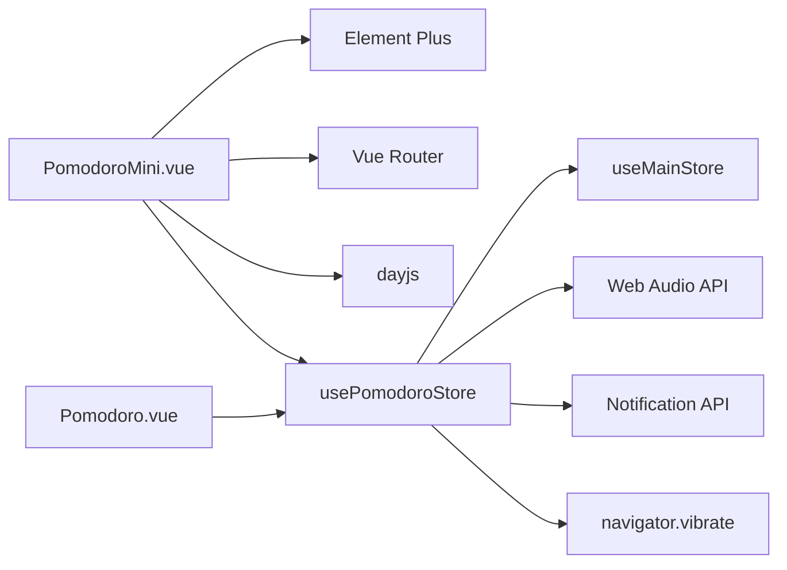

# PomodoroMini 番茄钟迷你组件

<cite>
**本文引用的文件**
- [PomodoroMini.vue](file://src/renderer/src/components/PomodoroMini.vue)
- [pomodoro.ts](file://src/renderer/src/stores/pomodoro.ts)
- [index.ts](file://src/renderer/src/stores/index.ts)
- [Pomodoro.vue](file://src/renderer/src/views/Pomodoro.vue)
- [TitleBar.vue](file://src/renderer/src/components/TitleBar.vue)
- [App.vue](file://src/renderer/src/App.vue)
</cite>

## 目录
1. [简介](#简介)
2. [项目结构](#项目结构)
3. [核心组件](#核心组件)
4. [架构总览](#架构总览)
5. [详细组件分析](#详细组件分析)
6. [依赖关系分析](#依赖关系分析)
7. [性能与体验优化](#性能与体验优化)
8. [故障排查指南](#故障排查指南)
9. [结论](#结论)
10. [附录：配置与主题定制](#附录配置与主题定制)

## 简介
PomodoroMini 是番茄钟的“迷你浮窗”组件，提供在任意页面可见、可拖拽、可展开/收起的紧凑计时器。它复用全局状态（Pinia store），与主番茄钟页面共享数据与逻辑，确保跨页面不中断、不丢失进度；同时提供环形进度可视化、倒计时闪烁、通知提醒、声音提示等能力，并在非番茄钟页面自动显示，帮助用户随时掌控学习节奏。

## 项目结构
- 组件层
  - 迷你浮窗：src/renderer/src/components/PomodoroMini.vue
  - 主番茄钟页面：src/renderer/src/views/Pomodoro.vue
  - 应用壳与浮窗显隐控制：src/renderer/src/App.vue
  - 标题栏（顶栏）：src/renderer/src/components/TitleBar.vue
- 状态层
  - 全局番茄钟状态：src/renderer/src/stores/pomodoro.ts
  - 主应用状态与设置：src/renderer/src/stores/index.ts

图表来源
- [App.vue:23-24](file://src/renderer/src/App.vue#L23-L24)
- [PomodoroMini.vue:132-188](file://src/renderer/src/components/PomodoroMini.vue#L132-L188)
- [Pomodoro.vue:169-199](file://src/renderer/src/views/Pomodoro.vue#L169-L199)
- [pomodoro.ts:12-40](file://src/renderer/src/stores/pomodoro.ts#L12-L40)
- [index.ts:283-294](file://src/renderer/src/stores/index.ts#L283-L294)

章节来源
- [App.vue:23-24](file://src/renderer/src/App.vue#L23-L24)
- [PomodoroMini.vue:132-188](file://src/renderer/src/components/PomodoroMini.vue#L132-L188)
- [Pomodoro.vue:169-199](file://src/renderer/src/views/Pomodoro.vue#L169-L199)
- [pomodoro.ts:12-40](file://src/renderer/src/stores/pomodoro.ts#L12-L40)
- [index.ts:283-294](file://src/renderer/src/stores/index.ts#L283-L294)

## 核心组件
- PomodoroMini 迷你浮窗
  - 功能：紧凑/展开双模式、拖拽定位、模式切换、开始/暂停/重置/跳过、科目选择、今日统计、环形进度、倒计时闪烁、跳转主页面。
  - 布局：固定定位浮动卡片，头部为拖拽条，主体分紧凑小球与展开卡片两种形态。
  - 持久化：位置与紧凑态通过 localStorage 保存，窗口尺寸变化时自动约束到可视区域。
- 全局计时 Store（usePomodoroStore）
  - 职责：维护当前模式、运行状态、剩余时间、完成计数、提醒弹窗、脉冲动画、声音/通知/标题闪烁、振动反馈等。
  - 计时实现：使用 setInterval + 绝对时间差计算，保证精度与性能。
- 主番茄钟页面（Pomodoro.vue）
  - 职责：与大尺寸环形进度、完整控制按钮、记录列表等展示配合，复用同一 store 状态。
- 应用壳（App.vue）
  - 职责：在非登录且非番茄钟页面显示迷你浮窗；渲染全局提醒遮罩；监听全屏设置。
- 标题栏（TitleBar.vue）
  - 职责：提供天气、倒计时、日期、时间、音乐控件等；与迷你浮窗无直接耦合，但共同构成应用顶部信息区。

章节来源
- [PomodoroMini.vue:1-129](file://src/renderer/src/components/PomodoroMini.vue#L1-L129)
- [pomodoro.ts:68-162](file://src/renderer/src/stores/pomodoro.ts#L68-L162)
- [Pomodoro.vue:1-167](file://src/renderer/src/views/Pomodoro.vue#L1-L167)
- [App.vue:23-39](file://src/renderer/src/App.vue#L23-L39)
- [TitleBar.vue:1-332](file://src/renderer/src/components/TitleBar.vue#L1-L332)

## 架构总览
迷你浮窗与主番茄钟页面通过 Pinia store 共享同一份计时状态，形成“单源事实”的数据流：用户在任何界面操作，都会更新 store，所有订阅者（浮窗、主页面、统计面板）同步响应。

图表来源
- [PomodoroMini.vue:231-236](file://src/renderer/src/components/PomodoroMini.vue#L231-L236)
- [pomodoro.ts:68-162](file://src/renderer/src/stores/pomodoro.ts#L68-L162)
- [index.ts:526-537](file://src/renderer/src/stores/index.ts#L526-L537)

## 详细组件分析

### 设计理念与紧凑布局
- 设计目标
  - 最小占用空间：紧凑模式下仅显示一个带进度的圆形小球和剩余时间，点击即可展开。
  - 随时可用：非番茄钟页面自动显示，支持拖拽定位，避免遮挡关键内容。
  - 视觉聚焦：环形进度与倒计时数字为核心信息，颜色随模式变化（专注/短休/长休）。
- 紧凑模式实现要点
  - 使用 SVG 圆环 + stroke-dashoffset 表示进度，半径较小以适配紧凑布局。
  - 时间格式化在紧凑模式下优先显示分钟，超长时长采用“小时”简写，限制字符宽度。
  - 头部保留拖拽条与展开/收起、跳转按钮，便于快速切换。

章节来源
- [PomodoroMini.vue:31-46](file://src/renderer/src/components/PomodoroMini.vue#L31-L46)
- [PomodoroMini.vue:217-229](file://src/renderer/src/components/PomodoroMini.vue#L217-L229)
- [PomodoroMini.vue:362-473](file://src/renderer/src/components/PomodoroMini.vue#L362-L473)

### 计时控制与响应式处理
- 开始/暂停/重置/跳过
  - 通过调用 store 方法统一控制，避免组件内重复计时逻辑。
  - 开始计时使用绝对时间差计算，减少漂移；最后5秒触发预警提示音与振动。
- 模式切换
  - 切换模式会停止当前计时并重置剩余时间与总时长，保持状态一致性。
- 响应式联动
  - 组件通过 computed 映射 store 状态，任何一处变更都会实时反映到 UI。

图表来源
- [pomodoro.ts:68-162](file://src/renderer/src/stores/pomodoro.ts#L68-L162)
- [index.ts:526-537](file://src/renderer/src/stores/index.ts#L526-L537)

章节来源
- [pomodoro.ts:58-110](file://src/renderer/src/stores/pomodoro.ts#L58-L110)
- [PomodoroMini.vue:231-236](file://src/renderer/src/components/PomodoroMini.vue#L231-L236)

### 进度指示器与动画效果
- 环形进度
  - 展开模式：大圆环（r=60），紧凑模式：小圆环（r=24），均通过 stroke-dasharray/dashoffset 驱动。
  - 颜色随模式变化：专注蓝色、短休绿色、长休黄色。
- 倒计时闪烁
  - 最后5秒数字颜色交替闪烁，增强紧迫感。
- 脉冲与缩放
  - 完成提醒时整体容器轻微脉冲；进入/退出浮窗有缩放过渡。

图表来源
- [PomodoroMini.vue:176-205](file://src/renderer/src/components/PomodoroMini.vue#L176-L205)
- [pomodoro.ts:12-40](file://src/renderer/src/stores/pomodoro.ts#L12-L40)

章节来源
- [PomodoroMini.vue:57-74](file://src/renderer/src/components/PomodoroMini.vue#L57-L74)
- [PomodoroMini.vue:509-566](file://src/renderer/src/components/PomodoroMini.vue#L509-L566)
- [pomodoro.ts:81-90](file://src/renderer/src/stores/pomodoro.ts#L81-L90)

### 与主应用的同步机制与数据共享
- 状态共享
  - 迷你浮窗与主番茄钟页面均通过 usePomodoroStore 获取状态，确保一致性与实时性。
- 数据记录
  - 工作模式完成时，store 调用 main store 的记录方法写入当日番茄记录，并刷新统计。
- 提醒与通知
  - 完成时根据设置触发声音、桌面通知、标题闪烁与振动；提醒遮罩由 App.vue 全局渲染，不受页面切换影响。

章节来源
- [PomodoroMini.vue:176-188](file://src/renderer/src/components/PomodoroMini.vue#L176-L188)
- [pomodoro.ts:112-162](file://src/renderer/src/stores/pomodoro.ts#L112-L162)
- [index.ts:526-537](file://src/renderer/src/stores/index.ts#L526-L537)
- [App.vue:27-38](file://src/renderer/src/App.vue#L27-L38)

### 自定义计时时长与快捷操作
- 自定义时长
  - 工作/短休/长休时长来自主 store 的设置项，修改后自动生效于迷你浮窗与主页面。
- 快捷操作
  - 紧凑模式点击小球展开；头部按钮支持展开/收起与跳转到主番茄钟页面。
  - 支持跳过当前阶段，直接进入下一阶段。

章节来源
- [index.ts:283-294](file://src/renderer/src/stores/index.ts#L283-L294)
- [PomodoroMini.vue:21-28](file://src/renderer/src/components/PomodoroMini.vue#L21-L28)
- [PomodoroMini.vue:238-249](file://src/renderer/src/components/PomodoroMini.vue#L238-L249)

### 通知提醒与声音提示
- 声音提示
  - 使用 Web Audio API 合成铃音，区分工作完成（上行琶音）与休息结束（下行旋律）。
  - 最后5秒有短促滴答声，辅助倒计时感知。
- 桌面通知
  - 根据权限请求并发送系统通知，图标使用站点 favicon。
- 标题闪烁
  - 定时切换 document.title，10秒后自动恢复，获得焦点时立即停止。
- 振动反馈
  - 在支持的设备上触发不同模式的振动序列。

章节来源
- [pomodoro.ts:170-323](file://src/renderer/src/stores/pomodoro.ts#L170-L323)

### 在标题栏中的嵌入方式与交互限制
- 嵌入方式
  - 迷你浮窗并非嵌入标题栏内部，而是作为独立浮动层覆盖在主内容之上，默认在非番茄钟页面显示。
- 交互限制
  - 头部禁用右键菜单，防止误触；拖拽使用 Pointer Events 并设置阈值，避免与滚动冲突。
  - 浮窗层级低于全局提醒遮罩，确保提醒始终置顶。

章节来源
- [PomodoroMini.vue:10-28](file://src/renderer/src/components/PomodoroMini.vue#L10-L28)
- [PomodoroMini.vue:251-316](file://src/renderer/src/components/PomodoroMini.vue#L251-L316)
- [App.vue:168-180](file://src/renderer/src/App.vue#L168-L180)

### 样式定制与主题适配
- 主题变量
  - 使用 CSS 变量定义背景、边框、文字色、玻璃拟态滤镜等，适配深色/浅色主题。
- 模式配色
  - 专注/短休/长休分别对应蓝/绿/黄，通过类名动态切换。
- 玻璃拟态
  - 背景半透明 + backdrop-filter 模糊，提升层次感且不干扰底层内容。
- 动画与过渡
  - 进入/退出缩放、倒计时闪烁、脉冲等动画增强反馈。

章节来源
- [PomodoroMini.vue:362-641](file://src/renderer/src/components/PomodoroMini.vue#L362-L641)

## 依赖关系分析
- 组件依赖
  - PomodoroMini 依赖 Element Plus 图标与按钮、Vue Router、dayjs。
  - 主页面同样依赖这些库，保证交互一致性。
- 状态依赖
  - 两个组件都依赖 usePomodoroStore；store 依赖 useMainStore 获取设置与记录。
- 外部集成
  - 声音：Web Audio API
  - 通知：浏览器 Notification API
  - 振动：navigator.vibrate
  - 存储：localStorage（浮窗位置/紧凑态）、IndexedDB/Storage（主 store 数据）

图表来源
- [PomodoroMini.vue:132-141](file://src/renderer/src/components/PomodoroMini.vue#L132-L141)
- [pomodoro.ts:183-323](file://src/renderer/src/stores/pomodoro.ts#L183-L323)
- [index.ts:283-294](file://src/renderer/src/stores/index.ts#L283-L294)

章节来源
- [PomodoroMini.vue:132-141](file://src/renderer/src/components/PomodoroMini.vue#L132-L141)
- [pomodoro.ts:183-323](file://src/renderer/src/stores/pomodoro.ts#L183-L323)
- [index.ts:283-294](file://src/renderer/src/stores/index.ts#L283-L294)

## 性能与体验优化
- 计时精度与性能
  - 使用绝对时间差计算剩余秒数，避免累积误差；1秒间隔足够精确且节省 CPU。
- 渲染优化
  - 紧凑模式使用更小圆环与简化文本，降低重绘开销；CSS transition 用于进度环平滑更新。
- 交互优化
  - 拖拽阈值避免误触发；窗口尺寸变化时自动约束位置，防止越界。
- 资源管理
  - 音频上下文复用单一实例；定时器在组件卸载时清理，避免内存泄漏。

章节来源
- [pomodoro.ts:68-90](file://src/renderer/src/stores/pomodoro.ts#L68-L90)
- [PomodoroMini.vue:251-316](file://src/renderer/src/components/PomodoroMini.vue#L251-L316)
- [PomodoroMini.vue:350-359](file://src/renderer/src/components/PomodoroMini.vue#L350-L359)

## 故障排查指南
- 计时不准确
  - 检查是否频繁切换标签页导致后台节流；当前实现基于绝对时间差，通常不受影响。
- 声音未播放
  - 确认已启用声音设置；首次交互需用户授权音频上下文；检查浏览器静音策略。
- 通知未出现
  - 检查浏览器通知权限；若被拒绝，需在设置中允许。
- 浮窗位置异常
  - 窗口尺寸变化后会自动校正；如仍越界，尝试重新拖拽或刷新页面。
- 提醒遮罩无法关闭
  - 点击遮罩或“好的”按钮；若无效，检查控制台错误与 store 状态。

章节来源
- [pomodoro.ts:170-323](file://src/renderer/src/stores/pomodoro.ts#L170-L323)
- [PomodoroMini.vue:304-316](file://src/renderer/src/components/PomodoroMini.vue#L304-L316)
- [App.vue:27-38](file://src/renderer/src/App.vue#L27-L38)

## 结论
PomodoroMini 通过紧凑布局与全局状态共享，实现了跨页面可用的轻量级番茄钟。其环形进度、倒计时闪烁、通知与声音提示等功能提升了专注体验；拖拽定位与持久化增强了可用性。与主番茄钟页面共用 store 的设计保证了数据一致性与扩展性，便于后续功能迭代。

## 附录：配置与主题定制
- 计时时长配置
  - 工作时长、短休时长、长休时长、长休间隔、声音开关、通知开关、标题闪烁开关、音量等均在主 store 的设置项中管理，修改后即时生效。
- 主题与样式
  - 通过 CSS 变量与类名切换模式配色；玻璃拟态与动画可通过调整变量与关键帧进行定制。
- 快捷键与扩展
  - 当前未内置全局快捷键；可在未来扩展键盘快捷键（如空格开始/暂停）以提升效率。

章节来源
- [index.ts:283-294](file://src/renderer/src/stores/index.ts#L283-L294)
- [PomodoroMini.vue:362-641](file://src/renderer/src/components/PomodoroMini.vue#L362-L641)