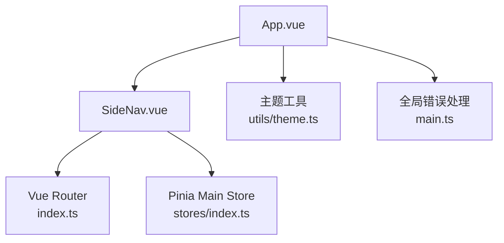
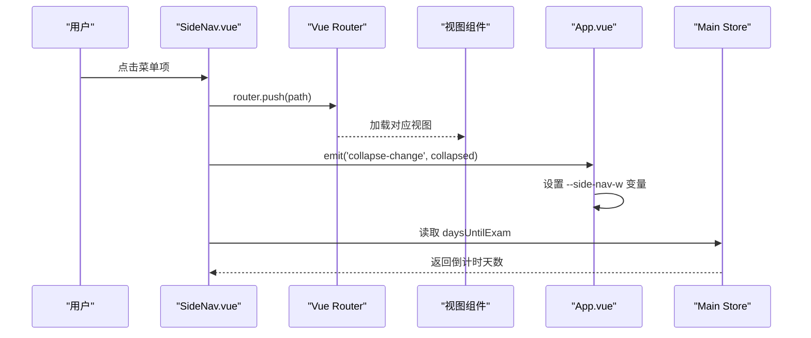
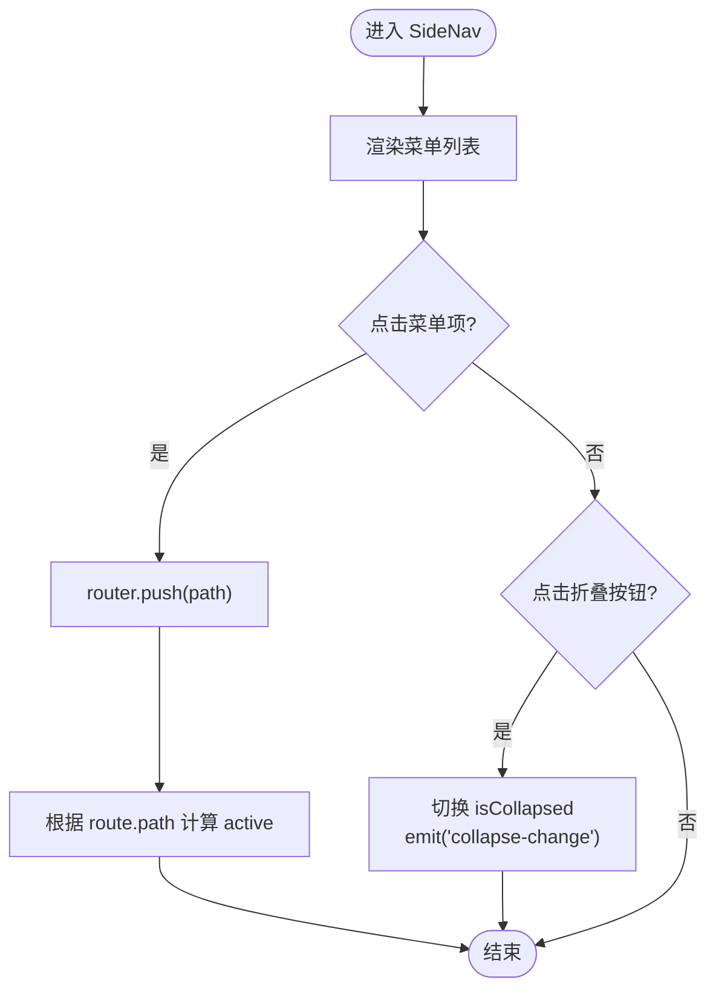
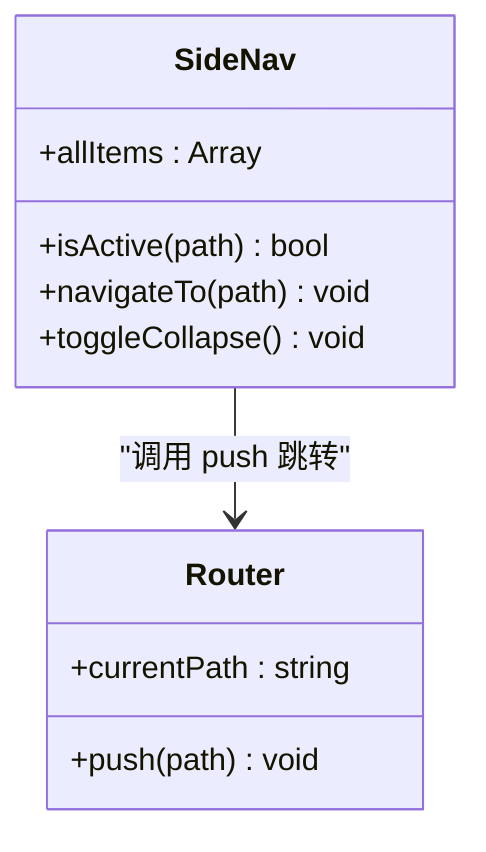
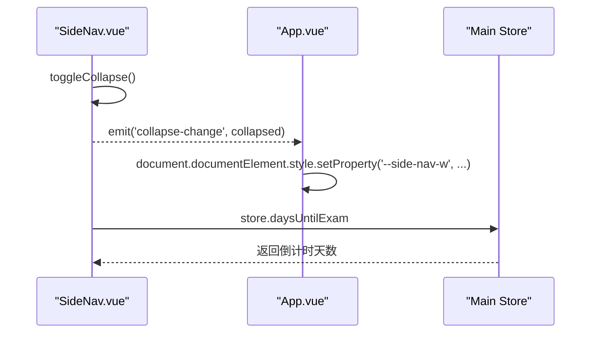
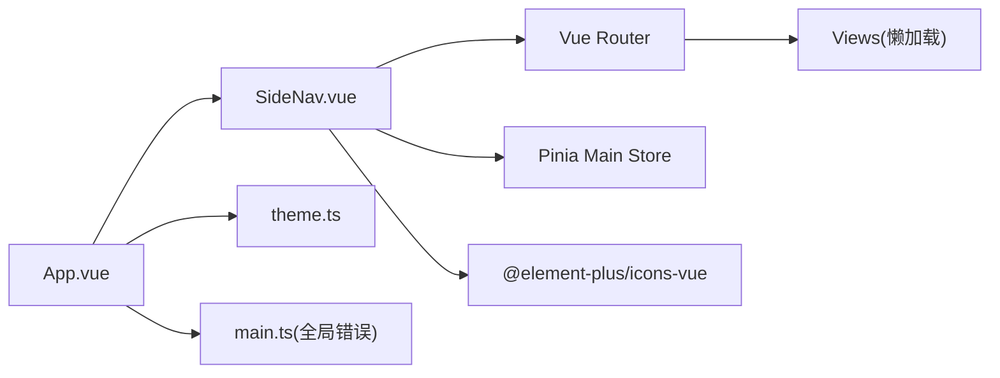

# SideNav 侧边导航组件

<cite>
**本文引用的文件**
- [SideNav.vue](file://src/renderer/src/components/SideNav.vue)
- [App.vue](file://src/renderer/src/App.vue)
- [index.ts（路由）](file://src/renderer/src/router/index.ts)
- [main.ts（渲染进程入口）](file://src/renderer/src/main.ts)
- [index.ts（主 Store）](file://src/renderer/src/stores/index.ts)
- [theme.ts（主题工具）](file://src/renderer/src/utils/theme.ts)
</cite>

## 目录
1. [简介](#简介)
2. [项目结构](#项目结构)
3. [核心组件与职责](#核心组件与职责)
4. [架构总览](#架构总览)
5. [详细组件分析](#详细组件分析)
6. [依赖关系分析](#依赖关系分析)
7. [性能与可访问性](#性能与可访问性)
8. [故障排查指南](#故障排查指南)
9. [结论](#结论)
10. [附录：配置与扩展](#附录：配置与扩展)

## 简介
本文件面向 SideNav 侧边导航组件，系统性说明其布局设计、交互逻辑、菜单动态生成、路由集成、状态管理、选中高亮、响应式适配、移动端策略、自定义样式与主题集成方法。文档同时给出与 Vue Router 的集成方式、路由守卫现状以及可扩展的菜单配置格式与操作指南。

## 项目结构
SideNav 位于渲染进程的组件目录中，作为应用左侧导航面板，由 App.vue 引入并参与整体布局；菜单项通过组件内数组定义，点击后通过 Vue Router 进行页面跳转；折叠状态通过事件向父组件传递，由父组件更新 CSS 变量以控制主内容区宽度。

图表来源
- [App.vue:1-234](file://src/renderer/src/App.vue#L1-L234)
- [SideNav.vue:1-377](file://src/renderer/src/components/SideNav.vue#L1-L377)
- [index.ts（路由）:1-144](file://src/renderer/src/router/index.ts#L1-L144)
- [index.ts（主 Store）:1-699](file://src/renderer/src/stores/index.ts#L1-L699)
- [theme.ts:1-144](file://src/renderer/src/utils/theme.ts#L1-L144)
- [main.ts:1-63](file://src/renderer/src/main.ts#L1-L63)

章节来源
- [App.vue:1-234](file://src/renderer/src/App.vue#L1-L234)
- [SideNav.vue:1-377](file://src/renderer/src/components/SideNav.vue#L1-L377)
- [index.ts（路由）:1-144](file://src/renderer/src/router/index.ts#L1-L144)

## 核心组件与职责
- SideNav.vue：负责侧边栏 UI、菜单渲染、选中态判断、折叠展开、与路由交互、向父组件广播折叠变化。
- App.vue：承载 SideNav，监听折叠事件并设置根元素 CSS 变量以调整主内容区宽度；同时初始化主题与数据同步。
- 路由 index.ts：声明所有页面路由及元信息，提供路由跳转能力；当前无强制认证守卫。
- 主 Store：提供考试倒计时等共享数据，供 SideNav 展示。
- 主题工具：提供深色/浅色/跟随系统主题切换，影响全局 CSS 变量与类名。

章节来源
- [SideNav.vue:55-119](file://src/renderer/src/components/SideNav.vue#L55-L119)
- [App.vue:42-81](file://src/renderer/src/App.vue#L42-L81)
- [index.ts（路由）:1-144](file://src/renderer/src/router/index.ts#L1-L144)
- [index.ts（主 Store）:219-310](file://src/renderer/src/stores/index.ts#L219-L310)
- [theme.ts:25-58](file://src/renderer/src/utils/theme.ts#L25-L58)

## 架构总览
SideNav 通过 Vue Router 完成页面导航，使用 Pinia 获取考试倒计时等数据，配合 App.vue 实现折叠状态与布局联动。主题系统通过全局 CSS 变量与类名驱动视觉风格。

图表来源
- [SideNav.vue:107-118](file://src/renderer/src/components/SideNav.vue#L107-L118)
- [App.vue:75-81](file://src/renderer/src/App.vue#L75-L81)
- [index.ts（路由）:112-115](file://src/renderer/src/router/index.ts#L112-L115)
- [index.ts（主 Store）:304-310](file://src/renderer/src/stores/index.ts#L304-L310)

## 详细组件分析

### 布局设计与交互
- 布局结构：外层包裹容器用于定位折叠按钮，内部为悬浮卡片式面板，包含头部（Logo、倒计时）、菜单区、底部提示区。
- 折叠交互：点击右侧圆形按钮切换 isCollapsed，并向父组件发射 collapse-change 事件；父组件根据该事件设置 CSS 变量控制主内容区宽度。
- 选中高亮：基于当前 route.path 与菜单项 path 比较，匹配时添加 active 样式。
- 标题与图标：折叠状态下隐藏文本，仅显示图标；非折叠时显示图标与文字。

图表来源
- [SideNav.vue:17-29](file://src/renderer/src/components/SideNav.vue#L17-L29)
- [SideNav.vue:107-118](file://src/renderer/src/components/SideNav.vue#L107-L118)
- [App.vue:75-81](file://src/renderer/src/App.vue#L75-L81)

章节来源
- [SideNav.vue:1-53](file://src/renderer/src/components/SideNav.vue#L1-L53)
- [SideNav.vue:121-377](file://src/renderer/src/components/SideNav.vue#L121-L377)
- [App.vue:75-81](file://src/renderer/src/App.vue#L75-L81)

### 菜单项的动态生成与路由集成
- 菜单数据：allItems 为扁平数组，每项包含 path、title、icon。
- 路由集成：点击调用 router.push(path)，路由表在 index.ts 中声明，支持懒加载与 meta 元信息。
- 选中态：isActive 直接比较 route.path 与 item.path。

图表来源
- [SideNav.vue:89-113](file://src/renderer/src/components/SideNav.vue#L89-L113)
- [index.ts（路由）:5-110](file://src/renderer/src/router/index.ts#L5-L110)

章节来源
- [SideNav.vue:89-113](file://src/renderer/src/components/SideNav.vue#L89-L113)
- [index.ts（路由）:5-110](file://src/renderer/src/router/index.ts#L5-L110)

### 导航状态管理与选中高亮
- 状态来源：isCollapsed 为本地 ref；active 由 route.path 决定。
- 父级联动：SideNav 通过事件将折叠状态传递给 App.vue，App.vue 设置 CSS 变量 --side-nav-w，从而改变主内容区宽度。
- 数据联动：SideNav 从 Main Store 读取 daysUntilExam，用于头部倒计时展示。

图表来源
- [SideNav.vue:115-118](file://src/renderer/src/components/SideNav.vue#L115-L118)
- [App.vue:75-81](file://src/renderer/src/App.vue#L75-L81)
- [index.ts（主 Store）:304-310](file://src/renderer/src/stores/index.ts#L304-L310)

章节来源
- [SideNav.vue:115-118](file://src/renderer/src/components/SideNav.vue#L115-L118)
- [App.vue:75-81](file://src/renderer/src/App.vue#L75-L81)
- [index.ts（主 Store）:304-310](file://src/renderer/src/stores/index.ts#L304-L310)

### 响应式适配机制与移动端策略
- 桌面端：固定宽度 224px，折叠后 68px；通过 CSS 过渡动画平滑切换。
- 移动端适配：当前未内置媒体查询或手势支持；建议在 App.vue 或 SideNav.vue 中增加响应式逻辑（如小屏自动折叠、触摸滑动收起/展开）。
- 建议方案：
  - 使用 window.matchMedia 监听屏幕宽度，在小尺寸下默认折叠。
  - 添加触摸事件监听，实现滑动手势控制折叠。
  - 在折叠状态下优化触控区域大小与间距。

[本节为通用指导，不直接分析具体代码文件]

### 自定义样式与主题集成
- 主题系统：通过 theme.ts 在全局根节点切换 .dark 与 data-theme，Element Plus 深色模式生效；SideNav 使用 CSS 变量（如 --mo-primary、--glass-border）实现玻璃质感与主题色。
- 自定义背景：theme.ts 提供 applyCustomBg 注入 --mo-bg-custom 变量，可在主题层叠加自定义背景图。
- 侧边栏样式：SideNav.vue 使用 scoped 样式，可通过覆盖 CSS 变量或类名进行主题定制。

章节来源
- [theme.ts:25-58](file://src/renderer/src/utils/theme.ts#L25-L58)
- [theme.ts:111-140](file://src/renderer/src/utils/theme.ts#L111-L140)
- [SideNav.vue:131-149](file://src/renderer/src/components/SideNav.vue#L131-L149)

## 依赖关系分析
- SideNav.vue 依赖：
  - Vue Router：useRoute/useRouter 实现导航与选中态。
  - Element Plus Icons：菜单图标。
  - Pinia Main Store：获取考试倒计时等数据。
- App.vue 依赖：
  - SideNav.vue：布局与交互。
  - TitleBar.vue、PomodoroMini.vue：其他 UI 组件。
  - 主题工具：initTheme/initCustomBg。
- 路由 index.ts：
  - 声明路由表、懒加载组件、错误捕获与日志记录。
- 主 Store：
  - 提供考试日期、倒计时、学习统计等数据与方法。

图表来源
- [SideNav.vue:55-81](file://src/renderer/src/components/SideNav.vue#L55-L81)
- [App.vue:42-57](file://src/renderer/src/App.vue#L42-L57)
- [index.ts（路由）:1-144](file://src/renderer/src/router/index.ts#L1-L144)
- [main.ts:25-43](file://src/renderer/src/main.ts#L25-L43)

章节来源
- [SideNav.vue:55-81](file://src/renderer/src/components/SideNav.vue#L55-L81)
- [App.vue:42-57](file://src/renderer/src/App.vue#L42-L57)
- [index.ts（路由）:1-144](file://src/renderer/src/router/index.ts#L1-L144)
- [main.ts:25-43](file://src/renderer/src/main.ts#L25-L43)

## 性能与可访问性
- 性能：
  - 菜单项数量较少，v-for 渲染开销低。
  - 路由采用懒加载，减少首屏体积。
  - 使用 CSS 变量与 transition 提升交互流畅度。
- 可访问性：
  - 折叠状态下为菜单项提供 title 属性，便于 Tooltip 提示。
  - 建议补充键盘导航（Tab 聚焦、Enter 激活）与 aria-* 属性以提升无障碍体验。

[本节为通用指导，不直接分析具体代码文件]

## 故障排查指南
- 路由加载失败：
  - 现象：点击菜单无响应或页面空白。
  - 处理：路由 onError 会记录错误日志并通过 ElMessage 提示；查看“设置 → 报错日志”获取详情。
- 全局异常：
  - 现象：组件崩溃或 Promise 未捕获。
  - 处理：main.ts 的全局 errorHandler 与 unhandledrejection 会将异常写入日志并提示。
- 主题与背景：
  - 现象：主题切换无效或背景图不显示。
  - 处理：检查 theme.ts 的 applyTheme/applyCustomBg 是否被正确调用；确认 CSS 变量是否存在。

章节来源
- [index.ts（路由）:123-141](file://src/renderer/src/router/index.ts#L123-L141)
- [main.ts:25-56](file://src/renderer/src/main.ts#L25-L56)
- [theme.ts:25-58](file://src/renderer/src/utils/theme.ts#L25-L58)
- [theme.ts:111-140](file://src/renderer/src/utils/theme.ts#L111-L140)

## 结论
SideNav 组件以简洁的扁平菜单、清晰的选中高亮和灵活的折叠交互为核心，结合 Vue Router 与 Pinia 实现了稳定的导航与数据展示。通过主题系统与 CSS 变量，组件具备良好的可定制性与一致性。未来可在响应式与移动端手势方面进一步增强，以提升多设备体验。

[本节为总结，不直接分析具体代码文件]

## 附录：配置与扩展

### 菜单配置格式
- 字段要求：
  - path：字符串，必须与路由表中的 path 一致。
  - title：字符串，菜单显示名称。
  - icon：Element Plus 图标组件引用。
- 示例位置：参见 SideNav.vue 中的 allItems 定义。

章节来源
- [SideNav.vue:89-105](file://src/renderer/src/components/SideNav.vue#L89-L105)

### 菜单项的添加、删除与排序
- 添加：在 allItems 数组末尾追加新对象，并确保路由表中存在对应路径。
- 删除：移除 allItems 中对应项，如需保留路由则不影响导航但不再显示。
- 排序：调整 allItems 数组顺序即可改变菜单显示顺序。

章节来源
- [SideNav.vue:89-105](file://src/renderer/src/components/SideNav.vue#L89-L105)
- [index.ts（路由）:5-110](file://src/renderer/src/router/index.ts#L5-L110)

### 与 Vue Router 的集成与路由守卫
- 集成方式：
  - 使用 useRoute/useRouter 获取当前路由与导航能力。
  - 点击菜单调用 router.push(path) 进行跳转。
- 路由守卫：
  - 当前 beforeEach 为空，无需登录鉴权；若需权限控制，可在 beforeEach 中添加校验逻辑。
  - 错误处理：onError 已实现，统一记录并提示。

章节来源
- [SideNav.vue:79-113](file://src/renderer/src/components/SideNav.vue#L79-L113)
- [index.ts（路由）:112-141](file://src/renderer/src/router/index.ts#L112-L141)

### 移动端适配策略与手势支持
- 建议实现：
  - 媒体查询：在小于特定宽度时默认折叠侧边栏。
  - 手势：监听 touchstart/touchmove/touchend，实现滑动收起/展开。
  - 触控优化：增大点击区域，避免误触。
- 注意：当前代码未内置上述逻辑，需在 SideNav.vue 或 App.vue 中扩展。

[本节为通用指导，不直接分析具体代码文件]

### 自定义样式与主题集成方法
- 主题切换：通过 theme.ts 的 setThemeMode/toggleTheme 切换深色/浅色/跟随系统。
- 自定义背景：通过 applyCustomBg 注入背景图 URL，并在 CSS 中使用 --mo-bg-custom。
- 侧边栏样式：通过覆盖 CSS 变量（如 --mo-primary、--glass-border）或修改 SideNav.vue 的 scoped 样式进行定制。

章节来源
- [theme.ts:32-58](file://src/renderer/src/utils/theme.ts#L32-L58)
- [theme.ts:111-140](file://src/renderer/src/utils/theme.ts#L111-L140)
- [SideNav.vue:131-149](file://src/renderer/src/components/SideNav.vue#L131-L149)