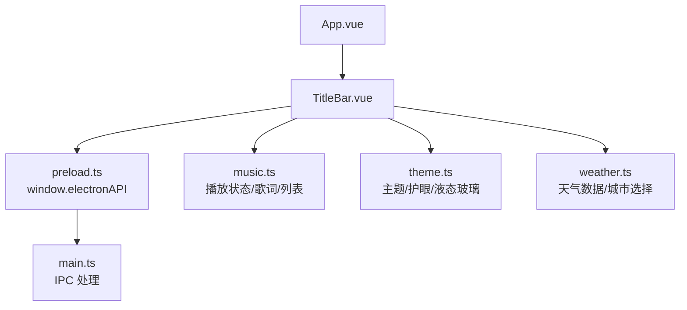
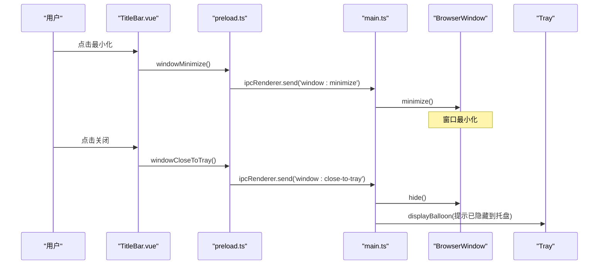
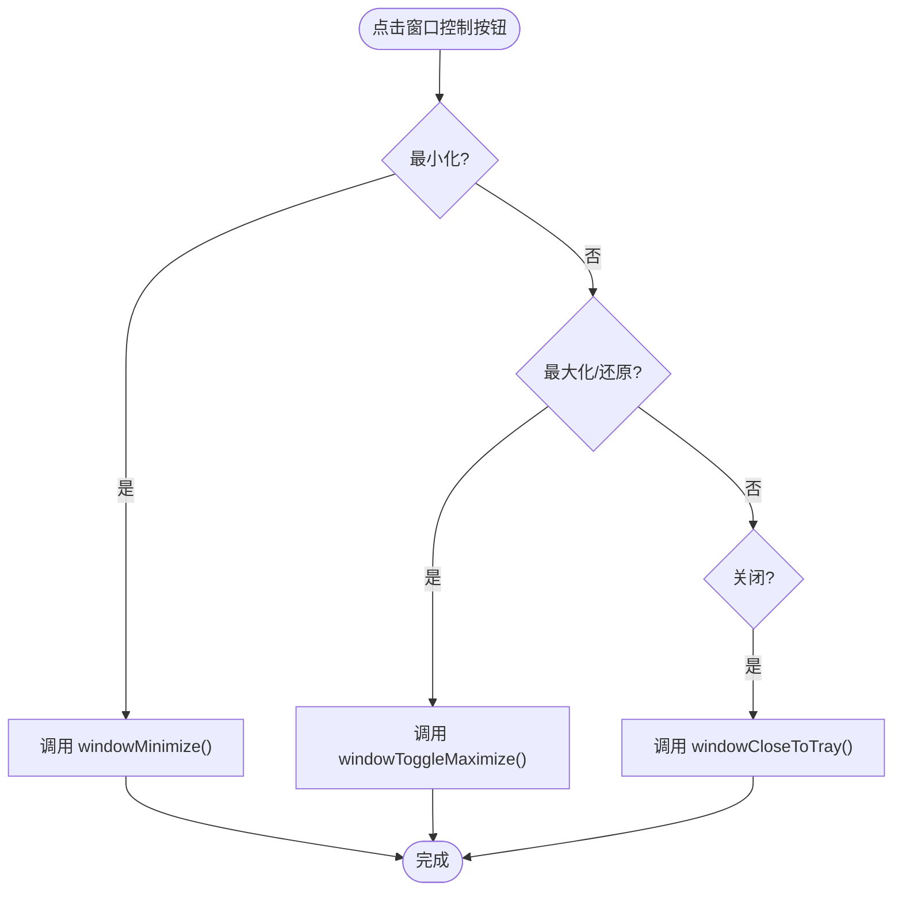
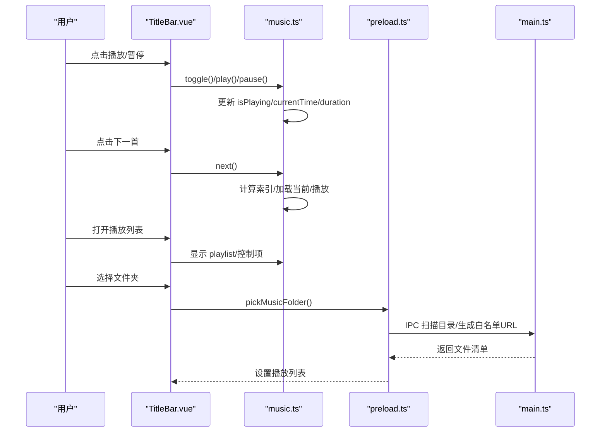
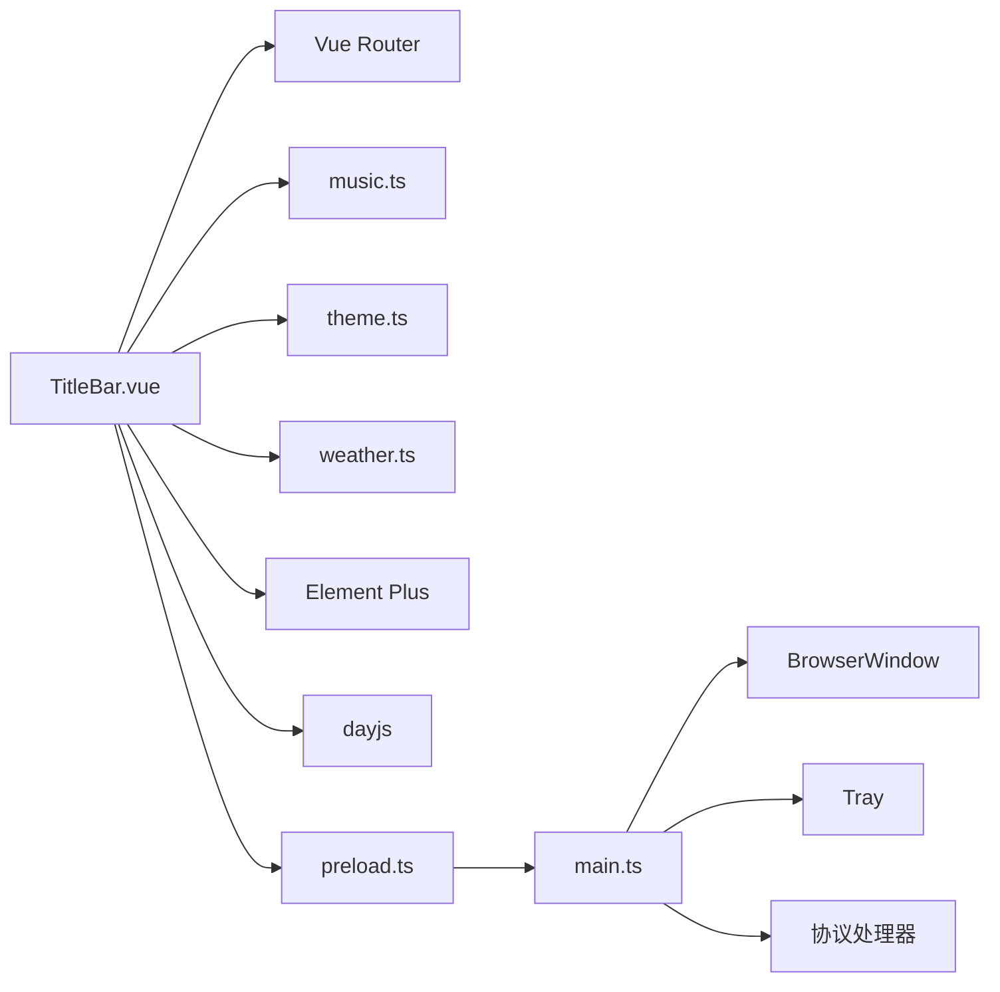

# TitleBar 标题栏组件

<cite>
**本文引用的文件**
- [TitleBar.vue](file://src/renderer/src/components/TitleBar.vue)
- [App.vue](file://src/renderer/src/App.vue)
- [preload.ts](file://src/preload/preload.ts)
- [main.ts](file://src/main/main.ts)
- [music.ts](file://src/renderer/src/stores/music.ts)
- [theme.ts](file://src/renderer/src/utils/theme.ts)
- [weather.ts](file://src/renderer/src/utils/weather.ts)
</cite>

## 目录
1. [简介](#简介)
2. [项目结构](#项目结构)
3. [核心组件](#核心组件)
4. [架构总览](#架构总览)
5. [详细组件分析](#详细组件分析)
6. [依赖关系分析](#依赖关系分析)
7. [性能考量](#性能考量)
8. [故障排查指南](#故障排查指南)
9. [结论](#结论)
10. [附录](#附录)

## 简介
本组件文档聚焦于 Electron 应用的自定义标题栏（TitleBar）实现，覆盖以下目标：
- 窗口控制按钮（最小化、最大化、关闭）的样式定制与功能绑定
- 标题文本的动态更新机制与图标显示逻辑
- 系统托盘图标的集成与状态同步
- 音乐播放状态的实时显示与交互控制
- 全屏模式下的行为适配与快捷键支持
- 主题切换时的样式同步与动画效果
- 自定义标题内容与布局的方法

该组件通过无边框窗口 + 渲染层自建顶栏的方式，将原生窗口控制与丰富的业务信息（天气、倒计时、时间、音乐播放器、网易云用户信息等）整合到统一的顶部区域。

## 项目结构
TitleBar 位于渲染进程，作为应用根组件 App 的子组件被引入；窗口控制能力通过 preload 暴露给渲染进程，再由 IPC 调用主进程完成实际系统级操作。

图表来源
- [App.vue:1-24](file://src/renderer/src/App.vue#L1-L24)
- [TitleBar.vue:1-332](file://src/renderer/src/components/TitleBar.vue#L1-L332)
- [preload.ts:1-98](file://src/preload/preload.ts#L1-L98)
- [main.ts:290-327](file://src/main/main.ts#L290-L327)
- [music.ts:32-147](file://src/renderer/src/stores/music.ts#L32-L147)
- [theme.ts:25-58](file://src/renderer/src/utils/theme.ts#L25-L58)
- [weather.ts:98-164](file://src/renderer/src/utils/weather.ts#L98-L164)

章节来源
- [App.vue:1-24](file://src/renderer/src/App.vue#L1-L24)
- [TitleBar.vue:1-332](file://src/renderer/src/components/TitleBar.vue#L1-L332)

## 核心组件
- 三栏布局：左侧（Logo、标题、页面名、音乐控件）、中间（天气、倒计时、日期、当前时间）、右侧（资料入口、浏览器、护眼、液态玻璃、主题切换、网易云用户信息、窗口控制按钮）
- 透明模式：登录页等场景可传入 transparent 以隐藏边框和背景
- 动态标题：根据路由映射显示页面名称
- 实时时钟：每秒刷新当前时间与日期
- 天气面板：点击弹出详情，支持预设城市与搜索
- 音乐控件：播放/暂停、上一首/下一首、随机播放、进度条、歌词显示、播放列表、文件夹/文件选择、网易云心动模式、收藏歌曲、用户信息弹窗
- 窗口控制：最小化、最大化/还原、关闭（隐藏到托盘）
- 主题与外观：深色/浅色切换、护眼模式、液态玻璃效果、主题切换动画

章节来源
- [TitleBar.vue:1-659](file://src/renderer/src/components/TitleBar.vue#L1-L659)

## 架构总览
TitleBar 通过 Vue 响应式状态驱动 UI，结合 Pinia store（music.ts）管理播放状态，通过 window.electronAPI 与主进程通信，完成窗口控制、文件系统访问、协议资源读取、系统托盘交互等。

图表来源
- [TitleBar.vue:534-545](file://src/renderer/src/components/TitleBar.vue#L534-L545)
- [preload.ts:11-14](file://src/preload/preload.ts#L11-L14)
- [main.ts:674-693](file://src/main/main.ts#L674-L693)
- [main.ts:330-342](file://src/main/main.ts#L330-L342)

章节来源
- [preload.ts:1-98](file://src/preload/preload.ts#L1-L98)
- [main.ts:290-327](file://src/main/main.ts#L290-L327)
- [main.ts:674-693](file://src/main/main.ts#L674-L693)

## 详细组件分析

### 窗口控制按钮（最小化、最大化、关闭）
- 最小化：调用 window.electronAPI.windowMinimize()，主进程执行 BrowserWindow.minimize()
- 最大化/还原：调用 window.electronAPI.windowToggleMaximize()，主进程判断并切换 maximize/unmaximize，同时本地维护 isMaximized 状态用于图标切换
- 关闭：调用 window.electronAPI.windowCloseToTray()，主进程隐藏窗口并展示托盘气泡提示

图表来源
- [TitleBar.vue:534-545](file://src/renderer/src/components/TitleBar.vue#L534-L545)
- [preload.ts:11-14](file://src/preload/preload.ts#L11-L14)
- [main.ts:674-693](file://src/main/main.ts#L674-L693)

章节来源
- [TitleBar.vue:317-329](file://src/renderer/src/components/TitleBar.vue#L317-L329)
- [preload.ts:11-14](file://src/preload/preload.ts#L11-L14)
- [main.ts:674-693](file://src/main/main.ts#L674-L693)

### 标题文本动态更新与图标显示
- 标题文本：基于路由 path 映射为中文页面名，非透明模式下显示
- 图标：Logo 使用 Element Plus 图标组件；天气、资料、浏览器、护眼、液态玻璃、主题切换等按钮均使用内联 SVG 或图标组件
- 透明模式：当传入 transparent=true（如登录页），隐藏边框、背景与部分元素

章节来源
- [TitleBar.vue:3-7](file://src/renderer/src/components/TitleBar.vue#L3-L7)
- [TitleBar.vue:372-389](file://src/renderer/src/components/TitleBar.vue#L372-L389)
- [TitleBar.vue:661-684](file://src/renderer/src/components/TitleBar.vue#L661-L684)

### 系统托盘集成与状态同步
- 托盘创建：主进程在应用就绪时创建托盘，设置图标、工具提示与菜单（显示主窗口、退出应用）
- 双击托盘：恢复并聚焦主窗口
- 关闭行为：默认隐藏到托盘而非退出，首次隐藏时展示气泡提示
- 真正退出：通过托盘菜单“退出”触发 before-quit，释放资源并退出应用

章节来源
- [main.ts:278-342](file://src/main/main.ts#L278-L342)
- [main.ts:344-377](file://src/main/main.ts#L344-L377)
- [main.ts:660-670](file://src/main/main.ts#L660-L670)

### 音乐播放状态实时显示与交互控制
- 播放控制：播放/暂停、上一首/下一首、随机播放、进度条拖动、音量调节（由 store 管理）
- 歌词显示：支持本地 .lrc 与在线歌词解析，顶栏一行歌词显示，点击跳转至音乐页
- 播放列表：弹出面板显示曲目、删除、清空、选择文件夹/文件加载
- 网易云集成：心动模式、收藏歌曲、用户信息弹窗（等级、签名、账号信息、粉丝/关注/歌单/听歌数）
- 错误重试：在线歌曲 URL 过期自动刷新并重试播放

图表来源
- [TitleBar.vue:20-146](file://src/renderer/src/components/TitleBar.vue#L20-L146)
- [TitleBar.vue:513-532](file://src/renderer/src/components/TitleBar.vue#L513-L532)
- [music.ts:32-147](file://src/renderer/src/stores/music.ts#L32-L147)
- [music.ts:265-298](file://src/renderer/src/stores/music.ts#L265-L298)
- [preload.ts:23-28](file://src/preload/preload.ts#L23-L28)
- [main.ts:703-760](file://src/main/main.ts#L703-L760)

章节来源
- [TitleBar.vue:20-146](file://src/renderer/src/components/TitleBar.vue#L20-L146)
- [music.ts:32-147](file://src/renderer/src/stores/music.ts#L32-L147)
- [music.ts:265-298](file://src/renderer/src/stores/music.ts#L265-L298)
- [preload.ts:23-28](file://src/preload/preload.ts#L23-L28)
- [main.ts:703-760](file://src/main/main.ts#L703-L760)

### 全屏模式适配与快捷键支持
- 全屏开关：通过 window.electronAPI.setFullscreen(on) 通知主进程设置全屏
- 行为：开启即生效，与番茄钟运行状态解耦；关闭立即退出全屏
- 快捷键：组件未直接注册全局快捷键；全屏可通过设置页开关触发

章节来源
- [App.vue:69-73](file://src/renderer/src/App.vue#L69-L73)
- [preload.ts:20-21](file://src/preload/preload.ts#L20-L21)
- [main.ts:695-699](file://src/main/main.ts#L695-L699)

### 主题切换样式同步与动画效果
- 主题切换：调用 toggleTheme() 切换深色/浅色，并在根元素添加 theme-anim 类实现过渡动画
- 护眼模式：toggleEyeCare() 切换 .eyecare 类，降低蓝光
- 液态玻璃：toggleLiquidGlass() 切换 .liquid-glass 类，增强毛玻璃效果
- 初始化：应用启动时加载持久化主题、护眼、液态玻璃状态并应用

章节来源
- [TitleBar.vue:547-561](file://src/renderer/src/components/TitleBar.vue#L547-L561)
- [theme.ts:25-58](file://src/renderer/src/utils/theme.ts#L25-L58)
- [theme.ts:68-107](file://src/renderer/src/utils/theme.ts#L68-L107)

### 自定义标题内容与布局方法
- 三栏布局：titlebar-left、titlebar-center、titlebar-right，分别承载不同功能区
- 透明模式：通过 props.transparent 控制背景与边框透明度
- 扩展点：可在各栏中添加新按钮或组件，遵循现有 CSS 变量与间距规范
- 天气/时间/倒计时：中间区域提供实用信息，可按需调整显示顺序或内容

章节来源
- [TitleBar.vue:686-711](file://src/renderer/src/components/TitleBar.vue#L686-L711)
- [TitleBar.vue:149-235](file://src/renderer/src/components/TitleBar.vue#L149-L235)

## 依赖关系分析
- 渲染层依赖：
  - Vue Router：页面名映射与导航
  - Pinia（music.ts）：播放状态、歌词、网易云用户信息
  - Element Plus：图标与 Popover 组件
  - dayjs：时间格式化
  - theme.ts：主题/护眼/液态玻璃
  - weather.ts：天气数据与城市选择
- 预加载桥接：
  - window.electronAPI：封装 IPC 调用（窗口控制、文件系统、协议、网易云 API、天气、B站等）
- 主进程能力：
  - BrowserWindow：窗口生命周期、全屏、背景色
  - Tray：托盘图标、菜单、气泡提示
  - 协议处理：kaoyan-music、kaoyan-material、kaoyan-assets、kaoyan-bg、kaoyan-data
  - 自动更新：electron-updater

图表来源
- [TitleBar.vue:334-355](file://src/renderer/src/components/TitleBar.vue#L334-L355)
- [preload.ts:1-98](file://src/preload/preload.ts#L1-L98)
- [main.ts:183-197](file://src/main/main.ts#L183-L197)

章节来源
- [TitleBar.vue:334-355](file://src/renderer/src/components/TitleBar.vue#L334-L355)
- [preload.ts:1-98](file://src/preload/preload.ts#L1-L98)
- [main.ts:183-197](file://src/main/main.ts#L183-L197)

## 性能考量
- 音乐流式播放：主进程对 kaoyan-music 协议使用 ReadableStream 与 Range 请求，避免大文件内存占用
- 资源协议优化：kaoyan-assets 回环 HTTP 服务确保 pdf.js 走 fetch 分支，提升稳定性
- 定时器管理：时钟每秒刷新，卸载时清理避免内存泄漏
- 缓存策略：天气数据本地缓存 30 分钟，减少网络请求
- 主题切换动画：通过 CSS 过渡与 GPU 加速类名切换，减少重排

章节来源
- [main.ts:407-477](file://src/main/main.ts#L407-L477)
- [main.ts:504-535](file://src/main/main.ts#L504-L535)
- [TitleBar.vue:391-395](file://src/renderer/src/components/TitleBar.vue#L391-L395)
- [TitleBar.vue:640-658](file://src/renderer/src/components/TitleBar.vue#L640-L658)
- [weather.ts:28-31](file://src/renderer/src/utils/weather.ts#L28-L31)

## 故障排查指南
- 关闭窗口后仍可见：检查是否触发了托盘隐藏逻辑，确认 isQuitting 标志与 before-quit 处理
- 音乐无法播放：确认文件是否在白名单目录，检查 kaoyan-music 协议响应头与 Range 支持
- 在线歌曲 URL 过期：store 会自动刷新 URL 并重试，若失败请检查网络与登录态
- 天气不显示：检查城市选择与缓存，确认 IPC 可用或回退接口可达
- 主题切换无动画：确认根元素添加了 theme-anim 类且 CSS 过渡生效
- 全屏无效：检查设置页开关与 setFullscreen 调用链路

章节来源
- [main.ts:315-327](file://src/main/main.ts#L315-L327)
- [main.ts:687-693](file://src/main/main.ts#L687-L693)
- [main.ts:407-477](file://src/main/main.ts#L407-L477)
- [music.ts:102-138](file://src/renderer/src/stores/music.ts#L102-L138)
- [weather.ts:98-164](file://src/renderer/src/utils/weather.ts#L98-L164)
- [TitleBar.vue:547-552](file://src/renderer/src/components/TitleBar.vue#L547-L552)
- [App.vue:69-73](file://src/renderer/src/App.vue#L69-L73)

## 结论
TitleBar 组件通过无边框窗口与渲染层自建顶栏，实现了高度可定制的标题区域，集成了窗口控制、天气、倒计时、时间、音乐播放、网易云用户信息与主题外观等功能。借助 preload 与 IPC，渲染层与主进程职责清晰，保证了系统级能力的稳定调用。整体设计具备良好的扩展性与可维护性，适合进一步扩展更多业务模块。

## 附录
- 关键路径参考：
  - 窗口控制 IPC：[preload.ts:11-14](file://src/preload/preload.ts#L11-L14)、[main.ts:674-693](file://src/main/main.ts#L674-L693)
  - 音乐协议与流式播放：[main.ts:407-477](file://src/main/main.ts#L407-L477)
  - 主题与外观：[theme.ts:25-107](file://src/renderer/src/utils/theme.ts#L25-L107)
  - 天气数据与缓存：[weather.ts:28-164](file://src/renderer/src/utils/weather.ts#L28-L164)
  - 音乐状态管理：[music.ts:32-147](file://src/renderer/src/stores/music.ts#L32-L147)