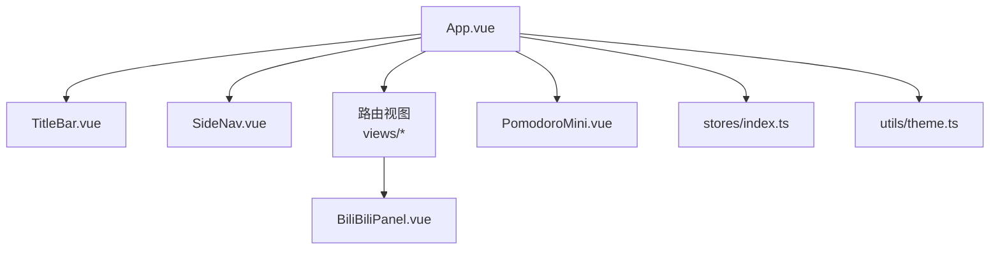
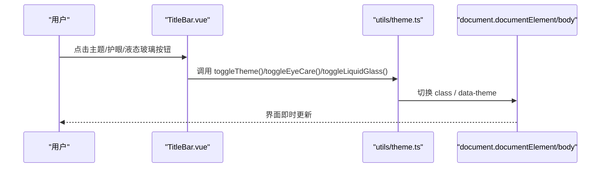
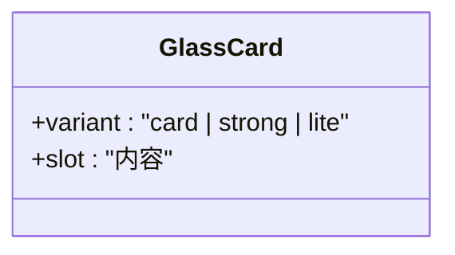
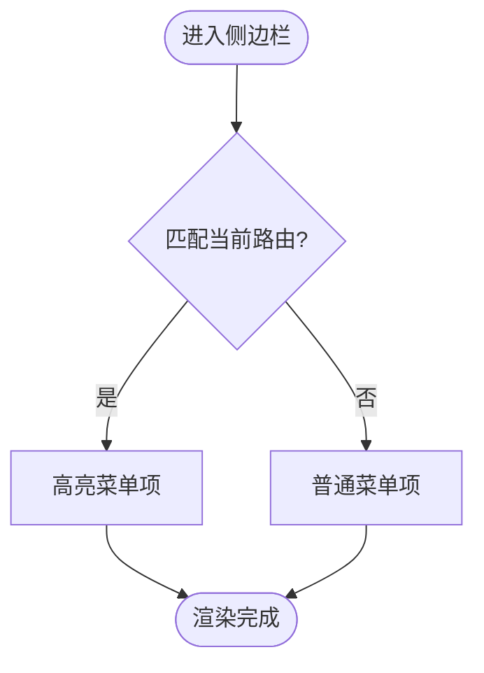
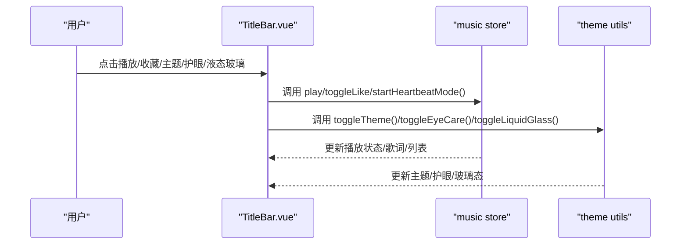
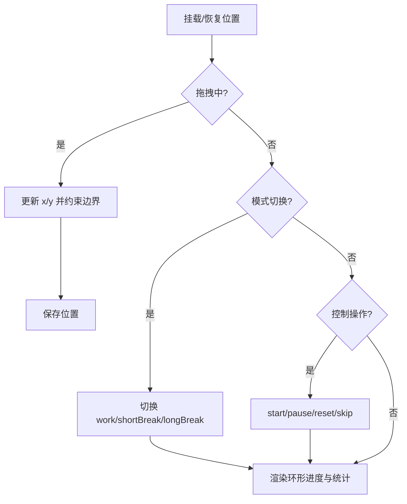
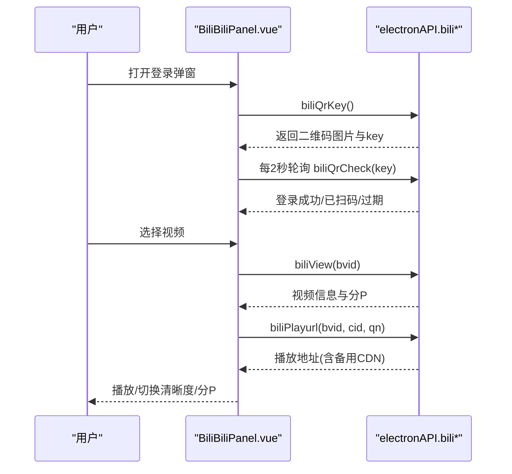
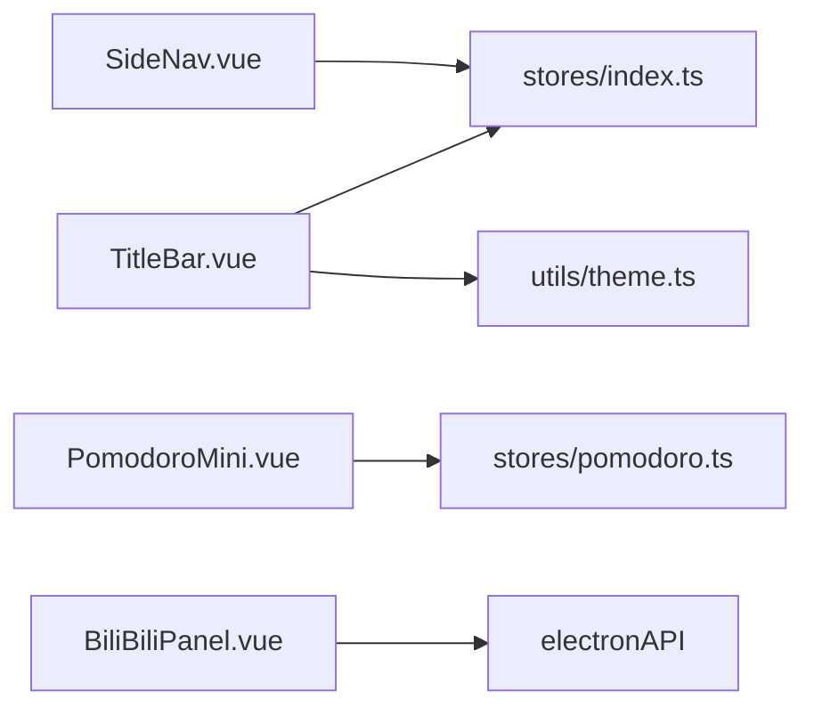

# 用户界面组件

<cite>
**本文引用的文件列表**
- [GlassCard.vue](file://src/renderer/src/components/GlassCard.vue)
- [SideNav.vue](file://src/renderer/src/components/SideNav.vue)
- [TitleBar.vue](file://src/renderer/src/components/TitleBar.vue)
- [PomodoroMini.vue](file://src/renderer/src/components/PomodoroMini.vue)
- [BiliBiliPanel.vue](file://src/renderer/src/components/BiliBiliPanel.vue)
- [App.vue](file://src/renderer/src/App.vue)
- [index.ts（主状态）](file://src/renderer/src/stores/index.ts)
- [theme.ts（主题与玻璃态开关）](file://src/renderer/src/utils/theme.ts)
</cite>

## 目录
1. [简介](#简介)
2. [项目结构](#项目结构)
3. [核心组件总览](#核心组件总览)
4. [架构总览](#架构总览)
5. [组件详细分析](#组件详细分析)
6. [依赖关系分析](#依赖关系分析)
7. [性能与可访问性](#性能与可访问性)
8. [故障排查指南](#故障排查指南)
9. [结论](#结论)
10. [附录：使用示例与集成指南](#附录使用示例与集成指南)

## 简介
本文件面向“考研助手”桌面应用的前端渲染层，聚焦 Vue 3 用户界面组件的架构设计与复用策略。文档围绕以下目标展开：
- 说明各 UI 组件的职责、属性配置与事件处理
- 解释玻璃态设计风格的主题切换机制与样式定制方法
- 提供组件的使用示例与集成指南
- 阐述响应式设计原则与无障碍访问支持
- 说明组件间通信模式与状态同步机制
- 给出扩展与自定义化的实践建议

## 项目结构
渲染层采用典型的 Vue 3 + Vite 工程组织：
- 组件位于 src/renderer/src/components，包含全局基础组件与业务面板
- 页面视图位于 src/renderer/src/views
- 状态管理通过 Pinia store（主状态在 stores/index.ts）
- 主题与系统能力封装在 utils（如 theme.ts）
- App.vue 作为根容器编排布局与全局行为

图表来源
- [App.vue:1-40](file://src/renderer/src/App.vue#L1-L40)
- [TitleBar.vue:1-332](file://src/renderer/src/components/TitleBar.vue#L1-L332)
- [SideNav.vue:1-53](file://src/renderer/src/components/SideNav.vue#L1-L53)
- [PomodoroMini.vue:1-130](file://src/renderer/src/components/PomodoroMini.vue#L1-L130)
- [BiliBiliPanel.vue:1-39](file://src/renderer/src/components/BiliBiliPanel.vue#L1-L39)

章节来源
- [App.vue:1-40](file://src/renderer/src/App.vue#L1-L40)

## 核心组件总览
- GlassCard：全局玻璃卡片容器，统一视觉参数与变体（card/strong/lite），所有视觉由全局 CSS 变量驱动，便于主题化与降级覆盖。
- SideNav：悬浮卡片式侧边导航，支持折叠/展开、菜单项高亮、考试倒计时展示，通过事件向父级通知折叠变化。
- TitleBar：自定义窗口顶栏，集成音乐控件、天气信息、主题切换、护眼模式、液态玻璃开关、窗口控制等。
- PomodoroMini：番茄钟迷你浮窗，支持拖拽、紧凑/展开模式、环形进度、科目选择与今日统计，状态与页面共享。
- BiliBiliPanel：学习资料页集成的 B 站视频模块，支持登录、热门推荐、收藏夹浏览、搜索、播放（分 P/清晰度/相关推荐）。

章节来源
- [GlassCard.vue:1-27](file://src/renderer/src/components/GlassCard.vue#L1-L27)
- [SideNav.vue:1-119](file://src/renderer/src/components/SideNav.vue#L1-L119)
- [TitleBar.vue:1-332](file://src/renderer/src/components/TitleBar.vue#L1-L332)
- [PomodoroMini.vue:1-130](file://src/renderer/src/components/PomodoroMini.vue#L1-L130)
- [BiliBiliPanel.vue:1-39](file://src/renderer/src/components/BiliBiliPanel.vue#L1-L39)

## 架构总览
整体采用“容器 + 功能组件 + 状态集中”的模式：
- 容器 App.vue 负责布局装配、全局初始化（主题、背景、数据同步）、路由过渡与全局提醒遮罩
- 功能组件通过 Pinia store 共享状态，或通过 props/emits 进行父子通信
- 主题与系统能力通过 utils 暴露 API，组件按需调用
- 玻璃态风格通过 CSS 变量与 body/html 类名控制，实现一键切换

图表来源
- [TitleBar.vue:547-561](file://src/renderer/src/components/TitleBar.vue#L547-L561)
- [theme.ts:25-58](file://src/renderer/src/utils/theme.ts#L25-L58)

章节来源
- [App.vue:42-57](file://src/renderer/src/App.vue#L42-L57)
- [theme.ts:1-58](file://src/renderer/src/utils/theme.ts#L1-L58)

## 组件详细分析

### GlassCard 玻璃卡片
- 职责：提供统一的玻璃卡片容器，承载内容插槽
- 属性：variant 可选 card/strong/lite，用于不同场景的视觉强度
- 样式策略：组件内仅占位，全部视觉来自全局 .glass-card 工具类与 CSS 变量；禁止嵌套，避免多重 backdrop-filter 叠加导致性能问题
- 复用策略：在需要玻璃效果的区域直接包裹内容，配合全局变量实现全站一致风格

图表来源
- [GlassCard.vue:8-22](file://src/renderer/src/components/GlassCard.vue#L8-L22)

章节来源
- [GlassCard.vue:1-27](file://src/renderer/src/components/GlassCard.vue#L1-L27)

### SideNav 侧边导航
- 职责：展示应用导航菜单、考试倒计时、折叠控制
- 属性：无显式 props，内部维护 isCollapsed 状态
- 事件：collapse-change 向父级通知折叠状态变化
- 交互：点击菜单项跳转路由；当前路由高亮；折叠时隐藏文本仅保留图标
- 样式：悬浮卡片风格，带玻璃效果与圆角阴影；宽度随折叠变化

图表来源
- [SideNav.vue:107-113](file://src/renderer/src/components/SideNav.vue#L107-L113)
- [SideNav.vue:15-30](file://src/renderer/src/components/SideNav.vue#L15-L30)

章节来源
- [SideNav.vue:1-119](file://src/renderer/src/components/SideNav.vue#L1-L119)

### TitleBar 顶部栏
- 职责：自定义窗口顶栏，集成音乐控件、天气、主题切换、护眼模式、液态玻璃开关、窗口控制
- 属性：transparent 控制透明顶栏（登录页使用）
- 事件与交互：
  - 音乐：播放/暂停、下一首、喜欢歌曲、心动模式、歌词显示、播放列表弹出
  - 天气：城市选择、搜索、刷新
  - 主题：深色/浅色切换、护眼模式开关、液态玻璃开关
  - 窗口：最小化、最大化/还原、关闭
- 状态来源：Pinia store（main/music/user）与 utils/theme/weather

图表来源
- [TitleBar.vue:334-447](file://src/renderer/src/components/TitleBar.vue#L334-L447)
- [TitleBar.vue:547-561](file://src/renderer/src/components/TitleBar.vue#L547-L561)

章节来源
- [TitleBar.vue:1-332](file://src/renderer/src/components/TitleBar.vue#L1-L332)
- [TitleBar.vue:334-659](file://src/renderer/src/components/TitleBar.vue#L334-L659)

### PomodoroMini 番茄钟迷你浮窗
- 职责：提供可拖拽的迷你计时器，支持紧凑/展开模式、环形进度、科目选择、今日统计
- 属性：visible 控制是否显示
- 交互：
  - 拖拽：Pointer Events + setPointerCapture，移动阈值防误触，位置持久化到 localStorage
  - 模式切换：专注/短休/长休
  - 控制：开始/暂停/重置/跳过
  - 跳转：跳转到完整番茄钟页面并自动隐藏浮窗
- 状态共享：完全复用番茄钟页面 store，保证多入口状态一致

图表来源
- [PomodoroMini.vue:143-188](file://src/renderer/src/components/PomodoroMini.vue#L143-L188)
- [PomodoroMini.vue:251-316](file://src/renderer/src/components/PomodoroMini.vue#L251-L316)

章节来源
- [PomodoroMini.vue:1-360](file://src/renderer/src/components/PomodoroMini.vue#L1-L360)

### BiliBiliPanel B 站面板
- 职责：学习资料页集成的在线视频模块，支持登录、热门推荐、收藏夹、搜索、播放
- 交互流程：
  - 登录：扫码或 Cookie 登录，轮询二维码状态
  - 热门：分页加载，换一批随机跳页
  - 收藏夹：文件夹列表与内容分页
  - 搜索：关键词搜索，分页与总数展示
  - 播放：获取视频信息、流地址，支持分 P、清晰度切换、相关推荐、错误重试与备用 CDN
- 外部依赖：electronAPI 代理请求（bili:* IPC），主进程 webRequest 注入 Referer 绕过防盗链

图表来源
- [BiliBiliPanel.vue:377-468](file://src/renderer/src/components/BiliBiliPanel.vue#L377-L468)
- [BiliBiliPanel.vue:610-693](file://src/renderer/src/components/BiliBiliPanel.vue#L610-L693)

章节来源
- [BiliBiliPanel.vue:1-722](file://src/renderer/src/components/BiliBiliPanel.vue#L1-L722)

## 依赖关系分析
- 组件与 Store：
  - SideNav 读取 main store 的考试倒计时
  - TitleBar 读取 main/music/user store，调用 theme utils
  - PomodoroMini 读取 pomodoro store，与页面共享状态
  - BiliBiliPanel 通过 electronAPI 与主进程通信
- 组件与主题：
  - TitleBar 触发主题切换，写入 html/body 类名与 data-theme
  - 玻璃态效果通过 body.liquid-glass 与 CSS 变量控制
- 组件与路由：
  - SideNav 与 TitleBar 均使用 vue-router 进行导航

图表来源
- [SideNav.vue:55-87](file://src/renderer/src/components/SideNav.vue#L55-L87)
- [TitleBar.vue:334-365](file://src/renderer/src/components/TitleBar.vue#L334-L365)
- [PomodoroMini.vue:132-147](file://src/renderer/src/components/PomodoroMini.vue#L132-L147)
- [BiliBiliPanel.vue:338-350](file://src/renderer/src/components/BiliBiliPanel.vue#L338-L350)

章节来源
- [index.ts:219-699](file://src/renderer/src/stores/index.ts#L219-L699)
- [theme.ts:1-144](file://src/renderer/src/utils/theme.ts#L1-L144)

## 性能与可访问性
- 性能优化
  - 玻璃态效果集中在全局 CSS 变量与伪元素，避免多层 backdrop-filter 叠加；GlassCard 禁止嵌套
  - 路由切换使用透明度过渡，减少滤镜重采样闪动
  - 番茄钟浮窗使用 Pointer Events 与 setPointerCapture 提升拖拽性能与体验
  - 视频播放支持备用 CDN 与分段连播，降低失败率与卡顿
- 可访问性
  - 关键按钮提供 title 提示，便于屏幕阅读器识别
  - 输入框与搜索具备明确的 placeholder 与键盘回车支持
  - 颜色对比度遵循主题变量，确保可读性
  - 图片与图标提供 alt/title，增强语义

[本节为通用指导，不直接分析具体文件]

## 故障排查指南
- 主题切换无效
  - 检查是否正确调用 toggleTheme 并更新 documentElement 类名
  - 确认 initTheme 已在应用启动时执行
- 玻璃态效果异常
  - 确认 body 是否添加 liquid-glass 类
  - 检查 CSS 变量 --glass-* 是否被正确定义
- 番茄钟浮窗位置丢失
  - 检查 localStorage 读写权限与格式
  - 监听 resize 事件校正位置
- B 站播放失败
  - 检查 electronAPI 代理是否可用
  - 尝试切换清晰度或启用备用 CDN
  - 查看网络错误与 CORS/Referer 限制

章节来源
- [TitleBar.vue:547-561](file://src/renderer/src/components/TitleBar.vue#L547-L561)
- [theme.ts:44-58](file://src/renderer/src/utils/theme.ts#L44-L58)
- [PomodoroMini.vue:318-359](file://src/renderer/src/components/PomodoroMini.vue#L318-L359)
- [BiliBiliPanel.vue:682-693](file://src/renderer/src/components/BiliBiliPanel.vue#L682-L693)

## 结论
本项目以清晰的组件分层与集中的状态管理为基础，结合玻璃态主题系统与 Electron 能力封装，提供了高度可复用的 UI 组件体系。通过 CSS 变量与类名切换实现主题与玻璃态的一键控制，借助 Pinia store 与 electronAPI 实现跨组件状态同步与系统集成。组件设计兼顾性能与可访问性，适合在复杂学习工具场景中持续扩展与维护。

[本节为总结性内容，不直接分析具体文件]

## 附录：使用示例与集成指南

### 使用 GlassCard
- 在任意需要玻璃效果的区域包裹内容，并根据场景选择 variant
- 示例路径参考：[GlassCard.vue:19-22](file://src/renderer/src/components/GlassCard.vue#L19-L22)

### 集成 SideNav
- 在 App.vue 中引入并监听 collapse-change 事件，动态调整侧栏宽度
- 示例路径参考：[App.vue:10-11](file://src/renderer/src/App.vue#L10-L11)、[App.vue:75-81](file://src/renderer/src/App.vue#L75-L81)

### 集成 TitleBar
- 在 App.vue 中引入并传入 transparent 属性（登录页使用）
- 通过 store 与 utils 调用音乐、主题、护眼等功能
- 示例路径参考：[App.vue:4](file://src/renderer/src/App.vue#L4)、[TitleBar.vue:334-365](file://src/renderer/src/components/TitleBar.vue#L334-L365)

### 集成 PomodoroMini
- 根据路由决定是否显示，并在非番茄钟页面挂载
- 通过 store 共享状态，确保与页面一致
- 示例路径参考：[App.vue:23-24](file://src/renderer/src/App.vue#L23-L24)、[PomodoroMini.vue:143-188](file://src/renderer/src/components/PomodoroMini.vue#L143-L188)

### 集成 BiliBiliPanel
- 在资料页中引入，确保 electronAPI 代理可用
- 处理登录、热门、收藏、搜索与播放流程
- 示例路径参考：[BiliBiliPanel.vue:377-468](file://src/renderer/src/components/BiliBiliPanel.vue#L377-L468)、[BiliBiliPanel.vue:610-693](file://src/renderer/src/components/BiliBiliPanel.vue#L610-L693)

### 主题与玻璃态定制
- 通过 theme.ts 提供的 API 切换主题、护眼模式与液态玻璃
- 通过 CSS 变量 --glass-* 统一调整玻璃效果强度与高光
- 示例路径参考：[theme.ts:25-58](file://src/renderer/src/utils/theme.ts#L25-L58)、[Music.vue:1125-1171](file://src/renderer/src/views/Music.vue#L1125-L1171)

章节来源
- [App.vue:1-40](file://src/renderer/src/App.vue#L1-L40)
- [theme.ts:1-144](file://src/renderer/src/utils/theme.ts#L1-L144)