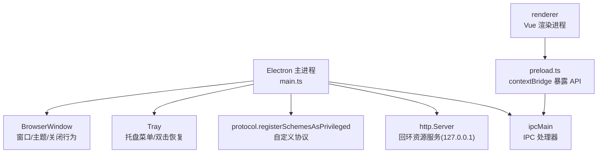
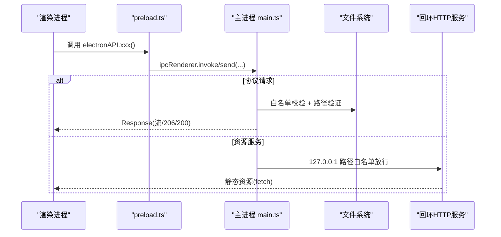
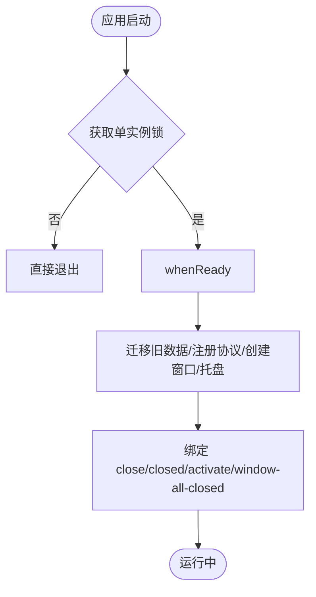
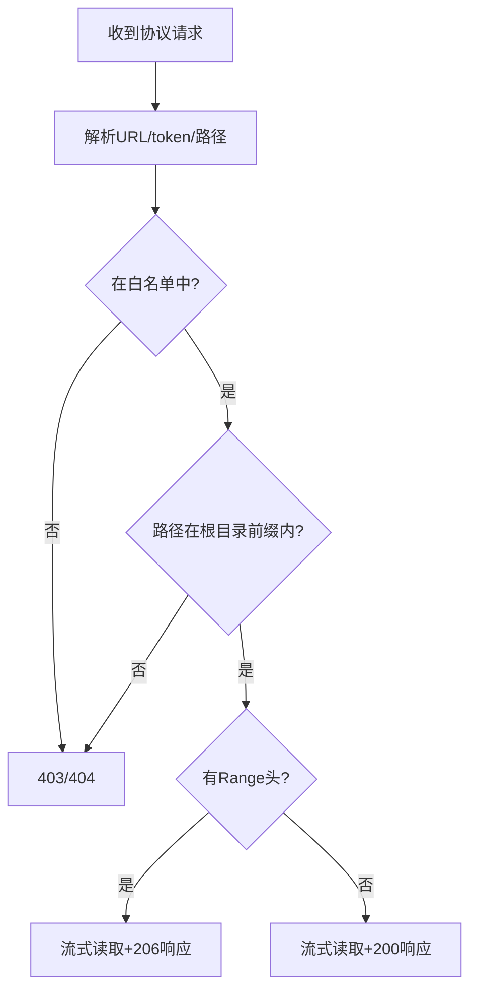
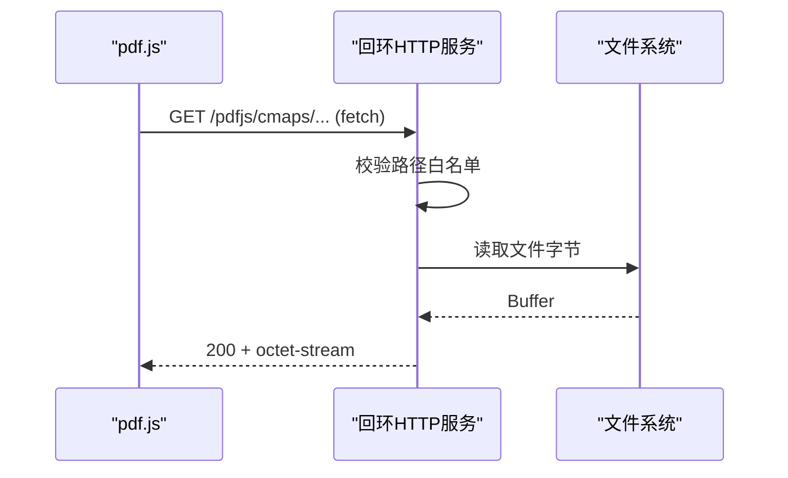
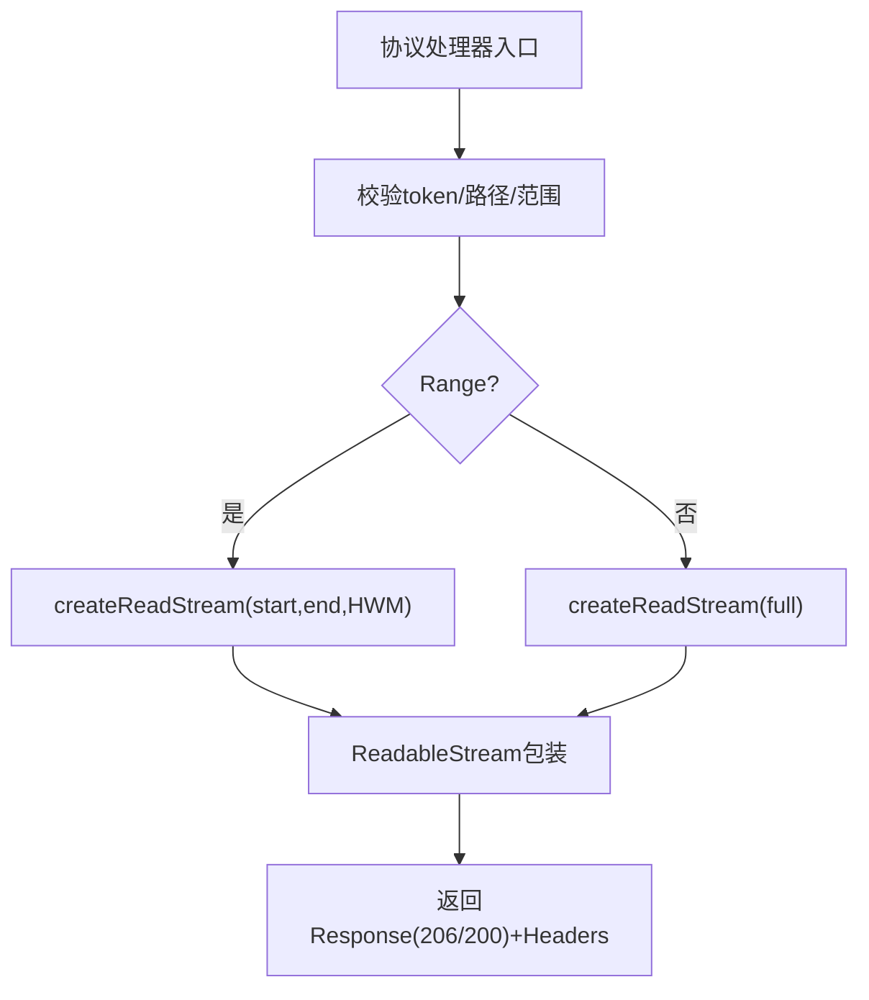
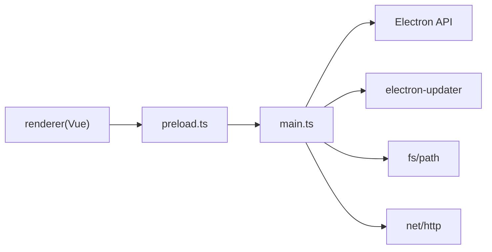

# 主进程功能

<cite>
**本文引用的文件**
- [src/main/main.ts](file://src/main/main.ts)
- [src/preload/preload.ts](file://src/preload/preload.ts)
- [package.json](file://package.json)
- [README.md](file://README.md)
</cite>

## 目录
1. [简介](#简介)
2. [项目结构](#项目结构)
3. [核心组件](#核心组件)
4. [架构总览](#架构总览)
5. [详细组件分析](#详细组件分析)
6. [依赖关系分析](#依赖关系分析)
7. [性能考量](#性能考量)
8. [故障排查指南](#故障排查指南)
9. [结论](#结论)
10. [附录](#附录)

## 简介
本文件聚焦 Electron 主进程的核心职责与实现，覆盖应用生命周期管理、窗口控制、托盘集成、自定义协议注册与安全、文件白名单与路径校验、流式读取与 Range 请求处理、主进程与渲染进程的 IPC 通信模式与安全最佳实践，以及错误处理、异常捕获与资源清理机制。目标是帮助开发者快速理解并安全扩展主进程能力。

## 项目结构
- 主进程入口：src/main/main.ts
- 预加载脚本（隔离桥）：src/preload/preload.ts
- 构建与打包配置：package.json
- 项目说明与技术栈概览：README.md

图表来源
- [src/main/main.ts:191-197](file://src/main/main.ts#L191-L197)
- [src/main/main.ts:213-276](file://src/main/main.ts#L213-L276)
- [src/preload/preload.ts:1-98](file://src/preload/preload.ts#L1-L98)

章节来源
- [src/main/main.ts:1-20](file://src/main/main.ts#L1-L20)
- [package.json:1-20](file://package.json#L1-L20)
- [README.md:111-130](file://README.md#L111-L130)

## 核心组件
- 应用生命周期与单实例锁
  - 使用 requestSingleInstanceLock 防止多实例；second-instance 事件聚焦已有窗口。
  - whenReady 后初始化数据目录迁移、注册协议、创建窗口与托盘、启动自动更新监听。
- 窗口控制
  - 无边框窗口 + 自定义顶栏；最小化、最大化切换、隐藏到托盘、全屏开关。
- 托盘集成
  - 托盘图标、工具提示、菜单项“显示主窗口”“退出考研助手”，首次隐藏时展示气泡提示（Windows）。
- 自定义协议
  - kaoyan-bg：用户自定义背景图（存在才返回内容）。
  - kaoyan-music：音乐文件夹内音频，基于 token 白名单 + 路径前缀校验，支持 Range 流式播放。
  - kaoyan-data：仅允许数据目录下的 .json 备份文件访问。
  - kaoyan-material：资料文件夹内文件（PDF/MP4 等），token 白名单 + 路径前缀校验，Range 流式响应。
  - kaoyan-assets：内置静态资源（pdf.js cmaps/standard_fonts），路径白名单限制为 pdfjs/ 子目录，跨域头开启。
- 回环 HTTP 资源服务
  - 仅在 127.0.0.1 监听，路径白名单严格限制为 pdfjs/cmaps 与 pdfjs/standard_fonts，提供 fetch 分支稳定加载 PDF 字体与 CMap。
- 自动更新
  - 基于 electron-updater，不自动下载，设置页手动触发；通过 IPC 推送更新事件。
- 第三方服务代理
  - 网易云音乐 API（eapi/weapi 智能降级）、哔哩哔哩 API（登录/收藏/搜索/播放），统一在主进程发起网络请求，避免渲染进程跨域与风控问题。

章节来源
- [src/main/main.ts:379-391](file://src/main/main.ts#L379-L391)
- [src/main/main.ts:393-657](file://src/main/main.ts#L393-L657)
- [src/main/main.ts:672-699](file://src/main/main.ts#L672-L699)
- [src/main/main.ts:213-276](file://src/main/main.ts#L213-L276)
- [src/main/main.ts:975-1332](file://src/main/main.ts#L975-L1332)
- [src/main/main.ts:2103-2399](file://src/main/main.ts#L2103-L2399)

## 架构总览
主进程作为安全边界，集中管理：
- 协议路由：将 kaoyan-* 协议映射到受控的文件访问与流式输出。
- 资源托管：本地回环 HTTP 服务提供稳定的 fetch 通道给 pdf.js。
- IPC 网关：通过 preload 的 contextBridge 暴露最小必要 API，禁止 Node 集成。
- 外部服务代理：网易云、B站接口由主进程统一封装，携带必要 Cookie/UA/Referer，降低前端复杂度与风控风险。

图表来源
- [src/preload/preload.ts:1-98](file://src/preload/preload.ts#L1-L98)
- [src/main/main.ts:191-197](file://src/main/main.ts#L191-L197)
- [src/main/main.ts:213-276](file://src/main/main.ts#L213-L276)
- [src/main/main.ts:407-615](file://src/main/main.ts#L407-L615)

## 详细组件分析

### 应用生命周期与窗口/托盘
- 单实例锁：避免重复启动；二次实例聚焦已有窗口。
- 窗口：无边框、跟随系统主题背景色、关闭隐藏到托盘而非退出。
- 托盘：菜单项控制显示/退出；首次隐藏时 Windows 平台弹出气泡提示。

图表来源
- [src/main/main.ts:379-391](file://src/main/main.ts#L379-L391)
- [src/main/main.ts:393-657](file://src/main/main.ts#L393-L657)
- [src/main/main.ts:660-670](file://src/main/main.ts#L660-L670)

章节来源
- [src/main/main.ts:379-391](file://src/main/main.ts#L379-L391)
- [src/main/main.ts:393-657](file://src/main/main.ts#L393-L657)
- [src/main/main.ts:660-670](file://src/main/main.ts#L660-L670)

### 自定义协议与安全机制
- 注册特权协议：kaoyan-bg、kaoyan-music、kaoyan-data、kaoyan-material、kaoyan-assets，启用 standard/secure/supportFetchAPI/stream/corsEnabled 等权限。
- 白名单与路径校验：
  - 音乐/资料：通过 token -> 绝对路径 Map 建立白名单；请求时解析 token 并校验最终路径是否位于根目录前缀下，防止路径穿越。
  - 数据目录：仅允许匹配正则的 .json 文件名，拼接至数据目录后访问。
  - 内置资源：仅允许 pdfjs/ 子目录，且文件名符合安全字符集。
- Range 请求：对 kaoyan-music 与 kaoyan-material 支持 bytes= 范围请求，返回 206 Partial Content 并附带 Content-Range/Accept-Ranges。

图表来源
- [src/main/main.ts:191-197](file://src/main/main.ts#L191-L197)
- [src/main/main.ts:407-477](file://src/main/main.ts#L407-L477)
- [src/main/main.ts:542-615](file://src/main/main.ts#L542-L615)
- [src/main/main.ts:480-495](file://src/main/main.ts#L480-L495)
- [src/main/main.ts:504-532](file://src/main/main.ts#L504-L532)

章节来源
- [src/main/main.ts:191-197](file://src/main/main.ts#L191-L197)
- [src/main/main.ts:407-477](file://src/main/main.ts#L407-L477)
- [src/main/main.ts:480-495](file://src/main/main.ts#L480-L495)
- [src/main/main.ts:504-532](file://src/main/main.ts#L504-L532)
- [src/main/main.ts:542-615](file://src/main/main.ts#L542-L615)

### 回环 HTTP 资源服务（pdf.js CMap/标准字体）
- 目的：让 pdf.js 走最稳定的 fetch 分支，避免 XHR 访问自定义协议的不稳定性。
- 安全：仅监听 127.0.0.1，路径白名单严格限制为 pdfjs/cmaps 与 pdfjs/standard_fonts，防路径穿越。
- 行为：GET/HEAD 支持，OPTIONS 预检放行；失败时清空 baseUrl，渲染层回退到 kaoyan-assets://。

图表来源
- [src/main/main.ts:213-276](file://src/main/main.ts#L213-L276)

章节来源
- [src/main/main.ts:213-276](file://src/main/main.ts#L213-L276)

### 文件白名单与扫描
- 音乐文件夹：递归扫描限定扩展名（mp3/flac/wav/ogg/m4a/aac/wma/opus），最多记录 2000 个文件；生成 token 映射到绝对路径，返回相对路径列表供渲染层构造 kaoyan-music:// 链接。
- 资料文件夹：递归扫描多种媒体/文档格式，构建树形结构（保留层级），每个文件分配 token 并生成 kaoyan-material:// 链接；支持打开系统默认应用。

章节来源
- [src/main/main.ts:701-817](file://src/main/main.ts#L701-L817)
- [src/main/main.ts:841-959](file://src/main/main.ts#L841-L959)

### 流式文件读取与内存优化
- 采用 fs.createReadStream + ReadableStream 包装，避免一次性读入内存导致 Array buffer allocation failed。
- 支持 Range 请求：解析 bytes=start-end，计算有效区间，返回 206 并设置 Content-Range/Accept-Ranges。
- 大文件吞吐优化：highWaterMark 设置为 512KB，减少系统调用次数。
- 取消与错误处理：ReadableStream cancel 销毁流；data/end/error 事件安全 enqueue/close。

图表来源
- [src/main/main.ts:407-477](file://src/main/main.ts#L407-L477)
- [src/main/main.ts:542-615](file://src/main/main.ts#L542-L615)

章节来源
- [src/main/main.ts:407-477](file://src/main/main.ts#L407-L477)
- [src/main/main.ts:542-615](file://src/main/main.ts#L542-L615)

### IPC 通信模式与安全最佳实践
- 预加载桥：preload.ts 通过 contextBridge.exposeInMainWorld 暴露最小 API 集合，渲染进程通过 electronAPI.* 调用。
- 主进程处理器：ipcMain.handle/on 对应各功能模块（窗口控制、更新、音乐/资料、网易云/B站、天气、数据目录等）。
- 安全要点：
  - 渲染进程禁用 nodeIntegration，启用 contextIsolation 与 webSecurity。
  - 所有敏感操作（文件访问、网络请求、系统调用）集中在主进程，渲染进程仅传递参数。
  - 协议与路径严格白名单校验，拒绝非法 token/越权路径。
  - 对外部 URL 打开进行格式校验（仅 https/http）。

章节来源
- [src/preload/preload.ts:1-98](file://src/preload/preload.ts#L1-L98)
- [src/main/main.ts:290-327](file://src/main/main.ts#L290-L327)
- [src/main/main.ts:672-699](file://src/main/main.ts#L672-L699)
- [src/main/main.ts:961-973](file://src/main/main.ts#L961-L973)

### 错误处理、异常捕获与资源清理
- 全局未捕获异常：uncaughtException/unhandledRejection 打印日志，避免崩溃弹窗。
- 协议处理器：try/catch 包裹，返回标准化错误响应（400/403/404/416）。
- 资源清理：before-quit 事件中关闭回环 HTTP 服务；window-all-closed 在非 macOS 平台退出应用。
- 托盘与窗口：close-to-tray 隐藏窗口并提示；真正退出通过托盘菜单设置 isQuitting=true 再 quit。

章节来源
- [src/main/main.ts:8-14](file://src/main/main.ts#L8-L14)
- [src/main/main.ts:660-670](file://src/main/main.ts#L660-L670)
- [src/main/main.ts:687-693](file://src/main/main.ts#L687-L693)

## 依赖关系分析
- 主进程依赖 Electron 模块：app、BrowserWindow、ipcMain、protocol、net、Tray、Menu、nativeImage、shell、session。
- 第三方库：electron-updater（自动更新）、pdfjs-dist（渲染）、@open-file-viewer/core（文档预览）。
- 构建产物：dist/main/main.js 作为入口；Vite 构建 renderer 资源；electron-builder 打包。

图表来源
- [src/main/main.ts:1-6](file://src/main/main.ts#L1-L6)
- [package.json:19-44](file://package.json#L19-L44)

章节来源
- [package.json:1-20](file://package.json#L1-L20)
- [package.json:19-44](file://package.json#L19-L44)

## 性能考量
- 流式读取：避免大文件全量载入内存，降低峰值内存占用。
- Range 请求：支持拖动进度与按需加载，提升视频/PDF 体验。
- 高水位标记：highWaterMark 设为 512KB，平衡吞吐与内存。
- 异步 stat：避免阻塞主线程。
- 回环 HTTP：确保 pdf.js 走 fetch 分支，减少不稳定因素。

[本节为通用指导，无需特定文件引用]

## 故障排查指南
- 协议无法访问
  - 检查 token 是否存在于白名单；确认路径是否在根目录前缀内。
  - 查看协议处理器返回状态码（400/403/404/416）。
- PDF 中文乱码或黑屏
  - 确认回环 HTTP 服务已启动且 baseUrl 可用；若为空则回退 kaoyan-assets://。
  - 检查路径白名单是否包含目标 cmaps/standard_fonts 文件。
- 音乐/视频无法拖动
  - 确认服务端正确返回 206 与 Content-Range/Accept-Ranges。
- 更新检测失败
  - 检查网络与 electron-updater 配置；关注 update:error 事件消息。
- 第三方 API 风控
  - 网易云：eapi/weapi 智能降级；检查 Cookie 持久化与 UA/Referer。
  - B站：确保 buvid3/buvid4 存在；必要时先登录或重试。

章节来源
- [src/main/main.ts:407-477](file://src/main/main.ts#L407-L477)
- [src/main/main.ts:542-615](file://src/main/main.ts#L542-L615)
- [src/main/main.ts:213-276](file://src/main/main.ts#L213-L276)
- [src/main/main.ts:975-1332](file://src/main/main.ts#L975-L1332)
- [src/main/main.ts:2103-2399](file://src/main/main.ts#L2103-L2399)

## 结论
主进程以最小暴露面、严格白名单与流式 I/O 为核心，实现了安全的本地资源访问与丰富的协议能力；通过回环 HTTP 服务保障 PDF 渲染稳定性；借助 IPC 与预加载桥实现前后端解耦与安全隔离；同时提供完善的错误处理与资源清理机制，确保应用健壮性与用户体验。

[本节为总结性内容，无需特定文件引用]

## 附录
- 自定义协议一览
  - kaoyan-bg：用户自定义背景图（存在即返回）。
  - kaoyan-music：音乐文件流式播放（支持 Range）。
  - kaoyan-data：数据目录内 .json 备份文件访问。
  - kaoyan-material：资料文件流式访问（支持 Range）。
  - kaoyan-assets：内置静态资源（pdf.js CMap/字体）。
- 关键安全点
  - 路径前缀校验、token 白名单、正则文件名过滤、仅 127.0.0.1 监听、CORS 精确控制。
- 推荐实践
  - 新增协议需遵循白名单与路径校验原则；
  - 大文件一律流式读取并支持 Range；
  - IPC 只暴露必要方法，敏感逻辑留在主进程。

[本节为补充信息，无需特定文件引用]