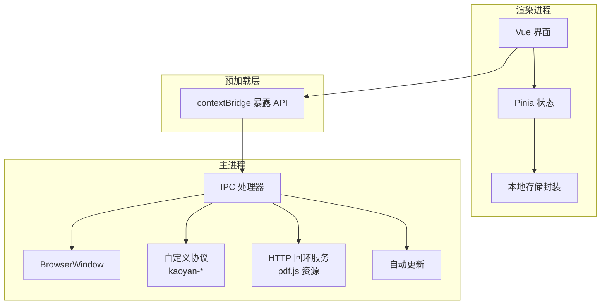
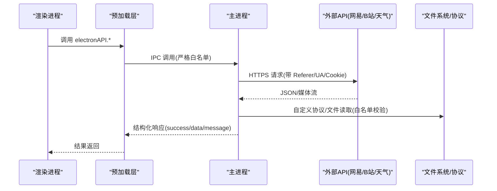
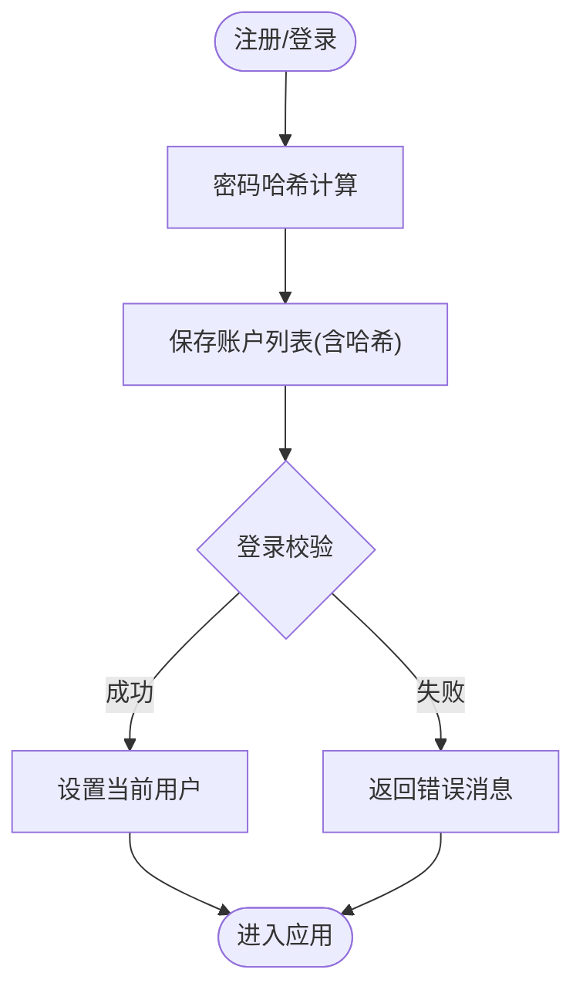
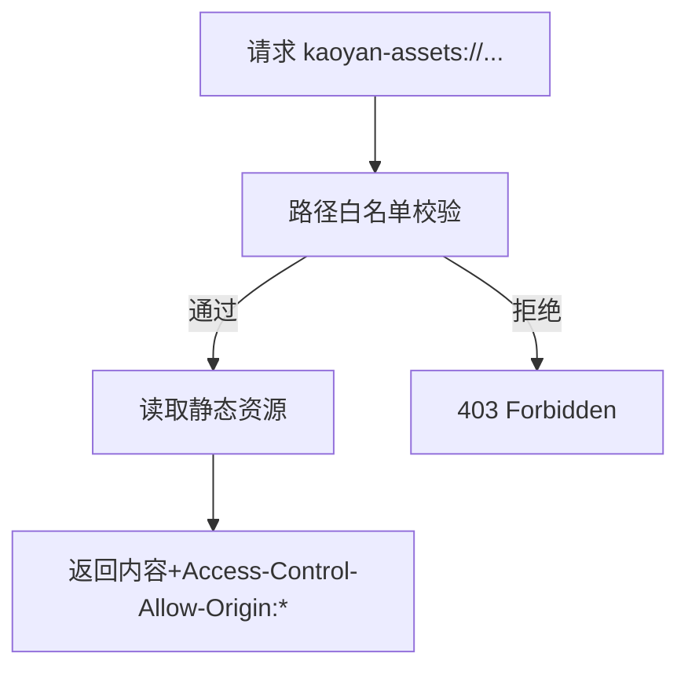
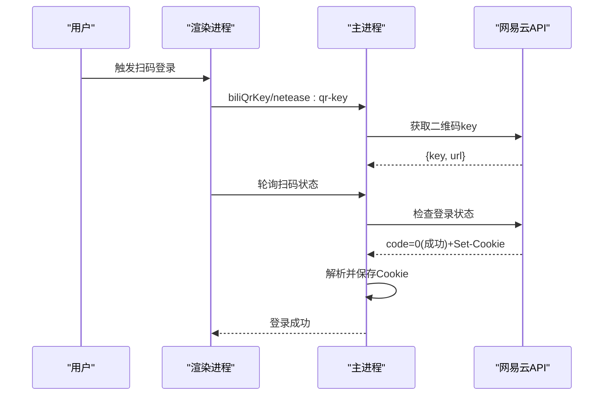
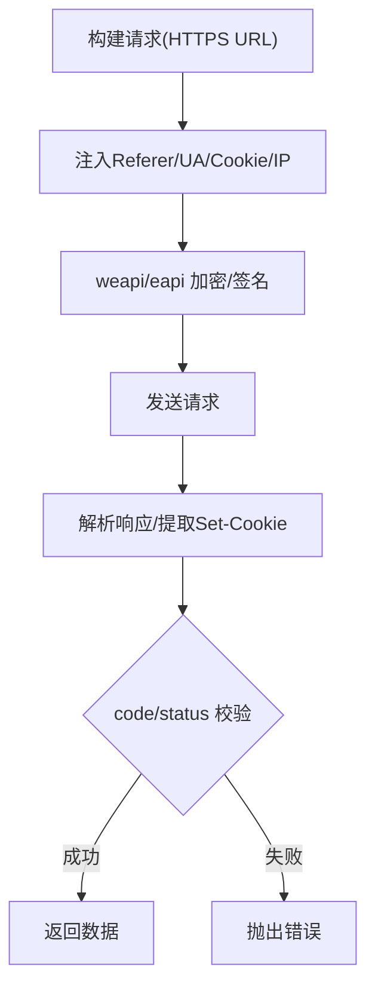
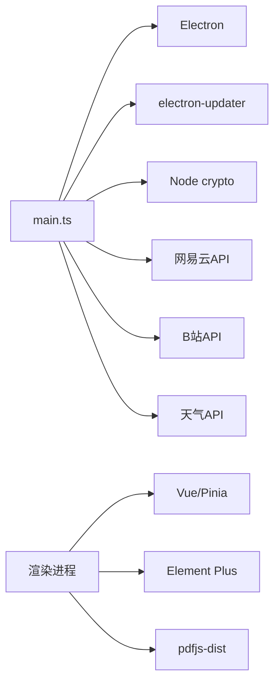

# API安全与配置

<cite>
**本文引用的文件**
- [main.ts](file://src/main/main.ts)
- [preload.ts](file://src/preload/preload.ts)
- [storage.ts](file://src/renderer/src/utils/storage.ts)
- [user.ts](file://src/renderer/src/stores/user.ts)
- [Login.vue](file://src/renderer/src/views/Login.vue)
- [datasync.ts](file://src/renderer/src/utils/datasync.ts)
- [weather.ts](file://src/renderer/src/utils/weather.ts)
- [package.json](file://package.json)
</cite>

## 目录
1. [简介](#简介)
2. [项目结构](#项目结构)
3. [核心组件](#核心组件)
4. [架构总览](#架构总览)
5. [详细组件分析](#详细组件分析)
6. [依赖关系分析](#依赖关系分析)
7. [性能与安全考量](#性能与安全考量)
8. [故障排查指南](#故障排查指南)
9. [结论](#结论)
10. [附录](#附录)

## 简介
本文件聚焦于该 Electron 桌面应用（考研助手）的 API 安全与配置，覆盖以下主题：
- API 密钥管理与敏感信息存储（本地哈希、Cookie/凭证持久化、环境变量使用）
- 跨域请求与 CORS 策略（自定义协议、回环 HTTP 服务）
- 用户认证令牌管理（本地账号登录态、第三方 Cookie 会话、过期处理与续期）
- 网络请求安全验证（HTTPS 强制、证书校验、Referer/UA/Cookie 注入）
- 权限控制与访问限制（IPC 白名单、路径白名单、协议白名单）
- 错误日志记录与异常监控（主进程未捕获异常、统一错误返回）
- API 限流与防滥用（当前实现现状与建议）
- 网络安全最佳实践与常见漏洞防护建议

## 项目结构
本项目采用 Electron 多进程架构：
- 主进程（main.ts）：负责窗口、协议、系统能力、外部 API 代理、安全策略。
- 预加载脚本（preload.ts）：通过 contextBridge 暴露最小 IPC 接口给渲染进程。
- 渲染进程（Vue + Pinia）：业务页面、状态管理、本地存储封装。

图表来源
- [main.ts:192-277](file://src/main/main.ts#L192-L277)
- [preload.ts:1-98](file://src/preload/preload.ts#L1-L98)

章节来源
- [main.ts:1-200](file://src/main/main.ts#L1-L200)
- [preload.ts:1-98](file://src/preload/preload.ts#L1-L98)

## 核心组件
- 主进程安全入口：启用 webSecurity、contextIsolation、禁用 nodeIntegration；注册受限协议；提供最小 IPC 暴露。
- 本地认证与数据持久化：用户名/密码哈希存储、当前用户标识、数据迁移与清理。
- 第三方服务集成：网易云音乐、哔哩哔哩、天气等通过主进程代理调用，集中处理 Cookie、加密、签名、CORS。
- 静态资源与协议：自定义协议与回环 HTTP 服务，确保离线可用与稳定加载。

章节来源
- [main.ts:291-314](file://src/main/main.ts#L291-L314)
- [storage.ts:325-443](file://src/renderer/src/utils/storage.ts#L325-L443)
- [preload.ts:1-98](file://src/preload/preload.ts#L1-L98)

## 架构总览
下图展示从渲染进程到主进程再到外部服务的完整调用链，以及安全边界（IPC 白名单、协议白名单、CORS）。

图表来源
- [main.ts:1121-1333](file://src/main/main.ts#L1121-L1333)
- [main.ts:2131-2350](file://src/main/main.ts#L2131-L2350)
- [main.ts:2501-2597](file://src/main/main.ts#L2501-L2597)
- [preload.ts:1-98](file://src/preload/preload.ts#L1-L98)

## 详细组件分析

### 1) API 密钥管理与敏感信息存储
- 本地账号密码不直接明文存储，采用简单哈希后保存账户列表，登录时比对哈希值。
- 第三方服务凭据以 Cookie 形式在主进程内存中维护，并在退出或登出时清理；部分场景支持持久化（如 B 站 Cookie）。
- 环境变量使用：开发环境通过 NODE_ENV 区分行为；无显式 API Key 配置文件，密钥/盐值以内联常量方式存在（需评估安全性）。

图表来源
- [storage.ts:333-400](file://src/renderer/src/utils/storage.ts#L333-L400)
- [user.ts:34-54](file://src/renderer/src/stores/user.ts#L34-L54)
- [Login.vue:134-166](file://src/renderer/src/views/Login.vue#L134-L166)

章节来源
- [storage.ts:325-443](file://src/renderer/src/utils/storage.ts#L325-L443)
- [user.ts:14-86](file://src/renderer/src/stores/user.ts#L14-L86)
- [Login.vue:82-172](file://src/renderer/src/views/Login.vue#L82-L172)

### 2) 跨域请求与 CORS 策略
- 自定义协议（kaoyan-bg/music/data/material/assets）均声明 secure:true，并开启 supportFetchAPI；其中 assets 额外开启 corsEnabled:true，配合 Access-Control-Allow-Origin:* 允许渲染进程跨域读取。
- 回环 HTTP 服务（127.0.0.1）为 pdf.js 资源提供稳定 fetch 通道，仅放行 pdfjs/cmaps 与 standard_fonts 子路径，防止路径穿越。
- 所有跨域响应头在必要时设置，OPTIONS 预检直接放行。

图表来源
- [main.ts:192-198](file://src/main/main.ts#L192-L198)
- [main.ts:213-277](file://src/main/main.ts#L213-L277)
- [main.ts:505-533](file://src/main/main.ts#L505-L533)

章节来源
- [main.ts:192-277](file://src/main/main.ts#L192-L277)
- [main.ts:505-533](file://src/main/main.ts#L505-L533)

### 3) 用户认证令牌管理与刷新机制
- 本地账号：登录后设置当前用户名至本地存储，重启后恢复；无 Token 概念，基于本地会话。
- 第三方服务：
  - 网易云：通过 Cookie 维持登录态，二维码登录成功后解析 Set-Cookie 并持久化；支持手机号登录、Cookie 粘贴登录；登出时清空 Cookie。
  - 哔哩哔哩：扫码登录或 Cookie 登录，Set-Cookie 入库；播放 CDN 请求注入 Referer/UA 以通过防盗链校验。
- 过期处理：
  - 二维码有效期轮询检测，过期提示刷新。
  - 第三方 API 返回非成功码时抛出错误，上层统一处理。

图表来源
- [main.ts:1404-1473](file://src/main/main.ts#L1404-L1473)
- [main.ts:2321-2350](file://src/main/main.ts#L2321-L2350)
- [main.ts:2131-2151](file://src/main/main.ts#L2131-L2151)

章节来源
- [main.ts:1404-1473](file://src/main/main.ts#L1404-L1473)
- [main.ts:2131-2350](file://src/main/main.ts#L2131-L2350)

### 4) 网络请求的安全验证
- 全部外部 API 使用 HTTPS（music.163.com、bilibili.com、wttr.in 等），由 Node fetch 默认进行 TLS 握手与证书校验。
- 请求头注入：
  - Referer/Origin/User-Agent/Accept-Language 模拟浏览器环境，避免被服务端拦截。
  - X-Real-IP/X-Forwarded-For 随机国内 IP，规避地域限制。
  - Cookie：根据登录态动态构建，保证鉴权上下文。
- 加密与签名：
  - 网易云 weapi/eapi 加密流程（AES/RSA/MD5），参数与签名按官方兼容实现。
  - 哔哩哔哩 WBI 签名、Buvid 生成、CDN 请求头注入。

图表来源
- [main.ts:1121-1150](file://src/main/main.ts#L1121-L1150)
- [main.ts:1285-1333](file://src/main/main.ts#L1285-L1333)
- [main.ts:2285-2350](file://src/main/main.ts#L2285-L2350)

章节来源
- [main.ts:1121-1333](file://src/main/main.ts#L1121-L1333)
- [main.ts:2285-2350](file://src/main/main.ts#L2285-L2350)

### 5) 权限控制与访问限制
- IPC 白名单：预加载层仅暴露必要方法，主进程对应 handler 逐一实现，避免任意命令执行。
- 协议白名单：kaoyan-* 协议仅允许访问指定目录与扩展名，路径穿越防护（正则校验）。
- 资源访问限制：资料/音乐协议要求 token 映射到绝对路径，并校验位于根目录内；PDF/字体资源仅限 pdfjs 子目录。
- 窗口与系统能力：通过 preload 暴露的最小 API 控制窗口操作、更新、外部链接打开等。

章节来源
- [main.ts:84-99](file://src/main/main.ts#L84-L99)
- [main.ts:407-478](file://src/main/main.ts#L407-L478)
- [main.ts:543-616](file://src/main/main.ts#L543-L616)
- [preload.ts:1-98](file://src/preload/preload.ts#L1-L98)

### 6) 错误日志记录与异常监控
- 主进程全局异常处理：uncaughtException/unhandledRejection 输出日志，避免崩溃弹窗。
- 统一错误返回：各 IPC handler 捕获异常并返回 { success:false, message }，渲染层统一提示。
- 网络错误：HTTP status 非 2xx 或业务 code 非预期时抛错，便于定位。

章节来源
- [main.ts:9-15](file://src/main/main.ts#L9-L15)
- [main.ts:1269-1283](file://src/main/main.ts#L1269-L1283)
- [main.ts:2501-2597](file://src/main/main.ts#L2501-L2597)

### 7) API 限流与防滥用机制
- 当前实现未发现全局限流器或速率限制逻辑。
- 建议：
  - 在 IPC 层增加滑动窗口限流（按接口维度）。
  - 对高频接口（搜索、排行榜）增加去抖与缓存。
  - 针对第三方 API 增加重试退避与熔断保护。

[本节为通用建议，不直接分析具体文件]

### 8) 数据安全与备份
- 本地数据实时写入 localStorage，启动时载入并做版本迁移；容量不足时清理旧数据。
- 数据目录：支持选择自定义目录，手动同步全量快照；自动备份已关闭，降低后台写入风险。
- 敏感数据：Cookie 仅在主进程内存/有限持久化，登出时清理。

章节来源
- [storage.ts:144-195](file://src/renderer/src/utils/storage.ts#L144-L195)
- [datasync.ts:1-108](file://src/renderer/src/utils/datasync.ts#L1-L108)

## 依赖关系分析
- 主进程依赖 Electron、electron-updater、Node 标准库（crypto/http/path/fs/url）。
- 渲染进程依赖 Vue、Pinia、Element Plus、ECharts、pdfjs-dist。
- 第三方服务：网易云音乐、哔哩哔哩、中国天气网/wttr.in。

图表来源
- [package.json:19-44](file://package.json#L19-L44)
- [main.ts:1-8](file://src/main/main.ts#L1-L8)

章节来源
- [package.json:19-44](file://package.json#L19-L44)
- [main.ts:1-8](file://src/main/main.ts#L1-L8)

## 性能与安全考量
- 性能
  - 大文件流式读取（音乐/资料协议）减少内存占用。
  - 回环 HTTP 服务提升 pdf.js 资源加载稳定性。
  - 天气数据本地缓存，定时刷新。
- 安全
  - 启用 webSecurity、contextIsolation，禁用 nodeIntegration。
  - 自定义协议与路径白名单防止越权访问。
  - 第三方 Cookie 最小化持久化，登出即清。
  - 请求头注入规避防盗链与风控。
  - 统一错误处理与日志输出。

[本节为综合评估，不直接分析具体文件]

## 故障排查指南
- 无法加载 PDF CMap/字体：检查回环 HTTP 服务是否启动成功，或回退到 kaoyan-assets:// 协议。
- 第三方登录失败：确认 Cookie 是否有效，二维码是否过期；查看主进程日志中的错误信息。
- 网络请求报错：检查 HTTPS 连接、Referer/UA/Cookie 是否正确注入；核对业务 code 与 HTTP status。
- 数据丢失：检查 localStorage 容量与迁移逻辑；尝试手动同步数据目录。

章节来源
- [main.ts:213-277](file://src/main/main.ts#L213-L277)
- [main.ts:1404-1473](file://src/main/main.ts#L1404-L1473)
- [main.ts:1269-1283](file://src/main/main.ts#L1269-L1283)
- [storage.ts:93-109](file://src/renderer/src/utils/storage.ts#L93-L109)

## 结论
该项目在 Electron 环境下实现了较为完善的安全基线：严格的上下文隔离、受限的 IPC 暴露、自定义协议与路径白名单、HTTPS 强制与请求头注入、统一的错误处理与日志。对于敏感信息，采用本地哈希与 Cookie 管理，但需注意内联密钥/盐值的长期安全风险。建议引入更健壮的限流与监控机制，并对敏感常量进行外部化管理（如环境变量或安全存储），以提升整体安全性与可维护性。

[本节为总结，不直接分析具体文件]

## 附录
- 环境变量与构建配置：NODE_ENV 用于开发/生产分支；electron-builder 配置打包产物与发布渠道。
- 推荐改进清单
  - 将密钥/盐值移至环境变量或安全存储，避免源码硬编码。
  - 增加全局限流与重试退避策略。
  - 引入结构化日志与错误上报（可选）。
  - 对 Cookie 生命周期与过期检测增强。

章节来源
- [package.json:7-17](file://package.json#L7-L17)
- [package.json:45-86](file://package.json#L45-L86)