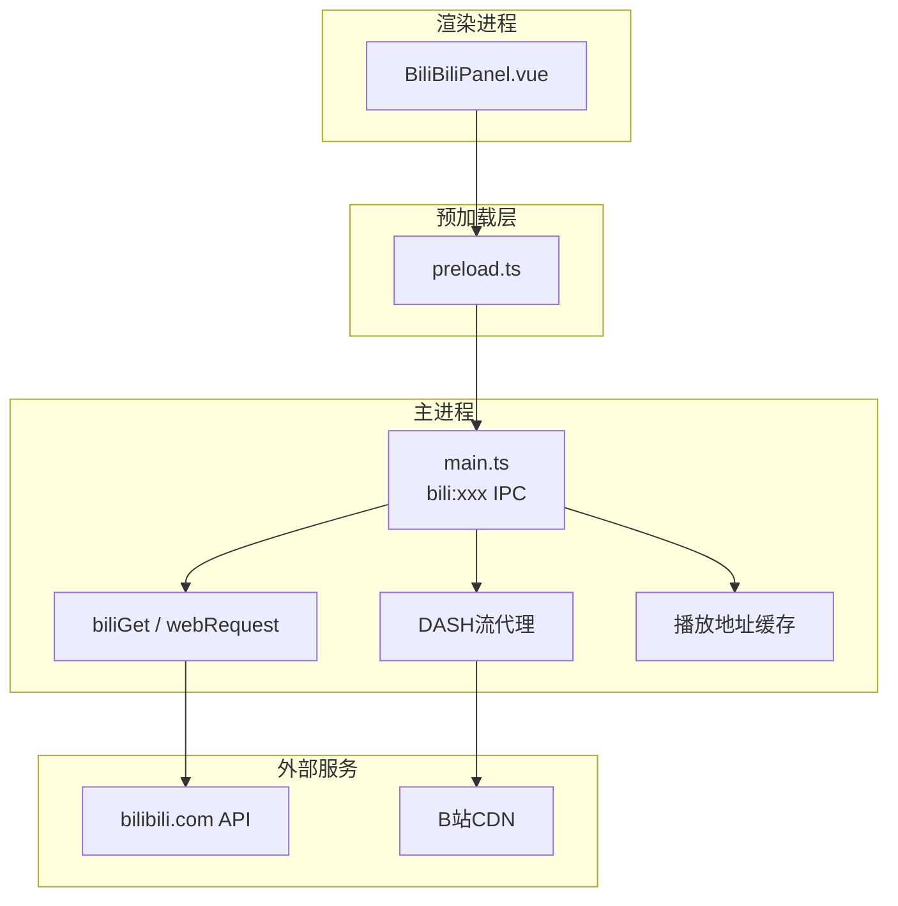
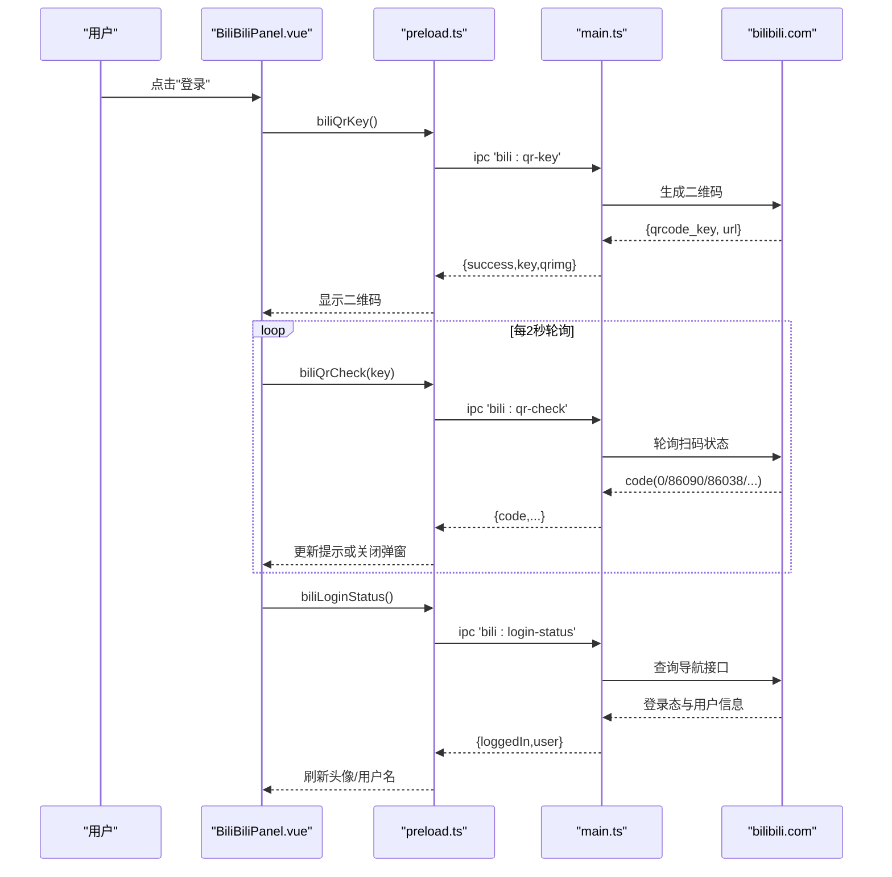
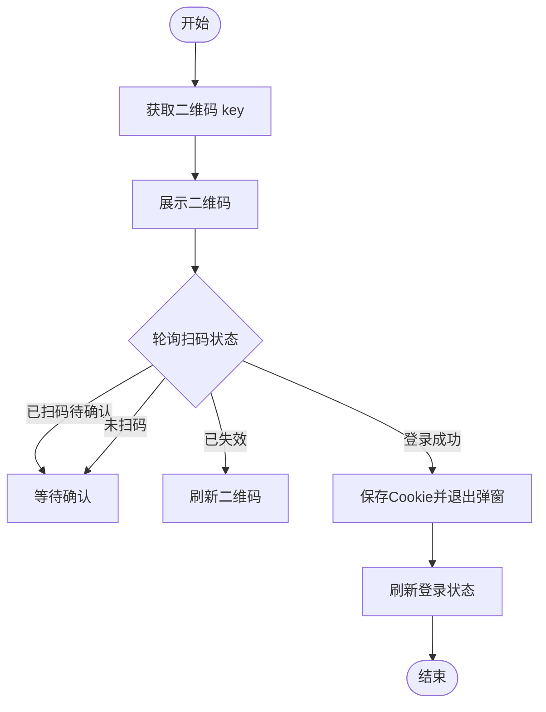
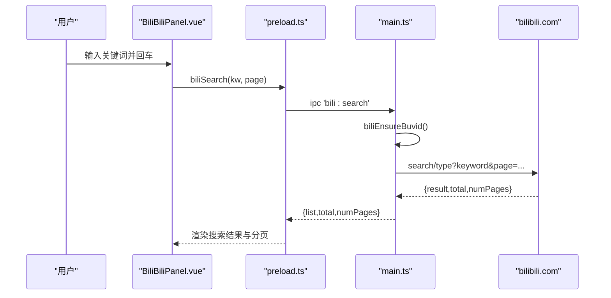
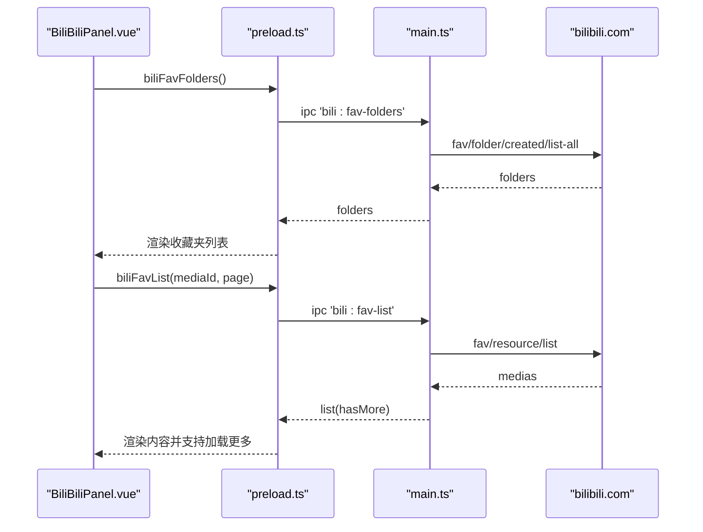
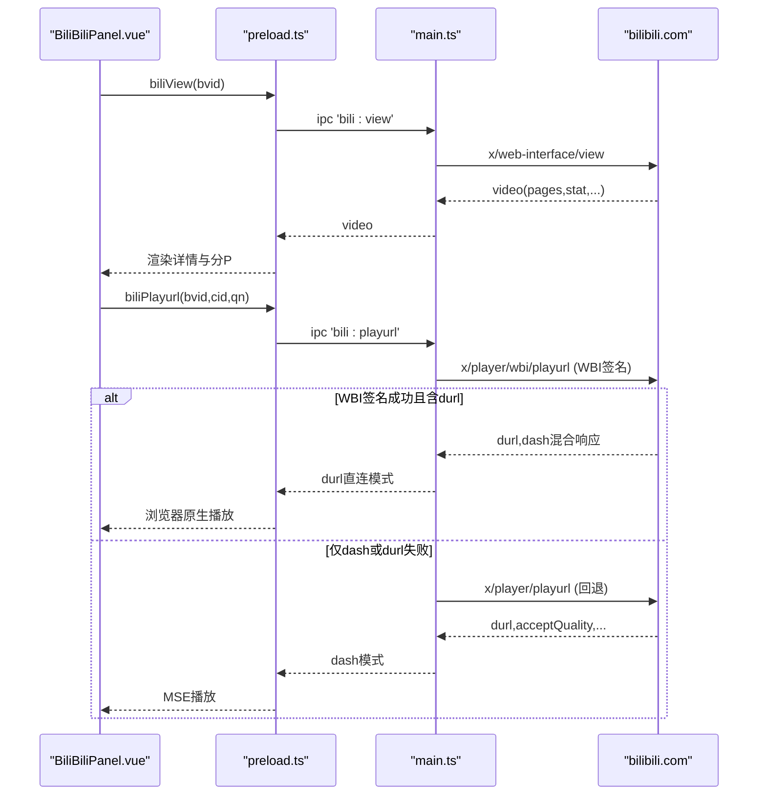
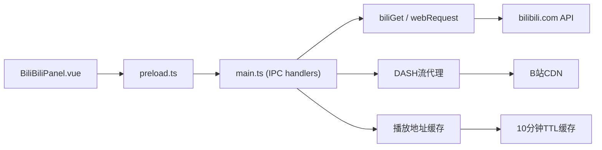

# 哔哩哔哩API集成

<cite>
**本文引用的文件**
- [BiliBiliPanel.vue](file://src/renderer/src/components/BiliBiliPanel.vue)
- [main.ts（主进程）](file://src/main/main.ts)
- [preload.ts（预加载脚本）](file://src/preload/preload.ts)
- [vite-env.d.ts（类型声明）](file://src/renderer/src/vite-env.d.ts)
</cite>

## 更新摘要
**变更内容**
- **v3.6.2重大改进**：增强了durl直连播放支持，当API返回fnval=4048响应同时包含durl和dash数据时优先使用durl直连
- **智能Codec验证**：通过临时MediaSource测试实现自动回退机制，当首选codec失败时自动降级到兼容性更好的编码格式
- **播放状态监控增强**：通过canplaythrough事件与readyState >= 3验证确保播放状态稳定
- **高清卡顿检测**：新增播放停滞检测机制，自动透明降清解决网络缓冲不足问题
- **观看进度续播**：实现分P观看进度保存与恢复，支持跨会话续播功能
- **播放地址缓存优化**：10分钟TTL的视频信息和播放地址缓存，显著提升二次起播速度

## 目录
1. [简介](#简介)
2. [项目结构](#项目结构)
3. [核心组件](#核心组件)
4. [架构总览](#架构总览)
5. [详细组件分析](#详细组件分析)
6. [依赖关系分析](#依赖关系分析)
7. [性能与并发](#性能与并发)
8. [故障排查指南](#故障排查指南)
9. [结论](#结论)

## 简介
本仓库在 Electron 应用中集成了哔哩哔哩 API，提供以下能力：
- 用户认证：二维码登录、Cookie 登录、登录状态检查、登出
- 视频搜索：关键词搜索、分页处理、结果展示
- 收藏夹管理：收藏夹列表获取、内容浏览、收藏操作
- 视频播放：视频详情获取、播放地址解析、分 P 切换、清晰度选择、相关推荐
- 热门推荐：无需登录的热门视频推荐
- 跨域与防盗链：通过主进程代理请求、注入 Referer/User-Agent 绕过防盗链
- 异常与重试：网络异常提示、播放器错误回退到备用 CDN、失败重试入口
- 限流与风控：自动补领 buvid Cookie、对 -412 等风控码友好提示

**v3.6.2版本重大增强**：实现了durl直连播放优先策略，智能Codec验证与自动回退机制，增强的播放状态监控，以及完整的观看进度续播功能，大幅提升了播放稳定性和用户体验。

## 项目结构
- 渲染层（Vue 组件）：BiliBiliPanel.vue 负责 UI 交互与业务编排
- 预加载层：preload.ts 暴露 IPC 方法给渲染层调用
- 主进程：main.ts 封装 biliGet/biliCookies/webRequest 等能力，统一访问 B 站 API 并处理跨域/防盗链

**图表来源**
- [BiliBiliPanel.vue:338-722](file://src/renderer/src/components/BiliBiliPanel.vue#L338-L722)
- [preload.ts:73-82](file://src/preload/preload.ts#L73-L82)
- [main.ts:2168-2183](file://src/main/main.ts#L2168-L2183)
- [main.ts:2230-2247](file://src/main/main.ts#L2230-L2247)

## 核心组件
- 用户认证流程：二维码生成与轮询、Cookie 粘贴验证、登录状态查询、登出清理
- 内容获取：热门推荐、相关视频、搜索、收藏夹列表与内容
- 播放链路：**v3.6.2增强**：durl直连优先 + DASH高清兜底、智能Codec验证、播放状态监控、观看进度续播
- 跨域与防盗链：主进程统一发起请求，webRequest 注入 Referer/User-Agent
- 异常与重试：前端错误提示、播放器错误切换备用 CDN、失败重试按钮
- **v3.6.2增强**：高清卡顿检测、自动透明降清、播放地址缓存优化

## 架构总览

**图表来源**
- [BiliBiliPanel.vue:393-440](file://src/renderer/src/components/BiliBiliPanel.vue#L393-L440)
- [preload.ts:73-82](file://src/preload/preload.ts#L73-L82)
- [main.ts:2251-2312](file://src/main/main.ts#L2251-L2312)

## 详细组件分析

### 用户认证流程（二维码登录、登录状态检查、登出）
- 二维码登录
  - 渲染层调用 biliQrKey 获取二维码图片与 key，启动定时器每 2 秒轮询 biliQrCheck
  - 主进程调用 B 站 passport 接口生成二维码与轮询状态；成功时从 URL 参数提取 SESSDATA 等关键 Cookie 并持久化
- 登录状态检查
  - 渲染层调用 biliLoginStatus，主进程调用 nav 接口判断 isLogin，返回用户信息
- 登出
  - 渲染层调用 biliLogout，主进程清空本地 biliCookies 并持久化

**图表来源**
- [BiliBiliPanel.vue:393-440](file://src/renderer/src/components/BiliBiliPanel.vue#L393-L440)
- [main.ts:2251-2290](file://src/main/main.ts#L2251-L2290)

**章节来源**
- [BiliBiliPanel.vue:357-468](file://src/renderer/src/components/BiliBiliPanel.vue#L357-L468)
- [main.ts:2251-2319](file://src/main/main.ts#L2251-L2319)

### 视频搜索功能（关键词搜索、分页、结果展示）
- 渲染层 doSearch 校验关键词后调用 biliSearch(keyword, page)，根据返回的 total/numPages 控制分页
- 主进程 search/type 接口需 buvid3/buvid4，缺失时自动通过 finger/spi 补领；遇到 -412 风控给出友好提示
- 搜索结果映射为统一视频卡片数据，支持点击播放

**图表来源**
- [BiliBiliPanel.vue:546-581](file://src/renderer/src/components/BiliBiliPanel.vue#L546-L581)
- [preload.ts:73-82](file://src/preload/preload.ts#L73-L82)
- [main.ts:2376-2391](file://src/main/main.ts#L2376-L2391)

**章节来源**
- [BiliBiliPanel.vue:546-581](file://src/renderer/src/components/BiliBiliPanel.vue#L546-L581)
- [main.ts:2153-2166](file://src/main/main.ts#L2153-L2166)
- [main.ts:2376-2391](file://src/main/main.ts#L2376-L2391)

### 收藏夹管理（列表获取、内容浏览、收藏操作）
- 收藏夹列表：需登录，主进程通过 created/list-all 获取当前用户创建的收藏夹
- 收藏夹内容：按 media_id 分页拉取，过滤失效资源（attr != 0/1），返回视频卡片
- 收藏操作：**v3.6.1更新**：使用正确的 `rid` 参数替代 `oid` 进行 favinfo 查询，确保取消收藏操作的准确性

**更新**：收藏夹管理功能已优化，favinfo查询接口现在使用官方标准的 `rid` 参数，解决了之前使用 `oid` 导致的查询失败问题。

**图表来源**
- [BiliBiliPanel.vue:494-544](file://src/renderer/src/components/BiliBiliPanel.vue#L494-L544)
- [preload.ts:73-82](file://src/preload/preload.ts#L73-L82)
- [main.ts:2395-2440](file://src/main/main.ts#L2395-L2440)

**章节来源**
- [BiliBiliPanel.vue:494-544](file://src/renderer/src/components/BiliBiliPanel.vue#L494-L544)
- [main.ts:2395-2440](file://src/main/main.ts#L2395-L2440)

### 视频播放（详情获取、播放地址解析、画质选择）
- 视频详情：调用 view 接口获取标题、封面、简介、分 P、统计数据等
- 播放地址：**v3.6.2重大改进**：优先使用 durl 直连播放（浏览器原生播放器接管），当 fnval=4048 响应同时包含 durl 和 dash 数据时自动选择最优方案
- 分 P 与清晰度：渲染层提供下拉切换，切换后重新 loadStream
- 多分段连播：onVideoEnded 自动切换到下一段
- 错误回退：onVideoError 优先尝试 backupUrl，否则提示切换清晰度或重试

**v3.6.2播放机制重构**：
- **durl直连优先**：直接赋值 video.src，享受浏览器内置缓冲/seek/续播能力，起播速度显著提升
- **智能Codec验证**：通过临时 MediaSource 测试验证编码格式支持性，自动回退到兼容性更好的编码
- **播放状态监控**：监听 canplaythrough 事件与 readyState >= 3 验证，确保播放状态稳定
- **高清卡顿检测**：实时监测播放停滞，自动透明降清解决网络缓冲不足问题
- **观看进度续播**：实现分P观看进度保存与恢复，支持跨会话续播功能

**图表来源**
- [BiliBiliPanel.vue:589-703](file://src/renderer/src/components/BiliBiliPanel.vue#L589-L703)
- [preload.ts:73-82](file://src/preload/preload.ts#L73-L82)
- [main.ts:2444-2499](file://src/main/main.ts#L2444-L2499)

**章节来源**
- [BiliBiliPanel.vue:589-703](file://src/renderer/src/components/BiliBiliPanel.vue#L589-L703)
- [main.ts:2444-2499](file://src/main/main.ts#L2444-L2499)

### DASH流播放与MIME类型处理（v3.5.6增强）
- **MIME类型标准化**：v3.5.6引入了mseMime函数，专门处理B站返回的mime_type格式，将`video/mp4; codecs=avc1.640033`转换为标准的`video/mp4; codecs="avc1.640033"`格式
- **轨道选择优化**：在MSE可解码的轨道中选择目标清晰度，避免选中不支持的编码格式
- **错误恢复机制**：当DASH流播放失败时，提供详细的错误信息和用户友好的提示
- **流代理增强**：主进程DASH流代理支持Range请求，提升大文件传输的稳定性

**v3.6.2Codec验证增强**：
- **智能编码选择**：优先选择 avc1（通用硬解支持好），其次 hevc（现代设备支持），最后 fallback 到其他编码
- **临时MediaSource测试**：通过实际创建 MediaSource 验证编码格式支持性，避免理论判断误差
- **自动回退机制**：当首选编码失败时自动降级到兼容性更好的编码格式

**章节来源**
- [BiliBiliPanel.vue:844-853](file://src/renderer/src/components/BiliBiliPanel.vue#L844-L853)
- [main.ts:2316-2398](file://src/main/main.ts#L2316-2398)

### 播放状态监控与高清卡顿检测（v3.6.2新增）
- **播放停滞检测**：轮询检测 currentTime 是否推进，累计 ≥6s 视为缓冲不足
- **透明降清机制**：检测到卡顿后自动降低一档清晰度，30秒防抖避免频繁调整
- **播放状态验证**：通过 canplaythrough 事件与 readyState >= 3 双重验证确保播放状态稳定
- **观看进度续播**：实现分P观看进度保存与恢复，支持跨会话续播功能

**章节来源**
- [BiliBiliPanel.vue:1630-1679](file://src/renderer/src/components/BiliBiliPanel.vue#L1630-L1679)
- [BiliBiliPanel.vue:1850-1954](file://src/renderer/src/components/BiliBiliPanel.vue#L1850-L1954)

### 热门推荐与相关视频推荐
- 热门推荐：无需登录，popular 接口返回视频列表，支持"换一批"随机页码
- 相关视频：播放页异步加载 archive/related，失败不影响播放

**章节来源**
- [BiliBiliPanel.vue:470-492](file://src/renderer/src/components/BiliBiliPanel.vue#L470-L492)
- [BiliBiliPanel.vue:610-631](file://src/renderer/src/components/BiliBiliPanel.vue#L610-L631)
- [main.ts:2352-2374](file://src/main/main.ts#L2352-L2374)

### 跨域请求与 CORS 配置方案
- 所有 B 站 API 请求由主进程统一发起，避免渲染进程跨域限制
- webRequest.onBeforeSendHeaders 为视频流域名注入 Referer 与 User-Agent，绕过防盗链
- 通用 biliGet 自动附加 UA/Referer/Origin/Cookie，并回收 Set-Cookie
- **v3.5.6增强**：改进了DASH流代理的CORS配置，确保跨域请求的稳定性

**章节来源**
- [main.ts:2168-2183](file://src/main/main.ts#L2168-L2183)
- [main.ts:2230-2247](file://src/main/main.ts#L2230-L2247)
- [main.ts:2322-2398](file://src/main/main.ts#L2322-2398)

### 网络异常处理、请求重试机制与用户体验优化
- 前端错误提示：ElMessage.error/warning/info 提示搜索/热门/收藏等失败原因
- 播放器错误回退：onVideoError 优先尝试备用 CDN；若仍失败则提示切换清晰度
- 重试入口：播放器错误区域提供"重试"按钮，触发 loadStream
- 风控提示：搜索 -412 时提示被风控拦截，建议稍后重试或先登录
- **v3.5.6增强**：改进了DASH流播放的错误处理，提供更准确的错误信息和恢复建议

**v3.6.2增强**：
- **高清卡顿自动处理**：检测到播放停滞时自动降清，避免用户手动干预
- **播放状态实时监控**：通过 canplaythrough 事件确保播放状态稳定
- **观看进度保护**：防止因 seek 失败导致的进度丢失和循环跳转

**章节来源**
- [BiliBiliPanel.vue:476-492](file://src/renderer/src/components/BiliBiliPanel.vue#L476-L492)
- [BiliBiliPanel.vue:556-581](file://src/renderer/src/components/BiliBiliPanel.vue#L556-L581)
- [BiliBiliPanel.vue:656-693](file://src/renderer/src/components/BiliBiliPanel.vue#L656-L693)
- [main.ts:2376-2391](file://src/main/main.ts#L2376-L2391)

### 第三方 API 限流与并发控制策略
- 当前实现未内置显式限流与队列控制
- 建议策略（供后续扩展参考）：
  - 基于令牌桶/漏桶对高频接口（如搜索、热门）进行限速
  - 使用 Promise 队列限制并发数，避免瞬时大量请求触发风控
  - 对 -412/-460 等风控码实施指数退避重试
  - 将相关推荐等弱依赖请求降级为低优先级任务

[本节为通用建议，不直接分析具体代码]

## 依赖关系分析

**图表来源**
- [BiliBiliPanel.vue:338-722](file://src/renderer/src/components/BiliBiliPanel.vue#L338-L722)
- [preload.ts:73-82](file://src/preload/preload.ts#L73-L82)
- [main.ts:2168-2183](file://src/main/main.ts#L2168-L2183)
- [main.ts:2230-2247](file://src/main/main.ts#L2230-L2247)

**章节来源**
- [vite-env.d.ts:205-241](file://src/renderer/src/vite-env.d.ts#L205-L241)
- [preload.ts:73-82](file://src/preload/preload.ts#L73-L82)

## 性能与并发
- 视频流：主进程注入 Referer/User-Agent，减少防盗链导致的重定向与失败
- 多分段 FLV：自动连播减少用户操作，提升观看体验
- 缓存与状态：Cookie 持久化减少重复登录成本；buvid 自动补领降低搜索失败率
- **v3.5.6增强**：DASH流播放性能优化，包括MIME类型缓存、轨道选择优化、流控机制改进
- **v3.6.1增强**：WBI签名播放URL减少了风控拦截，提升了播放成功率
- **v3.6.2重大优化**：
  - **durl直连优先**：浏览器原生播放器接管，起播速度显著提升
  - **播放地址缓存**：10分钟TTL缓存，二次起播免重复请求
  - **视频信息缓存**：5分钟TTL缓存，减少重复的网络请求
  - **智能Codec选择**：优先选择兼容性好的编码格式，减少播放失败
  - **高清卡顿检测**：自动透明降清，避免长时间卡顿影响用户体验

**v3.6.2性能优化亮点**：
- **播放停滞检测**：500ms轮询currentTime，累计≥6s触发降清
- **观看进度续播**：localStorage存储分P进度，支持跨会话恢复
- **缓冲水位自适应**：高清晰度使用更低缓冲水位（18/8），低清晰度保持流畅（30/12）
- **MSE配额管理**：主动清理历史缓冲区间，避免配额打满导致播放中断

建议优化：
- 对热门/搜索接口增加本地短时缓存，减少重复请求
- 对相关推荐采用懒加载与去重
- 对频繁切换清晰度/分 P 做防抖，避免短时间内多次请求

[本节为通用建议，不直接分析具体代码]

## 故障排查指南
- 二维码登录失败
  - 检查网络连通性与二维码服务可用性
  - 查看轮询返回码：86038 表示过期需刷新；86090 表示已扫码待确认
- 搜索被风控（-412）
  - 确保 buvid3/buvid4 存在；必要时先登录再搜索
  - 稍后重试或降低请求频率
- 播放失败
  - 优先尝试切换清晰度
  - 播放器会自动尝试备用 CDN；仍失败请检查网络与版权限制
  - **v3.5.6新增**：DASH流播放失败时检查MIME类型支持和编码格式兼容性
  - **v3.6.1新增**：WBI签名播放URL失败时会自动回退到旧接口，如遇问题可检查网络连接
  - **v3.6.2新增**：durl直连播放失败时自动回退到DASH模式，确保播放连续性
- 收藏夹无法加载
  - 确认已登录且拥有有效 Cookie
  - 检查是否处于非公开收藏夹
  - **v3.6.1修复**：收藏夹操作现在使用正确的 `rid` 参数，确保操作有效性
- **v3.5.6新增**：DASH流相关问题
  - 检查浏览器是否支持目标编码格式
  - 尝试降低清晰度或使用不同的浏览器
  - 查看控制台是否有MIME类型解析错误
- **v3.6.1新增**：投币功能问题
  - 投币功能已修复端点路径问题，从 `/web-interface/web/coin/add` 修正为 `/web-interface/coin/add`
  - 如遇投币失败，检查登录状态和网络连接
- **v3.6.2新增**：播放卡顿问题
  - 系统会自动检测播放停滞并降清，如需手动调整可在清晰度菜单中切换
  - 检查网络连接质量，高清视频需要稳定的带宽
  - 观看进度续播失败时，检查localStorage存储空间是否充足

**章节来源**
- [BiliBiliPanel.vue:393-440](file://src/renderer/src/components/BiliBiliPanel.vue#L393-L440)
- [BiliBiliPanel.vue:656-693](file://src/renderer/src/components/BiliBiliPanel.vue#L656-L693)
- [main.ts:2376-2391](file://src/main/main.ts#L2376-L2391)

## 结论
该集成通过主进程代理与 webRequest 注入，安全高效地对接了哔哩哔哩 API，实现了完整的认证、搜索、收藏、播放与推荐链路。前端提供了良好的错误提示与重试入口，后端具备 Cookie 管理与风控提示。

**v3.6.2版本重大改进**：
- **durl直连播放优先**：当API返回fnval=4048响应同时包含durl和dash数据时，优先使用durl直连播放，享受浏览器原生播放器的完整功能
- **智能Codec验证与自动回退**：通过临时MediaSource测试验证编码格式支持性，自动回退到兼容性更好的编码格式
- **增强的播放状态监控**：通过canplaythrough事件与readyState >= 3验证确保播放状态稳定
- **高清卡顿检测与透明降清**：实时监测播放停滞，自动降低一档清晰度解决网络缓冲不足问题
- **完整的观看进度续播**：实现分P观看进度保存与恢复，支持跨会话续播功能
- **播放地址缓存优化**：10分钟TTL的视频信息和播放地址缓存，显著提升二次起播速度

**v3.6.1版本的重要改进**：
- 迁移到WBI签名的播放URL接口 `/x/player/wbi/playurl`，显著提升播放稳定性和防风控能力
- 修复了投币功能的端点路径问题，从错误的 `/web-interface/web/coin/add` 修正为正确的 `/web-interface/coin/add`
- 优化了收藏夹管理功能，使用官方标准的 `rid` 参数替代 `oid`，确保收藏操作的准确性
- 增强了DASH流的MIME类型处理能力，支持更准确的编码格式识别
- 改进了视频播放器错误处理机制，提供更友好的用户提示
- 优化了DASH流代理的错误恢复和重试逻辑
- 提升了高清晰度视频播放的稳定性和兼容性

后续可在限流、并发控制与缓存方面进一步增强鲁棒性与性能。