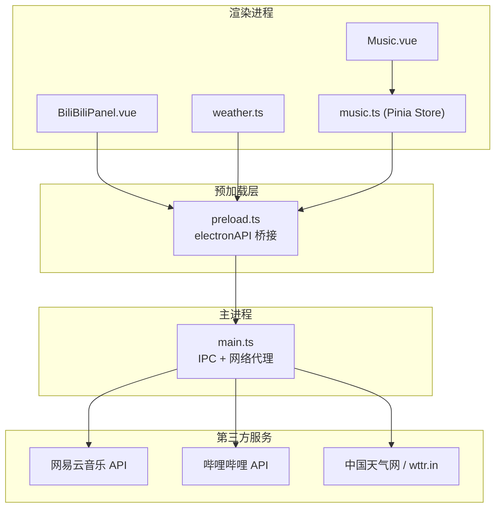
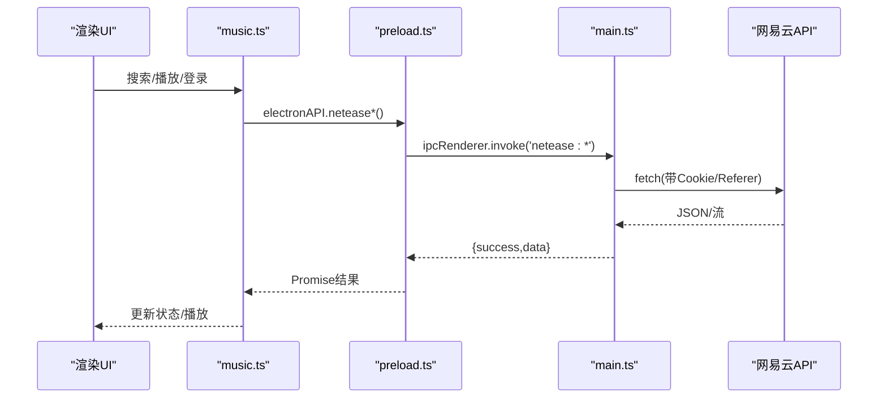
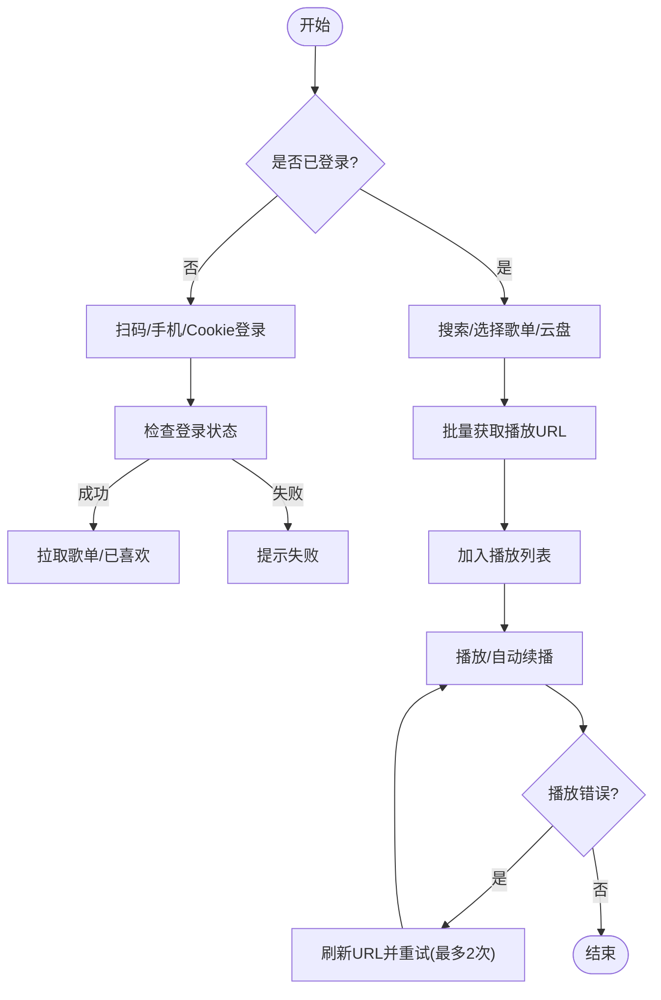
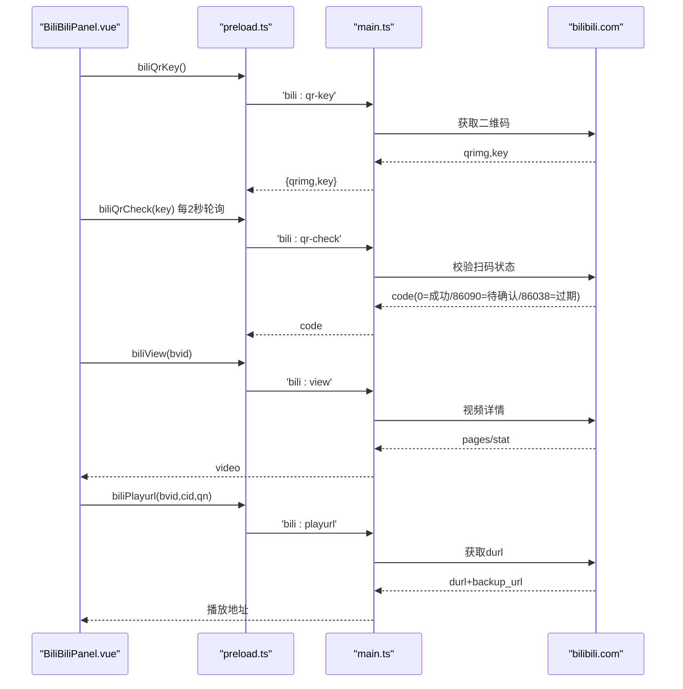
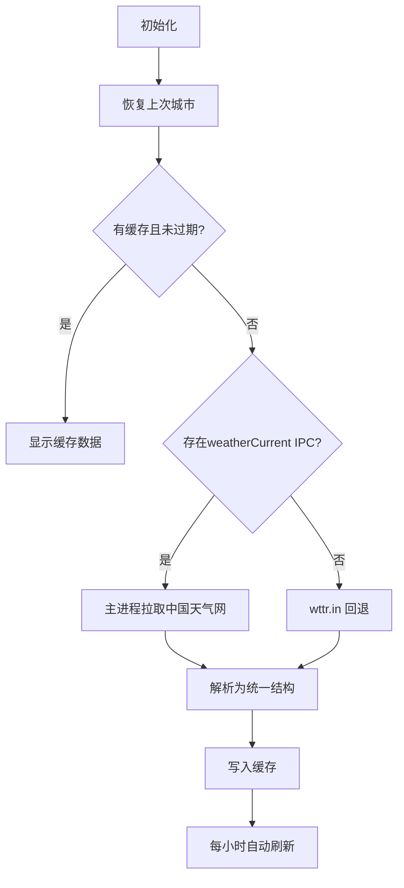
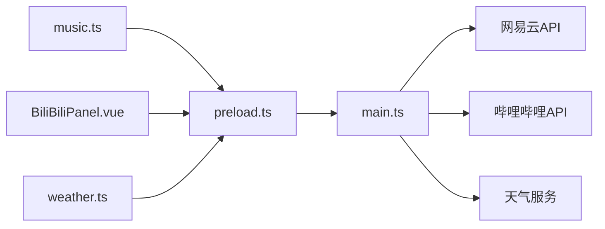

# 外部API集成

<cite>
**本文引用的文件**
- [src/renderer/src/stores/music.ts](file://src/renderer/src/stores/music.ts)
- [src/renderer/src/components/BiliBiliPanel.vue](file://src/renderer/src/components/BiliBiliPanel.vue)
- [src/renderer/src/utils/weather.ts](file://src/renderer/src/utils/weather.ts)
- [src/preload/preload.ts](file://src/preload/preload.ts)
- [src/main/main.ts](file://src/main/main.ts)
- [src/renderer/src/views/Music.vue](file://src/renderer/src/views/Music.vue)
- [src/renderer/src/views/Login.vue](file://src/renderer/src/views/Login.vue)
- [src/renderer/src/stores/user.ts](file://src/renderer/src/stores/user.ts)
</cite>

## 目录
1. [简介](#简介)
2. [项目结构](#项目结构)
3. [核心组件](#核心组件)
4. [架构总览](#架构总览)
5. [详细组件分析](#详细组件分析)
6. [依赖关系分析](#依赖关系分析)
7. [性能与限流](#性能与限流)
8. [错误处理与重试](#错误处理与重试)
9. [安全与密钥管理](#安全与密钥管理)
10. [跨域与CORS](#跨域与cors)
11. [故障排查指南](#故障排查指南)
12. [结论](#结论)

## 简介
本文件面向“考研助手”应用的外部 API 集成，覆盖网易云音乐、哔哩哔哩与天气服务三大第三方能力。文档从系统架构、数据流、错误处理、重试机制、限流策略、安全存储与跨域配置等维度进行系统化说明，帮助开发者快速理解并维护现有实现，同时为后续扩展提供指导。

## 项目结构
本项目采用 Electron 架构：渲染进程通过 preload 暴露的 electronAPI 调用主进程 IPC；主进程负责网络请求、Cookie/会话管理、协议代理与本地资源访问。前端状态由 Pinia store 管理，UI 使用 Vue 组件。

**图表来源**
- [src/preload/preload.ts:3-97](file://src/preload/preload.ts#L3-L97)
- [src/main/main.ts:1474-1509](file://src/main/main.ts#L1474-L1509)
- [src/main/main.ts:2292-2503](file://src/main/main.ts#L2292-L2503)

**章节来源**
- [src/preload/preload.ts:3-97](file://src/preload/preload.ts#L3-L97)
- [src/main/main.ts:1474-1509](file://src/main/main.ts#L1474-L1509)
- [src/main/main.ts:2292-2503](file://src/main/main.ts#L2292-L2503)

## 核心组件
- 网易云音乐集成（搜索、播放、歌词、登录、歌单、评论、排行榜、云盘）
- 哔哩哔哩集成（扫码/Cookie 登录、热门推荐、收藏夹、搜索、视频详情与播放）
- 天气服务集成（国内城市编码查询、实况获取、缓存与自动刷新）

**章节来源**
- [src/renderer/src/stores/music.ts:433-800](file://src/renderer/src/stores/music.ts#L433-L800)
- [src/renderer/src/components/BiliBiliPanel.vue:338-722](file://src/renderer/src/components/BiliBiliPanel.vue#L338-L722)
- [src/renderer/src/utils/weather.ts:98-195](file://src/renderer/src/utils/weather.ts#L98-L195)

## 架构总览
渲染进程通过 Pinia store 或组件直接调用 window.electronAPI；preload 将 IPC 通道映射到浏览器上下文；主进程统一封装对第三方的 HTTP 请求、Cookie 管理与响应解析，并将结果返回给渲染端。

**图表来源**
- [src/renderer/src/stores/music.ts:435-483](file://src/renderer/src/stores/music.ts#L435-L483)
- [src/preload/preload.ts:39-69](file://src/preload/preload.ts#L39-L69)
- [src/main/main.ts:1269-1309](file://src/main/main.ts#L1269-L1309)

## 详细组件分析

### 网易云音乐集成
- 用户认证
  - 支持扫码登录、手机号登录、Cookie 粘贴登录；登录后拉取用户信息、歌单列表与已喜欢歌曲。
  - 登录态检查、退出登录均通过主进程 IPC 完成。
- 音乐搜索与播放
  - 在线搜索返回歌曲元数据；点击播放时批量获取播放URL（按音质等级），加入播放列表并立即播放。
  - 播放过程中若 URL 过期，自动刷新并重试一次。
- 歌词与评论
  - 在线曲目走网易云歌词接口；本地曲目读取同目录 .lrc。
  - 支持热门评论与评论点赞。
- 歌单与云盘
  - 拉取用户歌单与详情，支持“播放全部/添加到队列”。
  - 云盘歌曲分页加载，支持批量获取播放地址。
- 热搜与排行榜
  - 热搜列表展示；排行榜列表与详情可进入后播放。

**图表来源**
- [src/renderer/src/stores/music.ts:102-138](file://src/renderer/src/stores/music.ts#L102-L138)
- [src/renderer/src/stores/music.ts:435-506](file://src/renderer/src/stores/music.ts#L435-L506)
- [src/renderer/src/stores/music.ts:546-700](file://src/renderer/src/stores/music.ts#L546-L700)
- [src/renderer/src/stores/music.ts:707-776](file://src/renderer/src/stores/music.ts#L707-L776)

**章节来源**
- [src/renderer/src/stores/music.ts:433-800](file://src/renderer/src/stores/music.ts#L433-L800)
- [src/renderer/src/views/Music.vue:668-800](file://src/renderer/src/views/Music.vue#L668-L800)
- [src/preload/preload.ts:39-69](file://src/preload/preload.ts#L39-L69)
- [src/main/main.ts:1474-1509](file://src/main/main.ts#L1474-L1509)

### 哔哩哔哩集成
- 登录状态维护
  - 扫码登录：获取二维码图片，轮询确认登录；Cookie 登录：解析粘贴的 Cookie 字符串并验证登录态。
  - 退出登录：清空本地 Cookie 存储。
- 内容浏览
  - 热门推荐：无需登录，分页加载；收藏夹：需登录，分文件夹与分页；搜索：关键词分页。
- 视频播放
  - 视频详情：获取分P、作者、统计数据。
  - 播放流：根据清晰度获取 durl，支持多分段自动连播；出错时优先切换备用 CDN。

**图表来源**
- [src/renderer/src/components/BiliBiliPanel.vue:393-468](file://src/renderer/src/components/BiliBiliPanel.vue#L393-L468)
- [src/renderer/src/components/BiliBiliPanel.vue:610-693](file://src/renderer/src/components/BiliBiliPanel.vue#L610-L693)
- [src/preload/preload.ts:70-82](file://src/preload/preload.ts#L70-L82)
- [src/main/main.ts:2292-2503](file://src/main/main.ts#L2292-L2503)

**章节来源**
- [src/renderer/src/components/BiliBiliPanel.vue:338-722](file://src/renderer/src/components/BiliBiliPanel.vue#L338-L722)
- [src/preload/preload.ts:70-82](file://src/preload/preload.ts#L70-L82)
- [src/main/main.ts:2292-2503](file://src/main/main.ts#L2292-L2503)

### 天气服务集成
- 数据源
  - 首选国内源：通过主进程 IPC 获取中国天气网数据；无 IPC 时回退至 wttr.in。
- 缓存与刷新
  - 本地缓存 30 分钟；支持设置城市、名称搜索城市；每小时自动刷新。
- 数据结构
  - 统一输出温度、体感、湿度、风力、图标、观测时间、最高/最低温等字段。

**图表来源**
- [src/renderer/src/utils/weather.ts:98-195](file://src/renderer/src/utils/weather.ts#L98-L195)
- [src/preload/preload.ts:83-85](file://src/preload/preload.ts#L83-L85)

**章节来源**
- [src/renderer/src/utils/weather.ts:98-195](file://src/renderer/src/utils/weather.ts#L98-L195)
- [src/preload/preload.ts:83-85](file://src/preload/preload.ts#L83-L85)

## 依赖关系分析
- 渲染层依赖
  - music.ts 依赖 preload 暴露的 netease* 方法；BiliBiliPanel.vue 依赖 bili* 方法；weather.ts 依赖 weather* 方法。
- 主进程职责
  - 统一封装第三方 API 请求、Cookie 管理、响应解析与错误转换；提供 IPC 通道供渲染进程调用。
- 外部依赖
  - 网易云音乐 API、哔哩哔哩 API、中国天气网/wttr.in。

**图表来源**
- [src/preload/preload.ts:3-97](file://src/preload/preload.ts#L3-L97)
- [src/main/main.ts:1269-1309](file://src/main/main.ts#L1269-L1309)
- [src/main/main.ts:2292-2503](file://src/main/main.ts#L2292-L2503)

**章节来源**
- [src/preload/preload.ts:3-97](file://src/preload/preload.ts#L3-L97)
- [src/main/main.ts:1269-1309](file://src/main/main.ts#L1269-L1309)
- [src/main/main.ts:2292-2503](file://src/main/main.ts#L2292-L2503)

## 性能与限流
- 批量请求与分批渲染
  - 网易云播放URL批量获取（每次最多20首）；云盘与播放队列长列表采用分页渲染（默认60条，点击加载更多）。
- 缓存优化
  - 天气数据本地缓存30分钟；避免频繁请求。
- 播放体验
  - 在线音频URL过期自动刷新并重试；B站视频出错优先切换备用CDN；多分段自动连播。
- 建议
  - 对高频搜索/热门接口增加客户端侧节流（如防抖）；对大列表继续采用虚拟滚动或分页加载。

[本节为通用性能建议，不直接分析具体文件]

## 错误处理与重试
- 网易云音乐
  - 播放错误监听：在线歌曲URL失效时自动刷新并重试（最多2次）；失败则停止播放。
  - 登录/歌单/评论等调用在 store 中捕获异常并降级为空数据或提示。
- 哔哩哔哩
  - 登录轮询：二维码有效期内每2秒轮询，处理“待确认/过期”等状态码。
  - 播放错误：优先尝试备用CDN；仍失败则提示用户切换清晰度或重试。
- 天气服务
  - 主进程失败静默保留旧数据；浏览器环境回退至 wttr.in。

**章节来源**
- [src/renderer/src/stores/music.ts:102-138](file://src/renderer/src/stores/music.ts#L102-L138)
- [src/renderer/src/components/BiliBiliPanel.vue:682-693](file://src/renderer/src/components/BiliBiliPanel.vue#L682-L693)
- [src/renderer/src/utils/weather.ts:108-126](file://src/renderer/src/utils/weather.ts#L108-L126)

## 安全与密钥管理
- 凭证存储
  - 网易云与哔哩哔哩的 Cookie 在主进程中以内存 Map 存储，并在必要时持久化到本地文件（保存/清理逻辑在主进程实现）。
  - 应用自身账号密码经简单哈希后存储在本地存储层（非明文）。
- 敏感操作
  - 登录态检查、退出登录、Cookie 设置均在主进程完成，避免泄露到渲染进程。
- 建议
  - 对 Cookie 文件加密存储；限制访问权限；定期清理过期凭证；对敏感日志脱敏。

**章节来源**
- [src/main/main.ts:2131-2151](file://src/main/main.ts#L2131-L2151)
- [src/main/main.ts:2321-2348](file://src/main/main.ts#L2321-L2348)
- [src/renderer/src/stores/user.ts:325-424](file://src/renderer/src/stores/user.ts#L325-L424)

## 跨域与CORS
- 架构优势
  - 所有第三方 API 请求均由主进程发起，渲染进程仅与主进程通信，天然规避浏览器跨域限制。
- 协议与代理
  - 主进程提供自定义协议（如 kaoyan-assets://）与 HTTP 服务用于本地资源访问；播放器通过主进程 webRequest 注入 Referer 绕过防盗链。
- 建议
  - 保持主进程集中网络访问；如需在浏览器环境运行，应引入后端代理统一转发。

**章节来源**
- [src/main/main.ts:451-495](file://src/main/main.ts#L451-L495)
- [src/main/main.ts:2473-2499](file://src/main/main.ts#L2473-L2499)

## 故障排查指南
- 网易云登录失败
  - 检查 Cookie 是否包含必要键值；确认扫码流程是否超时；查看主进程返回的错误消息。
- 在线歌曲无法播放
  - 观察是否触发URL刷新重试；确认音质等级是否受限；检查网络连通性。
- B站视频无法播放
  - 尝试切换清晰度；确认是否登录以获得更高清晰度；查看备用CDN是否可用。
- 天气数据不更新
  - 检查缓存是否命中；确认主进程 IPC 是否可用；查看回退源是否可达。

**章节来源**
- [src/renderer/src/stores/music.ts:546-673](file://src/renderer/src/stores/music.ts#L546-L673)
- [src/renderer/src/components/BiliBiliPanel.vue:393-468](file://src/renderer/src/components/BiliBiliPanel.vue#L393-L468)
- [src/renderer/src/utils/weather.ts:108-195](file://src/renderer/src/utils/weather.ts#L108-L195)

## 结论
本项目通过主进程集中管理第三方 API 调用，实现了网易云音乐、哔哩哔哩与天气服务的稳定集成。借助缓存、重试、备用CDN与分批渲染等策略，保障了用户体验与性能。后续可在凭证加密、限流与监控方面进一步增强安全性与可观测性。