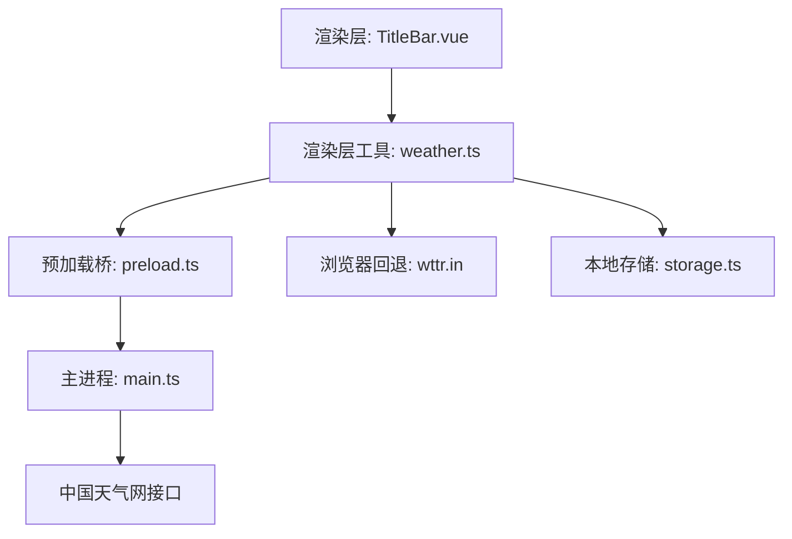
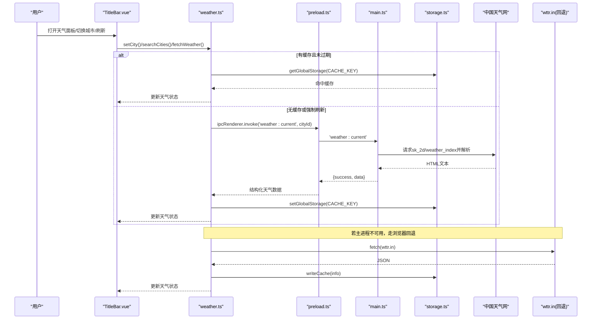
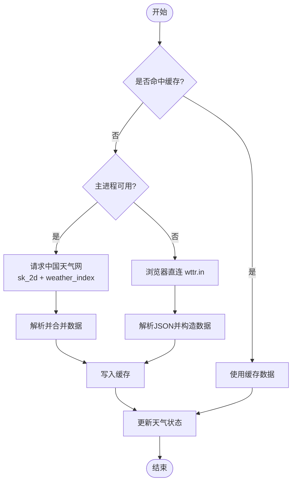
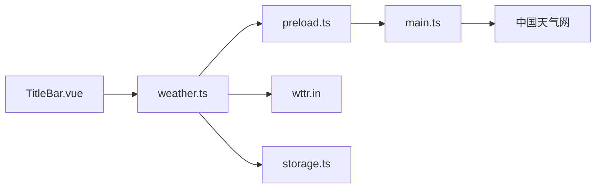

# 天气服务集成

<cite>
**本文引用的文件**
- [weather.ts](file://src/renderer/src/utils/weather.ts)
- [storage.ts](file://src/renderer/src/utils/storage.ts)
- [preload.ts](file://src/preload/preload.ts)
- [main.ts](file://src/main/main.ts)
- [TitleBar.vue](file://src/renderer/src/components/TitleBar.vue)
</cite>

## 目录
1. [简介](#简介)
2. [项目结构](#项目结构)
3. [核心组件](#核心组件)
4. [架构总览](#架构总览)
5. [详细组件分析](#详细组件分析)
6. [依赖关系分析](#依赖关系分析)
7. [性能与缓存](#性能与缓存)
8. [故障排查指南](#故障排查指南)
9. [结论](#结论)
10. [附录](#附录)

## 简介
本文件面向“天气服务集成”的完整实现，覆盖以下目标：
- 天气数据获取流程：城市ID查询、当前天气信息获取
- 城市搜索功能：支持用户输入城市名称查找对应城市ID
- 缓存机制与本地存储策略：30分钟TTL缓存、持久化已选城市
- 天气信息格式化显示：温度、湿度、风力、体感温度、观测时间、最高/最低温
- 网络请求错误处理与降级方案：主进程国内源失败回退到浏览器直连第三方接口
- 多城市切换与数据更新：预设城市、自定义搜索、自动刷新
- 天气图标映射与界面适配：中国天气网编码到Emoji映射；标题栏天气面板展示
- 地理位置自动检测与时区处理：当前实现以用户选择城市为准，未启用自动定位；时区由上游天气源返回的时间字段体现

## 项目结构
天气能力由渲染层（Vue）、预加载桥接（Electron IPC）和主进程（Node.js）三部分协作完成：
- 渲染层：暴露状态、UI交互、调用IPC或浏览器API
- 预加载层：将主进程能力暴露给渲染层
- 主进程：封装对国内天气源的HTTP请求、解析HTML响应并返回结构化数据

图表来源
- [TitleBar.vue:149-229](file://src/renderer/src/components/TitleBar.vue#L149-L229)
- [weather.ts:1-195](file://src/renderer/src/utils/weather.ts#L1-L195)
- [preload.ts:83-85](file://src/preload/preload.ts#L83-L85)
- [main.ts:2532-2591](file://src/main/main.ts#L2532-L2591)
- [storage.ts:252-274](file://src/renderer/src/utils/storage.ts#L252-L274)

章节来源
- [TitleBar.vue:149-229](file://src/renderer/src/components/TitleBar.vue#L149-L229)
- [weather.ts:1-195](file://src/renderer/src/utils/weather.ts#L1-L195)
- [preload.ts:83-85](file://src/preload/preload.ts#L83-L85)
- [main.ts:2532-2591](file://src/main/main.ts#L2532-L2591)
- [storage.ts:252-274](file://src/renderer/src/utils/storage.ts#L252-L274)

## 核心组件
- 天气数据模型与状态
  - 统一数据结构包含温度、天气现象、图标、湿度、风力、城市、体感温度、观测时间、最高/最低温等
  - 全局响应式状态用于驱动UI更新
- 城市管理
  - 默认北京，提供常用城市快捷选择
  - 支持按名称搜索中国天气网城市，返回id、name、province
- 数据获取与缓存
  - 优先读取本地缓存（30分钟TTL），命中则直接展示
  - 无缓存或强制刷新时通过IPC调用主进程拉取国内源
  - 主进程不可用时回退到浏览器直连wttr.in
- 本地存储
  - 已选城市与缓存均持久化到localStorage，应用重启可恢复
  - 容量不足时自动清理旧数据，保证写入不阻塞
- 界面展示
  - 标题栏天气卡片与详情面板，展示温度、现象、湿度、风速、今日气温范围
  - 支持点击切换城市、搜索城市、手动刷新

章节来源
- [weather.ts:4-51](file://src/renderer/src/utils/weather.ts#L4-L51)
- [weather.ts:71-96](file://src/renderer/src/utils/weather.ts#L71-L96)
- [weather.ts:98-176](file://src/renderer/src/utils/weather.ts#L98-L176)
- [storage.ts:252-274](file://src/renderer/src/utils/storage.ts#L252-L274)
- [TitleBar.vue:177-229](file://src/renderer/src/components/TitleBar.vue#L177-L229)

## 架构总览
天气服务采用“渲染层 + 预加载桥 + 主进程”的分层架构，结合本地缓存与浏览器回退，确保在多种运行环境下均可用。

图表来源
- [weather.ts:98-176](file://src/renderer/src/utils/weather.ts#L98-L176)
- [preload.ts:83-85](file://src/preload/preload.ts#L83-L85)
- [main.ts:2532-2591](file://src/main/main.ts#L2532-L2591)
- [storage.ts:252-274](file://src/renderer/src/utils/storage.ts#L252-L274)

## 详细组件分析

### 天气数据获取流程（城市ID查询与当前天气）
- 城市ID查询
  - 渲染层调用 searchCities(name)，经预加载桥转发至主进程的 'weather:search'
  - 主进程请求 toy1.weather.com.cn/search?cityname=...，解析返回数组，提取 id、name、province，最多返回10条
- 当前天气获取
  - 渲染层调用 fetchWeather(opts?)，优先读缓存；若无缓存或 opts.force=true，则通过 IPC 调用 'weather:current'
  - 主进程并行请求 sk_2d（实况）与 weather_index（今日预报），合并后返回结构化数据
  - 渲染层解析为统一 WeatherInfo，写入缓存并更新状态

图表来源
- [weather.ts:98-176](file://src/renderer/src/utils/weather.ts#L98-L176)
- [main.ts:2532-2591](file://src/main/main.ts#L2532-L2591)

章节来源
- [weather.ts:98-176](file://src/renderer/src/utils/weather.ts#L98-L176)
- [main.ts:2532-2591](file://src/main/main.ts#L2532-L2591)

### 城市搜索功能的实现
- 输入城市名后，调用 searchCities(name)
- 预加载桥转发到主进程 'weather:search'
- 主进程对 toy1.weather.com.cn 发起检索请求，解析出 id、name、province 列表
- 渲染层展示搜索结果，用户点击后调用 setCity({id,name}) 切换城市并强制刷新天气

章节来源
- [weather.ts:166-176](file://src/renderer/src/utils/weather.ts#L166-L176)
- [preload.ts:83-85](file://src/preload/preload.ts#L83-L85)
- [main.ts:2569-2591](file://src/main/main.ts#L2569-L2591)
- [TitleBar.vue:202-221](file://src/renderer/src/components/TitleBar.vue#L202-L221)

### 天气数据的缓存机制与本地存储策略
- 缓存键与TTL
  - 缓存键：kaoyan_weather_cache_v2
  - TTL：30分钟
  - 仅当缓存中的城市ID与当前选中城市一致时才视为有效
- 持久化
  - 已选城市键：kaoyan_weather_city_v2，应用启动时恢复
  - 读写通过 storage.ts 的全局存储API，底层基于localStorage，具备容量不足时的自动清理策略
- 初始化流程
  - initWeather() 恢复已选城市、读取缓存、后台刷新，并设置每小时自动刷新定时器

章节来源
- [weather.ts:23-31](file://src/renderer/src/utils/weather.ts#L23-L31)
- [weather.ts:71-81](file://src/renderer/src/utils/weather.ts#L71-L81)
- [weather.ts:178-195](file://src/renderer/src/utils/weather.ts#L178-L195)
- [storage.ts:252-274](file://src/renderer/src/utils/storage.ts#L252-L274)
- [storage.ts:93-109](file://src/renderer/src/utils/storage.ts#L93-L109)

### 天气信息的格式化显示
- 温度：当前温度 tempC、体感温度 feelsLikeC（部分源可能为空）、今日最高/最低温 tempMax/tempMin
- 现象与图标：condition 描述 + icon 表情符号
- 湿度：humidity（百分比）
- 风力：wind（km/h）
- 观测时间：obsTime
- 展示位置：标题栏天气卡片与详情面板，网格布局展示湿度、风速、今日气温范围

章节来源
- [weather.ts:4-15](file://src/renderer/src/utils/weather.ts#L4-L15)
- [weather.ts:83-96](file://src/renderer/src/utils/weather.ts#L83-L96)
- [TitleBar.vue:177-190](file://src/renderer/src/components/TitleBar.vue#L177-L190)

### 网络请求的错误处理与降级方案
- 主进程侧
  - 若国内源请求失败或解析失败，返回 success=false，渲染层保留上次成功展示，不清空
- 浏览器回退
  - 当主进程不可用时，渲染层直接调用 wttr.in，解析JSON并构造相同的数据结构
- 异常捕获
  - 渲染层与主进程均进行try/catch，避免崩溃；搜索失败返回空数组

章节来源
- [weather.ts:98-157](file://src/renderer/src/utils/weather.ts#L98-L157)
- [main.ts:2532-2591](file://src/main/main.ts#L2532-L2591)

### 多城市切换与数据更新机制
- 预设城市：内置常用城市列表，点击即切换
- 自定义搜索：输入城市名，从搜索结果中选择
- 切换逻辑：setCity(city) 更新当前城市、持久化、并强制刷新天气
- 自动刷新：initWeather() 启动后每小时自动刷新一次（幂等，重复初始化不会叠加定时器）

章节来源
- [weather.ts:32-51](file://src/renderer/src/utils/weather.ts#L32-L51)
- [weather.ts:159-164](file://src/renderer/src/utils/weather.ts#L159-L164)
- [weather.ts:178-195](file://src/renderer/src/utils/weather.ts#L178-L195)
- [TitleBar.vue:191-221](file://src/renderer/src/components/TitleBar.vue#L191-L221)

### 天气图标映射与界面适配方案
- 图标映射
  - 中国天气网天气编码转换为Emoji：晴天、多云、阴、雨、雪、雾/霾等
  - 回退源根据中文描述关键字匹配图标
- 界面适配
  - 标题栏天气区域紧凑展示温度与现象
  - 详情面板网格布局展示湿度、风速、今日气温范围
  - 支持深色主题变量与圆角玻璃风格

章节来源
- [weather.ts:53-69](file://src/renderer/src/utils/weather.ts#L53-L69)
- [weather.ts:128-157](file://src/renderer/src/utils/weather.ts#L128-L157)
- [TitleBar.vue:749-839](file://src/renderer/src/components/TitleBar.vue#L749-L839)

### 地理位置自动检测与时区处理逻辑
- 地理位置自动检测
  - 当前实现未启用自动定位，所有天气数据基于用户选择的“城市ID”
- 时区处理
  - 观测时间 obsTime 由上游天气源返回，渲染层直接展示，不做本地时区转换
  - 如需本地时区显示，可在渲染层基于系统时区对时间进行格式化

章节来源
- [weather.ts:11-15](file://src/renderer/src/utils/weather.ts#L11-L15)
- [weather.ts:83-96](file://src/renderer/src/utils/weather.ts#L83-L96)

## 依赖关系分析
- 渲染层依赖
  - Vue响应式状态驱动UI更新
  - 预加载桥暴露IPC方法
  - 本地存储工具负责缓存与持久化
- 主进程依赖
  - HTTP请求与HTML解析，合并实况与预报数据
  - 城市搜索接口解析
- 外部依赖
  - 中国天气网接口（sk_2d、weather_index、toy1.search）
  - 浏览器回退源 wttr.in

图表来源
- [TitleBar.vue:149-229](file://src/renderer/src/components/TitleBar.vue#L149-L229)
- [weather.ts:1-195](file://src/renderer/src/utils/weather.ts#L1-L195)
- [preload.ts:83-85](file://src/preload/preload.ts#L83-L85)
- [main.ts:2532-2591](file://src/main/main.ts#L2532-L2591)
- [storage.ts:252-274](file://src/renderer/src/utils/storage.ts#L252-L274)

章节来源
- [weather.ts:1-195](file://src/renderer/src/utils/weather.ts#L1-L195)
- [preload.ts:83-85](file://src/preload/preload.ts#L83-L85)
- [main.ts:2532-2591](file://src/main/main.ts#L2532-L2591)
- [storage.ts:252-274](file://src/renderer/src/utils/storage.ts#L252-L274)

## 性能与缓存
- 缓存命中率优化
  - 30分钟TTL减少频繁网络请求
  - 城市维度隔离缓存，避免跨城市污染
- 并发请求
  - 主进程并行请求实况与预报，降低整体延迟
- 自动刷新
  - 每小时刷新一次，避免长时间数据陈旧
- 存储容量保护
  - localStorage写失败时自动清理旧数据，保障写入不阻塞

章节来源
- [weather.ts:28-31](file://src/renderer/src/utils/weather.ts#L28-L31)
- [weather.ts:178-195](file://src/renderer/src/utils/weather.ts#L178-L195)
- [main.ts:2532-2541](file://src/main/main.ts#L2532-L2541)
- [storage.ts:93-109](file://src/renderer/src/utils/storage.ts#L93-L109)

## 故障排查指南
- 天气不更新
  - 检查是否命中缓存且未过期；尝试手动刷新
  - 确认主进程IPC可用；若不可用，确认浏览器回退是否生效
- 城市搜索无结果
  - 检查网络连通性；确认搜索词是否正确
  - 查看主进程返回的 results 是否为空
- 显示异常
  - 检查天气数据字段是否齐全（tempC、condition、icon、humidity、wind）
  - 确认图标映射逻辑是否匹配上游编码
- 存储问题
  - localStorage容量不足时会自动清理旧数据；如仍失败，检查浏览器限制
  - 应用重启后城市与缓存应恢复；如未恢复，检查初始化流程

章节来源
- [weather.ts:98-176](file://src/renderer/src/utils/weather.ts#L98-L176)
- [main.ts:2532-2591](file://src/main/main.ts#L2532-L2591)
- [storage.ts:50-65](file://src/renderer/src/utils/storage.ts#L50-L65)

## 结论
该天气服务集成通过分层架构实现了稳定可靠的数据获取与展示：
- 渲染层负责状态管理与UI交互
- 预加载桥提供IPC通道
- 主进程聚合国内天气源数据并兼容回退
- 本地缓存与持久化提升体验与鲁棒性
- 完善的错误处理与降级策略确保在各种环境下可用

## 附录
- 关键函数路径参考
  - 天气获取与缓存：[weather.ts:98-176](file://src/renderer/src/utils/weather.ts#L98-L176)
  - 城市搜索：[weather.ts:166-176](file://src/renderer/src/utils/weather.ts#L166-L176)
  - 主进程天气接口：[main.ts:2532-2591](file://src/main/main.ts#L2532-L2591)
  - 预加载桥暴露：[preload.ts:83-85](file://src/preload/preload.ts#L83-L85)
  - 本地存储工具：[storage.ts:252-274](file://src/renderer/src/utils/storage.ts#L252-L274)
  - 界面展示：[TitleBar.vue:177-229](file://src/renderer/src/components/TitleBar.vue#L177-L229)