# 网易云音乐API集成

<cite>
**本文引用的文件**
- [src/main/main.ts](file://src/main/main.ts)
- [src/renderer/src/stores/music.ts](file://src/renderer/src/stores/music.ts)
- [src/renderer/src/views/Music.vue](file://src/renderer/src/views/Music.vue)
- [src/renderer/src/vite-env.d.ts](file://src/renderer/src/vite-env.d.ts)
- [package.json](file://package.json)
- [README.md](file://README.md)
</cite>

## 目录
1. [简介](#简介)
2. [项目结构](#项目结构)
3. [核心组件](#核心组件)
4. [架构总览](#架构总览)
5. [详细组件分析](#详细组件分析)
6. [依赖关系分析](#依赖关系分析)
7. [性能与限流](#性能与限流)
8. [故障排查指南](#故障排查指南)
9. [结论](#结论)
10. [附录：关键流程时序图](#附录关键流程时序图)

## 简介
本仓库在考研助手桌面应用中深度集成了网易云音乐能力，覆盖用户认证（二维码登录、手机号登录、Cookie 登录）、音乐搜索与分页、播放列表管理（歌单获取、详情查看、智能推荐/心动模式）、歌曲播放 URL 获取（多音质选择与流媒体处理）、歌词获取与显示（在线歌词与本地 .lrc 文件读取）、收藏/评论/点赞等社交功能，以及错误处理、网络异常重试、状态同步、限流与用户体验优化策略。

## 项目结构
- 主进程负责与网易云 API 通信、Cookie 管理、加密与请求降级策略、IPC 暴露能力。
- 渲染进程通过 Pinia store 组织音乐状态、搜索、歌单、评论、喜欢等逻辑，并通过 Electron preload 暴露的 electronAPI 调用主进程能力。
- UI 层使用 Vue + Element Plus 提供交互界面，包括播放器、歌词、搜索、歌单、排行榜、评论弹窗等。

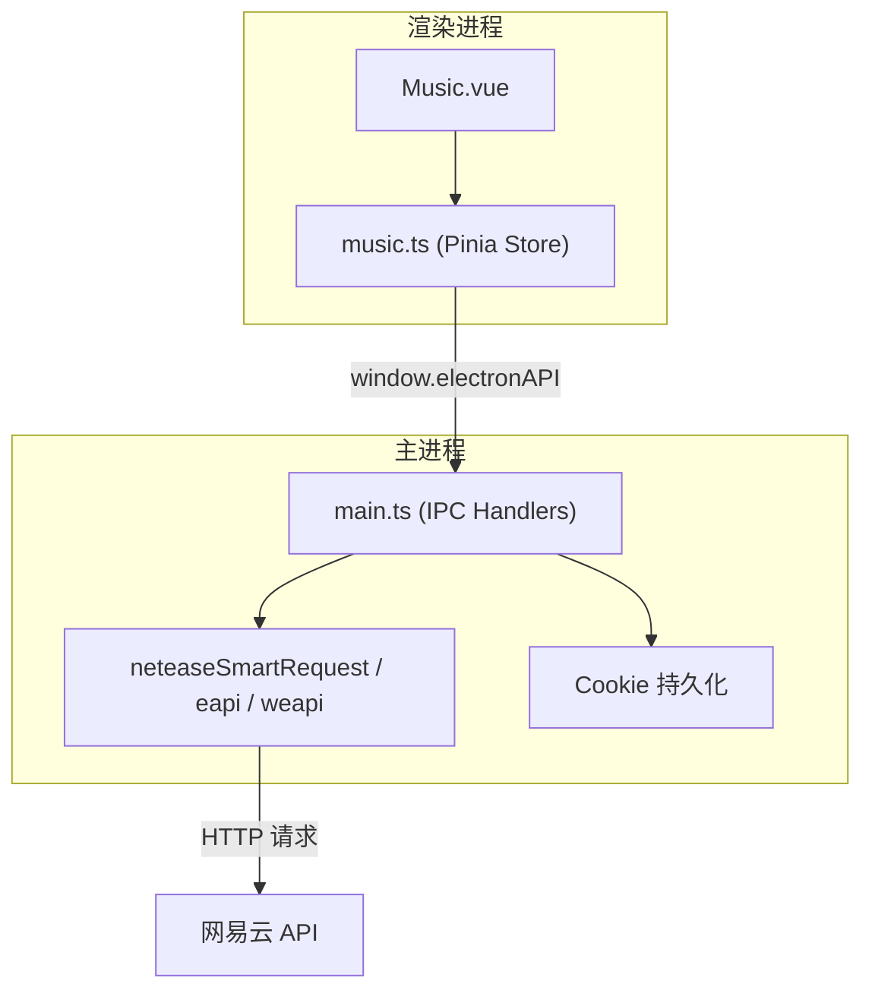

**图表来源**
- [src/renderer/src/views/Music.vue:1-800](file://src/renderer/src/views/Music.vue#L1-L800)
- [src/renderer/src/stores/music.ts:1-800](file://src/renderer/src/stores/music.ts#L1-L800)
- [src/main/main.ts:1000-1400](file://src/main/main.ts#L1000-L1400)

**章节来源**
- [README.md:87-99](file://README.md#L87-L99)
- [package.json:1-95](file://package.json#L1-L95)

## 核心组件
- 认证与会话：二维码登录、手机号登录、Cookie 登录；登录态检查与退出；Cookie 持久化。
- 搜索与热搜：关键词搜索、分页、热搜榜展示。
- 播放列表与歌单：用户歌单列表、歌单详情、批量播放/加入队列、云盘歌曲、排行榜。
- 播放与歌词：在线/本地播放、音质选择、URL 过期自动刷新、歌词解析与滚动。
- 社交互动：收藏/喜欢、评论加载与分页、评论点赞、热门评论卡片。
- 错误与重试：播放错误自动刷新 URL、eapi/weapi 双通道降级、统一错误封装。
- 性能与体验：分批渲染长列表、批量获取 URL、质量等级缓存、顶栏悬浮播放器。

**章节来源**
- [src/renderer/src/stores/music.ts:102-147](file://src/renderer/src/stores/music.ts#L102-L147)
- [src/main/main.ts:1334-1400](file://src/main/main.ts#L1334-L1400)
- [src/main/main.ts:1440-1509](file://src/main/main.ts#L1440-L1509)
- [src/main/main.ts:1511-1597](file://src/main/main.ts#L1511-L1597)
- [src/main/main.ts:1601-1673](file://src/main/main.ts#L1601-L1673)
- [src/main/main.ts:1675-1721](file://src/main/main.ts#L1675-L1721)
- [src/main/main.ts:1723-1813](file://src/main/main.ts#L1723-L1813)
- [src/main/main.ts:1893-1978](file://src/main/main.ts#L1893-L1978)

## 架构总览
- 渲染进程通过 Pinia store 维护音乐状态，调用 window.electronAPI 暴露的 IPC 方法。
- 主进程集中实现网易云 API 调用：优先 eapi（客户端接口，风控更松），失败时降级 weapi（网页版）。所有请求附带完整 Cookie 头、设备信息、随机 IP 伪装，避免风控。
- Cookie 在内存 Map 中维护，并在 Set-Cookie 响应头或登录成功后持久化到磁盘，保证跨会话登录态。

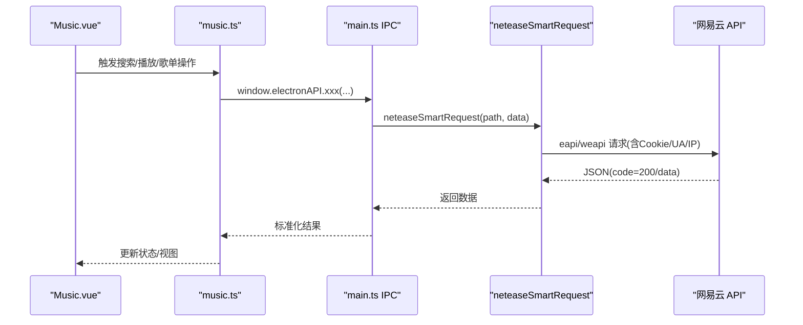

**图表来源**
- [src/main/main.ts:1222-1237](file://src/main/main.ts#L1222-L1237)
- [src/main/main.ts:1247-1282](file://src/main/main.ts#L1247-L1282)
- [src/renderer/src/stores/music.ts:435-506](file://src/renderer/src/stores/music.ts#L435-L506)

## 详细组件分析

### 用户认证流程（二维码、手机号、Cookie）
- 二维码登录：获取 key 与 base64 二维码图片，轮询检查扫码状态，成功时保存 Cookie 并拉取用户信息与歌单。
- 手机号登录：MD5 密码后调用登录接口，验证账号信息并保存 Cookie。
- Cookie 登录：从浏览器复制 Cookie 字符串，解析入库，验证登录态并拉取歌单与已喜欢歌曲列表。
- 登录态检查与退出：检查当前账户信息，退出时清空 Cookie 并重置状态。

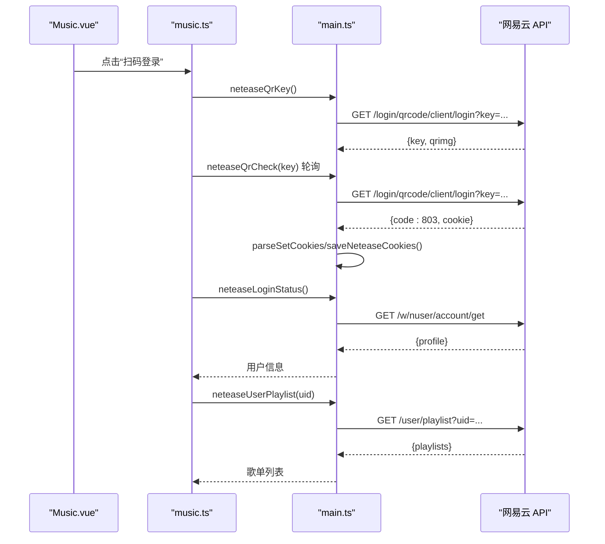

**图表来源**
- [src/main/main.ts:1440-1509](file://src/main/main.ts#L1440-L1509)
- [src/main/main.ts:1511-1597](file://src/main/main.ts#L1511-L1597)
- [src/main/main.ts:1601-1628](file://src/main/main.ts#L1601-L1628)
- [src/renderer/src/stores/music.ts:547-685](file://src/renderer/src/stores/music.ts#L547-L685)

**章节来源**
- [src/main/main.ts:1049-1090](file://src/main/main.ts#L1049-L1090)
- [src/main/main.ts:1440-1509](file://src/main/main.ts#L1440-L1509)
- [src/main/main.ts:1511-1597](file://src/main/main.ts#L1511-L1597)
- [src/renderer/src/stores/music.ts:547-685](file://src/renderer/src/stores/music.ts#L547-L685)
- [src/renderer/src/views/Music.vue:541-615](file://src/renderer/src/views/Music.vue#L541-L615)

### 音乐搜索与分页、结果过滤
- 搜索接口：支持关键词搜索、limit/offset 分页、返回歌曲总数。
- 前端展示：搜索结果列表，支持点击播放、加入队列、收藏；搜索完成后批量检查喜欢状态。
- 热搜榜：独立接口获取热搜词条，点击热词直接搜索。

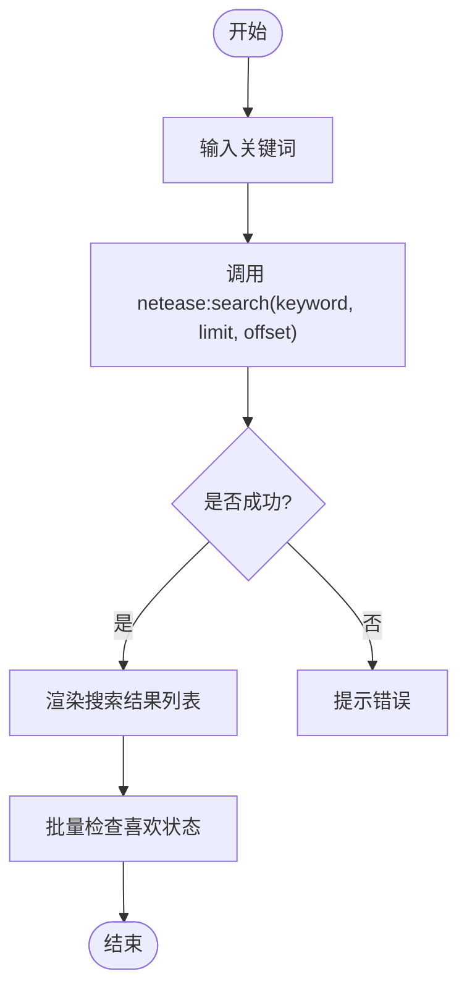

**图表来源**
- [src/main/main.ts:1334-1354](file://src/main/main.ts#L1334-L1354)
- [src/renderer/src/stores/music.ts:435-454](file://src/renderer/src/stores/music.ts#L435-L454)
- [src/renderer/src/views/Music.vue:736-752](file://src/renderer/src/views/Music.vue#L736-L752)

**章节来源**
- [src/main/main.ts:1334-1354](file://src/main/main.ts#L1334-L1354)
- [src/main/main.ts:1723-1741](file://src/main/main.ts#L1723-L1741)
- [src/renderer/src/stores/music.ts:435-454](file://src/renderer/src/stores/music.ts#L435-L454)
- [src/renderer/src/views/Music.vue:187-269](file://src/renderer/src/views/Music.vue#L187-L269)

### 播放列表管理（歌单获取、详情、智能推荐）
- 用户歌单：按 uid 分页获取自建/收藏歌单列表。
- 歌单详情：获取歌单元信息与歌曲列表，支持批量播放与加入队列。
- 智能推荐：基于当前歌曲生成相似推荐序列（心动模式）。
- 云盘与排行榜：云盘歌曲分页加载，排行榜列表与详情。

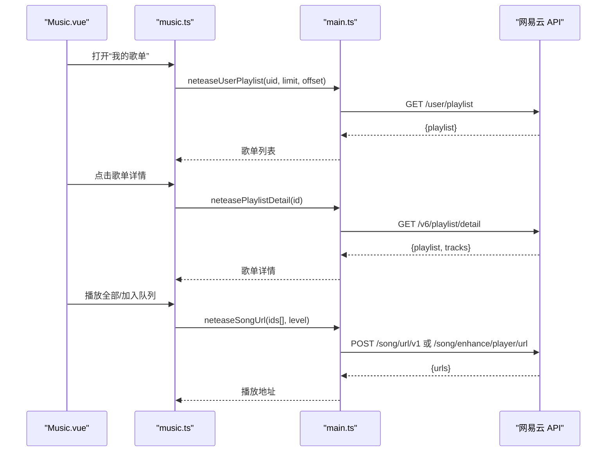

**图表来源**
- [src/main/main.ts:1601-1673](file://src/main/main.ts#L1601-L1673)
- [src/main/main.ts:1356-1387](file://src/main/main.ts#L1356-L1387)
- [src/main/main.ts:1986-2000](file://src/main/main.ts#L1986-L2000)
- [src/renderer/src/stores/music.ts:675-776](file://src/renderer/src/stores/music.ts#L675-L776)

**章节来源**
- [src/main/main.ts:1601-1673](file://src/main/main.ts#L1601-L1673)
- [src/main/main.ts:1986-2000](file://src/main/main.ts#L1986-L2000)
- [src/renderer/src/stores/music.ts:675-776](file://src/renderer/src/stores/music.ts#L675-L776)
- [src/renderer/src/views/Music.vue:425-500](file://src/renderer/src/views/Music.vue#L425-L500)

### 歌曲播放 URL 获取机制（音质选择与流媒体处理）
- 音质等级：standard/higher/exhigh/lossless/hires，默认 exhigh，可配置持久化。
- 接口选择：优先 /song/url/v1，若返回空则降级到 /song/enhance/player/url，并按音质映射 br。
- 播放错误自动刷新：当在线歌曲 URL 过期或不可用时，自动重新获取新 URL 并恢复播放。

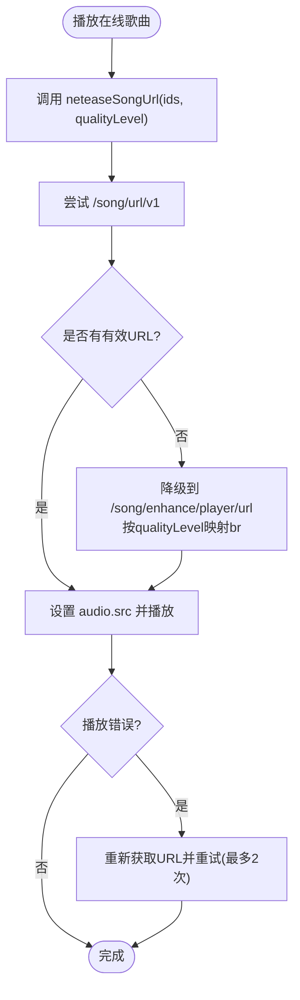

**图表来源**
- [src/main/main.ts:1356-1387](file://src/main/main.ts#L1356-L1387)
- [src/renderer/src/stores/music.ts:102-147](file://src/renderer/src/stores/music.ts#L102-L147)
- [src/renderer/src/stores/music.ts:308-343](file://src/renderer/src/stores/music.ts#L308-L343)

**章节来源**
- [src/main/main.ts:1356-1387](file://src/main/main.ts#L1356-L1387)
- [src/renderer/src/stores/music.ts:102-147](file://src/renderer/src/stores/music.ts#L102-L147)
- [src/renderer/src/stores/music.ts:308-343](file://src/renderer/src/stores/music.ts#L308-L343)

### 歌词获取与显示（在线歌词与本地 .lrc）
- 在线歌词：根据歌曲 ID 调用 /song/lyric，解析 lrc 时间戳为行数组，随播放进度高亮当前行。
- 本地歌词：同目录查找同名 .lrc 文件，读取并解析；若无则显示空状态。
- 顶栏歌词开关：可切换显示/隐藏，状态持久化。

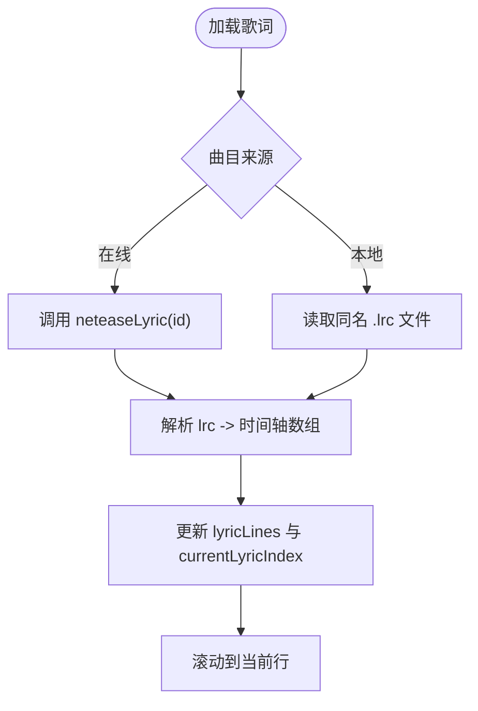

**图表来源**
- [src/main/main.ts:1389-1400](file://src/main/main.ts#L1389-L1400)
- [src/renderer/src/stores/music.ts:171-252](file://src/renderer/src/stores/music.ts#L171-L252)
- [src/renderer/src/views/Music.vue:99-117](file://src/renderer/src/views/Music.vue#L99-L117)

**章节来源**
- [src/main/main.ts:1389-1400](file://src/main/main.ts#L1389-L1400)
- [src/renderer/src/stores/music.ts:171-252](file://src/renderer/src/stores/music.ts#L171-L252)
- [src/renderer/src/views/Music.vue:99-117](file://src/renderer/src/views/Music.vue#L99-L117)

### 收藏、评论、点赞等社交功能
- 喜欢/收藏：单个或批量检查喜欢状态，切换喜欢状态；登录后拉取已喜欢歌曲列表用于初始点亮。
- 评论：支持最热/最新排序、分页加载、热门评论卡片；评论点赞状态本地缓存。
- 热门评论：首次加载时提取一条热门评论展示于卡片。

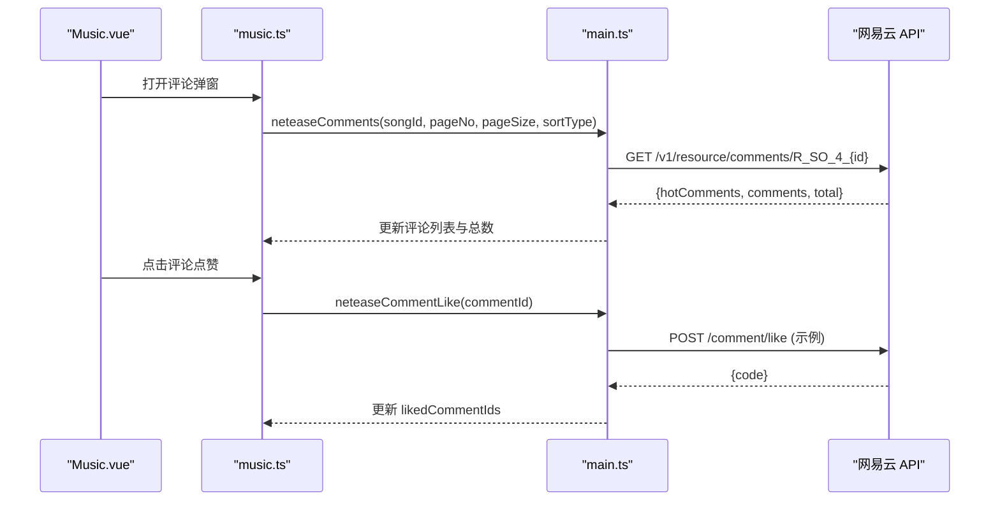

**图表来源**
- [src/main/main.ts:1675-1721](file://src/main/main.ts#L1675-L1721)
- [src/main/main.ts:1893-1978](file://src/main/main.ts#L1893-L1978)
- [src/renderer/src/stores/music.ts:1084-1130](file://src/renderer/src/stores/music.ts#L1084-L1130)
- [src/renderer/src/views/Music.vue:617-664](file://src/renderer/src/views/Music.vue#L617-L664)

**章节来源**
- [src/main/main.ts:1675-1721](file://src/main/main.ts#L1675-L1721)
- [src/main/main.ts:1893-1978](file://src/main/main.ts#L1893-L1978)
- [src/renderer/src/stores/music.ts:1084-1130](file://src/renderer/src/stores/music.ts#L1084-L1130)
- [src/renderer/src/views/Music.vue:617-664](file://src/renderer/src/views/Music.vue#L617-L664)

## 依赖关系分析
- 渲染进程依赖 Pinia store 管理状态，通过 preload 暴露的 electronAPI 调用主进程 IPC。
- 主进程依赖 Node.js crypto、fs、fetch 等能力进行加密、Cookie 持久化与 HTTP 请求。
- 外部依赖：Element Plus、Vue 3、Electron 28、electron-updater 等。

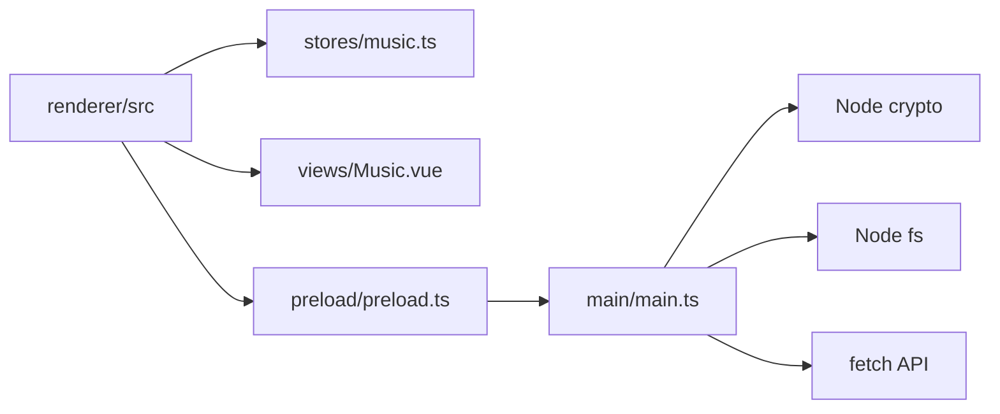

**图表来源**
- [package.json:19-44](file://package.json#L19-L44)
- [src/main/main.ts:1000-1090](file://src/main/main.ts#L1000-L1090)

**章节来源**
- [package.json:19-44](file://package.json#L19-L44)
- [src/main/main.ts:1000-1090](file://src/main/main.ts#L1000-L1090)

## 性能与限流
- 长列表分批渲染：云盘与播放队列采用可视数量分页（如 60 条/批），减少 DOM 压力。
- 批量获取 URL：歌单/排行榜播放时按每批 20 首批量获取播放地址，降低请求次数。
- 音质等级缓存：用户选择的音质等级持久化存储，避免重复配置。
- 智能请求降级：eapi/weapi 双通道，提高成功率与稳定性。
- 建议的限流策略（未在当前代码中显式实现）：对高频搜索/评论加载增加节流与防抖；对批量 URL 获取增加并发限制与退避重试；对 Cookie 失效场景增加指数退避重试。

[本节为通用指导，不直接分析具体文件]

## 故障排查指南
- 播放失败：在线歌曲 URL 过期会自动刷新并重试（最多 2 次）；若仍失败，检查网络与 Cookie 有效性。
- 登录失败：确认 Cookie 格式正确；二维码登录需确保 App 端已授权；手机号登录需确认密码 MD5 与区号。
- 评论加载失败：检查评论接口参数（sortType/pageNo/pageSize）；网络异常时重试。
- 风控问题：确保完整 Cookie 头（包含 _ntes_nuid、NMTID、WNMCID、WEVNSM、deviceId、osver 等）；必要时切换 eapi/weapi。

**章节来源**
- [src/renderer/src/stores/music.ts:102-147](file://src/renderer/src/stores/music.ts#L102-L147)
- [src/main/main.ts:1049-1090](file://src/main/main.ts#L1049-L1090)
- [src/main/main.ts:1222-1237](file://src/main/main.ts#L1222-L1237)

## 结论
本项目在渲染进程与主进程之间清晰分层，通过 Pinia store 管理音乐状态，主进程集中处理网易云 API 调用与 Cookie 管理，实现了完整的认证、搜索、播放、歌单、评论与社交功能。具备较强的容错与降级能力，并提供良好的用户体验（分批渲染、批量请求、音质选择、自动刷新 URL）。建议在后续版本中引入更完善的限流与重试策略，进一步提升稳定性与可扩展性。

[本节为总结，不直接分析具体文件]

## 附录：关键流程时序图

### 认证流程（二维码登录）
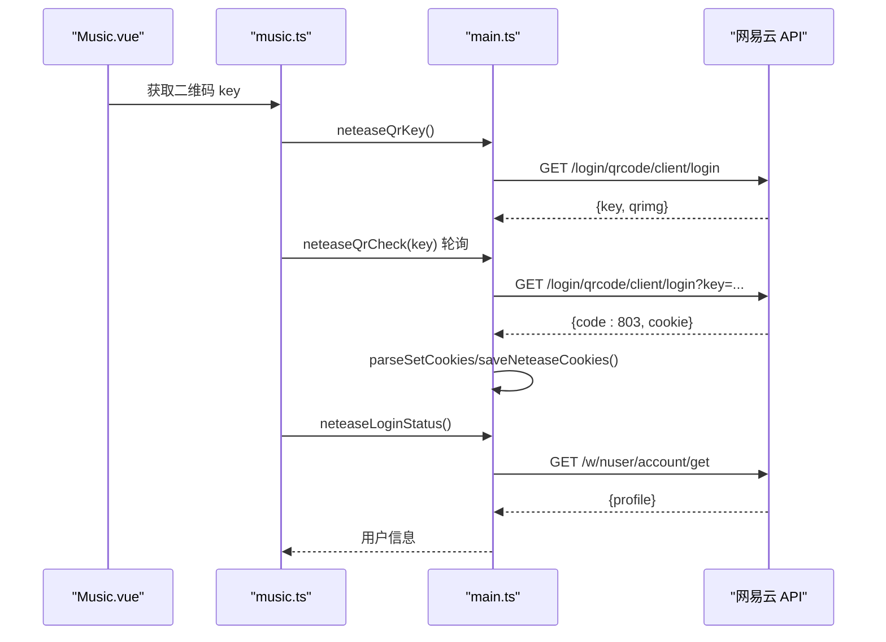

**图表来源**
- [src/main/main.ts:1440-1509](file://src/main/main.ts#L1440-L1509)
- [src/renderer/src/stores/music.ts:619-652](file://src/renderer/src/stores/music.ts#L619-L652)

### 播放 URL 获取与错误重试
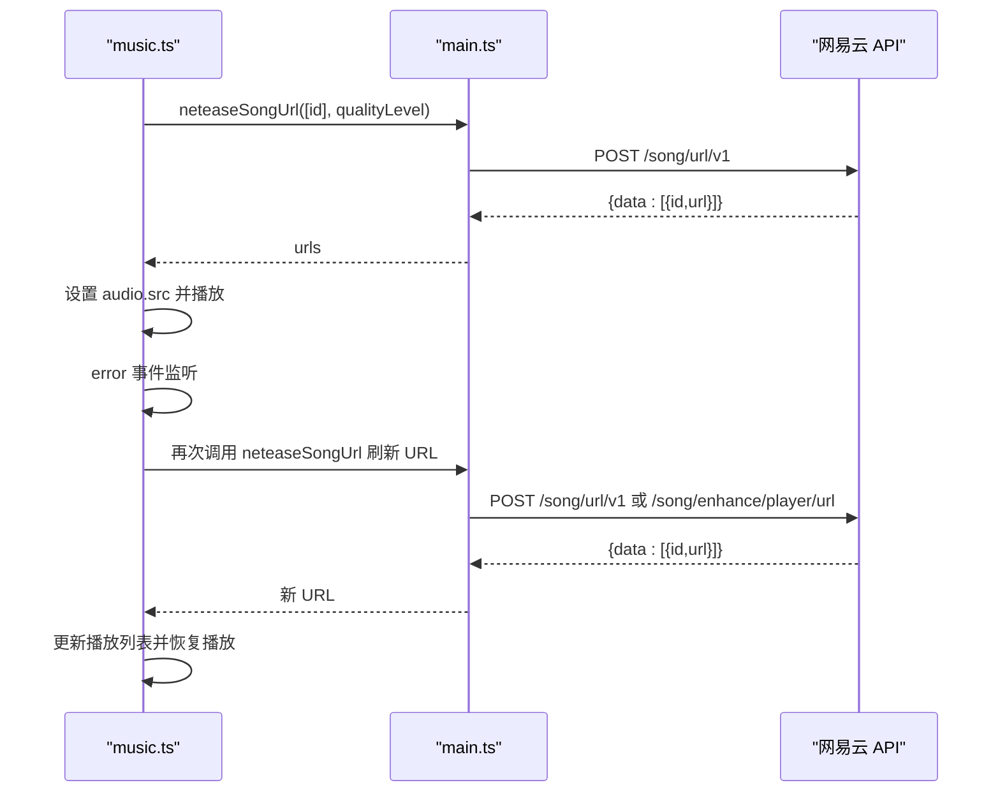

**图表来源**
- [src/main/main.ts:1356-1387](file://src/main/main.ts#L1356-L1387)
- [src/renderer/src/stores/music.ts:102-147](file://src/renderer/src/stores/music.ts#L102-L147)
- [src/renderer/src/stores/music.ts:308-343](file://src/renderer/src/stores/music.ts#L308-L343)