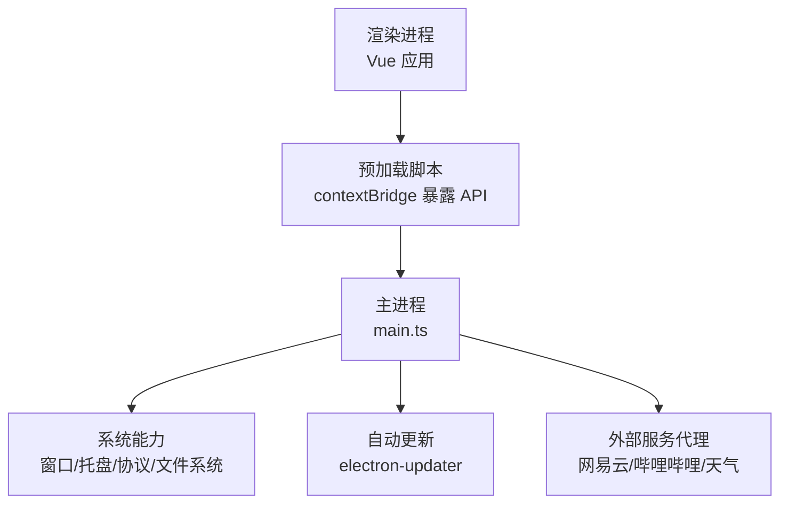
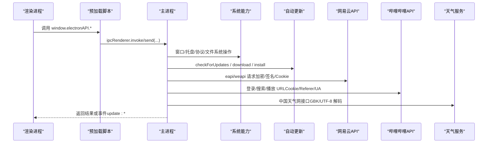
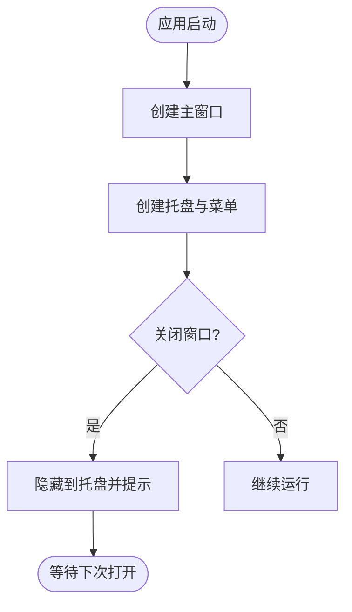
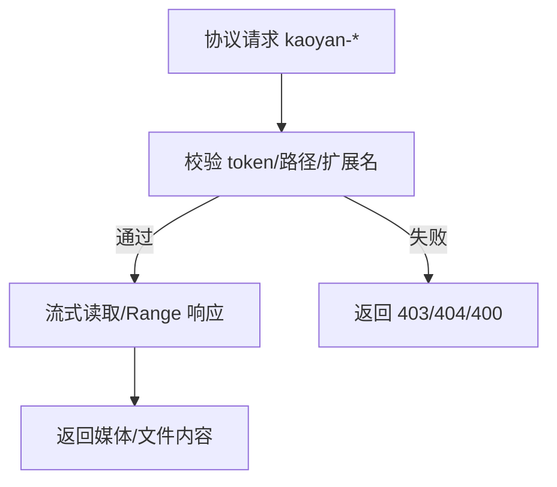
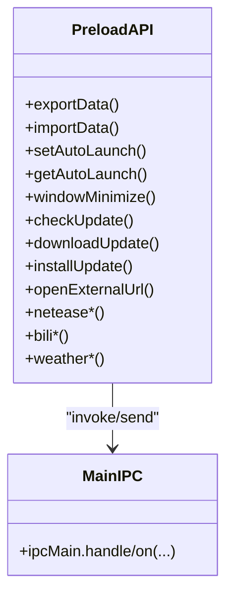
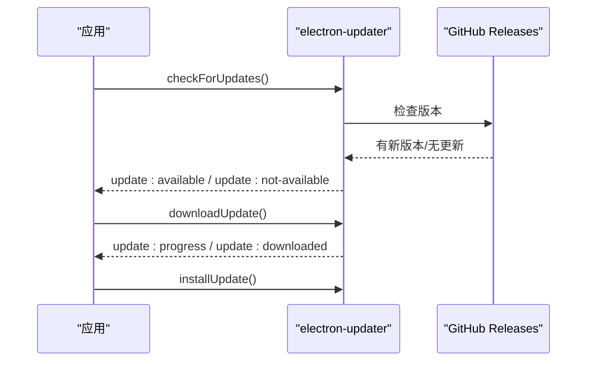
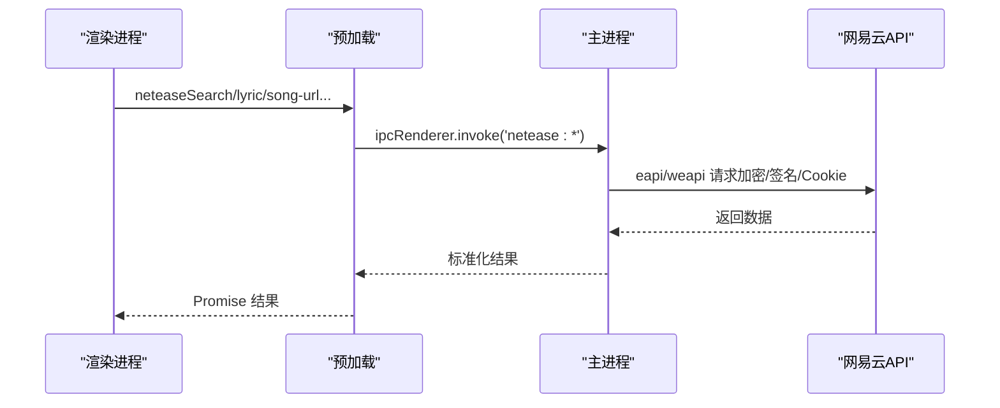
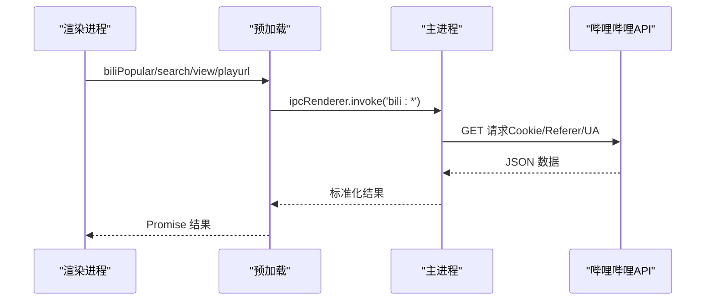
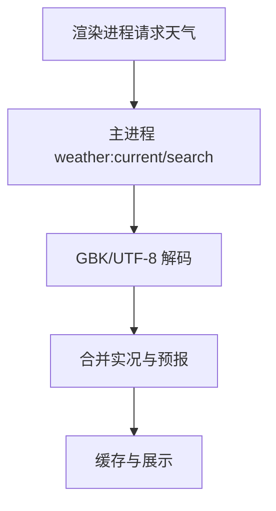
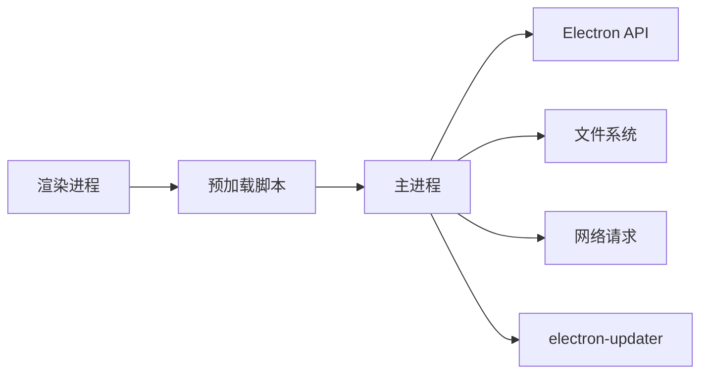

# 系统集成

<cite>
**本文引用的文件**
- [src/main/main.ts](file://src/main/main.ts)
- [src/preload/preload.ts](file://src/preload/preload.ts)
- [package.json](file://package.json)
- [vite.config.ts](file://vite.config.ts)
- [src/renderer/src/utils/weather.ts](file://src/renderer/src/utils/weather.ts)
- [src/renderer/src/components/BiliBiliPanel.vue](file://src/renderer/src/components/BiliBiliPanel.vue)
- [src/renderer/src/views/Settings.vue](file://src/renderer/src/views/Settings.vue)
</cite>

## 目录
1. [简介](#简介)
2. [项目结构](#项目结构)
3. [核心组件](#核心组件)
4. [架构总览](#架构总览)
5. [详细组件分析](#详细组件分析)
6. [依赖关系分析](#依赖关系分析)
7. [性能考量](#性能考量)
8. [故障排查指南](#故障排查指南)
9. [结论](#结论)
10. [附录：扩展开发指南与最佳实践](#附录：扩展开发指南与最佳实践)

## 简介
本文件面向“考研助手”桌面应用（Electron）的系统集成功能，覆盖主进程系统级能力、预加载安全桥接与 IPC 封装、自动更新配置与部署流程、外部服务集成（网易云音乐、哔哩哔哩、天气等）、系统权限与安全策略，以及扩展开发与最佳实践。目标是帮助开发者快速理解并安全地扩展系统功能。

## 项目结构
- 主进程入口位于 src/main/main.ts，负责窗口管理、托盘、协议处理、IPC 路由、自动更新、外部服务代理等。
- 预加载脚本位于 src/preload/preload.ts，通过 contextBridge 暴露最小化 API 给渲染进程。
- 构建与打包由 vite.config.ts 与 package.json 的 electron-builder 配置共同完成。
- 渲染侧使用 Vue + Vite，部分功能在 renderer 中调用预加载暴露的 API。

图表来源
- [src/main/main.ts:1-15](file://src/main/main.ts#L1-L15)
- [src/preload/preload.ts:1-98](file://src/preload/preload.ts#L1-L98)
- [package.json:45-86](file://package.json#L45-L86)

章节来源
- [src/main/main.ts:1-15](file://src/main/main.ts#L1-L15)
- [package.json:1-95](file://package.json#L1-L95)
- [vite.config.ts:1-39](file://vite.config.ts#L1-L39)

## 核心组件
- 窗口与托盘：无边框窗口、关闭隐藏到托盘、托盘菜单、单实例锁、主题同步。
- 私有协议：kaoyan-bg、kaoyan-music、kaoyan-data、kaoyan-material、kaoyan-assets，提供安全的本地资源访问与流式读取。
- IPC 安全桥接：仅暴露必要方法，禁止 Node 集成，启用上下文隔离。
- 自动更新：检查、下载、安装事件推送，支持手动触发。
- 外部服务代理：网易云音乐、哔哩哔哩、国内天气，统一在主进程发起请求，避免跨域与风控问题。
- 数据目录与备份：用户文档下独立数据目录，支持迁移、自定义背景、自动备份。

章节来源
- [src/main/main.ts:183-618](file://src/main/main.ts#L183-L618)
- [src/preload/preload.ts:1-98](file://src/preload/preload.ts#L1-L98)
- [package.json:45-86](file://package.json#L45-L86)

## 架构总览
下图展示从渲染进程到主进程再到系统与外部服务的整体交互路径。

图表来源
- [src/preload/preload.ts:1-98](file://src/preload/preload.ts#L1-L98)
- [src/main/main.ts:625-648](file://src/main/main.ts#L625-L648)
- [src/main/main.ts:975-1332](file://src/main/main.ts#L975-L1332)
- [src/main/main.ts:2103-2503](file://src/main/main.ts#L2103-L2503)
- [src/main/main.ts:2501-2590](file://src/main/main.ts#L2501-L2590)

## 详细组件分析

### 托盘集成与窗口管理
- 托盘图标与菜单：创建托盘、设置工具提示、显示主窗口、退出应用；首次隐藏到托盘时弹出气泡提示（Windows）。
- 窗口行为：无边框窗口、关闭按钮隐藏到托盘而非退出、全屏切换、跟随系统主题背景色。
- 单实例锁：防止重复启动，激活已有窗口。

图表来源
- [src/main/main.ts:290-377](file://src/main/main.ts#L290-L377)
- [src/main/main.ts:379-391](file://src/main/main.ts#L379-L391)
- [src/main/main.ts:672-699](file://src/main/main.ts#L672-L699)

章节来源
- [src/main/main.ts:278-377](file://src/main/main.ts#L278-L377)
- [src/main/main.ts:379-391](file://src/main/main.ts#L379-L391)
- [src/main/main.ts:672-699](file://src/main/main.ts#L672-L699)

### 文件协议处理（kaoyan-*）
- 注册私有协议：kaoyan-bg（自定义背景图）、kaoyan-music（音频流式播放）、kaoyan-data（数据目录 JSON 备份）、kaoyan-material（资料 PDF/视频等）、kaoyan-assets（pdf.js 静态资源）。
- 安全校验：白名单 token、路径穿越防护、扩展名限制、Range 请求支持、CORS 头设置。
- 回环 HTTP 服务：为 pdf.js 提供 cmaps/standard_fonts 的稳定 fetch 通道，绑定 127.0.0.1 避免防火墙提示。

图表来源
- [src/main/main.ts:183-197](file://src/main/main.ts#L183-L197)
- [src/main/main.ts:398-615](file://src/main/main.ts#L398-L615)
- [src/main/main.ts:212-276](file://src/main/main.ts#L212-L276)

章节来源
- [src/main/main.ts:183-197](file://src/main/main.ts#L183-L197)
- [src/main/main.ts:398-615](file://src/main/main.ts#L398-L615)
- [src/main/main.ts:212-276](file://src/main/main.ts#L212-L276)

### 预加载脚本的安全桥接与 IPC 封装
- 安全策略：contextIsolation=true、nodeIntegration=false、webSecurity=true，仅通过 contextBridge 暴露有限 API。
- 暴露能力：窗口控制、自动更新、数据目录、音乐/资料文件夹、外部链接、网易云/哔哩哔哩/天气、PDF 资源基址等。
- 事件订阅：onUpdateEvent 订阅主进程推送的更新事件。

图表来源
- [src/preload/preload.ts:1-98](file://src/preload/preload.ts#L1-L98)
- [src/main/main.ts:672-973](file://src/main/main.ts#L672-L973)

章节来源
- [src/preload/preload.ts:1-98](file://src/preload/preload.ts#L1-L98)
- [src/main/main.ts:672-973](file://src/main/main.ts#L672-L973)

### 自动更新系统的配置与部署流程
- 配置：禁用自动下载，允许应用退出时自动安装；延迟启动检测新版本。
- 事件：update:available、update:not-available、update:progress、update:downloaded、update:error，通过 IPC 推送到渲染进程。
- 部署：package.json 中 publish 指向 GitHub Releases，electron-builder 输出安装包。

图表来源
- [src/main/main.ts:625-648](file://src/main/main.ts#L625-L648)
- [package.json:81-86](file://package.json#L81-L86)

章节来源
- [src/main/main.ts:625-648](file://src/main/main.ts#L625-L648)
- [package.json:81-86](file://package.json#L81-L86)
- [src/renderer/src/views/Settings.vue:425-500](file://src/renderer/src/views/Settings.vue#L425-L500)

### 外部服务集成

#### 网易云音乐 API
- 认证与会话：二维码登录、手机号登录、Cookie 持久化、设备 ID 与客户端信息伪装。
- 加密与签名：eapi/weapi 双通道智能降级，AES/RSA 加密、base62 密钥、MD5 摘要。
- 功能：搜索、歌曲 URL、歌词、歌单详情、评论、热搜、排行榜、用户详情、喜欢/收藏、云盘等。

图表来源
- [src/main/main.ts:975-1332](file://src/main/main.ts#L975-L1332)
- [src/main/main.ts:1334-2101](file://src/main/main.ts#L1334-L2101)
- [src/preload/preload.ts:39-70](file://src/preload/preload.ts#L39-L70)

章节来源
- [src/main/main.ts:975-1332](file://src/main/main.ts#L975-L1332)
- [src/main/main.ts:1334-2101](file://src/main/main.ts#L1334-L2101)
- [src/preload/preload.ts:39-70](file://src/preload/preload.ts#L39-L70)

#### 哔哩哔哩 API
- 认证与会话：二维码登录、Cookie 持久化、buvid3/buvid4 自动补领。
- 功能：热门、相关视频、搜索、收藏夹列表与内容、视频详情、播放地址获取。
- CDN 请求头注入：为 B 站媒体域名统一注入 Referer/UA，避免防盗链拦截。

图表来源
- [src/main/main.ts:2103-2503](file://src/main/main.ts#L2103-L2503)
- [src/preload/preload.ts:70-82](file://src/preload/preload.ts#L70-L82)
- [src/renderer/src/components/BiliBiliPanel.vue:387-440](file://src/renderer/src/components/BiliBiliPanel.vue#L387-L440)

章节来源
- [src/main/main.ts:2103-2503](file://src/main/main.ts#L2103-L2503)
- [src/preload/preload.ts:70-82](file://src/preload/preload.ts#L70-L82)
- [src/renderer/src/components/BiliBiliPanel.vue:387-440](file://src/renderer/src/components/BiliBiliPanel.vue#L387-L440)

#### 天气服务（国内源）
- 数据源：中国天气网 sk_2d 与 weather_index，GBK/UTF-8 自适应解码。
- 功能：实时天气、城市搜索、缓存与定时刷新。
- 渲染层：优先走主进程 IPC，浏览器环境回退 wttr.in。

图表来源
- [src/main/main.ts:2501-2590](file://src/main/main.ts#L2501-L2590)
- [src/renderer/src/utils/weather.ts:1-194](file://src/renderer/src/utils/weather.ts#L1-L194)

章节来源
- [src/main/main.ts:2501-2590](file://src/main/main.ts#L2501-L2590)
- [src/renderer/src/utils/weather.ts:1-194](file://src/renderer/src/utils/weather.ts#L1-L194)

## 依赖关系分析
- 主进程依赖 Electron API、fs/path/net/http/crypto、electron-updater。
- 预加载脚本依赖 contextBridge/ipcRenderer，仅暴露最小 API。
- 渲染侧依赖 Vue/Pinia/ECharts 等，通过预加载 API 与主进程通信。
- 构建与打包依赖 vite/electron-builder，publish 至 GitHub Releases。

图表来源
- [src/main/main.ts:1-15](file://src/main/main.ts#L1-L15)
- [src/preload/preload.ts:1-98](file://src/preload/preload.ts#L1-L98)
- [package.json:19-44](file://package.json#L19-L44)

章节来源
- [src/main/main.ts:1-15](file://src/main/main.ts#L1-L15)
- [src/preload/preload.ts:1-98](file://src/preload/preload.ts#L1-L98)
- [package.json:19-44](file://package.json#L19-L44)

## 性能考量
- 大文件与媒体流式读取：音乐与资料协议采用 ReadableStream + Range 请求，减少内存占用并支持拖动进度。
- 高水位缓冲：资料协议 highWaterMark=512KB，降低系统调用次数，提升吞吐。
- 回环 HTTP 服务：为 pdf.js 提供稳定 fetch 通道，避免 XHR 不稳定导致的中文 PDF 渲染失败。
- 自动更新延迟检测：启动后延迟 5s 静默检查，避免影响首屏体验。

章节来源
- [src/main/main.ts:406-615](file://src/main/main.ts#L406-L615)
- [src/main/main.ts:212-276](file://src/main/main.ts#L212-L276)
- [src/main/main.ts:645-648](file://src/main/main.ts#L645-L648)

## 故障排查指南
- 托盘提示未显示：确认 Windows 平台且首次隐藏到托盘；检查托盘图标路径是否存在。
- 协议 403/404：检查 token 是否有效、路径是否在白名单内、扩展名是否允许。
- 自动更新失败：检查网络与 GitHub Releases 配置；查看 update:error 事件消息。
- 网易云/哔哩哔哩登录失败：确认 Cookie 是否完整、设备 ID 与客户端信息是否正确；必要时重新扫码或粘贴 Cookie。
- 天气乱码：确认主进程 GBK/UTF-8 解码逻辑；检查网络响应头 charset。

章节来源
- [src/main/main.ts:329-342](file://src/main/main.ts#L329-L342)
- [src/main/main.ts:406-615](file://src/main/main.ts#L406-L615)
- [src/main/main.ts:625-648](file://src/main/main.ts#L625-L648)
- [src/main/main.ts:975-1332](file://src/main/main.ts#L975-L1332)
- [src/main/main.ts:2103-2503](file://src/main/main.ts#L2103-L2503)
- [src/main/main.ts:2501-2590](file://src/main/main.ts#L2501-L2590)

## 结论
本项目通过主进程集中实现系统级能力与外部服务代理，结合预加载的安全桥接与严格的协议白名单，实现了安全、稳定、高性能的桌面应用集成。自动更新与多平台打包简化了分发流程，外部服务集成覆盖了音乐、视频与天气等高频场景。遵循本文档的最佳实践可进一步扩展与维护系统功能。

## 附录：扩展开发指南与最佳实践
- 新增 IPC 接口
  - 在预加载脚本中通过 contextBridge.exposeInMainWorld 暴露新方法。
  - 在主进程中注册对应的 ipcMain.handle/on 处理器，进行参数校验与权限控制。
  - 保持最小暴露原则，避免直接暴露敏感 API。

- 新增私有协议
  - 在 protocol.registerSchemesAsPrivileged 中注册新 scheme，设置 secure 与 stream 等权限。
  - 实现 handler，进行路径穿越防护、扩展名白名单、token 校验与范围请求支持。

- 外部服务集成
  - 统一在主进程发起请求，避免渲染进程跨域与风控问题。
  - 对 Cookie、Referer、UA 进行统一管理，持久化会话状态。
  - 对加密/签名算法进行封装，提供智能降级与错误处理。

- 安全与权限
  - 始终启用 contextIsolation 与 webSecurity，禁用 nodeIntegration。
  - 对用户输入与路径进行严格校验，限制可访问的资源范围。
  - 对敏感数据（Cookie、Token）进行加密或安全存储。

- 性能优化
  - 大文件与媒体使用流式读取与 Range 请求。
  - 合理设置缓冲区大小，减少系统调用开销。
  - 对频繁请求进行缓存与去重。

章节来源
- [src/preload/preload.ts:1-98](file://src/preload/preload.ts#L1-L98)
- [src/main/main.ts:183-197](file://src/main/main.ts#L183-L197)
- [src/main/main.ts:398-615](file://src/main/main.ts#L398-L615)
- [src/main/main.ts:975-1332](file://src/main/main.ts#L975-L1332)
- [src/main/main.ts:2103-2503](file://src/main/main.ts#L2103-L2503)