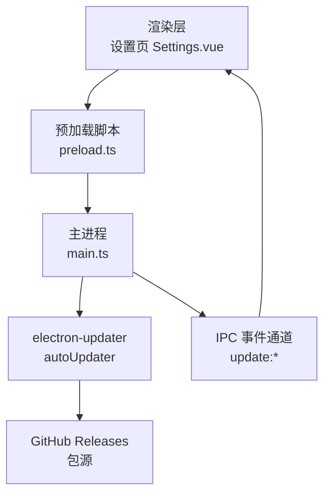
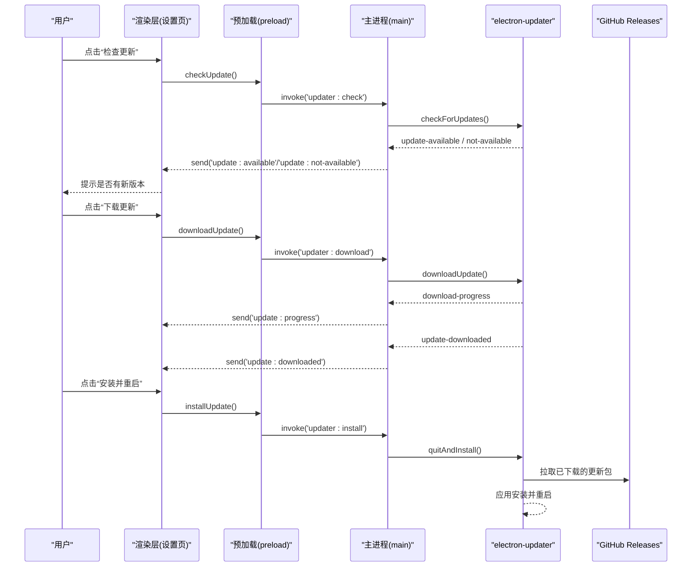
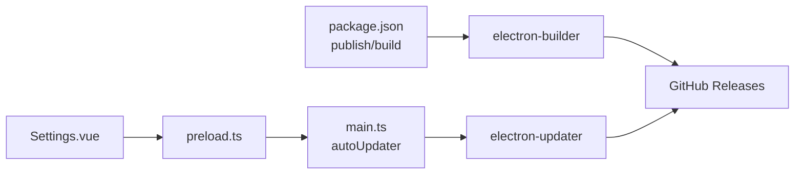
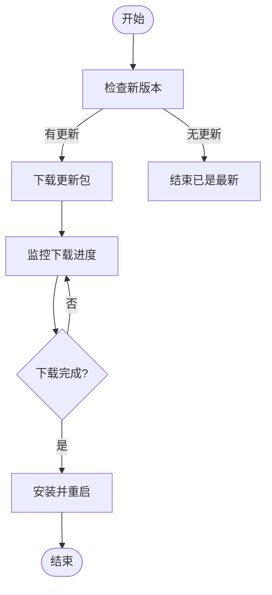

# 自动更新系统

<cite>
**本文引用的文件**
- [package.json](file://package.json)
- [src/main/main.ts](file://src/main/main.ts)
- [src/preload/preload.ts](file://src/preload/preload.ts)
- [src/renderer/src/views/Settings.vue](file://src/renderer/src/views/Settings.vue)
- [.github/workflows/release.yml](file://.github/workflows/release.yml)
</cite>

## 目录
1. [简介](#简介)
2. [项目结构](#项目结构)
3. [核心组件](#核心组件)
4. [架构总览](#架构总览)
5. [详细组件分析](#详细组件分析)
6. [依赖关系分析](#依赖关系分析)
7. [性能与可靠性](#性能与可靠性)
8. [故障排查指南](#故障排查指南)
9. [结论](#结论)
10. [附录](#附录)

## 简介
本文件面向“考研助手”桌面应用的自动更新子系统，基于 electron-updater 实现。文档覆盖以下要点：
- 更新服务器配置与发布目标（GitHub Releases）
- 版本检查机制、下载进度监控、安装流程
- 手动触发更新的交互与状态反馈
- GitHub Actions 自动化构建与发布流程
- 多平台打包配置与注意事项
- 更新失败处理策略与用户提示

## 项目结构
自动更新相关代码分布在主进程、预加载脚本与渲染层设置页中，并通过 IPC 通信；发布流水线由 GitHub Actions 驱动。

图表来源
- [src/renderer/src/views/Settings.vue:425-504](file://src/renderer/src/views/Settings.vue#L425-L504)
- [src/preload/preload.ts:1-98](file://src/preload/preload.ts#L1-L98)
- [src/main/main.ts:625-648](file://src/main/main.ts#L625-L648)
- [package.json:81-86](file://package.json#L81-L86)

章节来源
- [package.json:45-86](file://package.json#L45-L86)
- [src/main/main.ts:625-648](file://src/main/main.ts#L625-L648)
- [src/preload/preload.ts:1-98](file://src/preload/preload.ts#L1-L98)
- [src/renderer/src/views/Settings.vue:425-504](file://src/renderer/src/views/Settings.vue#L425-L504)
- [.github/workflows/release.yml:1-28](file://.github/workflows/release.yml#L1-L28)

## 核心组件
- 主进程更新管理器：负责初始化 autoUpdater、监听事件、暴露 IPC 接口供渲染层调用。
- 预加载桥接：将主进程的更新能力安全暴露给渲染层，并订阅更新事件。
- 渲染层设置页：提供“检查更新/下载更新/安装更新”的 UI 与状态展示。
- 发布流水线：在推送 v* 标签时，构建 Windows 安装包并发布到 GitHub Releases。

章节来源
- [src/main/main.ts:625-648](file://src/main/main.ts#L625-L648)
- [src/main/main.ts:2781-2804](file://src/main/main.ts#L2781-L2804)
- [src/preload/preload.ts:16-19](file://src/preload/preload.ts#L16-L19)
- [src/preload/preload.ts:91-96](file://src/preload/preload.ts#L91-L96)
- [src/renderer/src/views/Settings.vue:425-504](file://src/renderer/src/views/Settings.vue#L425-L504)
- [.github/workflows/release.yml:1-28](file://.github/workflows/release.yml#L1-L28)

## 架构总览
下图展示了从用户操作到最终安装的完整序列：

图表来源
- [src/renderer/src/views/Settings.vue:425-504](file://src/renderer/src/views/Settings.vue#L425-L504)
- [src/preload/preload.ts:16-19](file://src/preload/preload.ts#L16-L19)
- [src/main/main.ts:625-648](file://src/main/main.ts#L625-L648)
- [src/main/main.ts:2781-2804](file://src/main/main.ts#L2781-L2804)

## 详细组件分析

### 主进程：更新管理器与 IPC
- 初始化与行为
  - 关闭自动下载，启用退出后自动安装：确保更新由用户在界面主动触发。
  - 启动延迟静默检查：应用启动 5 秒后尝试检查更新，失败不干扰用户。
- 事件转发
  - 将 electron-updater 的事件通过 IPC 发送到渲染层：
    - update-available / update-not-available
    - download-progress
    - update-downloaded
    - error
- 暴露的 IPC 接口
  - updater:check：执行版本检查，返回是否成功及最新版本号（开发环境会捕获异常）。
  - updater:download：开始下载更新包。
  - updater:install：退出并安装已下载的更新。

章节来源
- [src/main/main.ts:625-648](file://src/main/main.ts#L625-L648)
- [src/main/main.ts:2781-2804](file://src/main/main.ts#L2781-L2804)

### 预加载脚本：安全桥接与事件订阅
- 暴露更新 API：checkUpdate、downloadUpdate、installUpdate。
- 订阅主进程推送的更新事件通道：update:available、update:not-available、update:progress、update:downloaded、update:error。

章节来源
- [src/preload/preload.ts:16-19](file://src/preload/preload.ts#L16-L19)
- [src/preload/preload.ts:91-96](file://src/preload/preload.ts#L91-L96)

### 渲染层：设置页交互与状态反馈
- 检查更新：调用 API，根据返回结果提示“发现新版本/已是最新”。
- 下载更新：显示进度条，完成后提示可安装。
- 安装更新：调用安装接口，应用退出并完成安装。
- 错误处理：网络或环境问题导致失败时，给出友好提示并引导至项目主页。

章节来源
- [src/renderer/src/views/Settings.vue:425-504](file://src/renderer/src/views/Settings.vue#L425-L504)

### 发布流水线：GitHub Actions
- 触发条件：推送 v* 标签。
- 运行环境：Windows 最新镜像。
- 步骤：
  - 检出代码
  - 安装 Node.js 20
  - 安装依赖
  - 执行构建并发布：使用 electron-builder 构建 Windows 安装包，并上传到 GitHub Releases。
- 权限：需要 contents: write 以创建 Release。

章节来源
- [.github/workflows/release.yml:1-28](file://.github/workflows/release.yml#L1-L28)

### 更新服务器与版本检查机制
- 更新源：通过 package.json 的 publish 配置指定 GitHub 仓库与 releaseType，electron-updater 会自动读取对应 Release 中的增量/全量更新包。
- 版本检查：
  - 启动时延迟静默检查一次。
  - 用户可在设置页手动检查。
- 下载与安装：
  - 默认不自动下载，需用户手动触发。
  - 下载完成后，用户可立即安装；或在应用退出时自动安装（已开启）。

章节来源
- [package.json:81-86](file://package.json#L81-L86)
- [src/main/main.ts:625-648](file://src/main/main.ts#L625-L648)

### 下载进度监控
- 主进程监听 download-progress，将百分比通过 IPC 推送到渲染层。
- 渲染层实时更新进度条，并在完成时提示可安装。

章节来源
- [src/main/main.ts:635-637](file://src/main/main.ts#L635-L637)
- [src/renderer/src/views/Settings.vue:485-493](file://src/renderer/src/views/Settings.vue#L485-L493)

### 手动触发更新的实现方式
- 入口：设置页按钮“检查更新/下载更新/安装并重启”。
- 交互：
  - 检查：调用 updater:check，根据返回消息提示。
  - 下载：调用 updater:download，监听 update:progress 更新进度。
  - 安装：调用 updater:install，应用退出并安装。
- 状态反馈：
  - 有新版本：提示并引导下载。
  - 无新版本：提示当前已是最新。
  - 下载中：显示进度。
  - 下载完成：提示可安装。
  - 错误：提示失败原因并建议重试或前往项目主页。

章节来源
- [src/renderer/src/views/Settings.vue:425-504](file://src/renderer/src/views/Settings.vue#L425-L504)
- [src/preload/preload.ts:16-19](file://src/preload/preload.ts#L16-L19)
- [src/main/main.ts:2781-2804](file://src/main/main.ts#L2781-L2804)

### 多平台打包配置与发布自动化
- 多平台目标：
  - Windows：NSIS 安装包
  - macOS：dmg
  - Linux：AppImage
- 构建命令：
  - 全平台：npm run electron:build
  - 单平台：electron:build:win / :mac / :linux
- 发布自动化：
  - 当前工作流仅包含 Windows 构建与发布。
  - 如需多平台发布，可在同一 workflow 增加 mac/linux job，或使用矩阵策略。

章节来源
- [package.json:45-80](file://package.json#L45-L80)
- [.github/workflows/release.yml:1-28](file://.github/workflows/release.yml#L1-L28)

## 依赖关系分析
- 运行时依赖
  - electron-updater：用于版本检查、下载与安装。
  - electron-builder：用于打包与发布到 GitHub Releases。
- 配置依赖
  - package.json 的 build.publish 字段决定更新源与发布目标。
  - .github/workflows/release.yml 控制 CI 构建与发布。

图表来源
- [package.json:81-86](file://package.json#L81-L86)
- [src/main/main.ts:625-648](file://src/main/main.ts#L625-L648)
- [src/preload/preload.ts:16-19](file://src/preload/preload.ts#L16-L19)
- [src/renderer/src/views/Settings.vue:425-504](file://src/renderer/src/views/Settings.vue#L425-L504)

章节来源
- [package.json:19-43](file://package.json#L19-L43)
- [package.json:45-86](file://package.json#L45-L86)

## 性能与可靠性
- 启动静默检查：避免阻塞首屏，降低网络抖动影响。
- 手动下载：减少不必要的带宽占用，提升用户体验可控性。
- 退出自动安装：简化用户操作，保证更新及时生效。
- 错误容错：开发环境与网络异常均被捕获，避免弹窗打扰。

[本节为通用指导，无需特定文件引用]

## 故障排查指南
- 无法检测到更新
  - 确认已推送带 v* 标签的 Release，且包含正确的增量/全量更新包。
  - 检查 package.json 的 publish 配置是否正确指向目标仓库。
  - 检查网络连通性与代理设置。
- 下载失败
  - 查看渲染层错误提示，必要时重试。
  - 检查磁盘空间与权限。
- 安装失败
  - 确保当前应用未锁定更新文件（如正在后台进程）。
  - 尝试手动删除临时更新缓存后重试。
- 开发环境报错
  - 开发环境无打包产物时会抛错，属预期行为；请切换到打包产物或忽略该提示。

章节来源
- [src/main/main.ts:2781-2788](file://src/main/main.ts#L2781-L2788)
- [src/renderer/src/views/Settings.vue:437-445](file://src/renderer/src/views/Settings.vue#L437-L445)
- [src/renderer/src/views/Settings.vue:494-498](file://src/renderer/src/views/Settings.vue#L494-L498)

## 结论
本项目基于 electron-updater 实现了稳定、可控的自动更新机制：
- 更新源通过 GitHub Releases 管理，CI 自动化构建与发布。
- 主进程集中管理更新生命周期，渲染层提供直观的用户交互与状态反馈。
- 支持手动触发更新、下载进度监控与失败提示，兼顾可用性与可靠性。
- 多平台打包配置完备，当前工作流聚焦 Windows 发布，可按需扩展。

[本节为总结性内容，无需特定文件引用]

## 附录

### 关键流程图：更新流程

[此图为概念流程示意，不直接映射具体源码，故不提供图表来源]