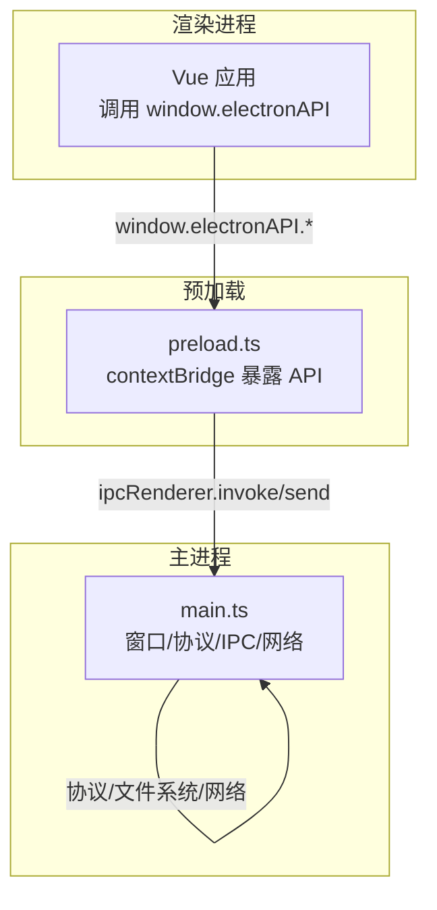
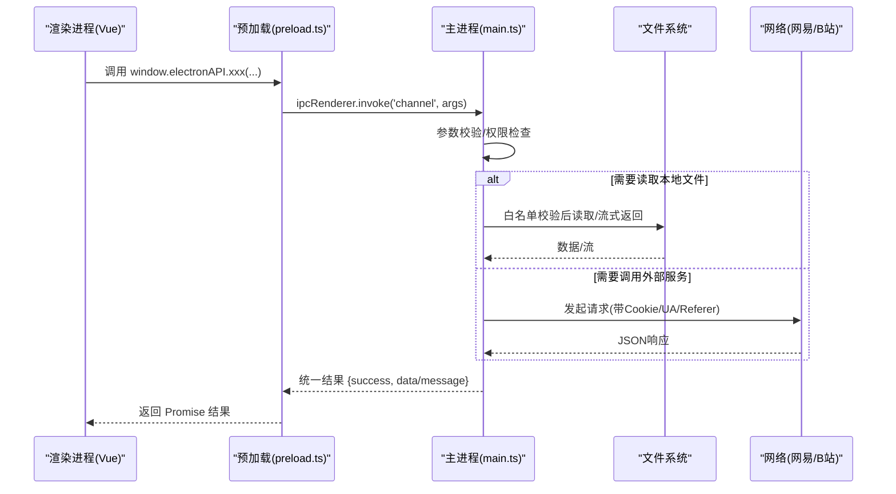
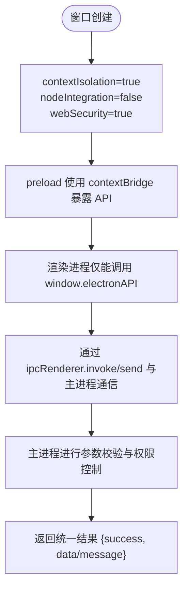
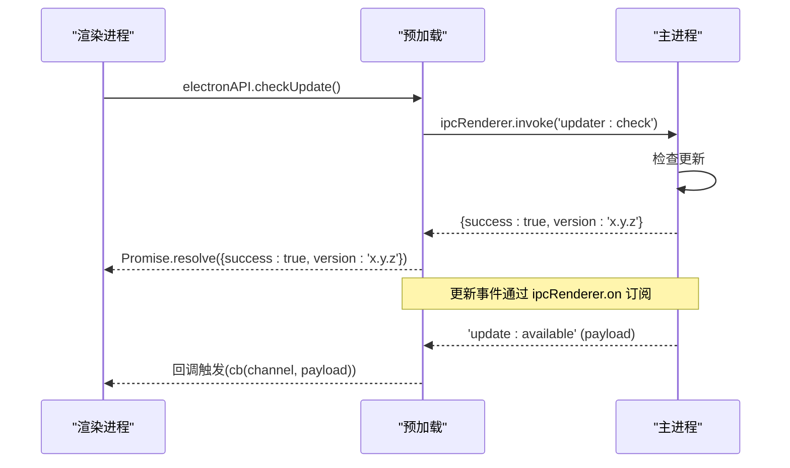
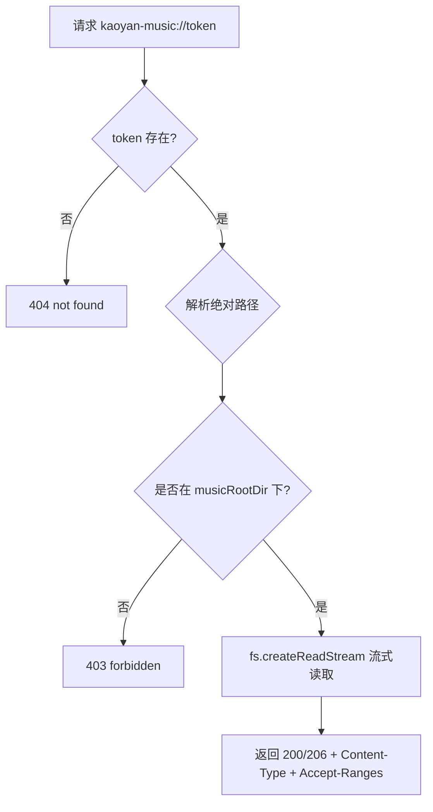
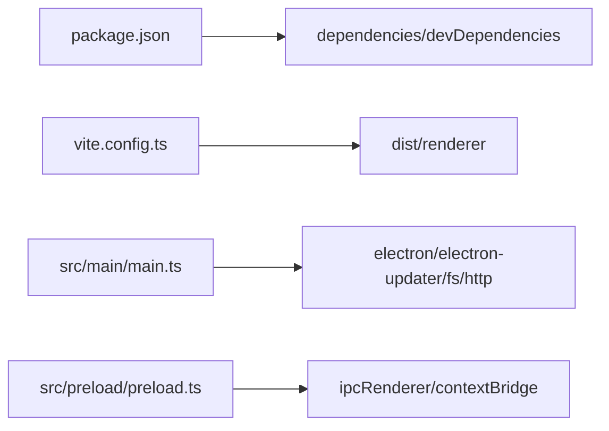

# 预加载脚本

<cite>
**本文引用的文件**
- [src/preload/preload.ts](file://src/preload/preload.ts)
- [src/main/main.ts](file://src/main/main.ts)
- [package.json](file://package.json)
- [vite.config.ts](file://vite.config.ts)
</cite>

## 目录
1. [简介](#简介)
2. [项目结构](#项目结构)
3. [核心组件](#核心组件)
4. [架构总览](#架构总览)
5. [详细组件分析](#详细组件分析)
6. [依赖关系分析](#依赖关系分析)
7. [性能考量](#性能考量)
8. [故障排查指南](#故障排查指南)
9. [结论](#结论)
10. [附录：扩展新API与权限策略](#附录：扩展新api与权限策略)

## 简介
本项目的预加载脚本是 Electron 安全模型中的关键“安全桥接层”。它通过 contextBridge 将受控的 API 暴露给渲染进程，使渲染进程在不启用 nodeIntegration、开启 contextIsolation 的前提下，仍能安全地访问主进程能力（文件系统、系统信息、外部服务调用等）。本文档围绕以下目标展开：
- 说明预加载在 Electron 安全模型中的作用
- 详细描述暴露给渲染进程的 API 接口（文件系统访问、系统信息获取、外部服务调用）
- 解释 contextIsolation 与 nodeIntegration 的安全配置
- 提供 IPC 通信封装方法与错误处理机制
- 指导如何扩展新的 API 接口和权限控制策略
- 总结安全最佳实践与常见陷阱避免方法

## 项目结构
本项目采用典型的 Electron 多进程架构：
- 主进程（main）：负责窗口管理、协议注册、IPC 处理、网络请求代理、本地资源访问、自动更新等
- 预加载脚本（preload）：使用 contextBridge 暴露最小化、白名单化的 API 到渲染进程
- 渲染进程（renderer）：基于 Vue + Vite 的前端界面，仅能调用预加载暴露的 API

**图表来源**
- [src/preload/preload.ts:1-98](file://src/preload/preload.ts#L1-L98)
- [src/main/main.ts:290-313](file://src/main/main.ts#L290-L313)

**章节来源**
- [src/preload/preload.ts:1-98](file://src/preload/preload.ts#L1-L98)
- [src/main/main.ts:290-313](file://src/main/main.ts#L290-L313)
- [package.json:1-95](file://package.json#L1-L95)
- [vite.config.ts:1-39](file://vite.config.ts#L1-L39)

## 核心组件
- 预加载脚本（preload.ts）：集中定义并暴露 electronAPI 到渲染进程，所有对外能力均通过 IPC 转发至主进程
- 主进程（main.ts）：实现具体业务逻辑，包括：
  - 自定义协议（kaoyan-bg/music/data/material/assets）
  - 文件白名单与路径校验
  - 网易云音乐与哔哩哔哩 API 代理
  - 自动更新事件推送
  - 窗口控制与托盘集成

**章节来源**
- [src/preload/preload.ts:1-98](file://src/preload/preload.ts#L1-L98)
- [src/main/main.ts:183-210](file://src/main/main.ts#L183-L210)
- [src/main/main.ts:393-658](file://src/main/main.ts#L393-L658)

## 架构总览
预加载脚本作为安全边界，严格限制渲染进程可直接访问的能力。所有敏感操作必须通过主进程完成，并在主进程中执行权限校验与输入验证。

**图表来源**
- [src/preload/preload.ts:3-97](file://src/preload/preload.ts#L3-L97)
- [src/main/main.ts:703-817](file://src/main/main.ts#L703-L817)
- [src/main/main.ts:1334-1401](file://src/main/main.ts#L1334-L1401)

## 详细组件分析

### 预加载脚本暴露的 API 分类
- 数据导入导出
  - exportData/importData：用于备份/恢复用户数据
- 启动项与背景图
  - setAutoLaunch/getAutoLaunch：设置开机自启
  - setCustomBg/clearCustomBg/getCustomBg：管理自定义背景图
- 窗口控制
  - windowMinimize/windowToggleMaximize/windowCloseToTray/setFullscreen：最小化、最大化、隐藏到托盘、全屏切换
- 应用更新
  - checkUpdate/downloadUpdate/installUpdate：手动触发更新流程
  - onUpdateEvent：订阅更新事件（available/not-available/progress/downloaded/error）
- 资料与媒体
  - pickMusicFolder/restoreMusicFolder/readLyric：选择音乐文件夹、恢复上次选择、读取歌词
  - pickMaterialsFolder/restoreMaterialsFolder/listMaterialsFiles/openMaterialsExternal：资料文件夹选择、恢复、列表、用系统默认应用打开
  - getAssetsBaseUrl：获取 pdf.js 静态资源回环 HTTP 基址（优先 http://127.0.0.1，否则回退 kaoyan-assets://）
- 外部链接与天气
  - openExternalUrl：以默认浏览器打开外部 URL（仅允许 https/http）
  - weatherCurrent/weatherSearch：国内天气查询
- 数据目录管理
  - getDataDir/setDataDir/openDataDir/syncDataToDir：查看/设置/打开数据目录，同步数据到指定目录
- 第三方服务代理
  - 网易云音乐：搜索、歌曲URL、歌词、二维码登录、登录状态、退出、Cookie 设置、手机号登录、歌单、评论、热搜、排行榜、用户详情、喜欢、云盘等
  - 哔哩哔哩：二维码登录、登录状态、退出、热门、相关视频、搜索、收藏夹、播放地址

**章节来源**
- [src/preload/preload.ts:3-97](file://src/preload/preload.ts#L3-L97)

### 安全配置：contextIsolation 与 nodeIntegration
- 主进程创建窗口时明确设置：
  - contextIsolation: true：隔离渲染上下文，禁止直接访问 Node 模块
  - nodeIntegration: false：禁用渲染进程中的 Node 能力
  - webSecurity: true：启用 Web 安全策略（CORS、XSS 防护等）
- 预加载脚本通过 contextBridge.exposeInMainWorld 暴露最小化 API，避免直接暴露全局对象或危险方法

**图表来源**
- [src/main/main.ts:290-313](file://src/main/main.ts#L290-L313)
- [src/preload/preload.ts:1-98](file://src/preload/preload.ts#L1-L98)

**章节来源**
- [src/main/main.ts:290-313](file://src/main/main.ts#L290-L313)

### IPC 通信封装与错误处理
- 预加载侧统一使用 ipcRenderer.invoke 进行请求-响应式调用，返回 Promise，便于前端异步处理
- 主进程侧对每个 handle 进行 try/catch 包裹，确保异常不崩溃，并以统一格式返回：
  - success: boolean
  - data/message: 成功数据或错误消息
- 事件通道（如更新事件）使用 ipcRenderer.on 订阅，主进程通过 webContents.send 推送

**图表来源**
- [src/preload/preload.ts:91-97](file://src/preload/preload.ts#L91-L97)
- [src/main/main.ts:629-648](file://src/main/main.ts#L629-L648)

**章节来源**
- [src/preload/preload.ts:3-97](file://src/preload/preload.ts#L3-L97)
- [src/main/main.ts:629-648](file://src/main/main.ts#L629-L648)

### 文件系统访问与安全策略
- 自定义协议限制：
  - kaoyan-music://：仅允许白名单内的音频文件，支持 Range 请求，流式读取避免内存溢出
  - kaoyan-material://：仅允许资料文件夹内文件，支持 PDF/视频等，同样支持 Range
  - kaoyan-data://：仅暴露数据目录下的 json 备份文件，文件名正则校验
  - kaoyan-assets://：仅暴露 pdfjs 子目录，防止路径穿越
- 路径校验：
  - 所有文件访问前进行白名单匹配与根目录校验，拒绝越权访问
  - 使用 token 机制映射临时可访问路径，避免直接暴露真实路径

**图表来源**
- [src/main/main.ts:407-477](file://src/main/main.ts#L407-L477)
- [src/main/main.ts:542-615](file://src/main/main.ts#L542-L615)

**章节来源**
- [src/main/main.ts:407-477](file://src/main/main.ts#L407-L477)
- [src/main/main.ts:542-615](file://src/main/main.ts#L542-L615)

### 外部服务调用代理
- 网易云音乐：
  - 智能请求：优先 eapi（客户端，风控较松），失败降级 weapi（网页版）
  - Cookie 持久化：从 Set-Cookie 解析并保存到 userData 目录
  - 加密：weapi 使用 AES/RSA 加密，eapi 使用特定算法
  - 防风控：随机中国 IP、完整 UA/Referer/Cookie
- 哔哩哔哩：
  - 二维码登录、登录状态、内容获取（热门/搜索/收藏/播放）
  - 视频 CDN 请求头注入：为播放流添加 Referer/UA，绕过防盗链

**章节来源**
- [src/main/main.ts:975-1332](file://src/main/main.ts#L975-L1332)
- [src/main/main.ts:2103-2400](file://src/main/main.ts#L2103-L2400)

## 依赖关系分析
- 构建与打包：
  - package.json 定义了 Electron、Vite、TypeScript 等依赖
  - vite.config.ts 配置了 Vue 插件、别名、输出目录等
- 运行时依赖：
  - electron-updater：自动更新
  - pdfjs-dist / @open-file-viewer/core：PDF 预览
  - dayjs、echarts、pinia、vue-router：前端功能库

**图表来源**
- [package.json:1-95](file://package.json#L1-L95)
- [vite.config.ts:1-39](file://vite.config.ts#L1-L39)

**章节来源**
- [package.json:1-95](file://package.json#L1-L95)
- [vite.config.ts:1-39](file://vite.config.ts#L1-L39)

## 性能考量
- 大文件流式读取：音乐与资料协议使用 fs.createReadStream 与 ReadableStream，避免一次性加载导致内存溢出
- Range 请求支持：视频拖动进度与快速加载依赖 206 Partial Content
- 缓存与优化：
  - 数据目录配置缓存（getDataDir）
  - 网易云 Cookie 持久化减少重复登录
  - pdf.js 静态资源回环 HTTP 服务提升稳定性
- 限制扫描数量：音乐与资料文件夹扫描限制最大文件数（MUSIC_MAX_FILES/MATERIALS_MAX_FILES）

[本节为通用性能讨论，无需特定文件引用]

## 故障排查指南
- 常见问题定位：
  - 预加载未生效：检查 BrowserWindow.webPreferences.preload 路径是否正确
  - IPC 调用无响应：确认主进程是否注册了对应 handle/on
  - 文件访问被拒：检查 token 是否有效、路径是否在白名单内
  - 外部服务失败：查看主进程日志，确认 Cookie/UA/Referer 是否正确
- 调试建议：
  - 开发环境启用 DevTools，观察 IPC 调用与响应
  - 在主进程 uncaughtException/unhandledRejection 中记录错误
  - 对关键路径添加日志输出（如协议处理、网络请求）

**章节来源**
- [src/main/main.ts:8-14](file://src/main/main.ts#L8-L14)
- [src/main/main.ts:629-648](file://src/main/main.ts#L629-L648)

## 结论
本项目通过预加载脚本实现了安全的跨进程通信，严格限制了渲染进程的直接能力，并将所有敏感操作委托给主进程处理。通过自定义协议、白名单校验、参数验证与统一错误处理，构建了健壮且可扩展的安全桥接层。未来扩展新 API 时，应遵循最小权限原则，仅在预加载中暴露必要接口，并在主进程中实现完整的权限控制与输入验证。

[本节为总结性内容，无需特定文件引用]

## 附录：扩展新API与权限策略
- 新增步骤：
  1. 在 preload.ts 中添加新的 electronAPI 方法，使用 ipcRenderer.invoke/send 调用主进程
  2. 在 main.ts 中实现对应的 ipcMain.handle/on 处理器
  3. 在主处理器中进行参数校验、权限检查、业务逻辑实现
  4. 返回统一格式 {success, data/message}
- 权限控制策略：
  - 路径白名单：所有文件访问必须通过白名单与根目录校验
  - Token 机制：临时令牌映射真实路径，避免直接暴露
  - 输入验证：对所有传入参数进行类型与范围检查
  - 最小权限：仅暴露渲染进程必需的功能，避免过度授权
- 安全最佳实践：
  - 始终启用 contextIsolation 与 webSecurity
  - 禁用 nodeIntegration，避免渲染进程直接访问 Node 模块
  - 对所有外部输入进行严格校验
  - 使用 HTTPS 与正确的 Referer/UA 防止跨站请求伪造
  - 定期审查与更新第三方依赖

[本节为通用指导，无需特定文件引用]