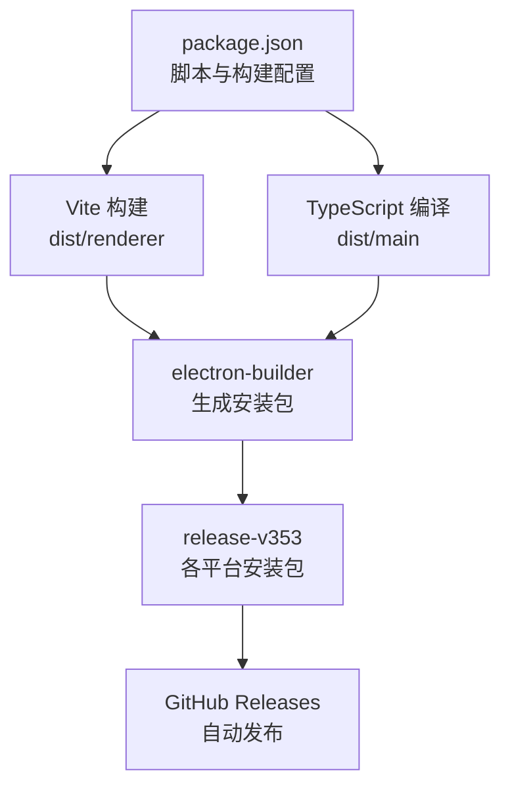
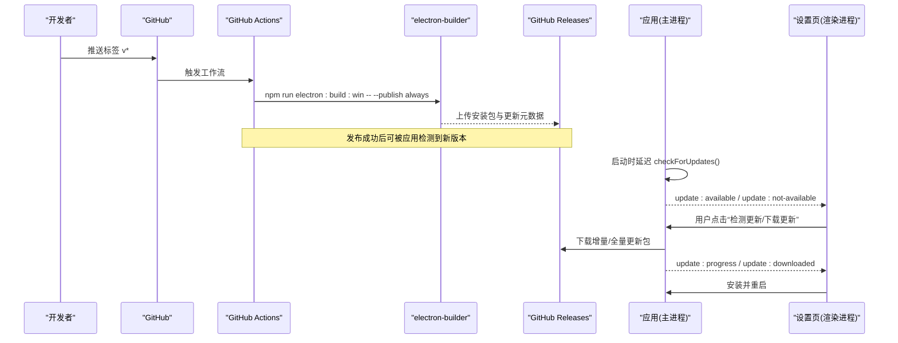
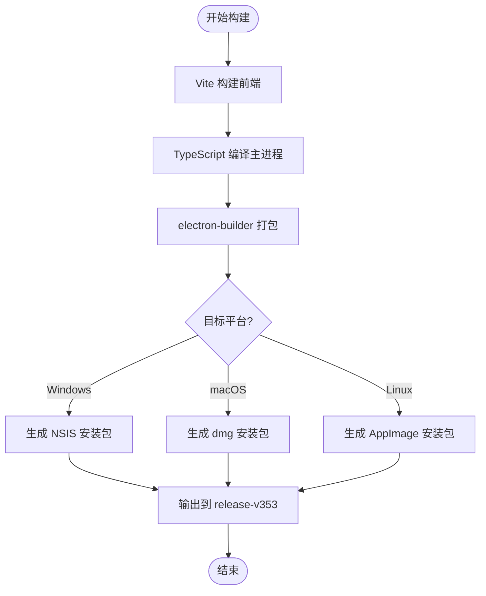
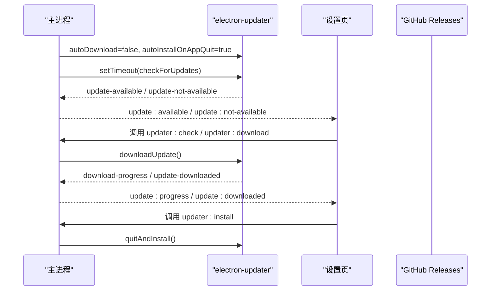
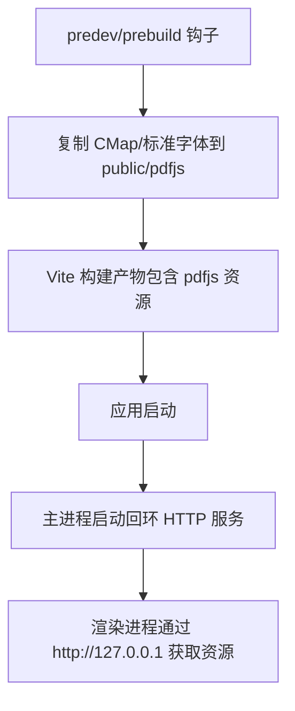
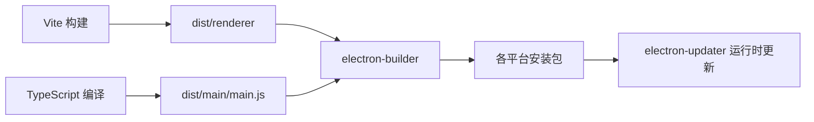

# 部署发布

<cite>
**本文引用的文件**
- [package.json](file://package.json)
- [.github/workflows/release.yml](file://.github/workflows/release.yml)
- [vite.config.ts](file://vite.config.ts)
- [src/main/main.ts](file://src/main/main.ts)
- [scripts/copy-pdfjs-assets.mjs](file://scripts/copy-pdfjs-assets.mjs)
- [README.md](file://README.md)
</cite>

## 目录
1. [简介](#简介)
2. [项目结构](#项目结构)
3. [核心组件](#核心组件)
4. [架构总览](#架构总览)
5. [详细组件分析](#详细组件分析)
6. [依赖关系分析](#依赖关系分析)
7. [性能与构建优化](#性能与构建优化)
8. [故障排除指南](#故障排除指南)
9. [结论](#结论)
10. [附录：平台要求与安全签名](#附录平台要求与安全签名)

## 简介
本文件面向“考研助手”桌面应用的打包、发布与自动更新，覆盖多平台（Windows/macOS/Linux）的 Electron Builder 配置、GitHub Releases 集成、CI/CD 自动化流程、版本管理与发布策略，以及应用签名与安全证书的配置建议。文档同时给出常见问题的排查方法与回滚方案，帮助你在本地或 CI 环境中稳定产出可分发的安装包并安全地交付给用户。

## 项目结构
本项目采用 Vite + Vue 3 作为渲染层，Electron 作为宿主容器，使用 electron-builder 进行多平台打包，electron-updater 实现应用内更新检查与安装。构建产物输出到 dist/renderer，主进程入口为 dist/main/main.js；资源通过 extraResources 注入，PDF 相关静态资源在 predev/prebuild 阶段复制到 public 目录以支持离线渲染。

图表来源
- [package.json:7-17](file://package.json#L7-L17)
- [package.json:45-80](file://package.json#L45-L80)
- [.github/workflows/release.yml:8-28](file://.github/workflows/release.yml#L8-L28)

章节来源
- [package.json:1-95](file://package.json#L1-L95)
- [vite.config.ts:1-39](file://vite.config.ts#L1-L39)
- [README.md:133-177](file://README.md#L133-L177)

## 核心组件
- 构建与打包
  - Vite 负责前端构建与资源优化，输出至 dist/renderer。
  - TypeScript 编译主进程代码，输出至 dist/main。
  - electron-builder 读取 package.json 中的 build 字段，生成 Windows/macOS/Linux 安装包。
- 自动更新
  - electron-updater 在主进程中初始化，监听更新事件并通过 IPC 通知渲染层。
  - 设置页提供“检测更新/下载/安装”的用户操作入口。
- 持续集成与发布
  - GitHub Actions 在推送 v* 标签时触发，仅构建并发布 Windows 安装包到 GitHub Releases。

章节来源
- [package.json:7-17](file://package.json#L7-L17)
- [package.json:45-80](file://package.json#L45-L80)
- [package.json:81-86](file://package.json#L81-L86)
- [src/main/main.ts:625-648](file://src/main/main.ts#L625-L648)
- [src/main/main.ts:2779-2804](file://src/main/main.ts#L2779-L2804)
- [.github/workflows/release.yml:1-28](file://.github/workflows/release.yml#L1-L28)

## 架构总览
下图展示了从代码提交到用户收到更新的完整链路：开发者推送标签触发 CI，CI 执行构建并发布到 GitHub Releases；应用启动后静默检查更新，用户在设置页手动触发下载与安装。

图表来源
- [.github/workflows/release.yml:8-28](file://.github/workflows/release.yml#L8-L28)
- [package.json:81-86](file://package.json#L81-L86)
- [src/main/main.ts:625-648](file://src/main/main.ts#L625-L648)
- [src/main/main.ts:2779-2804](file://src/main/main.ts#L2779-L2804)

## 详细组件分析

### Electron Builder 配置与多平台打包
- 应用标识与产物
  - appId、productName、输出目录 release-v353。
  - extraResources 将托盘图标打包进应用。
  - files 指定打包包含 dist/**/* 与 package.json。
- 平台目标与图标
  - Windows：NSIS 安装包，自定义快捷方式名称。
  - macOS：dmg 安装包。
  - Linux：AppImage 安装包。
- NSIS 选项
  - 非一键安装、允许选择安装路径、创建桌面与开始菜单快捷方式。

图表来源
- [package.json:45-80](file://package.json#L45-L80)

章节来源
- [package.json:45-80](file://package.json#L45-L80)

### 自动更新机制与 GitHub Releases 集成
- 更新源与发布配置
  - publish.provider 设置为 github，owner 与 repo 指向仓库，releaseType 为 release。
  - CI 仅在推送 v* 标签时运行，并使用 GH_TOKEN 调用 electron-builder 的 --publish always 直接发布到 GitHub Releases。
- 运行时更新流程
  - 主进程禁用自动下载，启用退出后自动安装。
  - 启动后延迟检查更新，失败静默处理。
  - 通过 IPC 暴露 check/download/install 接口，设置页驱动 UI 状态与进度。

图表来源
- [package.json:81-86](file://package.json#L81-L86)
- [.github/workflows/release.yml:25-28](file://.github/workflows/release.yml#L25-L28)
- [src/main/main.ts:625-648](file://src/main/main.ts#L625-L648)
- [src/main/main.ts:2779-2804](file://src/main/main.ts#L2779-L2804)

章节来源
- [package.json:81-86](file://package.json#L81-L86)
- [.github/workflows/release.yml:1-28](file://.github/workflows/release.yml#L1-L28)
- [src/main/main.ts:625-648](file://src/main/main.ts#L625-L648)
- [src/main/main.ts:2779-2804](file://src/main/main.ts#L2779-L2804)

### PDF 资源与构建前准备
- 构建前钩子
  - predev 与 prebuild 执行 copy-pdfjs-assets.mjs，将 pdfjs-dist 的 CMap 与标准字体复制到 src/renderer/public/pdfjs，确保离线与国内网络环境下 PDF 正常渲染。
- 运行时资源服务
  - 主进程提供 kaoyan-assets 协议与回环 HTTP 服务，优先走 fetch 分支加载 CMap/字体，避免 XHR 不稳定导致的渲染问题。

图表来源
- [scripts/copy-pdfjs-assets.mjs:1-31](file://scripts/copy-pdfjs-assets.mjs#L1-L31)
- [src/main/main.ts:204-276](file://src/main/main.ts#L204-L276)
- [src/main/main.ts:497-536](file://src/main/main.ts#L497-L536)

章节来源
- [scripts/copy-pdfjs-assets.mjs:1-31](file://scripts/copy-pdfjs-assets.mjs#L1-L31)
- [src/main/main.ts:204-276](file://src/main/main.ts#L204-L276)
- [src/main/main.ts:497-536](file://src/main/main.ts#L497-L536)

### 版本管理与发布策略
- 版本号管理
  - 应用版本定义于 package.json 的 version 字段，Vite 构建时将 __APP_VERSION__ 注入到渲染层常量中。
- 标签与发布
  - 使用语义化标签 v* 触发 CI 构建与发布。
  - 当前 CI 仅构建 Windows 安装包并发布到 GitHub Releases；如需多平台发布，可在工作流中扩展 job。
- 更新策略
  - 应用启动后延迟检查更新，失败静默处理；用户可在设置页手动触发检测与下载。
  - 下载完成后提示安装并重启，安装过程由 electron-updater 完成。

章节来源
- [package.json:1-12](file://package.json#L1-L12)
- [vite.config.ts:6-13](file://vite.config.ts#L6-L13)
- [.github/workflows/release.yml:3-28](file://.github/workflows/release.yml#L3-L28)
- [src/main/main.ts:625-648](file://src/main/main.ts#L625-L648)

## 依赖关系分析
- 构建与打包
  - vite、@vitejs/plugin-vue、typescript、vue-tsc 用于前端构建与类型检查。
  - electron、electron-builder、electron-updater 用于桌面端打包与更新。
- 运行时依赖
  - electron-updater 负责更新检查与下载。
  - 其他业务依赖（如 Element Plus、ECharts、Pinia、Vue Router）不影响打包与发布流程。

图表来源
- [package.json:19-43](file://package.json#L19-L43)
- [package.json:45-80](file://package.json#L45-L80)

章节来源
- [package.json:19-43](file://package.json#L19-L43)
- [package.json:45-80](file://package.json#L45-L80)

## 性能与构建优化
- 前端分包
  - 通过 manualChunks 将 vue/vue-router/pinia、element-plus、echarts 拆分为独立 vendor 包，提升缓存命中与并行加载效率。
- 资源体积控制
  - chunkSizeWarningLimit 限制单块大小，避免过大包影响首屏。
- 构建产物清理
  - emptyOutDir 确保每次构建输出目录干净，避免历史残留。
- PDF 资源本地化
  - 构建前复制 CMap/标准字体到 public，减少网络依赖，提高离线可用性。

章节来源
- [vite.config.ts:20-33](file://vite.config.ts#L20-L33)
- [scripts/copy-pdfjs-assets.mjs:1-31](file://scripts/copy-pdfjs-assets.mjs#L1-L31)

## 故障排除指南
- 更新检测失败
  - 开发环境无打包产物时，electron-updater 会抛错；主进程已捕获并返回失败结果，设置页提示访问主页手动更新。
  - 网络不可达或 GitHub Releases 未正确发布也会导致检测失败。
- 更新下载失败
  - 检查网络连接与 GitHub 访问情况；确认仓库中存在对应版本的更新元数据与安装包。
- 安装更新失败
  - 确保应用具有写入权限；若系统安全策略阻止安装，需调整系统设置或重新签名。
- PDF 渲染异常
  - 确认构建前钩子已执行，CMap/标准字体已复制到 public；主进程回环 HTTP 服务是否启动成功。
- 托盘图标缺失
  - 确认 extraResources 配置正确，且 resources/tray-icon.png 存在；打包后路径应位于 process.resourcesPath。

章节来源
- [src/main/main.ts:625-648](file://src/main/main.ts#L625-L648)
- [src/main/main.ts:2779-2804](file://src/main/main.ts#L2779-L2804)
- [scripts/copy-pdfjs-assets.mjs:1-31](file://scripts/copy-pdfjs-assets.mjs#L1-L31)
- [package.json:51-56](file://package.json#L51-L56)

## 结论
本项目通过 Vite + Electron + electron-builder 实现了跨平台打包与分发，结合 electron-updater 与 GitHub Releases 完成了自动更新闭环。当前 CI 仅发布 Windows 安装包，可根据需要扩展多平台构建任务。建议在后续迭代中完善代码签名与公证流程，以提升应用在各平台的可信度与用户体验。

## 附录：平台要求与安全签名

### 平台发布要求与注意事项
- Windows
  - 目标格式：NSIS 安装包。
  - 可选：代码签名（增强可信度，避免安全软件拦截）。
  - 注意：NSIS 安装器默认不弹窗提示签名信息，但系统仍会校验签名。
- macOS
  - 目标格式：dmg。
  - 必须：代码签名与公证（Notarization），否则无法在沙盒或新系统中正常运行。
  - 注意：需要在 CI 中配置 Apple ID 或 API Key，并在构建时传入签名与公证参数。
- Linux
  - 目标格式：AppImage。
  - 可选：代码签名（部分发行版支持，通常非强制）。
  - 注意：AppImage 本身不包含签名验证，分发渠道可附加 GPG 签名供用户校验。

### 代码签名与安全证书配置建议
- Windows
  - 使用 Authenticode 证书对安装包与可执行文件签名。
  - 在 CI 中通过环境变量注入证书与密码，或在本地使用 signtool 签名。
- macOS
  - 使用开发者证书对应用与插件签名。
  - 使用 xcrun notarytool 或 @electron/notarize 进行公证，并将时间戳服务器配置到构建流程。
- Linux
  - 可使用 GPG 对 AppImage 进行签名，并提供校验步骤说明。

### 版本管理与回滚方案
- 版本管理
  - 使用语义化版本标签 v* 触发 CI；package.json 的 version 与应用内显示一致。
- 发布策略
  - 建议先发布预发布版本（prerelease）进行灰度验证，再升级为正式 release。
- 回滚方案
  - 在 GitHub Releases 中保留旧版本安装包；若新版本出现问题，引导用户下载并安装上一稳定版本。
  - 应用侧可通过设置页提供“查看更新日志/前往主页”的入口，便于用户手动回滚。

章节来源
- [package.json:45-80](file://package.json#L45-L80)
- [package.json:81-86](file://package.json#L81-L86)
- [.github/workflows/release.yml:3-28](file://.github/workflows/release.yml#L3-L28)
- [README.md:133-177](file://README.md#L133-L177)