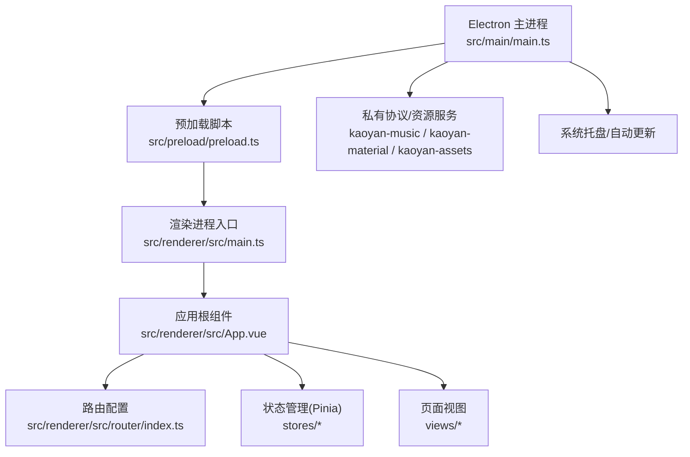
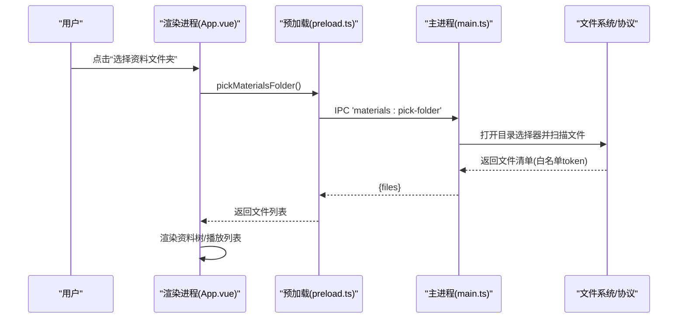
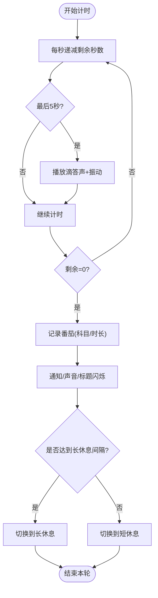
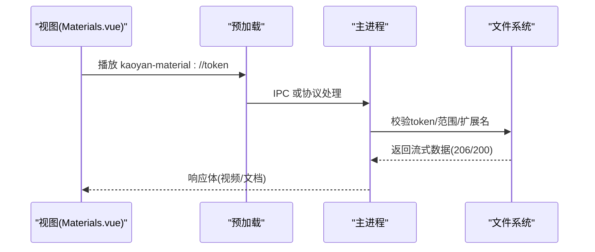
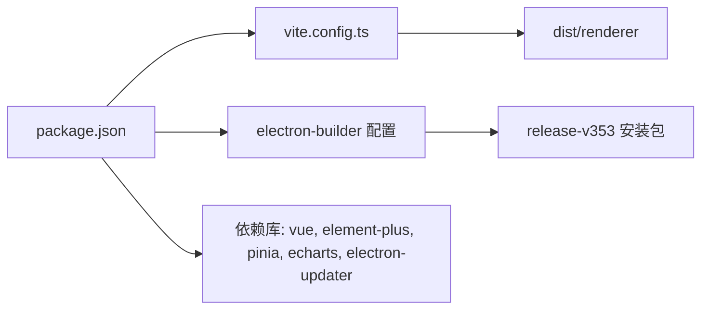

# 项目概述

<cite>
**本文引用的文件**
- [README.md](file://README.md)
- [package.json](file://package.json)
- [vite.config.ts](file://vite.config.ts)
- [src/main/main.ts](file://src/main/main.ts)
- [src/preload/preload.ts](file://src/preload/preload.ts)
- [src/renderer/src/main.ts](file://src/renderer/src/main.ts)
- [src/renderer/src/App.vue](file://src/renderer/src/App.vue)
- [src/renderer/src/router/index.ts](file://src/renderer/src/router/index.ts)
- [src/renderer/src/stores/pomodoro.ts](file://src/renderer/src/stores/pomodoro.ts)
- [src/renderer/src/views/Dashboard.vue](file://src/renderer/src/views/Dashboard.vue)
</cite>

## 目录
1. [简介](#简介)
2. [项目结构](#项目结构)
3. [核心组件](#核心组件)
4. [架构总览](#架构总览)
5. [详细组件分析](#详细组件分析)
6. [依赖关系分析](#依赖关系分析)
7. [性能考量](#性能考量)
8. [故障排查指南](#故障排查指南)
9. [结论](#结论)
10. [附录：快速开始与使用示例](#附录快速开始与使用示例)

## 简介
考研助手是一款面向考研学生的桌面端一站式备考工具，采用 Electron + Vue 3 + TypeScript 技术栈，提供倒计时、番茄专注计时、每日计划、真题成绩录入、学习数据统计、知识辅助（公式/大纲/算法模板）、资料播放器（PDF/视频）以及网易云音乐深度集成等能力。应用强调“离线优先、隐私可控”，所有学习数据本地双备份存储（IndexedDB + 文件快照），并提供可视化图表与一键导出 PDF 报告。

核心价值定位：
- 为初学者提供开箱即用的备考管理体验，降低多工具切换成本；
- 为有经验的开发者提供清晰的前后端分离式桌面应用架构参考（主进程/预加载/渲染进程）。

## 项目结构
应用采用 Electron 三进程模型：
- 主进程：窗口管理、协议与资源服务、系统托盘、自动更新、IPC 桥接等；
- 预加载脚本：通过 contextBridge 暴露安全 API 给渲染进程；
- 渲染进程：基于 Vue 3 + Element Plus + Pinia + Vue Router 的界面层。

图示来源
- [src/main/main.ts:191-618](file://src/main/main.ts#L191-L618)
- [src/preload/preload.ts:1-98](file://src/preload/preload.ts#L1-L98)
- [src/renderer/src/main.ts:1-63](file://src/renderer/src/main.ts#L1-L63)
- [src/renderer/src/App.vue:1-123](file://src/renderer/src/App.vue#L1-L123)
- [src/renderer/src/router/index.ts:1-144](file://src/renderer/src/router/index.ts#L1-L144)

章节来源
- [README.md:178-208](file://README.md#L178-L208)
- [package.json:1-95](file://package.json#L1-L95)

## 核心组件
- 主进程服务
  - 窗口与托盘：无边框窗口、自定义顶栏按钮、最小化到托盘、单实例锁；
  - 协议与资源：注册私有协议（音乐、资料、数据、内置静态资源），支持 Range 流式读取；
  - 自动更新：electron-updater，设置页触发检测/下载/安装；
  - IPC 桥接：向渲染进程暴露统一 API（音乐、资料、天气、B站、网易云、数据目录等）。
- 渲染进程
  - 应用壳：主题初始化、背景图、全屏开关、全局错误捕获、定时记录使用时长与计划快照；
  - 路由：按功能模块划分页面（首页、倒计时、统计、计划、番茄钟、资料、音乐、设置等）；
  - 状态管理：Pinia Store（如番茄钟、用户、音乐等）；
  - 页面：Dashboard 聚合展示今日学习、计划进度、各科时长、快捷入口等。

章节来源
- [src/main/main.ts:290-658](file://src/main/main.ts#L290-L658)
- [src/preload/preload.ts:3-97](file://src/preload/preload.ts#L3-L97)
- [src/renderer/src/App.vue:42-123](file://src/renderer/src/App.vue#L42-L123)
- [src/renderer/src/router/index.ts:5-109](file://src/renderer/src/router/index.ts#L5-L109)
- [src/renderer/src/views/Dashboard.vue:1-200](file://src/renderer/src/views/Dashboard.vue#L1-L200)

## 架构总览
应用遵循“主进程负责系统与资源、渲染进程负责交互与业务”的分层设计。主进程通过 IPC 暴露能力，渲染进程通过预加载脚本调用，保证安全隔离。数据持久化在渲染进程使用 IndexedDB，并通过主进程提供的数据目录协议进行文件级备份与同步。

图示来源
- [src/preload/preload.ts:29-34](file://src/preload/preload.ts#L29-L34)
- [src/main/main.ts:701-800](file://src/main/main.ts#L701-L800)

章节来源
- [src/main/main.ts:191-618](file://src/main/main.ts#L191-L618)
- [src/preload/preload.ts:1-98](file://src/preload/preload.ts#L1-L98)

## 详细组件分析

### 番茄钟计时器（Pomodoro）
- 模式：专注/短休息/长休息，可配置时长；
- 计时：基于绝对时间差计算剩余秒数，避免漂移；
- 提醒：完成时弹出遮罩提示、播放铃声、可选桌面通知、标题闪烁、振动；
- 统计：工作模式完成时记录科目与时长，供统计页展示。

图示来源
- [src/renderer/src/stores/pomodoro.ts:68-162](file://src/renderer/src/stores/pomodoro.ts#L68-L162)
- [src/renderer/src/stores/pomodoro.ts:170-251](file://src/renderer/src/stores/pomodoro.ts#L170-L251)

章节来源
- [src/renderer/src/stores/pomodoro.ts:1-347](file://src/renderer/src/stores/pomodoro.ts#L1-L347)

### 资料与媒体播放（PDF/视频/音频）
- 私有协议：kaoyan-material 提供 Range 请求，支持视频拖动与分片加载；
- 资源托管：kaoyan-assets 提供 pdf.js 的 CMap/标准字体，确保离线中文 PDF 正常渲染；
- 白名单校验：仅允许访问已选目录内的文件，防止路径穿越；
- 流式读取：大文件通过 ReadableStream 流式传输，降低内存占用。

图示来源
- [src/main/main.ts:538-615](file://src/main/main.ts#L538-L615)
- [src/main/main.ts:497-532](file://src/main/main.ts#L497-L532)

章节来源
- [src/main/main.ts:191-618](file://src/main/main.ts#L191-L618)

### 首页仪表盘（Dashboard）
- 聚合展示：今日学习时长、番茄数量、计划完成度、累计时长、应用使用时长；
- 快捷入口：跳转至知识大纲、算法模板、公式速查、番茄钟、真题成绩、背诵卡片等；
- 天气小组件：显示当前城市温度、湿度、风速等。

章节来源
- [src/renderer/src/views/Dashboard.vue:1-200](file://src/renderer/src/views/Dashboard.vue#L1-L200)

### 应用壳与全局行为（App.vue）
- 主题与背景：启动时初始化主题与自定义背景；
- 全屏控制：根据设置项即时进入/退出全屏；
- 使用时长统计：每分钟记录应用使用时长，跨天固化计划快照；
- 错误捕获：全局错误处理器记录日志并提示用户。

章节来源
- [src/renderer/src/App.vue:42-123](file://src/renderer/src/App.vue#L42-L123)
- [src/renderer/src/main.ts:25-63](file://src/renderer/src/main.ts#L25-L63)

## 依赖关系分析
- 构建与打包
  - Vite 作为前端构建工具，输出到 dist/renderer；
  - electron-builder 生成各平台安装包；
  - 脚本钩子在构建前复制 pdfjs 资源，确保离线可用。
- 运行时依赖
  - Electron 28 提供桌面能力；
  - Vue 3 + Element Plus + Pinia + Vue Router 构成 UI 与状态；
  - ECharts 用于数据可视化；
  - electron-updater 实现应用内更新。

图示来源
- [package.json:1-95](file://package.json#L1-L95)
- [vite.config.ts:1-39](file://vite.config.ts#L1-L39)

章节来源
- [package.json:1-95](file://package.json#L1-L95)
- [vite.config.ts:1-39](file://vite.config.ts#L1-L39)

## 性能考量
- 流式媒体：音视频通过 Range 与 ReadableStream 流式传输，避免一次性加载大文件导致内存峰值；
- 资源缓存：pdf.js 静态资源通过回环 HTTP 服务与协议双重保障，减少网络失败风险；
- 渲染优化：Element Plus 图标按需局部导入，减少运行时开销；长列表分批渲染防掉帧；
- 构建优化：手动分包 vendor-vue、vendor-element-plus、vendor-echarts，提升首屏加载性能。

[本节为通用性能建议，不直接分析具体代码文件]

## 故障排查指南
- 主进程异常
  - 未捕获异常与未处理 Promise 均被记录，便于定位崩溃原因；
  - 关闭按钮默认隐藏到托盘，若需完全退出请使用托盘菜单“退出”。
- 渲染进程异常
  - 全局错误处理器会记录类型、消息、堆栈与时间，并在设置中查看报错日志；
  - 路由懒加载失败会捕获并提示前往“设置 → 报错日志”查看详情。
- 资源加载问题
  - PDF 中文乱码或黑屏：检查 kaoyan-assets 协议与回环 HTTP 服务是否正常；
  - 视频无法拖动：确认 kaoyan-material 协议返回了正确的 Range 与 Content-Range。

章节来源
- [src/main/main.ts:8-14](file://src/main/main.ts#L8-L14)
- [src/main/main.ts:315-342](file://src/main/main.ts#L315-L342)
- [src/renderer/src/main.ts:25-63](file://src/renderer/src/main.ts#L25-L63)
- [src/renderer/src/router/index.ts:123-141](file://src/renderer/src/router/index.ts#L123-L141)

## 结论
考研助手以 Electron + Vue 3 + TypeScript 构建了稳定、可扩展的桌面应用架构，围绕考研学习场景提供了从计划、计时、统计到资料与音乐的一站式能力。其“离线优先、隐私可控”的设计确保了数据安全与可用性，同时通过清晰的模块化与完善的错误处理机制，既适合初学者上手，也为开发者提供了良好的二次开发基础。

[本节为总结性内容，不直接分析具体代码文件]

## 附录：快速开始与使用示例

### 环境要求
- Node.js ≥ 18
- npm ≥ 9（推荐）

### 安装与运行
- 安装依赖：npm install
- 开发模式（热更新）：npm run electron:dev
- 仅前端调试（无 Electron）：npm run dev
- 打包生产安装包：
  - 当前平台：npm run electron:build
  - Windows：npm run electron:build:win
  - macOS：npm run electron:build:mac
  - Linux：npm run electron:build:linux

章节来源
- [README.md:133-175](file://README.md#L133-L175)
- [package.json:7-17](file://package.json#L7-L17)

### 基本使用方法
- 学习计划制定：在“每日计划”中添加任务，支持分类、拖拽排序、循环重复与批量完成；
- 番茄钟计时：在“番茄钟”页面选择科目与时长，开始专注；结束时会有提示音与通知；
- 数据统计分析：在“数据统计”查看近 7 天时长趋势、科目占比、打卡日历，并可导出 PDF 报告；
- 资料播放：在“学习资料”中选择文件夹，支持 PDF 翻页/缩放/搜索、视频倍速/快进快退/自动连播；
- 网易云音乐：在“音乐播放”中扫码/手机号/Cookie 登录，浏览歌单、排行榜与评论，支持心动模式与云盘歌曲。

章节来源
- [README.md:64-108](file://README.md#L64-L108)
- [src/renderer/src/router/index.ts:5-109](file://src/renderer/src/router/index.ts#L5-L109)
- [src/preload/preload.ts:39-85](file://src/preload/preload.ts#L39-L85)

### 配置选项说明
- 番茄钟设置：工作时长、短休息时长、长休息时长、长休息间隔、声音开关、通知开关、标题闪烁、音量；
- 外观设置：深色/浅色/跟随系统、护眼滤光、自定义背景图；
- 数据目录：默认位于“文档\11408kaoyan-helper”，可在设置中自定义并开启自动备份；
- 自动更新：设置页一键检测新版本，支持下载与静默安装。

章节来源
- [src/renderer/src/stores/pomodoro.ts:21-23](file://src/renderer/src/stores/pomodoro.ts#L21-L23)
- [src/main/main.ts:625-648](file://src/main/main.ts#L625-L648)
- [README.md:101-108](file://README.md#L101-L108)