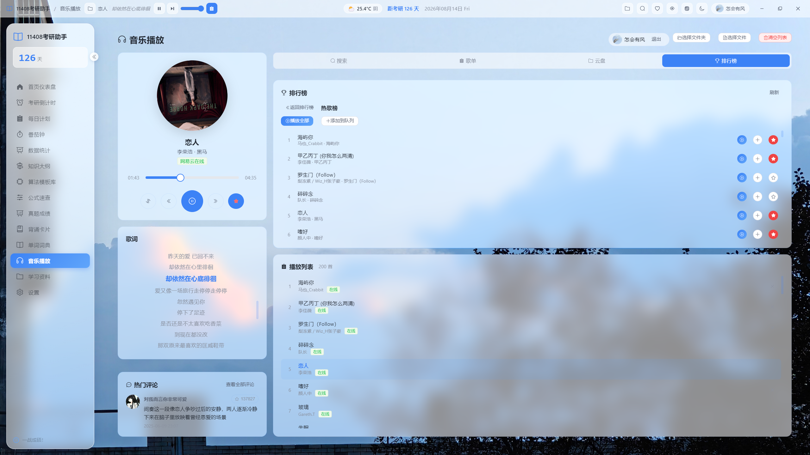
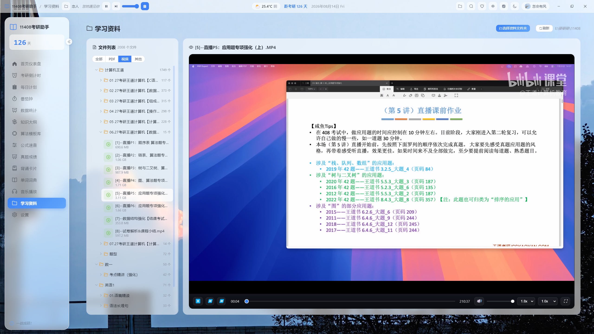

<p align="center">
  
</p>

<h1 align="center">考研助手 · Kaoyan Helper</h1>

<p align="center">
  一站式桌面备考工具 · 液态玻璃美学 · 离线本地优先
</p>

<p align="center">
  
  
  
  
</p>

> 2026 版全功能桌面备考工具。Vue 3 + Electron 打造的液态玻璃拟态原生界面，所有学习数据本地双备份存储，离线可用、隐私可控。

---

## 📑 目录

- [✨ 项目亮点](#-项目亮点)
- [🖼️ 界面预览](#️-界面预览)
- [🎯 完整功能一览](#-完整功能一览)
  - [备考主线模块](#备考主线模块)
  - [知识辅助模块](#知识辅助模块)
  - [网易云音乐深度集成](#网易云音乐深度集成)
  - [外观与全局体验](#外观与全局体验)
- [🧩 技术架构](#-技术架构)
- [🚀 环境与运行部署](#-环境与运行部署)
- [📂 项目目录结构](#-项目目录结构)
- [📦 下载安装](#-下载安装)
- [📄 开源协议](#-开源协议)

---

## ✨ 项目亮点

| # | 亮点 | 说明 |
| - | ---- | ---- |
| 1 | **一站式考研全流程** | 倒计时、番茄专注、每日计划、真题统计、背诵、词库、视频播放、网易云听歌全部内置，无需多开软件 |
| 2 | **液态玻璃拟态原生 UI** | 全局磨砂玻璃卡片、双主题 + 护眼模式，长列表分批渲染防掉帧，低卡顿轻量化 |
| 3 | **完整离线可用** | 所有学习数据本地双备份存储（IndexedDB + 文件快照），不上传云端，隐私可控 |
| 4 | **深度整合网易云音乐** | 云盘、歌单、心动模式、评论、三种登录方式，全局顶栏悬浮播放器 |
| 5 | **多格式内置播放器** | 支持 MP4 / MKV / AVI 等主流视频，倍速、快捷键、音量增益、快进退；PDF 本地渲染、中文无乱码 |
| 6 | **可视化学习数据** | ECharts 图表展示 7 天时长、科目占比、真题分数趋势，一键导出 PDF 报告 |
| 7 | **B 站学习视频集成** | 学习资料页内置哔哩哔哩：扫码 / Cookie 登录、收藏夹浏览、视频搜索、热门推荐、分 P / 清晰度播放 |

---

## 🖼️ 界面预览

<p align="center">
  <br>
  <br>
  <br>
  
</p>

---

## 🎯 完整功能一览

### 备考主线模块

| 模块 | 详细说明 |
| ---- | -------- |
| ⏳ 考研倒计时 | 精确到秒动态计时；环形进度条；按剩余天数智能推送分阶段复习规划；自定义考试名称与日期 |
| ✅ 每日计划待办 | 任务分类、拖拽排序；循环待办自动每日重复；一键批量完成 / 清空已完成；每日任务快照历史存档 |
| 🍅 番茄专注计时 | 专注 / 短休息 / 长休息三档模式，自定义时长；全局强制全屏防分心；结束区分上下行铃音；最后 5 秒视觉闪烁 + 振动预警；全局小浮窗（离开页面自动显示、任意拖动置顶） |
| 📊 真题成绩录入 | 2009–2026 全年份各科分数录入；自动计算平均分、最高分、练习年份统计；折线图展示分数波动，支持筛选、编辑、删除 |
| 📈 学习数据统计 | 近 7 天学习时长趋势；各科学习占比饼图；每日番茄完成柱状图；GitHub 风格打卡日历；一键导出 PDF 完整学习报告 |

### 知识辅助模块

| 模块 | 详细说明 |
| ---- | -------- |
| 🎴 翻转背诵卡片 | 正反面翻转记忆；自定义记忆分类；记住 / 未记住标记；自动统计复习次数；一键随机打乱 |
| 📖 考研单词词典 | 内置考研高频 / 中频 / 低频完整词库；单词音标、释义、真题例句；一键加入背诵卡片；未收录单词自动在线查词 |
| 📝 公式大纲 | 分章节汇总考研高数 / 线代 / 概率全部公式、政治核心考点；目录快速跳转、关键词检索 |
| 🧮 数据结构速查 | 计算机考研常考算法可视化讲解；排序、搜索、DP、图论通用模板速查 |
| 📁 学习资料播放器 | 树状文件夹本地资源管理；PDF ，离线可用、中文无乱码，支持翻页、缩放、旋转、文本选择、搜索、打印，切换或离开时卸载释放资源；视频倍速、Web Audio 音量增益（1×/1.5×/1.8×/2.5×/4×）、±10s 快退快进、完整键盘快捷键、自动连播、当前文件夹播放列表；学习进度自动记忆：PDF 页码 / 视频进度自动续播续读 |
| 📺 哔哩哔哩在线学习视频（v3.5.3） | 学习资料页「哔哩哔哩」模式：扫码 / Cookie 两种登录方式（凭证本地持久化）；我的收藏夹浏览与分页加载；关键词视频搜索（自动领取 buvid 防风控）；热门视频推荐换一批 / 加载更多；原生播放器弹窗支持分 P 切换、清晰度选择、备用 CDN 自动切换、相关视频推荐；播放流经主进程代理并注入 Referer 绕过防盗链，与本地资料功能互不影响 |

### 网易云音乐深度集成

| 模块 | 详细说明 |
| ---- | -------- |
| 🎧 全局悬浮播放器 | 本地文件夹歌曲递归扫描；私有协议流式读取；全页面顶栏常驻；播放暂停、切歌、音量、随机模式、歌词滚动 |
| 🔍 搜索 + 实时热搜榜 | 搜索页内置热搜卡片，点击热词一键检索；搜索后自动隐藏热搜，清空恢复榜单；在线试听、加入队列、收藏喜欢 |
| 💽 网易云云盘 | 云盘 Tab 支持分页全量加载全部云盘歌曲（不限 50 首）；批量播放、加入队列、单歌收藏 |
| 📋 我的歌单同步 | 同步自建歌单、收藏歌单；网格封面布局；歌单一键全量播放 / 加入播放队列 |
| 🏆 官方音乐排行榜 | 全分类官方榜单、新歌飙升榜；一键展开完整曲目列表 |
| 💓 心动智能播放 | 对接官方智能推荐接口，基于当前歌曲生成相似歌单序列 |
| ❤️ 喜欢音乐缓存 | 批量拉取收藏歌曲本地缓存，播放卡片实时同步喜欢状态 |
| 💬 歌曲评论系统 | 热门评论卡片、弹窗分页加载；最热 / 最新评论切换，支持评论点赞 |
| 🔐 三种登录方案 | 二维码扫码登录、手机号密码登录、Cookie 粘贴登录；登录状态持久化本地保存 |

### 外观与全局体验

- 🌗 **三色切换**：深色 / 浅色 / 跟随系统，独立暖色护眼滤光模式
- 🪟 **全局液态玻璃 UI**：统一 CSS 封装磨砂模糊卡片，长列表分批渲染防掉帧
- 🌤️ **顶栏天气小组件**：中国天气网数据源，17 座城市快捷切换、自定义城市搜索；每小时自动刷新，30 分钟本地缓存
- 🪟 **可自定义顶部导航栏**：窗口控制、滚动歌词、天气、迷你音乐播放条自由组合
- 🚀 **自动更新程序**：基于 `electron-updater`，设置页一键检测、下载、静默安装新版本

---

## 🧩 技术架构

| 分层 | 技术 |
| ---- | ---- |
| 前端框架 | Vue 3（Composition API）+ TypeScript |
| 构建工具 | Vite 5 |
| 桌面底层 | Electron 28 |
| UI 组件库 | Element Plus 2.5 |
| 图标系统 | @element-plus/icons-vue |
| 状态管理 | Pinia 2 |
| 路由管理 | Vue Router 4 |
| 数据可视化 | ECharts 5 + vue-echarts 6（按需引入） |
| 日期处理 | Day.js |
| 玻璃拟态样式 | 原生 CSS 变量封装 `backdrop-filter`，低版本自动滤镜降级 |
| 文档 / PDF 渲染 | `@open-file-viewer/core` + `pdfjs-dist`（主进程回环 HTTP 托管 CMap / 标准字体） |
| 应用更新 | electron-updater 6 |
| 本地数据存储 | IndexedDB 渲染进程存储 + 文件 JSON 快照双备份 |

> **关于 PDF 渲染**：采用 `pdfjs-dist` 的 legacy 构建，CMap 与标准字体资源由 Electron 主进程本地回环 HTTP 服务（`127.0.0.1`）托管，确保离线环境、国内网络下中文 CID 字体 PDF 也能正确解码、不黑屏；同时对 `getTextContent` 做了防御性包装，文本层提取失败时仅降级为无文本层，不会抹掉已渲染的页面内容。

---

## 🚀 环境与运行部署

### 前置要求

- **Node.js** ≥ 18
- **npm** ≥ 9（推荐）

### 1. 安装依赖

```bash
npm install
```

### 2. 开发模式（热更新）

```bash
npm run electron:dev
```

启动后 Vite 开发服务运行于 `http://localhost:5173`，主进程编译完成自动拉起桌面窗口。

### 3. 仅前端浏览器调试（无 Electron）

```bash
npm run dev
```

### 4. 打包生产安装包

```bash
# 打包当前操作系统对应安装包
npm run electron:build

# 仅构建 Windows 安装包
npm run electron:build:win

# 仅构建 macOS 安装包
npm run electron:build:mac

# 仅构建 Linux 安装包
npm run electron:build:linux
```

---

## 📂 项目目录结构

```
kaoyan-helper/
├── assets/                       # README 截图、封面图片
├── resources/                    # Electron 托盘图标等静态资源
├── src/
│   ├── main/                     # Electron 主进程
│   │   └── main.ts               # 窗口管理、IPC 通信、回环资源服务、网易云/哔哩哔哩/天气 API 代理、更新逻辑
│   ├── preload/                  # Preload 隔离脚本，contextBridge 暴露 electronAPI
│   │   └── preload.ts
│   └── renderer/                 # Vue 渲染进程
│       ├── index.html
│       └── src/
│           ├── App.vue
│           ├── main.ts
│           ├── style.css         # 全局玻璃拟态、主题 CSS 变量
│           ├── router/           # 页面路由配置
│           ├── stores/           # Pinia 全局状态：music / pomodoro / user 等
│           ├── components/       # 通用组件：GlassCard、侧边导航、自定义顶栏
│           ├── views/            # 完整功能页面（含 Materials.vue 文档预览）
│           ├── data/             # 静态资源：数学公式、政治大纲、考研词库
│           ├── utils/            # 工具函数：主题切换、日期、存储、天气、数据备份
│           └── assets/           # 前端页面静态图片、图标
├── scripts/
│   └── copy-pdfjs-assets.mjs     # 构建钩子：复制 pdfjs CMap / 字体资源
├── README.md
├── package.json
├── tsconfig.json / tsconfig.node.json
└── vite.config.ts
```

---

## 📦 下载安装

- [夸克网盘](https://pan.quark.cn/s/059395b45b88)
- [123 盘](https://1813557547.share.123pan.cn/123pan/ok2SVv-zE4PA)
- [蓝奏云（密码：1234）](https://wwbdp.lanzoum.com/ilRUO42p0uzc?pwd=1234)

---

## 📄 开源协议

[MIT](https://opensource.org/licenses/MIT) © Kaoyan Helper Team

> 祝所有考研学子一战成硕 🎓
